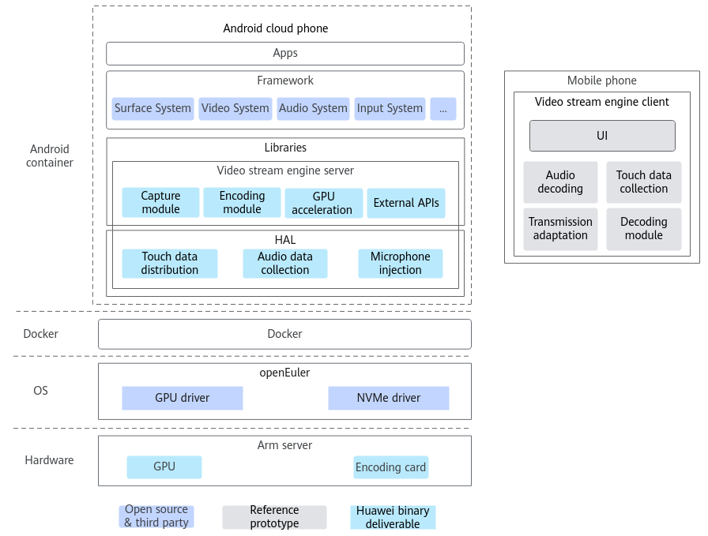

# Video Stream Introduction<a name="ZH-CN_TOPIC_0000002518224780"></a>

English | [简体中文](./README.md)

## Project Description<a name="ZH-CN_TOPIC_0000002550235025"></a>

### Overview<a name="ZH-CN_TOPIC_0000002518384706"></a>

The video stream engine is mainly applied to cloud phones. The cloud phone solution implemented based on the video stream engine technology is called video stream cloud phone. This document describes the basic concepts of the video stream engine and provides guidance for setting up the environment and using the video stream engine.

The cloud phone solution is a virtual phone service virtualized based on the Arm server and runs the Android Open Source Project (AOSP). In short, cloud phones are Arm servers that run the Android OS and function as virtual phones. You can remotely control the cloud phone in real time to run Android applications on the cloud. Based on the basic computing power of cloud phones, you can also efficiently build applications for scenarios like cloud gaming, mobile office, and live streaming interaction.

The device-cloud synergy engine consists of the device side and the cloud side. The cloud side runs on a server; the device side is generally a cloud phone APK, which can be installed on your Android mobile phone to interact with the cloud side and operate the Kbox container.

The device-cloud synergy engine consists of the video stream engine and instruction stream engine. This document describes the video stream engine.

### Software Architecture<a name="ZH-CN_TOPIC_0000002518224792"></a>

This section describes the context logical structure and modules (including module functions) of the video stream cloud phone.

**Figure 1** Video stream cloud phone architecture<a name="fig0420851397"></a><a id="video-stream-cloud-phone-architecture"></a>


The video stream engine consists of the server and client. The server provides functions such as image capture and encoding, and the client decodes and plays video data. In some scenarios, functions such as obtaining and injecting user touch data, and obtaining and playing audio data are also supported.

|Module Name|Function|
|--|--|
|Capture module|Obtains image data. The output format is the RGBA video RAM address or RGBA memory address.|
|Encoding module|Encodes YUV data into H.264/H.265 streams and sends the streams through external APIs of the video stream engine.|
|GPU acceleration module|Converts the RGBA data obtained by the capture module into YUV data or video streams by utilizing GPU capabilities.|
|Audio data collection|Obtains audio data, outputs audio data in OPUS or PCM format, and sends the data through external APIs of the video stream engine.|
|Microphone injection|Obtains OPUS or PCM data from external APIs of the video stream engine and injects the data to the Android system.|
|Touch data distribution|Injects touch data into the Android cloud phone on the server.|
|External APIs|External APIs of the video stream engine server.|

### Specifications<a name="ZH-CN_TOPIC_0000002549864541"></a>

[**Table 1**](#video-stream-cloud-phone-specifications) lists the specifications of the video stream cloud phone on Kunpeng servers.

**Table 1** Video stream cloud phone specifications<a id="video-stream-cloud-phone-specifications"></a>

|Item|Configuration|
|--|--|
|Scenario|Hardware encoding for a mid-core game (login page of Honor of Kings)|
|CPU core binding policy|Bind containers to NUMA nodes. Reserve the first two cores of each NUMA node.|
|Memory|3 GB|
|Storage|16 GB|
|Resolution/Frame rate|720 x 1280/30 fps|
|Quantity|120 channels|

> **NOTE**
>
>The memory and drives can be flexibly configured based on the device specifications.

## Directory Structure<a name="ZH-CN_TOPIC_0000002518595280"></a>

```txt
├── docs                                          # Project document directory
│   └── en                                       # English document directory
│       ├── figures                              # Directory of figures in documents
│       ├── quick_start.md                       # Quick start
│       ├── release_notes.md                    # Release notes
│       ├── installation_guide.md                # Installation guide
│       ├── user_guide.md                        # User guide
│       ├── best_practices.md                    # Best practices
│       ├── api_reference.md                     # API reference
│       ├── design_guide.md                      # Design guide
│       ├── faq.md                               # Frequently asked questions
├── CloudPhoneClient                              # Build directory for the video stream client APK
│   ├── AudioPlay                                # Audio module
│   ├── TouchCapture                             # Touch module
│   ├── VideoDecoder                             # Client decoder control and adaptation layer
│   └── VideoEngine 
│       ├── CloudPhoneUI                         # UI component of the client app
│       └── NdkDecoder                           # Android native NDK decoder
├── CloudPhoneService                             # Build directory for the video stream server
│   ├── VideoEngine 
│   │   ├── GpuEncTurbo                         # Integrates and adapts the GPU encoding module, covering integrated rendering-streaming and GPU encoding solutions. (The hardware decoding module is implemented by vendors at the AOSP OMX layer.)
│   │   └── Media                               # Adaptation layer for software and hardware encoders (encoding cards)
│   ├── VideoScripts                             # Scripts for creating video stream server images
│   └── VmiAgent                                 # Main logic of the video stream server, running continuously after connection to control server module status, initialize the network module, and manage data transmission operations of each module.
├── Common                                        # Common files directory
│   ├── Communication                            # Manages data exchange between the client and the server.
│   │   ├── Connection                          # Client and server implementations of VmiSocket
│   │   ├── Heartbeat                           # Heartbeat module; sends a heartbeat packet at regular intervals (currently 100 seconds) to the peer and waits for a response. It evaluates whether the network connection is slow or disconnected based on the response wait time. If the connection is slow or disconnected, it sends a signal to the video stream engine to actively terminate the connection.
│   │   ├── MsgFragment                         # Message consolidation and transmission
│   │   ├── NetComm                             # Network communication module
│   │   ├── PacketHandle                        # Packet handler for packet queuing and reassembly functions
│   │   ├── PacketManager                       # Packet manager; creates packet queues to store reassembled packets awaiting further processing.
│   │   ├── Socket                              # Encapsulates sockets into VmiSockets for engine use.
│   │   └── StreamParse                         # Message data decapsulation
│   ├── Connection                               # Communication library implemented based on the TCP protocol
│   ├── Log                                      # Log module
│   └── Utils                                    # Other common utilities, including unified engine event reporting, packet queue implementation, and version validation
├── open_source_download                          # Directory for downloaded open-source software packages
├── scripts                                       # Directory for build scripts
└── unpack_open_source                            # Directory for unpacked open-source software
├── hantro                                        # Hantro GPU encoding module
├── libdrm                                        # Provides kernel subsystems interacting with the GPU.
├── libva                                         # Provides hardware acceleration for video processing.
├── openH264                                      # Supports H.264 video format encoding and decoding.
└── opus                                          # Audio encoding and decoding software
```

## Version Description<a name="ZH-CN_TOPIC_0000002518755186"></a>

The video stream engine has two branch versions: Android 11 and Android 15. This section describes the differences and feature changes between the two versions.

The video stream engine is developed based on AOSP and currently supports AOSP 11 and AOSP 15. Due to differences in Android versions, the video stream engine has two code branches to support different Android code.

**Table 1** Code branch differences<a id="code-branch-differences"></a>

|Code Branch|AOSP11|AOSP15|
|--|--|--|
|Supported kernel version|5.10|6.6|
|Supported Docker version|18.0|24.0|
|Corresponding AOSP version|11|15|

**Change Description<a name="section4408930144513"></a>**

For details about feature changes in each release, see the *Release Notes*.

## Environment Deployment<a name="ZH-CN_TOPIC_0000002550275031"></a>

For details about the hardware environment and OSs supported by the video stream cloud phone and the software packages required for environment setup, see "Environment Requirements" in the *Deployment Guide*.

The video stream cloud phone supports bare metal servers and VMs. For details, see the *Deployment Guide*.

## Related Documents<a name="ZH-CN_TOPIC_0000002550235029"></a>

|Resource Type|Resource Name|Description|
|--|--|--|
|Document|Quick Start|Provides a quick start guide for launching and operating a video stream cloud phone.|
|Document|Release Notes|Provides basic information and feature updates of each video stream cloud phone version.|
|Document|Deployment Guide|Provides detailed guidance for deploying the video stream cloud phone in two environments: bare metal and VM.|
|Document|FAQs|Provides answers to frequently asked questions (FAQs) about installing and using the video stream engine.|

## Disclaimer<a name="ZH-CN_TOPIC_0000002550275033"></a>

**To Users of This Project**

- This project is intended solely for debugging and development. You are responsible for any risks and should carefully review the following information:
    - Data processing and deletion: Users are responsible for managing and deleting any data generated while using this tool. You are advised to promptly delete any related data after use to prevent information leaks.
    - Data confidentiality and transmission: Users understand and agree not to share or transmit any data generated by this tool. Neither the tool nor its developers are responsible for any information leaks, data breaches, or other negative consequences.
    - User input security: Users are responsible for the security of any commands they enter and for any risks or losses resulting from improper input. The tool and its developers are not liable for issues caused by incorrect command usage.

- Disclaimer scope: This disclaimer applies to all individuals and entities using this tool. By using the tool, you acknowledge and accept this statement and assume all risks and responsibilities arising from its use. If you do not agree, please stop using the tool immediately.
- Before using this tool, **please read and understand the preceding disclaimer**. If you have any questions, contact the developer.

**To Data Owners**

If you do not want your model or dataset to be mentioned in this project, or if you wish to update its description, please submit an issue on GitCode. We will delete or update your description according to your request. Thank you for your understanding and contribution to this project.

## License<a name="ZH-CN_TOPIC_0000002550235031"></a>

This project is licensed under Apache License 2.0. For details, see [LICENSE](LICENSE).
The documents of this project are licensed under CC-BY 4.0. For details, see [LICENSE](docs/LICENSE).

## Contribution Statement<a name="ZH-CN_TOPIC_0000002518595284"></a>

We welcome your contributions to the community. If you have any questions/suggestions or want to provide feedback on feature requirements and bug reports, you can submit [issues](https://gitcode.com/boostkit/community/blob/master/docs/contributor/issue-submit.md). For details, see the [contribution guideline](https://gitcode.com/boostkit/community/blob/master/docs/contributor/contributing.md). You are also welcome to share insights in [Discussions](https://gitcode.com/boostkit/community/discussions). Thank you for your support.

## Suggestions and Communication<a name="ZH-CN_TOPIC_0000002518755190"></a>

You are welcome to contribute to the community. If you have any questions or suggestions, submit [issues](https://gitcode.com/boostkit/community/blob/master/docs/contributor/issue-submit.md). We will reply to you as soon as possible. Thank you for your support.

## Acknowledgement<a name="ZH-CN_TOPIC_0000002550275035"></a>

Kbox is jointly developed by the following Huawei department:

- Kunpeng Computing BoostKit Development Dept

Thank you to everyone in the community for your PRs. We warmly welcome contributions to Kbox!
