# Installation Guide<a name="ZH-CN_TOPIC_0000002521693392"></a>

<!-- md-trans-meta sourceCommit=8137c5c6f22411c010ac7e5e01f7b05f199cf237 translatedAt=2026-08-29T08:18:17.223Z pushedAt=2026-09-02T08:26:58.737Z -->

## Software Deployment<a name="ZH-CN_TOPIC_0000002549826277"></a>

### Environment Requirements<a name="ZH-CN_TOPIC_0000002549706275"></a>

#### Hardware Environment<a name="ZH-CN_TOPIC_0000002550361171"></a>

Before deploying the Kbox cloud phone container environment, ensure that your hardware environment meets the requirements.

For details, see [**Table 1**](#hardware-configuration-schemes-for-deploying-the-kbox-cloud-phone-container).

**Table 1** Hardware configuration schemes for deploying the Kbox cloud phone container<a id="hardware-configuration-schemes-for-deploying-the-kbox-cloud-phone-container"></a>

|Item|Hardware Configuration Scheme 1|Hardware Configuration Scheme 2|Hardware Configuration Scheme 3|Hardware Configuration Scheme 4|
| :---: | :---: | :---: | :---: | :---: |
|Server|Kunpeng server|Kunpeng server|Kunpeng server|Kunpeng server|
|CPU|2 x Kunpeng 920, 64 cores@2.6 GHz|2 x Kunpeng 920, 64 cores@2.6 GHz|2 x new Kunpeng 920 processor model, 80 cores@2.9 GHz|2 x new Kunpeng 920 processor model, 64 cores@2.2 GHz|
|Memory|16 x DDR4 RDIMM-32 GB-2933 MT/s|16 x DDR4 RDIMM-32 GB-2933 MT/s|16 x DDR5 DIMM-64 GB-4800 MT/s|16 x DDR5 DIMM-64 GB-5200 MT/s|
|Drive|System drive: 2 x SSD, 480 GB, SATA 6 Gbit/s, read-intensive<br>Data drive: 2 x ES3521A V6 SSD, 1920 GB, SATA 6 Gbit/s, read-intensive|System drive: 2 x SSD, 480 GB, SATA 6 Gbit/s, read-intensive<br>Data drive: 2 x ES3521A V6 SSD, 1920 GB, SATA 6 Gbit/s, read-intensive|System drive: 1 x S3521A V6 SSD, 1920 GB, SATA 6 Gbit/s, read-intensive<br>Data drive: 2 x S3521A V6 SSD, 1920 GB, SATA 6 Gbit/s, read-intensive|System drive: 1 x SSD, 480 GB, SATA 6 Gbit/s, 2.5-inch height, read-intensive<br>1 x S4510 SSD, 960 GB, SATA 6 Gbit/s, read-intensive<br>Data drive: 1 x ES3600P V6 SSD, 6400 GB, NVMe 64 Gbit/s<br>1 x ES3500P V5 SSD, 4000 GB, NVMe 32 Gbit/s|
|NIC|Onboard: 1 x NIC (4 x GE); 1 x TM280 FlexIO card, 25GE/10GE optical port, 4 ports, SFP28 (without optical modules)<br>External: 1 x Mellanox NIC|Onboard: 1 x NIC (4 x GE); 1 x TM280 FlexIO card, 25GE/10GE optical port, 4 ports, SFP28 (without optical modules)<br>External: 1 x Mellanox NIC|Onboard: 1 x NIC (4 x GE); 1 x TM280 FlexIO card, 2 x 25GE/10GE optical port, 4 ports, SFP28 (without optical modules)<br>External: 1 x Mellanox NIC|Onboard: 1 x NIC (4 x GE); 1 x TM280 FlexIO card, 2 x 25GE/10GE optical port, 4 ports, SFP28 (without optical modules)|
|Riser card|PCIe x16 + PCIe x8 for both riser 1 and riser 2|3 x PCIe x8 for both riser 1 and riser 2|2 x front riser (x8 x 2) + 2 x rear riser (x8 x 2) + 1 x riser 3 (x8 x 2)|2 x rear riser (x16 + x8 x 2) + 1 x riser 3 (x8 x 2)|
|Encoding card|1 x NETINT Quadra T2A (x8)|None|None|None|
|GPU|2 x AMD W6800|4 x DaoCloud DC1000|8 x DaoCloud DC1000 or 8 x DaoCloud DC1000C|8 x DaoCloud DC1000|
|OS|openEuler 22.03 LTS SP4|openEuler 22.03 LTS SP4|openEuler 22.03 LTS SP4|openEuler 22.03 LTS SP4|
|Kernel version|5.10.0-216.0.0|5.10.0-216.0.0|5.10.0-216.0.0|5.10.0-216.0.0|

> **NOTE**
>
>- Select the Mellanox NICs compatible with the Kunpeng server. You can visit [Kunpeng Computing Compatibility Query](https://info.support.huawei.com/computing/tools/compatibility-query/enterprise/kunpeng-computing/component-compatibility?lang=en) to query compatible NIC models.
>- NETINT Quadra is the next generation of the NETINT T432 encoding card. The following content uses the Quadra encoding card as an example. You can refer to the content as well if the T432 encoding card is used.

#### Software Environment<a name="ZH-CN_TOPIC_0000002549706295"></a>

##### Kbox<a name="ZH-CN_TOPIC_0000002549826303"></a>

For details about the software environment for deploying the Kbox cloud phone container, see "Software Environment" in [Kbox Cloud Phone Container Installation Guide](https://www.hikunpeng.com/document/detail/en/kunpengcps/boostcph/kboxcpc/docs/en/install_guide.md).

##### Video Stream Engine<a name="ZH-CN_TOPIC_0000002518346424" id="video-stream-engine"></a>

Before deploying the video stream cloud phone, obtain the required software packages from the addresses provided in this section and verify the integrity of the software packages provided by Huawei.

**Obtaining Software Packages<a name="section9155930113616" id="obtaining-software-packages"></a>**

**Table 1** Software requirements for deploying the video stream engine<a id="software-requirements-for-deploying-the-video-stream-engine"></a>

|No.|Software Package|Description|How to Obtain|Configuration Scheme 1|Configuration Scheme 2|Configuration Scheme 3|Configuration Scheme 4|
| :---: | :---: | :---: | :---: | :---: | :---: | :---: | :---: |
|1|BoostKit-boostcph-videoengine_*.zip|Binary package of the video stream engine.|Contact Huawei technical support.|√|√|√|√|
|2|DemoVideoEngine.tar.gz|TAR package of the video stream engine server. It is used to obtain the audio and video data of the Kbox container.|Contact Huawei technical support.|√|√|√|√|
|3|DemoVideoEngine_sha256.txt|SHA256 file corresponding to the TAR package of the video stream engine server. It is used to check the software integrity.|Contact Huawei technical support.|√|√|√|√|
|4|CloudPhoneApk.tar.gz|TAR package of the video stream engine client. It is used to decode and play audio and video data.|Contact Huawei technical support.|√|√|√|√|
|5|CloudPhoneApk_sha256.txt|SHA256 file corresponding to the TAR package of the video stream engine client. It is used to check the software integrity.|Contact Huawei technical support.|√|√|√|√|
|6|VideoClientEmulator.tar.gz|Stress test tool for the video stream cloud phone.|Contact Huawei technical support.|√|√|√|√|
|7|NETINT-v*XXX*.tar.gz|TAR package of the video stream NETINT encoding card for hardware encoding. The matching version is 4.8.F-adapt.|[Link](https://www.netint.cn/kunpeng-quadra-firmware-downloads)<br>Download password: **test123**|√|-|-|-|
|8|Quadra_V*XXX*.zip|Software, firmware, and document packages of the NETINT Quadra encoding card.|[Link](https://www.netint.cn/kunpeng-quadra-firmware-downloads)<br>Download password: **test123**|√|-|-|-|
|9|WebClient.zip|Web client.|Contact Huawei technical support.|√|√|√|√|
|10|topo-affinity-plugin-master.zip|Kubernetes NUMA affinity plugin.|[Link](https://gitee.com/kunpeng_compute/topo-affinity-plugin)|√|√|√|√|

> **NOTE**
>
>- **√** indicates that the software needs to be installed for the respective configuration scheme.
>- **-** indicates that the software is not required for the respective configuration scheme.

**Verifying Software Package Integrity<a name="section111981239163615"></a>**

To prevent software packages from being maliciously tampered with during transfer or storage, download also the corresponding digital signature files for integrity verification while obtaining the software packages from the Kunpeng community.

1. Obtain software packages based on [Table 1 Software requirements for deploying the video stream engine](#software-requirements-for-deploying-the-video-stream-engine).
2. <a name="li1273482318125"></a>Obtain the verification tool and guide from the [Huawei enterprise website](https://support.huawei.com/enterprise/en/tool/pgp-verify-TL1000000054) or [Huawei carrier website](http://support.huawei.com/carrier/digitalSignatureAction).
3. Based on the signature verification guide obtained in [2](#li1273482318125), verify the PGP digital signatures of the software packages.

> **NOTE**
>
>If the verification fails, do not use the software package. Contact Huawei technical support.
>Before a software package is used for installation or upgrade, its digital signature also needs to be verified to ensure that the software package is not tampered with.
>Before using the software package, read and agree to [Kunpeng BoostKit User License Agreement 2.0](https://www.hikunpeng.com/en/legal/developer/boostkit/software/protocol).

### Deploying a Cloud Phone<a name="ZH-CN_TOPIC_0000002549826291"></a>

#### Environment Configuration<a name="ZH-CN_TOPIC_0000002549826289"></a>

##### Configuring the BIOS<a name="ZH-CN_TOPIC_0000002518346454"></a>

The BIOS version of the specified server has restrictions on the DIMM insertion method. Before configuring the BIOS, ensure that the DIMM insertion method is correct. Then, configure MISC, performance, and memory options according to the hardware configuration scheme to improve server performance.

For details, see "Configuring the BIOS" in [Kbox Cloud Phone Container Installation Guide](https://www.hikunpeng.com/document/detail/en/kunpengcps/boostcph/kboxcpc/docs/en/install_guide.md#d4-configuring-the-bios ).

- **[(Hardware Configuration Scheme 1, Optional) Upgrading the NVMe Firmware](https://gitcode.com/boostkit/Kbox-patches/blob/AOSP11/docs/en/install_guide.md#upgrading-the-nvme-firmware)**

- **[(Hardware Configuration Scheme 1) Configuring the GPU Working Mode and CPU Binding](https://gitcode.com/boostkit/Kbox-patches/blob/AOSP11/docs/en/install_guide.md#configuring-the-gpu-working-mode-and-cpu-binding)** 

##### Deploying the Basic Environment for the Kbox Container<a name="ZH-CN_TOPIC_0000002518186516" id="deploying-the-basic-environment-for-the-kbox-container"></a>

For details about how to deploy a Kbox cloud phone container, see [Kbox Cloud Phone Container Installation Guide](https://www.hikunpeng.com/document/detail/en/kunpengcps/boostcph/kboxcpc/docs/en/install_guide.md).

##### (Optional) Deploying the Containerd Environment<a name="ZH-CN_TOPIC_0000002549826283" id="deploying-the-containerd-environment"></a>

In addition to the Docker container runtime, the video stream cloud phone also supports the containerd runtime. If you choose to run the video stream cloud phone with containerd, refer to this section to deploy containerd-related software packages.

**Obtaining Software Packages<a name="section11783175614511"></a>**

[**Table 1**](#containerd-related-software-packages) lists the software packages required for deploying the containerd environment.

**Table 1** Containerd-related software packages<a id="containerd-related-software-packages"></a>

|Software|Version|Description|How to Obtain|
| :---: | :---: | :---: | :---: |
|Containerd|v1.7.14|A container runtime.|Containerd binary software package: **containerd-1.7.14-linux-arm64.tar.gz**; containerd service file: [Link](https://raw.githubusercontent.com/containerd/containerd/main/containerd.service)|
|runC|v1.1.12|runC is a lightweight container runtime that complies with the Open Container Initiative (OCI). It is a dependency component of containerd.|[Link](https://github.com/opencontainers/runc/releases/download/v1.1.12/runc.arm64)|
|CNI Plugin|v1.4.1|The Container Network Interface (CNI) is a specification and libraries for configuring network interfaces in Linux containers.|[Link](https://github.com/containernetworking/plugins/releases/download/v1.4.1/cni-plugins-linux-arm64-v1.4.1.tgz)|
|nerdctl|v1.7.5|nerdctl is a Docker-compatible CLI for managing containerd-based containers and images.|[Link](https://github.com/containerd/nerdctl/releases/download/v1.7.5/nerdctl-1.7.5-linux-arm64.tar.gz)|
| Golang | v1.25 |Golang is a systems programming language used for developing NRI plugins.| [Link](https://golang.google.cn/dl/go1.25.0.linux-arm64.tar.gz) |

**Deploying the Containerd Environment<a name="section343716111874"></a>**

1. <a id="deploying-the-containerd-environment-1"></a>Download and decompress the containerd binary package to the `/usr/local` directory.

    ```shell
    mkdir -p /root/containerdenv/downloads
    cd /root/containerdenv/downloads
    wget https://github.com/containerd/containerd/releases/download/v1.7.14/containerd-1.7.14-linux-arm64.tar.gz --no-check-certificate
    tar Cxzvf /usr/local containerd-1.7.14-linux-arm64.tar.gz
    ```

    Check that the containerd version is v1.7.14.

    ```shell
    containerd --version
    ```

2. <a id="deploying-the-containerd-environment-2"></a>Download the containerd service file and configure it as a system service.

    ```shell
    cd /root/containerdenv/downloads
    wget https://raw.githubusercontent.com/containerd/containerd/main/containerd.service --no-check-certificate
    mkdir -p /usr/local/lib/systemd/system/
    cp containerd.service /usr/local/lib/systemd/system/
    systemctl daemon-reload
    systemctl enable --now containerd
    ```

    Check whether the containerd service is started.

    ```shell
    systemctl status containerd
    ```

    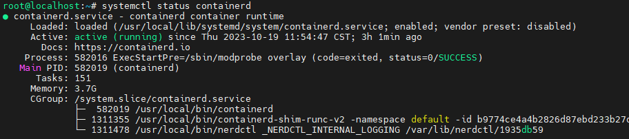

    If the command output shown in the preceding figure is displayed, the containerd service has been started.

3. <a id="deploying-the-containerd-environment-3"></a>Download and install runC.

    ```shell
    cd /root/containerdenv/downloads
    wget https://github.com/opencontainers/runc/releases/download/v1.1.12/runc.arm64 --no-check-certificate
    install -m 755 runc.arm64 /usr/local/sbin/runc
    ```

    Check that the runC version is 1.1.12.

    ```shell
    runc --version
    ```

4. <a id="deploying-the-containerd-environment-4"></a>Download and install the CNI plugin.

    ```shell
    cd /root/containerdenv/downloads
    mkdir -p /opt/cni/bin
    wget https://github.com/containernetworking/plugins/releases/download/v1.4.1/cni-plugins-linux-arm64-v1.4.1.tgz --no-check-certificate
    tar Cxzvf /opt/cni/bin cni-plugins-linux-arm64-v1.4.1.tgz
    ```

5. <a id="deploying-the-containerd-environment-5"></a>Download and install nerdctl.

    ```shell
    cd /root/containerdenv/downloads
    wget https://github.com/containerd/nerdctl/releases/download/v1.7.5/nerdctl-1.7.5-linux-arm64.tar.gz --no-check-certificate
    tar Cxzvf /usr/local/bin nerdctl-1.7.5-linux-arm64.tar.gz
    ```

    Check that the nerdctl version is 1.7.5.

    ```shell
    nerdctl --version
    ```

6. <a id="installing-golang"></a>Download and install Golang.

    ```shell
    wget https://golang.google.cn/dl/go1.25.0.linux-arm64.tar.gz
    tar -C /usr/local -xzf go1.25.0.linux-arm64.tar.gz
    echo 'export PATH=/usr/local/go/bin:$PATH' >> ~/.bashrc
    source ~/.bashrc
    ```

    Configure the proxy.

    ```shell
    go env -w GO111MODULE=on
    go env -w GOPROXY=https://goproxy.cn,direct
    ```

    Check that the Golang version is 1.25.

    ```shell
    go version
    ```

7. <a id="deploying-the-containerd-environment-7"></a>Restart the Docker service and start a new terminal for the new container runtime to take effect.

    ```shell
    systemctl restart docker
    ```

    To switch to the Docker container runtime, remove the software binaries installed in [1](#deploying-the-containerd-environment-1) to [5](#deploying-the-containerd-environment-5) from the corresponding directories. After the removal is complete, run the preceding command to restart the Docker service and start a new terminal.

- **[(Hardware Configuration Scheme 2/3/4) Installing the GPU Driver](https://gitcode.com/boostkit/Kbox-patches/blob/AOSP11/docs/en/install_guide.md#installing-the-gpu-driver)**  

#### Creating an Image<a name="ZH-CN_TOPIC_0000002549826281"></a>

##### Creating a Kbox Image<a name="ZH-CN_TOPIC_0000002549826313"></a>

Before creating a video stream cloud phone image, create a Kbox image first.

1. Obtain the Kbox container startup dependency components `android.tar` and `Kbox-patches-AOSP11.zip` based on [Deploying the Basic Environment for the Kbox Container](#deploying-the-basic-environment-for-the-kbox-container), and upload them to the `/home/kbox_video` directory on the server. (This directory is used as an example. You can customize a directory as required.)
2. Decompress the `Kbox-patches-AOSP11.zip` package, extract the `base_box.sh` and `hardware_bind.cfg` files from `deploy_scripts` to the`/home/kbox_video` directory, and grant permissions on the files. Ensure that the file owner has the read, write, and execute permissions while users in the owner group and others have only the read and execute permissions.

    ```shell
    unzip Kbox-patches-AOSP11.zip
    cp Kbox-patches-AOSP11/deploy_scripts/base_box.sh /home/kbox_video/
    cp Kbox-patches-AOSP11/deploy_scripts/hardware_bind.cfg /home/kbox_video/
    chmod 755 /home/kbox_video/base_box.sh
    ```

3. Create a Kbox image. The image name is usually set to `kbox:origin`.
    1. Upload the Kbox demo image package `android.tar` to the `~/dependency` directory (this directory is only an example and can be customized) and mount the image package.

        You can customize the image name and tag in the format of *{Name}:{Tag}*. In this example, the image name is `kbox:demo`.

        ```shell
        cd ~/dependency
        docker import android.tar kbox:demo
        ```

    2. Upload the `deploy_scripts` directory in the `Kbox-patches-AOSP11` folder to the `~/dependency` directory on the server.
    3. Upload the Android Kbox binary package `BoostKit-boostcph-kbox_*.zip` to `~/dependency/deploy_scripts`.
    4. (Hardware configuration scheme 2/3/4) If hardware configuration scheme 2/3/4 is used, decompress the GPU driver package `VAGPU-25.03.01.01-RC24.tgz` to obtain `va_driver.tgz` and upload `va_driver.tgz` to the `~/dependency/deploy_scripts` directory on the server.
    5. Create a Kbox image that contains the Android Kbox binary. In the following commands, `kbox:demo` is the official Kbox demo image, and `kbox:origin` is the new image that contains the Android Kbox binary.
        - For configuration scheme 1:

            ```shell
            cd ~/dependency/deploy_scripts
            chmod +x make_image.sh
            ./make_image.sh kbox:demo kbox:origin
            ```

        - For configuration scheme 2/3/4:

            ```shell
            cd ~/dependency/deploy_scripts
            chmod +x make_image.sh
            ./make_image.sh kbox:demo kbox:origin va_driver.tgz
            ```

4. Check whether the Kbox image (`kbox:origin`) is successfully created.

    ```shell
    docker images
    ```

    The image is created successfully if information similar to the following is displayed:

    ```shell
    REPOSITORY    TAG       IMAGE ID        CREATED          SIZE
    kbox          origin    d1f5cfd2e722    6 seconds ago    2.09GB
    ```

##### Creating a Video Stream Cloud Phone Image<a name="ZH-CN_TOPIC_0000002549706277"></a>

Obtain the TAR packages of the video stream engine client and server, binary package of the video stream engine, and the TAR package of the video stream NETINT encoding card to create a video stream cloud phone image. If you want to start a video stream cloud phone with containerd, use Docker to export an image that complies with the OCI and use nerdctl to import the image for containerd.

**Verifying Software Package Integrity<a name="section1286473717216"></a>**

1. Obtain `CloudPhoneApk.tar.gz`, `DemoVideoEngine.tar.gz`, and `BoostKit-boostcph-videoengine_*.zip` based on [Video Stream Engine](#video-stream-engine) and upload them to the `/home/kbox_video` directory on the server.
2. Obtain the SHA256 checksums of the following components.

    ```shell
    sha256sum DemoVideoEngine.tar.gz
    sha256sum CloudPhoneApk.tar.gz
    ```

3. Compare the obtained checksums with `DemoVideoEngine_sha256.txt` and `CloudPhoneApk_sha256.txt`.

    If the checksums are consistent, the obtained software packages are intact and you can proceed with the following operations. If not, stop the deployment and obtain the complete software packages.

4. (Configuration scheme 1) If hardware configuration scheme 1 is used, obtain the `NETINT-vXXX.tar.gz` package based on [Video Stream Engine](#video-stream-engine), upload the package to the `/home/kbox_video` directory on the server, and rename the package `NETINT.tar.gz`.

    > **NOTE**
    >
    >- The `NETINT.tar.gz` package for Quadra is different from that for T432. Select the correct version.
    >- NETINT Quadra is the next generation of the NETINT T432 encoding card. The following content uses the Quadra encoding card as an example. You can refer to the content as well if the T432 encoding card is used.

**Creating an Image<a name="section118652371219" id="creating-an-image"></a>**

1. Decompress the `DemoVideoEngine.tar.gz` package to obtain the image creation script and grant the execute permission on the script.
    - For configuration scheme 1:

        ```shell
        tar -xvf DemoVideoEngine.tar.gz Dockerfile_NoVPU Dockerfile_T432 Dockerfile_QuadraT2A make_image.sh
        chmod +x Dockerfile_NoVPU Dockerfile_T432 Dockerfile_QuadraT2A make_image.sh
        ```

    - For configuration scheme 2/3/4:

        ```shell
        tar -xvf DemoVideoEngine.tar.gz Dockerfile_NoVPU  make_image.sh
        chmod +x Dockerfile_NoVPU  make_image.sh
        ```

2. Create a video stream cloud phone image. You can use the default image name or specify an image name.
    - If the default image name is used, run the following command. The default image names of the Kbox basic cloud phone and video stream cloud phone are `kbox:latest` and `video:latest`, respectively.

        ```shell
        ./make_image.sh
        ```

    - If a customized image name is used, run the following command. Specify the image names of the Kbox basic cloud phone and video stream cloud phone in the format of *{image_name}:{tag}*. In the following command, `kbox` and `video` are image names, and `origin` and `latest` are tags.

        ```shell
        ./make_image.sh kbox:origin video:latest
        ```

        > **NOTE**
        >
        >The image name can contain only digits and lowercase letters, and must start with a lowercase letter. The tag can contain only digits and letters. If the image name of the video stream cloud phone is customized, refer to [Creating a Base Data Volume](#creating-a-base-data-volume) and change the image name in the `cfct_config` file to the custom image name.

3. Check whether the video stream cloud phone image (`video:latest`) is successfully created.

    ```shell
    docker images
    ```

    The image is created successfully if information similar to the following is displayed:

    ```shell
    REPOSITORY    TAG       IMAGE ID        CREATED          SIZE
    video         latest    40e5f42c17d9    6 seconds ago    2.11GB
    ```

If you want to start a video stream cloud phone with containerd, perform the following steps to use Docker to export an image that complies with the OCI and use nerdctl to import the image for containerd.

1. Export the prepared video stream cloud phone image. The following uses image `video:latest` as an example. (The name of the TAR package can be customized.)

    ```shell
    docker save video:latest > videolatest_oci.tar
    ```

2. Use nerdctl to import the video stream cloud phone image that complies with the OCI.

    ```shell
    nerdctl load -i videolatest_oci.tar
    ```

3. Confirm that the image has been successfully imported.

    ```shell
    nerdctl images
    ```

4. Create a `containerd_config` file so that the script can identify containerd as the runtime.

    ```shell
    cd /home/kbox_video
    touch containerd_config
    ```

    To use Docker as the default container runtime of the video stream cloud phone, delete the `containerd_config` file.

5. Allow the network packet forwarding policy.

    ```shell
    iptables -P FORWARD ACCEPT
    ```

#### Setting cfct_config and hardware_bind.cfg (Configuration Scheme 1)<a name="ZH-CN_TOPIC_0000002549706303"></a>

You can use the `cfct_config` and `hardware_bind.cfg` files to flexibly configure the resources used by the video stream cloud phone to achieve optimal performance. Before starting a cloud phone, ensure that the `cfct_config` and `hardware_bind.cfg` files are stored in the startup path and the configurations in the files are correct. The cloud phone container uses the configurations in these files.

**Procedure<a name="section9436102613100"></a>**

1. Extract the `cfct_config` file and grant permissions on the file. Ensure that the file owner has read and write permissions while users in the owner group and others have only the read permission.

    ```shell
    cd /home/kbox_video/
    tar -xvf DemoVideoEngine.tar.gz cfct_config
    chmod 644 cfct_config
    ```

2. Change map configurations such as `GPU`, `CPU`, `ENC`, and `USERDATA` of the corresponding channel to select the GPU, CPU, NETINT encoding card, and path to the data volume used by the container of this channel.

    > **NOTE**
    >
    >To ensure the stable running and optimal performance of the video stream cloud phone, ensure that the physical CPU cores and GPU rendering nodes bound to a container belong to the same CPU socket.

3. The nodes of the NETINT encoding card vary according to the server. You need to change the value of `NETINT` in the `hardware_bind.cfg` file based on your environment to avoid performance deterioration due to cross-chip encoding.
4. To enable hardware decoding of the Quadra/T432 encoding card, set `T432_QUADRA_DECODE_ENABLE` to `1` in the `cfct_config` file.
5. If only one GPU is used in your environment, change the value of `VIDEO_CPU_MAP_{total_CPU_core_count}CORE_MODE{CPU_BIND_MODE}` in the `hardware_bind.cfg` file. You can query the NUMA node to which a NETINT chip node belongs based on [Querying the NUMA Node to Which a NETINT Chip Node Belongs](#section2507154233510).

    Take `VIDEO_CPU_MAP_128CORE_MODE0` as an example. Retain the configuration of the CPU bound to the GPU and delete other configurations. If the GPU is inserted into CPU 0, delete all references related to `MODE0_CPUS2` and `MODE0_CPUS3`. If the GPU is inserted into CPU 1, delete all references related to `MODE0_CPUS0` and `MODE0_CPUS1`. For details about how to query the NUMA node to which a GPU belongs, see [Querying the NUMA Node to Which an AMD GPU Rendering Node Belongs](#section20575115322416).

6. If only one encoding card is used in your environment, change the value of `VIDEO_ENC_MAP_CORE` in the `hardware_bind.cfg` file.
7. If the encoding card is inserted into CPU 0, delete `${NETINT1}`. If the encoding card is inserted into CPU 1, delete `${NETINT0}`.
8. To enable the WebRTC feature, set `ENABLE_WEBRTC_CONNECTION` to `1` in `cfct_config`. If the CPU is used for software encoding of video frames, set `CPU_BIND_MODE` to `1` in `cfct_config` to prevent frame freezing.
9. To enable the graphics acceleration layer, set `ENABLE_RENDER_LAYER` in the `cfct_config` file to `1`. For details, see [Basic Functions and Usage of the Graphics Acceleration Layer](#basic-functions-and-usage-of-the-graphics-acceleration-layer).
10. To enable the C2 decoder if needed, set `ENABLE_AMD_C2_DECODE` in the `cfct_config` file to `1`.

**Querying the NUMA Node to Which a NETINT Chip Node Belongs<a name="section2507154233510"></a>**

1. <a name="li1256022316361"></a>Run the `nvme list` command to view the nodes of the encoding card chips.

    ```shell
    nvme list
    ```

    The following command output is an example of the NVMe nodes of the NETINT card chips.

    ```shell
    Node          SN                   Model            Namespace Usage                    Format           FW Rev
    ------------- -------------------- ---------------- --------- ------------------------ ---------------- --------
    /dev/nvme0n1  Q2A325A11DC082-0454A QuadraT2A        1         8.59  TB /   8.59  TB    4 KiB +  0 B     48F6rKr1
    /dev/nvme1n1  Q2A325A11DC082-0454B QuadraT2A        1         8.59  TB /   8.59  TB    4 KiB +  0 B     48F6rKr1
    ```

2. Check the mapping between NVMe nodes and PCIe bus numbers.

    *{index}* indicates the NVMe node number returned in [1](#li1256022316361). For example, for `/dev/nvme1n1`, the value of *{index}* is `1`.

    ```shell
    find /sys/devices/ -name nvme{index}
    ```

    In the following command output, `0000:05:00.0` indicates the bus number of the device.

    ```shell
    /sys/devices/pci0000:00/0000:00:0e.0/0000:05:00.0/nvme/nvme1
    /sys/devices/virtual/nvme-subsystem/nvme-subsys1/nvme1
    ```

3. Check the mapping between the node and NUMA based on the bus number.

    *{busID}* indicates the bus number obtained in the previous step. For example, in the command output for `nvme1`, *{busID}* is `0000:05:00.0`.

    ```shell
    lspci -vvvs {busID} | grep NUMA
    ```

    Command output:

    ```shell
    NUMA node: 0
    ```

4. Change the value of `NETINT` in `hardware_bind.cfg` based on the NUMA information corresponding to the NVMe node of the encoding card.

    For servers powered by Kunpeng 920 processors, write NVMe nodes belonging to NUMA0 and NUMA1 in the `NETINT0` field, and write NVMe nodes belonging to NUMA2 and NUMA3 in the `NETINT1` field.

    Two nodes need to be added for each device in a field. For example, for NVMe device 2, you need to add nodes `/dev/nvme2` and `/dev/nvme2n1`.

    ```shell
    # Nodes of NETINT encoding card devices
    NETINT0="/dev/nvme0,/dev/nvme0n1,/dev/nvme1,/dev/nvme1n1"
    NETINT1="/dev/nvme2,/dev/nvme2n1,/dev/nvme3,/dev/nvme3n1"
    ```

**Querying the NUMA Node to Which an AMD GPU Rendering Node Belongs<a name="section20575115322416"></a>**

> **NOTE**
>
>Each AMD GPU corresponds to one GPU rendering node.

1. <a name="li34656503552"></a>Query GPU rendering nodes.

    ```shell
    ll /dev/dri/by-path/ | grep renderD
    ```

    Example command output:

    ```shell
    lrwxrwxrwx 1 root root 13 Oct 25 10:58 pci-0000:03:00.0-render -> ../renderD128
    lrwxrwxrwx 1 root root 13 Oct 25 10:58 pci-0000:83:00.0-render -> ../renderD129
    ```

    This indicates that two AMD GPUs are inserted into the server, and the rendering nodes are `renderD128` and `renderD129`.

2. Query the NUMA node to which a GPU rendering node belongs.

    ```shell
    cat /sys/bus/pci/devices/0000\:XX\:00.0/numa_node 
    ```

    Replace *XX* in the command with the IP address of a node queried in [1](#li34656503552). Take `renderD128` as an example. The query command is as follows:

    ```shell
    cat /sys/bus/pci/devices/0000\:03\:00.0/numa_node
    ```

    Command output:

    ```shell
    0
    ```

    This indicates that `renderD128` belongs to NUMA node 0.

**Basic Functions and Usage of the Graphics Acceleration Layer<a name="section1156712526252" id="basic-functions-and-usage-of-the-graphics-acceleration-layer"></a>**

The graphics acceleration layer supports the following functions:

- GPU mock: emulates the GPU vendor, GPU model, OpenGL ES version, GL_MAX capability value, and OpenGL ES extension.
- Shader cache: pre-builds shader binaries and shares cache across multiple cloud phones to cut shader compilation and linking time, thereby reducing the stuttering of large OpenGL ES applications.

To enable the graphics acceleration layer, perform the following steps:

1. Set `ENABLE_RENDER_LAYER` in the cloud phone startup configuration file `cfct_config` to `1`.
2. Copy the `kbox_render_accelerating_configuration.xml` configuration file from the `Kbox-patches-AOSP11.zip` software package to the `/home/kbox_video/` startup path.

    ```shell
    cp /home/kbox_video/Kbox-patches-AOSP11/deploy_scripts/kbox_render_accelerating_configuration.xml /home/kbox_video/
    ```

3. Open the configuration file and configure the graphics acceleration layer functions for an application. For details about the configuration items, see [Configuration Items of the Graphics Acceleration Layer](user_guide.md#configuration-items-of-the-graphics-acceleration-layer).

> **NOTE**
>
>- If you need to modify the configuration of the graphics acceleration layer when starting a cloud phone for the first time, modify the application-specific settings in the configuration file, manually copy the file to the `/data/local/tmp` directory of the cloud phone container, and restart the application for the modification to take effect.
>- Multiple containers on the host share the same shader cache path. You can start a cloud phone to pre-collect as many shaders as possible. For other cloud phones, you can enable the shader cache function by setting the corresponding applications in the configuration file to read-only mode. In this case, the performance is optimal.
>- The shader cache function has no cache eviction mechanism. If the cache file system storage is full or the game application needs to be updated, clear the entire file system's cache to avoid a mismatch between the shaders and binary files.

#### Setting cfct_config and hardware_bind.cfg (Configuration Schemes 2, 3, and 4)<a name="ZH-CN_TOPIC_0000002518186514"></a>

You can use the `cfct_config` and `hardware_bind.cfg` files to flexibly configure the resources used by the video stream cloud phone to achieve optimal performance. Before starting a cloud phone, ensure that the `cfct_config` and `hardware_bind.cfg` files are stored in the startup path and the configurations in the files are correct. The cloud phone container uses the configurations in these files.

The configuration items and configuration methods for `cfct_config` and `hardware_bind.cfg` are as follows:

1. Extract the `cfct_config` file and grant permissions on the file. Ensure that the file owner has read and write permissions while users in the owner group and others have only the read permission.

    ```shell
    cd /home/kbox_video/
    tar -xvf DemoVideoEngine.tar.gz cfct_config
    chmod 644 cfct_config
    ```

2. Change map configurations such as `GPU`, `CPU`, and `USERDATA` of the corresponding channel to select the GPU, CPU, and path to the data volume used by the container of this channel.

    > **NOTE**
    >
    >To ensure the stable running and optimal performance of the video stream cloud phone, ensure that the physical CPU cores and GPU rendering nodes bound to a container belong to the same CPU socket.

3. By default, the hardware decoding function of the DC1000/DC1000C GPU is enabled on the video stream cloud phone (`ENABLE_HARD_DECODE=1`). To use software decoding, set `ENABLE_HARD_DECODE=0` and restart the container.
4. To enable the WebRTC feature, set `ENABLE_WEBRTC_CONNECTION` to `1` in `cfct_config`.
5. Bind cores and confirm that the core binding takes effect. If only one GPU is used in your environment, change the value of `VIDEO_CPU_MAP_{total_CPU_core_count}CORE_MODE{CPU_BIND_MODE}` in the `hardware_bind.cfg` file.

    Take `VIDEO_CPU_MAP_128CORE_MODE0` as an example. Retain the configuration of the CPU bound to the GPU and delete other configurations. If the GPU is inserted into CPU 0, delete all references related to `MODE0_CPUS2` and `MODE0_CPUS3`. If the GPU is inserted into CPU 1, delete all references related to `MODE0_CPUS0` and `MODE0_CPUS1`.

    - Checking the number of GPUs in the current environment

        Take DC1000/DC1000C as an example. Query the DaoCloud DC1000/DC1000C information on the server.

        ```shell
        lspci -D | grep 0200
        ```

        The following example output indicates that only one DaoCloud DC1000/DC1000C GPU exists on the server. `0000:04:00.0` is the bus number.

        ```shell
        0000:04:00.0 3D controller: Device 1f4f:0200
        0000:04:00.1 3D controller: Device 1f4f:0200
        0000:04:00.2 3D controller: Device 1f4f:0200
        0000:04:00.3 3D controller: Device 1f4f:0200
        ```

    - Checking the binding relationship between GPUs and CPUs

        Query the NUMA node to which the GPU belongs.

        ```shell
        lspci -vvvs {busID} | grep NUMA
        ```

        The following example output indicates that the GPU is bound to CPUs in NUMA node 0.

        ```shell
        NUMA node: 0
        ```

6. To enable the graphics acceleration layer, set `ENABLE_RENDER_LAYER` in the `cfct_config` file to `1`. For details, see [Basic Functions and Usage of the Graphics Acceleration Layer](#basic-functions-and-usage-of-the-graphics-acceleration-layer).

#### Creating a Base Data Volume<a name="ZH-CN_TOPIC_0000002518346430" id="creating-a-base-data-volume"></a>

Confirm or adjust the default image name and data volume storage directory as required. Delete or back up the existing data volume. After that, extract the startup script, set permissions, and run the script to start a cloud phone and pre-install an application. Finally, delete the initial container.

1. <a name="li16219132415811"></a>Determine the directory where the data volume is stored and the image name.

    The default image name is `video:latest`, and the default directory for storing the data volume is `/home/mount`. You can change the values of `DOCKER_IMAGE` and `USERDATA` in the `cfct_config` file to the actual name and directory, respectively.

    ```shell
    DOCKER_IMAGE=video:latest
    USERDATA="/home/mount"
    ```

2. Delete the original data volume or back up the data volume to another location. *{USERDATA}* indicates the directory for storing the data volume configured in [1](#li16219132415811). If there are multiple directories, perform the following operations in this section for each directory.

    ```shell
    rm -rf {USERDATA}/data/android_base
    ```

3. Extract the `cfct_video` startup script from `DemoVideoEngine.tar.gz` and grant permissions on the script. Ensure that the file owner has the read, write, and execute permissions while users in the owner group and others have only read and execute permissions.

    ```shell
    cd /home/kbox_video/
    tar -xvf DemoVideoEngine.tar.gz cfct_video
    chmod 755 cfct_video
    ```

4. Use the `cfct_video` script to start a cloud phone. This document uses `android_1` as an example.

    ```shell
    ./cfct_video start 1  
    ```

5. Pre-install an app (for example, Subway Surfers) in the cloud phone container, and use `android_1` as a new data volume for starting the video stream cloud phone.

    ```shell
    cd {USERDATA}/data/
    cp -rp android_1 android_base
    ```

    > **NOTE**
    >
    >If containers are started using NFS mounts, copying the data directory directly via `cp -rp` is not supported due to performance considerations. Instead, you should copy the image.
    >
    >Pre-install the required application (such as Subway Surfers) into the cloud phone container, then copy `android_1.img` as `android_base.img` to serve as the new data volume.
    >
    >```shell
    >cd ${USERDATA}/img/
    >cp -rp android_1.img android_base.img
    >```
    >
    >Manually copy `android_base.img` to the corresponding container index before starting the specified container.
    >
    >```shell
    >cd ${USERDATA}/img/
    >cp -rp android_base.img android_${index}.img
    >```

6. Delete the `android_1` container.

    ```shell
    cd /home/kbox_video/
    ./cfct_video delete 1
    ```

### Video Stream Cloud Phone Deployment in a Kubernetes Cluster (Configuration Scheme 2)<a name="ZH-CN_TOPIC_0000002518346436"></a>

#### Preparing the Environment<a name="ZH-CN_TOPIC_0000002518346440"></a>

You can start video stream cloud phones with containerd and manage them as a Kubernetes cluster. To deploy video stream cloud phones in a Kubernetes cluster, at least two servers are required. One server functions as the master node, and the others function as worker nodes.

[Table 1](#kubernetes-cluster-nodes) describes the node planning.

**Table 1** Kubernetes cluster nodes<a id="kubernetes-cluster-nodes"></a>

|Node Name (Host Name, Customizable)|Node Role|Number of Servers|Environment Preparation|Node Function|
| :---: | :---: | :---: | :---: | :---: |
|k8s-master|Master node|1|Install openEuler 22.03 LTS SP1 on the Kunpeng server.|Coordinates and manages various resources in the cluster to achieve high availability, high scalability, and automatic O&M. This node does not run cloud phone services.|
|k8s-slave1|Worker node|≥ 1|Deploy the video stream cloud phone environment based on [Software Deployment](#software-deployment).|Runs cloud phone services.|

> **NOTE**
>
>- Kubernetes is a container orchestration platform. The worker nodes need to run cloud phone services. Before deploying Kubernetes or after restarting a node, ensure that the video stream cloud phone environment has been deployed on the worker nodes. You can start a video stream cloud phone to check whether the environment deployment is complete.
>- To deploy a Kubernetes cluster environment and images, you need to pull images from the Docker image repository. Ensure that the server network is able to pull images from the Docker image repository.

#### Setting Up a Kubernetes Cluster<a name="ZH-CN_TOPIC_0000002549826297"></a>

##### Common Operations on All Nodes<a name="ZH-CN_TOPIC_0000002549706309"></a>

Install Kubernetes cluster software, configure containerd, and perform other related operations on all master and worker nodes.

1. Change the host names to ensure that the host name of each server is unique.

    For example:

    - On the master node, change the host name to `k8s-master`.

        ```shell
        hostnamectl set-hostname k8s-master
        bash
        ```

    - On a worker node, change the host name to `k8s-slave1`.

        ```shell
        hostnamectl set-hostname k8s-slave1
        bash
        ```

2. Change the passwords of all servers to the same.
3. Disable the firewall.

    ```shell
    systemctl stop firewalld
    systemctl disable firewalld
    ```

4. Disable SWAP partitions.
    - Run the following command. The setting becomes invalid after the server restarts.

        ```shell
        swapoff -a   
        ```

    - Comment out the code for automatic mounting of SWAP partitions in the `fstab` file. The setting is still valid after the server restarts.

        ```shell
        sed -i "/\/dev\/mapper\/openeuler-swap/ s|^|#|" /etc/fstab
        ```

5. Configure the repository for installing Kubernetes cluster software.

    ```shell
    touch /etc/yum.repos.d/kubernetes.repo
    cat >/etc/yum.repos.d/kubernetes.repo <<EOF
    [kubernetes]
    name=Kubernetes
    baseurl=https://pkgs.k8s.io/core:/stable:/v1.28/rpm/
    enabled=1
    gpgcheck=1
    gpgkey=https://pkgs.k8s.io/core:/stable:/v1.28/rpm/repodata/repomd.xml.key
    EOF
    ```

6. Install Kubernetes cluster software.

    ```shell
    yum install -y kubelet kubeadm kubectl kubernetes-cni --disableexcludes=kubernetes
    systemctl enable --now kubelet
    ```

7. Install containerd and runC based on [1](#deploying-the-containerd-environment-1) to [3](#deploying-the-containerd-environment-3) in [(Optional) Deploying the Containerd Environment](#deploying-the-containerd-environment). After the installation is successful, restart the Docker service based on [7](#deploying-the-containerd-environment-7) on the worker node.
8. Modify the containerd configuration file.

    ```shell
    mkdir -p /etc/containerd/
    cd /etc/containerd/
    containerd config default > /etc/containerd/config.toml
    sed -i "s|SystemdCgroup =.*|SystemdCgroup = true|g" /etc/containerd/config.toml
    ```

9. Configure crictl and restart containerd.

    ```shell
    echo "runtime-endpoint: unix:///run/containerd/containerd.sock" >> /etc/crictl.yaml
    echo "image-endpoint: unix:///run/containerd/containerd.sock" >> /etc/crictl.yaml
    echo "timeout: 10" >> /etc/crictl.yaml
    systemctl daemon-reload
    systemctl restart containerd
    ```

10. Configure network forwarding. Perform this step again after the server is restarted.

    ```shell
    modprobe overlay
    modprobe br_netfilter
    echo "net.bridge.bridge-nf-call-ip6tables=1" >> /etc/sysctl.d/k8s.conf
    echo "net.bridge.bridge-nf-call-iptables=1" >> /etc/sysctl.d/k8s.conf
    echo "net.ipv4.ip_forward=1" >> /etc/sysctl.d/k8s.conf
    sysctl -p /etc/sysctl.d/k8s.conf
    ```

##### Operations on the Master Node<a name="ZH-CN_TOPIC_0000002549706297"></a>

Initialize the cluster on the master node.

1. Download necessary images.

    ```shell
    kubeadm config images pull 
    ```

    If no error is reported, the download is successful.

    > **NOTE**
    >
    >Configure an image repository if required, for example:
    >
    > ```shell
    > kubeadm config images pull --image-repository registry.aliyuncs.com/google_containers
    > ```

2. Modify the containerd image configuration in the `config.toml` configuration file based on the `pause` version in the pulled image information. Run the following command to check the `pause` version:

    ```shell
    crictl images
    ```

    ​    **Figure 1** Image pull information<a id="image-pull-information"></a>
    ​    

    ​    The following uses `registry.aliyuncs.com/google_containers/pause:3.9` in [**Figure 1**](#image-pull-information) as an example:

        ```shell
        sed -i 's|sandbox_image =.*|sandbox_image = "registry.aliyuncs.com/google_containers/pause:3.9"|g' /etc/containerd/config.toml
        ```

3. Restart containerd.

    ```shell
    systemctl restart containerd
    ```

4. Initialize the cluster.

    ```shell
    kubeadm init --pod-network-cidr=10.244.0.0/16
    ```

    After the initialization is complete, information shown in [**Figure 2**](#cluster-initialization-success) is displayed.

    > **NOTE**
    >
    >If an image repository is configured for image download, the same image repository must be configured during cluster initialization. For example:
    >
    > ```shell
    > kubeadm init --pod-network-cidr=10.244.0.0/16 --image-repository registry.aliyuncs.com/google_containers
    > ```

    **Figure 2** Cluster initialization success<a id="cluster-initialization-success"></a>

    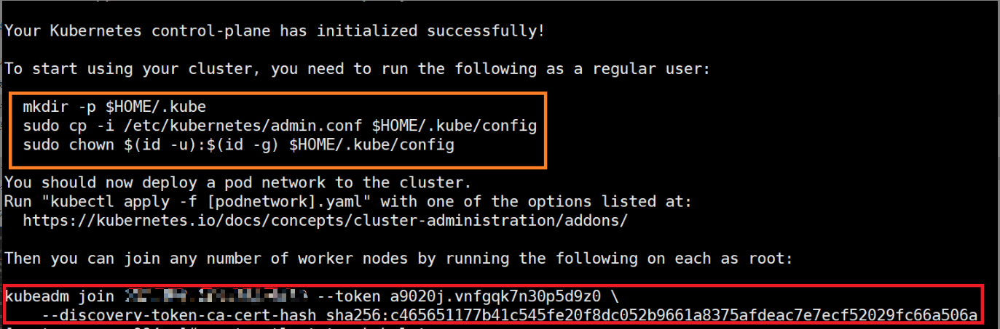

    Run the commands in the yellow box in [**Figure 2**](#cluster-initialization-success) to configure the cluster. Content in the red box indicates the token command for a worker node to join the cluster. Please save this command.

    ```shell
    rm -rf $HOME/.kube
    mkdir -p $HOME/.kube
    sudo cp -i /etc/kubernetes/admin.conf $HOME/.kube/config
    sudo chown $(id -u):$(id -g) $HOME/.kube/config
    ```

    > **NOTE**
    >
    >If cluster initialization fails on the master node, locate the cause as prompted, reset the node, and run the initialization command again. Reset commands:
    >
    > ```shell
    > kubeadm reset
    > systemctl stop kubelet
    > rm -rf /var/lib/cni/
    > rm -rf /var/lib/kubelet/*
    > rm -rf /etc/cni/
    > ifconfig cni0 down
    > ifconfig flannel.1 down
    > ip link delete cni0
    > ip link delete flannel.1
    > ```

5. Start the kube-flannel network plugin.

    Obtain `DemoVideoEngine.tar.gz` based on [Video Stream Engine](#video-stream-engine) and upload it to the `/home/k8s` directory on the server.

    ```shell
    cd /home/k8s
    tar -xvf DemoVideoEngine.tar.gz
    cd /home/k8s/k8s/script
    kubectl apply -f kube-flannel.yml
    ```

6. Check the cluster status.

    1. Check the status of the current node.

        ```shell
        kubectl get nodes -A -o wide
        ```

        It is expected that the `STATUS` column of the master node is `Ready` and the `CONTAINER-RUNTIME` column is `containerd://x.x.x`.

    2. Check the Pod status.

        ```shell
        kubectl get pod -A -o wide
        ```

        It is expected that the `STATUS` column of all Pods is `Running`.

    > **NOTE**
    >
    >If the status of the current node is `NotReady` and the error message "Network plugin returns error: cni plugin not initialized" is displayed when you run the `systemctl status kubelet` command to check the kubelet service status, you are advised to reset the cluster, restart the server, and initialize the cluster again.

##### Operations on a Worker Node<a name="ZH-CN_TOPIC_0000002518186532"></a>

Add a worker node to the cluster.

Obtain `DemoVideoEngine.tar.gz` based on [Video Stream Engine](#video-stream-engine) and upload it to the `/home/k8s` directory on the server.

1. <a id="worker-node-operation-1"></a>Configure container storage isolation and storage size. Perform this step again after the server is restarted.

    ```shell
    cd /home/k8s
    tar -xvf DemoVideoEngine.tar.gz k8s/
    cd /home/k8s/k8s/DevicesPlugin
    chmod +x storage_manager.sh
    ./storage_manager.sh $ACTION $STORAGE_START_INDEX $STORAGE_END_INDEX $STORAGE_SIZE_GB $IMG_BASE
    ```

    [**Table 1**](#parameters-for-configuring-container-storage-isolation-and-storage-size) describes the command parameters.

    **Table 1** Parameters for configuring container storage isolation and storage size<a id="parameters-for-configuring-container-storage-isolation-and-storage-size"></a>

    |Parameter|Description|
    | :---: | :---: |
    |ACTION|Specifies the action. The value can be `create`, `fcreate`, or `delete`, representing a standard creation, creating a container booted in f2fs format, or a deletion.|
    |STORAGE_START_INDEX|Specifies the start index of the data volume to be deleted or created.|
    |STORAGE_END_INDEX|Specifies the end index of the data volume to be deleted or created. The end index must be greater than or equal to the start index.|
    |STORAGE_SIZE_GB|Specifies the storage size, in GB. This parameter can be left blank when the action is `delete`.|
    |IMG_BASE|Specifies the image file of the base data volume. If there is no base data volume, this parameter can be left blank. For details about how to create an image file of the base data volume, see [Creating a Base Data Volume](#creating-a-base-data-volume). This parameter can be left blank when the action is `delete`. Pass only one of the parameters `STORAGE_SIZE_GB` and `IMG_BASE`.|

    For example:

    - Create 100 isolated data volumes from `video1` to `video100` whose storage size is 32 GB each.

        ```shell
        ./storage_manager.sh create 1 100 32
        ```

    - Create one isolated data volume `video1` whose storage size is 32 GB and boot the container internally in f2fs format.

        ```shell
        ./storage_manager.sh fcreate 1 1 32
        ```

    - Add 20 isolated data volumes from `video101` to `video120` whose storage size is 32 GB each.

        ```shell
        ./storage_manager.sh create 101 120 32
        ```

    - Delete data volumes `video1` to `video100`.

        ```shell
        ./storage_manager.sh delete 1 100
        ```

    - Delete the remaining 20 data volumes (`video101` to `video120`).

        ```shell
        ./storage_manager.sh delete 101 120
        ```

    - Use `videobase.img` to create data volumes `video1` to `video100`.

        ```shell
        ./storage_manager.sh create 1 100 /home/mount/img/videobase.img
        ```

    > **NOTE**
    >
    >If you have run commands in this step and want to change the storage size of a data volume, you need to delete the data volume and then create it again with the required size.
    >
    >The file format of the created data volume must match the configuration used when `k8s-video.sh` starts the Pod. For example, if a data volume in f2fs format is created for `video1` using `fcreate`, the f2fs option must be set to `1` when starting `video1` with the startup script `k8s-video.sh`.

2. Modify the containerd image configuration in the `config.toml` configuration file based on the `pause` version in the image information pulled on the master node. `registry.aliyuncs.com/google_containers/pause:3.9` in [**Figure 1** Image pull information](#image-pull-information) is used as an example.

    ```shell
    sed -i 's|sandbox_image =.*|sandbox_image = "registry.aliyuncs.com/google_containers/pause:3.9"|g' /etc/containerd/config.toml
    systemctl restart containerd
    ```

3. Run the token command to join the cluster. (The command is saved when the master node is initialized successfully. See the red box in [**Figure 2** Cluster initialization success](#cluster-initialization-success).)

    For example:

    ```shell
    kubeadm join xx.xx.xx.xx:xxxx --token 7h0hpd.1av4cdcb4fb0on5x \
    --discovery-token-ca-cert-hash sha256:357c6d1dbefe6f7adf3c80987a90d3765965b1c43e1757b655ea8586c8ade10a
    ```

    > **NOTE**
    >
    >- After a worker node is restarted and added to the cluster, ensure that the worker node can run the video stream cloud phone.
    >- *xx*.*xx*.*xx*.*xx* indicates the IP address, and *xxxx* indicates the mapped port.
    >- If the token command for joining the cluster is invalid, run the following command on the master node to generate a new one:
    >
    > ```shell
    > kubeadm token create --print-join-command
    > ```

4. Copy the kube configuration file of the master node to the worker node.

    ```shell
    rm -rf $HOME/.kube
    mkdir -p $HOME/.kube
    sudo scp root@xxx.xxx.xxx.xxx:$HOME/.kube/config $HOME/.kube/config
    sudo chown $(id -u):$(id -g) $HOME/.kube/config
    ```

5. Check the cluster status.
    1. Check the status on the master node.

        ```shell
        kubectl get nodes -A -o wide
        ```

        It is expected that the `STATUS` column of this worker node is `Ready` and the `CONTAINER-RUNTIME` column is `containerd://x.x.x`.

    2. Check the Pod status on the master node.

        ```shell
        kubectl get pod -A -o wide
        ```

        It is expected that the `STATUS` column of all Pods on the worker node is `Running`.

    3. Check the container status on the worker node.

        ```shell
        crictl ps
        ```

        It is expected that the `STATE` column of all containers is `Running`.

6. (Optional) Configure NUMA affinity.
    1. When configuring the compilation environment and compiling plugins, ensure that the Golang version is 1.25 or later. For details, refer to [Golang installation](#installing-golang).

    2. Obtain the Kubernetes NUMA affinity plugin package `topo-affinity-plugin-master.zip` based on [Video Stream Engine](#video-stream-engine) and upload it to the `/home/k8s` directory on the server.
    3. Decompress `topo-affinity-plugin-master.zip`, go to the package directory, and compile the plugin.

        ```shell
        unzip topo-affinity-plugin-master.zip
        cd topo-affinity-plugin-master
        go mod tidy
        make build
        ```

        After the build is complete, ensure that the `kunpeng-tap` binary file is generated in the `bin` directory.

    4. Install the containerd runtime.

        ```shell
        make install-service-containerd
        ```

        If you need to modify the startup parameters, modify the parameters under `ExecStart=` in the `hack/kunpeng-tap.service.containerd` file in the source code directory. [**Table 2**](#startup-parameters) describes the parameters.

        ```shell
        [Unit]
        Description=Kunpeng Topology-Affinity Plugin Service
        After=network.target
        
        [Service]
        ExecStart=/usr/local/bin/kunpeng-tap --runtime-proxy-endpoint="/var/run/kunpeng/tap-runtime-proxy.sock" \
            --container-runtime-service-endpoint="/var/run/containerd/containerd.sock" --container-runtime-mode="Containerd" \
            --resource-policy="topology-aware" --v=2
        Restart=always
        RestartSec=5
        
        [Install]
        WantedBy=multi-user.target
        ```

        **Table 2** Startup parameters<a id="startup-parameters"></a>

        |Parameter|Description|Default Value|Remarks|
        | :---: | :---: | :---: | :---: |
        |container-runtime-mode|Container runtime connected to the plugin, which can be Docker or containerd.|Containerd|Determine the container runtime according to that used in the Kubernetes cluster.|
        |resource-policy|Container resource optimization policy. Currently, numa-aware and topology-aware are supported. numa-aware supports CPU NUMA affinity for containers of the Burstable type. topology-aware provides CPU affinity at the socket, die, and NUMA levels, and supports memory and GPU optimization configurations.|topology-aware|Select a policy as required.|
        |v|Log level. The value ranges from 2 to 5.|2|The higher the level, the more detailed the logs.|

    5. Start the TAP service.

        ```shell
        make start-service
        ```

        After the startup is successful, the value of `Status` in the command output is `active`.

    6. Modify and restart Kubelet.
        1. Before the restart, ensure that no container is deployed on the node.
        2. Modify the kubelet configuration file `/var/lib/kubelet/kubeadm-flags.env`.

            The initial configuration is as follows:

            ```shell
            KUBELET_KUBEADM_ARGS="... --container-runtime=remote --container-runtime-endpoint=unix:///var/run/containerd/containerd.sock ..."
            ```

            Modify the file as follows:

            ```shell
            KUBELET_KUBEADM_ARGS="... --container-runtime=remote --container-runtime-endpoint=unix:///var/run/kunpeng/tap-runtime-proxy.sock ..."
            ```

    7. Restart kubelet and check whether the restart is successful.

        ```shell
        systemctl daemon-reload
        systemctl restart kubelet
        systemctl status kubelet
        ```

        > **NOTE**
        >
        >To uninstall the TAP plugin, perform the following steps:
        >- Restore the `/var/lib/kubelet/kubeadm-flags.env` file to its initial content, and then restart kubelet.
        >
        > ```shell
        > systemctl daemon-reload
        > systemctl restart kubelet
        > systemctl status kubelet
        > ```
        >
        >- Go to the `topology-affinity-plugin` source code directory and run the following commands to uninstall the plugin:
        >
        > ```shell
        > cd /home/k8s/topo-affinity-plugin-master
        > make uninstall-service
        > ```

#### Deploying Images<a name="ZH-CN_TOPIC_0000002518346452"></a>

##### Deploying the DaoCloud Device Plugin Image<a name="deploying-the-daocloud-device-plugin-image"></a>

Deploy the DaoCloud device plugin image on all worker nodes.

DaoCloud provides this plugin. This document applies to plugin version v0.0.5. Obtain related installation documents and software packages, and deploy the DaoCloud device plugin according to the documents.

1. Obtain the `VAGPU-25.03.01.01-RC24.tgz` GPU driver package based on "Software Environment" in [Kbox Cloud Phone Container Installation Guide](https://www.hikunpeng.com/document/detail/en/kunpengcps/boostcph/kboxcpc/docs/en/install_guide.md#d22-software-environment-). Decompress the package to obtain the `k8s-v0.0.5-1.tar.gz` package.
2. Decompress `k8s-v0.0.5-1.tar.gz` to obtain installation documents and software packages.
3. Install Va Docker based on chapter 4 in the *DC1000 Accelerator Card Va Docker Installation Guide 01*.
4. Configure the low-level runtime based on chapter 5 in the *DC1000 Accelerator Card Va Docker Installation Guide 02*.

> **NOTE**
>
>The DaoCloud device plugin version should be v0.0.5 or later.

##### Deploying the Device Plugin Image<a name="ZH-CN_TOPIC_0000002518186506"></a>

Deploy the device plugin image on all worker nodes.

1. If Golang is not installed, see [Golang installation](#installing-golang) to install it.

2. Download the device plugin code and switch to the specified commit ID.

    ```shell
    git clone https://github.com/everpeace/k8s-host-device-plugin.git
    cd  k8s-host-device-plugin
    git checkout 15e0a180dd4fbea7ea09b563b9e0713d3b90579a
    ```

3. Apply `device-plugin.patch`.

    Copy `device-plugin.patch` (in the `k8s/DevicesPlugin` folder of `DemoVideoEngine.tar.gz`) to the `k8s-host-device-plugin` directory.

    ```shell
    cd k8s-host-device-plugin
    patch -p1 < device-plugin.patch
    ```

4. Change the Go image repository address and compile the device plugin.

    ```shell
    export GOPROXY=https://goproxy.cn
    go build
    ```

5. Build an image.

    ```shell
    docker build -f Dockerfile  -t k8s-hostdev-plugin:0.1 .
    docker save k8s-hostdev-plugin:0.1 -o k8s-hostdev-plugin.tar
    ```

6. Import the image.

    Copy `k8s-hostdev-plugin.tar` to all worker nodes and import the image.

    ```shell
    ctr -n k8s.io images import k8s-hostdev-plugin.tar
    ```

##### Deploying the Image of the Plugin for Writing the Input Device Permission<a name="ZH-CN_TOPIC_0000002549706311"></a>

Deploy the image of the plugin for writing the input device permission on all worker nodes.

After the video stream cloud phone is started, a virtual input device is generated by the uinput kernel module. To access the virtual input device in the container, you need to configure its permission. This plugin automatically writes the permission of the virtual input device after the container is created.

1. Create an image of the plugin for writing the input device permission and import this image.

    ```shell
    cd /home/k8s/k8s/InputPermission
    ./make_image.sh
    ```

    `make_image.sh` contains image creation and import operations.

2. Copy `input-device-permission.tar` to other worker nodes and import it.

    ```shell
    ctr -n k8s.io images import input-device-permission.tar
    ```

##### Deploying the Video Stream Image<a name="ZH-CN_TOPIC_0000002518186530" id="deploying-the-video-stream-image"></a>

Create a video stream image on a worker node, and import and deploy the image on all worker nodes.

1. Place the `DemoVideoEngine.tar.gz` software package in a specified directory. Assume that this package is placed in `/home/k8s`.

    ```shell
    mkdir -p /home/k8s/tmp 
    cd /home/k8s/tmp 
    tar -xvf  ../DemoVideoEngine.tar.gz
    ```

2. <a id="deploying-the-video-stream-image-2"></a>Change the encoder type and re-create a `DemoVideoEngine.tar.gz` software package.

    In the `default.prop` file, the default encoder type is `1`. However, the encoder type required by DaoCloud is `2`. Therefore, you need to repack the package after modifying the value. In addition, you can modify the frame rate in the `default.prop` file. After the modification, you need to rebuild an image. Ensure that the image can run a cloud phone properly with Docker.

    1. Open the `default.prop` file.

        ```shell
        vi vendor/default.prop
        ```

    2. Press **i** to enter the insert mode and change `vmi.video.encodertype` to `2` and `vmi.video.encode.rcmode` to `2` or `3`.
    3. Press **Esc**, type `:wq!`, and press **Enter** to save the settings and exit.
    4. Re-create a `DemoVideoEngine.tar.gz` software package.

        ```shell
        tar -zcvf DemoVideoEngine.tar.gz  *
        ```

3. Use `DemoVideoEngine.tar.gz` created in [2](#deploying-the-video-stream-image-2) to re-create a video stream image based on [Creating an Image](#creating-an-image). Assume that the name of the created image is `video:version`.
4. Run `docker` to export the video stream image.

    ```shell
    docker save video:version -o video.tar
    ```

5. Copy the video stream image to all worker nodes and import the image.

    ```shell
    ctr -n k8s.io images import video.tar
    ```

    You can run the `crictl images` command to view the image name and tag. For example: `docker.io/library/video:version`.

## VM Environment Deployment<a name="ZH-CN_TOPIC_0000002518304958"></a>

### Environment Requirements<a name="ZH-CN_TOPIC_0000002549944725"></a>

You are advised to set up the VM environment of the video stream engine on openEuler 22.03 LTS SP4 running on the new Kunpeng 920 processor model. Before setting up the environment, ensure that your hardware meets the requirements.

**Hardware Requirements<a name="section217mcpsimp"></a>**

[**Table 1**](#hardware-requirements) describes the hardware requirements for deploying the Kbox Android container environment. [**Table 2**](#kunpeng-server-specifications) describes the hardware specifications.

**Table 1** Hardware requirements<a id="hardware-requirements"></a>

|No.|Device Model|Purpose|
| :---: | :---: | :---: |
|1|New Kunpeng 920 processor model|Used to set up the VM environment for running video stream containers and cloud phones.|

**Table 2** Kunpeng server specifications<a id="kunpeng-server-specifications"></a>

|Item|Specification|
| :---: | :---: |
|CPU|2 x new Kunpeng 920 processor model, 80 cores@2.9 GHz|
|Memory|16 x DDR5 DIMM-64 GB-4800 MT/s|
|System drive|ES3600C V5, 6400 GB, NVMe SSD|
|Data drive|ES3600C V5, 6400 GB, NVMe SSD|
|NIC|1 x NIC (4 x GE); 1 x 5902L onboard flexible NIC|
|Riser card|1 x x16 slot (PCIe x16) + 2 x x8 slot (PCIe x8)-riser modules 1 and 2, 2 x x8 slot (PCIe x8)-rear riser module|
|GPU|4 x DC1000 or 4 x DC1000C|
|OS|openEuler 22.03 LTS SP4|
|System/Kernel version|5.10.0-216.0.0|

**Table 3** VM specifications<a id="vm-specifications"></a>

|VM Quantity|CPU Quantity per VM|Memory per VM|Drive Capacity per VM|
| :---: | :---: | :---: | :---: |
|4|80|180 GiB|512 GiB|

> **NOTE**
>
>The VM memory and drive capacity are for reference only. Adjust the configurations as required.

**OS Requirements<a name="section305mcpsimp"></a>**

[**Table 4**](#host-os-requirements) and [**Table 5**](#vm-os-requirements) list the OS requirements of the host and VM.

**Table 4** Host OS requirements<a id="host-os-requirements"></a>

|Item|Version|How to Obtain|
| :---: | :---: | :---: |
|openEuler|22.03 LTS SP4|[Link](https://www.openeuler.openatom.cn/en/download/archive/detail/?version=openEuler%2022.03%20LTS%20SP4)|
|Kernel|5.10.0-216.0.0|[Link](https://gitee.com/openeuler/kernel/repository/archive/5.10.0-216.0.0.zip)|

**Table 5** VM OS requirements<a id="vm-os-requirements"></a>

|Item|Version|How to Obtain|
| :---: | :---: | :---: |
|openEuler|22.03 LTS SP4|[Link](https://www.openeuler.openatom.cn/en/download/archive/detail/?version=openEuler%2022.03%20LTS%20SP4)|
|Kernel|5.10.0-216.0.0|For details, see "Compiling the Kernel" in the [Kbox Cloud Phone Container Installation Guide](https://www.hikunpeng.com/document/detail/en/kunpengcps/boostcph/kboxcpc/docs/en/install_guide.md#d7-compiling-the-kernel).|

**Obtaining VM Software Packages<a name="section1543425619147" id="obtaining-vm-software-packages"></a>**

[**Table 6**](#files-required-for-vm-deployment) lists the patch and script required for VM deployment.

**Table 6** Files required for VM deployment<a id="files-required-for-vm-deployment"></a>

|Software Package|File|File Path|How to Obtain|
| :---: | :---: | :---: | :---: |
|Kbox-AOSP11.zip|VM kernel patch|Kbox-AOSP11/deploy_scripts/vm_deploy/patchForKernel/general.patch|[Link](https://mirrors.huaweicloud.com/kunpeng/archive/kunpeng_solution/ARMNative/BoostKit25.1.RC1_Demo/Kbox_Demo/Kbox-AOSP11.zip)|
|Kbox-AOSP11.zip|VM tuning script|Kbox-AOSP11/deploy_scripts/vm_deploy/setup_vm.sh|[Link](https://mirrors.huaweicloud.com/kunpeng/archive/kunpeng_solution/ARMNative/BoostKit25.1.RC1_Demo/Kbox_Demo/Kbox-AOSP11.zip)|

### Host Environment Configuration<a name="ZH-CN_TOPIC_0000002550064713" id="host-environment-configuration"></a>

#### Modifying BIOS Settings<a name="ZH-CN_TOPIC_0000002518464882"></a>

You can modify BIOS configuration items of the host to optimize the host for deploying the VM environment.

[**Table 1**](#bios-configuration-items) lists the BIOS configuration items to be modified.

**Table 1** BIOS configuration items<a id="bios-configuration-items"></a>

|Item|Path|Value|
| :---: | :---: | :---: |
|SMMU|Advanced > MISC Configuration > Support Smmu|Enabled|
|CPU hyper-threading|Advanced > Power And Performance Configuration > CPU PM Control > SMT2|Enabled|
|Performance policy|Advanced > Power And Performance Configuration > Power Policy|Performance|
|GICv4.1|Advanced > Processor Configuration > GIC Version|4.1|

#### Modifying the Kernel Module<a name="ZH-CN_TOPIC_0000002518304960"></a>

In the DC1000/DC1000C GPU hardware environment, the host kernel needs to be adapted for driver installation on the VM. Obtain the kernel source code in advance.

1. Obtain the kernel source code. See [Table 4](#host-os-requirements).
2. Decompress the kernel source code and go to the root directory.

    ```shell
    unzip 5.10.0-216.0.0.zip
    cd 5.10.0-216.0.0
    ```

3. Obtain the kernel patch file `general.patch` according to [Obtaining VM Software Packages](#obtaining-vm-software-packages).
4. Apply the patch in the kernel source code directory `5.10.0-216.0.0`.

    ```shell
    patch -p1 < general.patch
    ```

5. Generate a .config file in the source code directory.

    ```shell
    cp /boot/config-5.10.0-216.0.0.115.oe2203sp4.aarch64 .config
    make menuconfig
    ```

6. Select `Load` in the following page:

    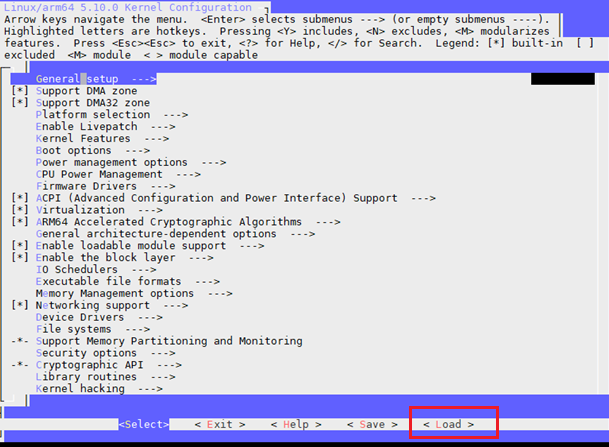

7. Select `OK` in the following page:

    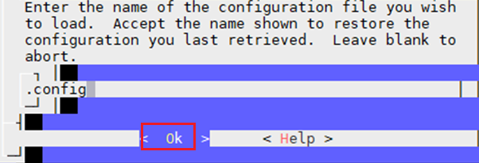

8. On the kernel configuration interface, configure the kernel compilation options listed in [**Table 1**](#kernel-compilation-options).

    **Table 1** Kernel compilation options<a id="kernel-compilation-options"></a>

    |Option|Required Value|
    | :---: | :---: |
    |LOCALVERSION|-patched-vm|
    |DEBUG_INFO_BTF|N|

    > **NOTE**
    >
    >Configuration method:
    >- Press **/** for search.
    >- Press **Y** to compile the selected item into the kernel. The corresponding item is displayed as `[*]`.
    >- Press **N** to exclude the selected item. The corresponding item is displayed as `[]`.
    >- Press **M** to compile the selected item into a module (in KO format). The corresponding item is displayed as `<M>`.
    >- Press **Enter** to edit the selected item.
    >- Press the corresponding number to select a search result.
    >- After the modification is complete, select `<Save>` to save the modification.
    >- After saving the modification, select `<Exit>` to exit.

9. Install dependencies and enable the LXCFS service. If you need to divide the command into multiple lines, add a backslash `\` at the end of each line.

    ```shell
    yum install -y dwarves dpkg dpkg-devel openssl openssl-devel ncurses ncurses-devel bison flex bc libdrm build elfutils-libelf-devel docker lxc lxcfs lxcfs-tools git tar patch make gcc
    systemctl start lxcfs
    systemctl enable lxcfs
    ```

    

10. Compile the kernel code.

    ```shell
    make -j72
    ```

11. Install the new kernel.

    ```shell
    make modules_install 
    make install
    ```

#### Modifying GRUB Settings<a name="ZH-CN_TOPIC_0000002549944727"></a>

In the GRUB configuration file, enable huge pages on the host to enhance memory management, enable IOMMU passthrough to accelerate memory access, and enable GICv4.1 to reduce CPU consumption and latency and improve virtual drive I/O performance.

1. Open the `grub` configuration file in the host system.

    ```shell
    vim /etc/default/grub
    ```

2. Press **i** to enter the insert mode and add the following content to `GRUB_CMDLINE_LINUX`:

    ```shell
    "default_hugepagesz=1G hugepagesz=1G hugepages=800 pci=realloc transparent_hugepage=never iommu.passthrough=1 arm64.nopauth kvm-arm.vgic_v4_enable=1 kvm-arm.virt_msi_bypass=1 irqchip.gicv3_rsv_buses_start=30 irqchip.gicv3_rsv_buses_count=10"
    ```

    > **NOTE**
    >
    >Huge page configuration reference: `hugepages` = Total memory x 0.8 (rounded down). In this example, the value is 800 GB (1 TB x 0.8).

3. Press **Esc** to exit the insert mode. Type `:wq!` and press **Enter** to save the settings and exit.
4. Update the `grub` configuration file.

    ```shell
    grub2-mkconfig -o /boot/efi/EFI/openEuler/grub.cfg
    ```

5. Set the boot kernel.

    ```shell
    grub2-set-default 'openEuler (5.10.0-patched-vm) 22.03 (LTS-SP4)'
    ```

6. Reboot the server.

    ```shell
    reboot
    ```

7. After the reboot, confirm that the kernel is switched to `5.10.0-patched-vm`.

    ```shell
    uname -r
    ```

8. <a id="modifying-grub-settings-8"></a>Check whether the hugepage configuration takes effect.

    ```shell
    cat /sys/devices/system/node/node*/meminfo | grep Huge
    ```

    In the command output, if the sum of each `Node  _x_  HugePages_Total` field is 800, the configuration is successful.

    

9. Check whether IOMMU passthrough is successfully configured.

    ```shell
    dmesg | grep iommu | head -n 10
    ```

    If "iommu: Default domain type: Passthrough" is displayed in the command output, the configuration is successful.

    

10. Check whether GICv4.1 is successfully configured.

    ```shell
    dmesg | grep GICv4.1
    ```

    If "GICv4.1 support enabled" is displayed in the command output, the configuration is successful.

    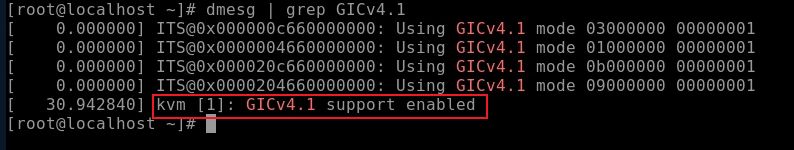

11. After the VM is started, run the following command:

    ```shell
    dmesg | grep "Create shadow device"
    ```

    If "Create shadow device" is displayed in the command output, GICv4.1 is successfully configured.

    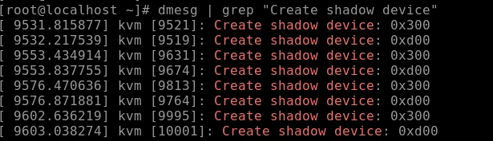

#### Installing VM Dependencies<a name="ZH-CN_TOPIC_0000002550064715"></a>

Install required dependencies on the host where the VM environment is set up.

1. Install libvirt, virt-manager, and other dependencies.

    ```shell
    yum install libvirt virt-manager edk2-aarch64 sshpass mesa-libGLES-devel mesa-dri-drivers virt-install -y
    ```

2. Install the x11 server to enable the virt-manager GUI.

    ```shell
    yum install xorg-x11-server
    ```

3. Open the sshd configuration file.

    ```shell
    vi /etc/ssh/sshd_config
    ```

4. Press **i** to enter the insert mode and set `X11Forwarding` to `yes`.
5. Press **Esc** to exit the insert mode. Type `:wq!` and press **Enter** to save the settings and exit.
6. Restart the sshd service.

    ```shell
    systemctl restart sshd
    ```

    > **NOTE**
    >
    >In the event of a `virt-manager` execution error, re-initiate an SSH terminal.

#### Querying PCIe Node Information of a GPU<a name="ZH-CN_TOPIC_0000002518464884" id="querying-pcie-node-information-of-a-gpu"></a>

The new Kunpeng 920 processor model has four NUMA nodes. Four VMs will be created, and each VM uses resources of a NUMA node of the host. Each NUMA node corresponds to two GPUs. To prevent performance loss caused by cross-NUMA access, you need to confirm the PCIe nodes of GPUs used by each VM before creating VMs.

1. <a name="pcie-info-query-1"></a>Check the IDs of all PCIe nodes of the DaoCloud GPUs.

    ```shell
    lspci | grep 0200
    ```

    

2. Check the NUMA node of each GPU node. The NUMA IDs in the command output map to the GPU node IDs queried in [1](#pcie-info-query-1). The command output in the following figure is only an example. 17:00.0 to 18:00.3 (the first eight nodes) correspond to NUMA node 1 of the host.

    ```shell
    lspci -vvv -d 1f4f:0200 | grep NUMA
    ```

    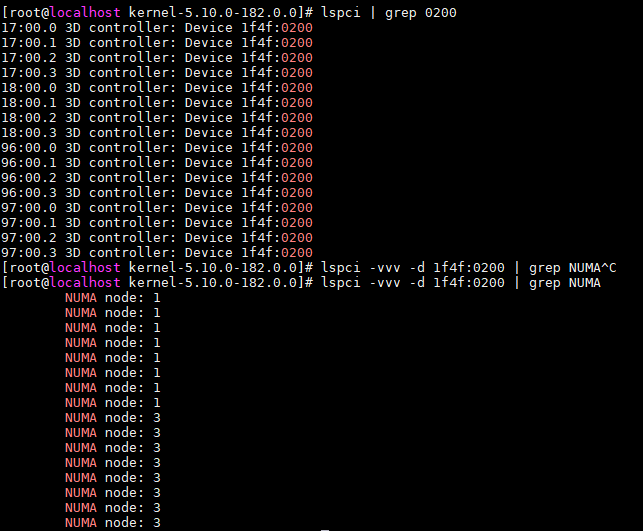

#### Configuring the Host Network<a name="ZH-CN_TOPIC_0000002518304962" id="configuring-the-host-network"></a>

Create a host network device to support subsequent VM network configuration.

1. <a id="configuring-the-host-network-1"></a>Check the NIC used on the host.

    ```shell
    ip a
    ```

    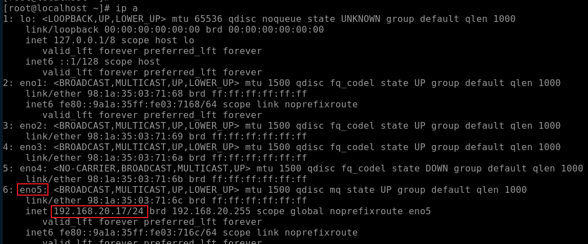

2. Check the PCI node of the NIC.

    ```shell
    lshw -c network -businfo
    ```

    

3. <a id="configuring-the-host-network-3"></a>Check the maximum number of VFs allowed by the NIC.

    ```shell
    cat /sys/bus/pci/devices/0000:75:00.0/sriov_totalvfs
    ```

    

    - If this command is successfully executed, the device supports the single-root I/O virtualization (SR-IOV) solution. `7` in the command output indicates that seven vNICs can be created, and a maximum of seven VMs can use the vNICs.
    - If this command fails or the number of vNICs in the command output is less than the number of VMs to be deployed, select the second solution, that is, the bridge mode. This mode will cause extra computing performance loss and latency. To configure the bridge mode, see [6](#configuring-the-host-network-6) and [7](#configuring-the-host-network-7).

4. Create VFs.

    ```shell
    echo 4 > /sys/bus/pci/devices/0000:75:00.0/sriov_numvfs
    ```

    > **NOTE**
    >
    >You need to perform this step every time the server is restarted. You are advised to write this step in a file such as `~/.bashrc` for automatic execution after each restart.

5. <a id="configuring-the-host-network-5"></a>Check the created VF nodes.

    ```shell
    lshw -c network -businfo
    ```

    If the following information is displayed, four vNICs are successfully created.

    

    > **NOTE**
    >
    >[1](#configuring-the-host-network-1) to [5](#configuring-the-host-network-5) have completed the creation of vNICs in the SR-IOV solution. You can skip the following steps.
    >If the device does not support SR-IOV, you can perform the following steps to adopt the bridge solution.
    >For example, if the maximum number of VFs supported by the NIC in [3](#configuring-the-host-network-3) is 2 and four VMs need to be deployed, you can adopt the SR-IOV solution for two VMs and the bridge solution for the other two.

6. <a id="configuring-the-host-network-6"></a>Check and back up the configuration file of the current NIC.

    ```shell
    cd /etc/sysconfig/network-scripts/
    cp ifcfg-eno5 ifcfg-eno5.bak
    ```

7. <a id="configuring-the-host-network-7"></a>Create a bridge configuration file `ifcfg-br0` and modify the NIC configuration file.

    Migrate the `IPADDR`, `NETMASK`, `GATEWAY`, and `DNS` information in the NIC configuration file to the bridge configuration file.

    ```shell
    touch ifcfg-br0
    cat >ifcfg-br0 <<EOF
    TYPE=Bridge
    NAME=br0
    DEVICE=br0
    ONBOOT=yes
    BOOTPROTO=static
    IPADDR=XX.XX.XX.XX
    NETMASK=XX.XX.XX.XX
    GATEWAY=XX.XX.XX.XX
    DNS1=XX.XX.XX.XX
    EOF
    ```

    > **NOTE**
    >
    >1. Modify `IPADDR`, `NETMASK`, `GATEWAY`, and `DNS` in the bridge configuration file based on the NIC configuration of the host.
    >2. Delete the `IPADDR`, `NETMASK`, `GATEWAY`, and `DNS` configurations from the host NIC configuration file and add `BRIDGE=br0` to the end of the file.
    > 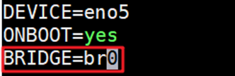

8. Restart the libvirtd and NetworkManager services and reboot the server.

    ```shell
    systemctl restart libvirtd
    systemctl restart NetworkManager
    reboot
    ```

9. Check whether `br0` is successfully created.

    ```shell
    ip a
    ```

    If the following information is displayed, the bridge is created.

    

### VM Configuration<a name="ZH-CN_TOPIC_0000002549944729" id="vm-configuration"></a>

#### Creating a VM Using virt-manager<a name="ZH-CN_TOPIC_0000002550064717"></a>

Four VMs are required in this document. You can perform operations in this section for four times in sequence. Alternatively, you can perform the operations only once and then copy the VM.

For details, see [VM Copying](#vm-copying).

1. Open virt-manager and click the icon in the red box to open the VM configuration page.

    ```shell
    virt-manager
    ```

    

2. Select **Local install media (ISO image or COROM)** and click **Forward**.

    

3. Click **Browse**, select the openEuler 22.03 LTS SP4 image downloaded before, deselect **Automatically detect from installation media / source**, enter **Generic default**, and click **Forward**.

    

4. <a id="virt-manager-4"></a>Set **Memory** to **180000** and **CPUs** to **80**, and click **Forward**.

    

    > **NOTE**
    >
    >**180000** is for reference only. You are advised to allocate all huge pages of each NUMA node to its corresponding VM based on the huge page configuration in [2.2.3-8](#modifying-grub-settings-8).

5. Allocate 512 GiB drive storage space and click **Forward**.

    > **NOTE**
    >
    >512 GiB is for reference only. Allocate drive storage space as required. If you plan to use passthrough drive partitions as data drives to improve the I/O performance of VMs, allocate a small volume here, for example, 50 GiB, to be used as a system drive.

    

    If the current drive space is insufficient, create a virtual drive file on another drive. The procedure is as follows:

    1. Create a drive image file `vm0.qcow2`.

        ```shell
        qemu-img create -f qcow2 vm0.qcow2 1024G
        ```

    2. Select **Select or create custom storage** and click **Manage**.

        

    3. Click **Browse Local**.

        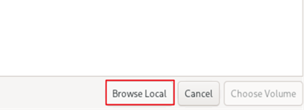

    4. Select the created `vm0.qcow2` file.

        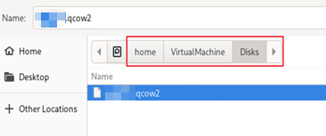

6. Set **Name** to **vm***X* (*X* = 0, 1, 2, or 3) and select **Customize configuration before install**. If the bridge mode is configured for the host machine in [2.2.6-Configuring the Host Network](#configuring-the-host-network), select **Bridge br0** from **Network selection** and click **Finish**.

    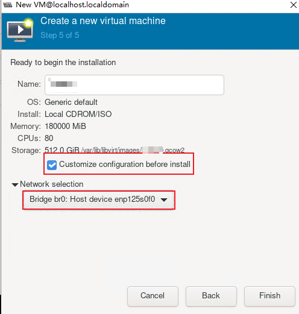

    > **NOTE**
    >
    >If SR-IOV is selected in [2.2.6-Configuring the Host Network](#configuring-the-host-network), you do not need to configure **Network selection**. These virtual network interfaces will be deleted later.

7. On the following page, click **Add Hardware** and add the following devices in sequence.

    

    1. Add peripheral 1: **Add Hardware > Input > Generic USB Keyboard > Finish**
    2. Add peripheral 2: **Add Hardware > Input > Virtio Tablet > Finish**
    3. Add GPU PCIe devices (each VM requires two GPUs and thus eight nodes need to be added in sequence): **Add Hardware > PCI Host Device > ***Select a node*** > Finish**. The GPU nodes and NUMA nodes in [2.3.2-2](#tuning-vm-configurations-2) must correspond to those queried in [Querying PCIe Node Information of a GPU](#querying-pcie-node-information-of-a-gpu).
    4. If the SR-IOV solution is used in [2.2.6-Configuring the Host Network](#configuring-the-host-network), add a vNIC to the VM: **Add Hardware > PCI Host Device > ***Select a node*** > Finish**. For details about NIC nodes, see the command output in [2.2.6-5](#configuring-the-host-network-5).

        

    5. If there is no **Display VNC** device by default, you need to manually add one. Choose **Add Hardware > Graphics**, set **Type** to **VNC server**, and click **Finish** to add the device.

8. Click **Begin Installation**. On the displayed page, select the first option to start the installation.
9. On the **INSTALLATION SUMMARY** page, select **Installation Destination**.

    

10. On the **Installation Destination** page, select **Custom** and click **Done** in the upper left corner.

    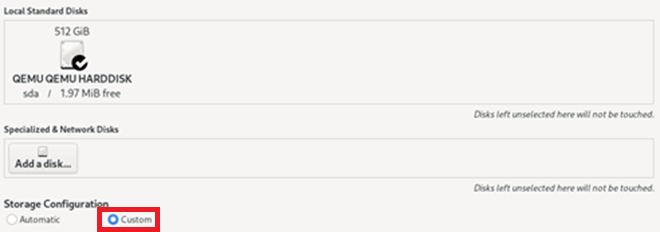

11. Set the partitioning scheme to **Standard Partition**.

    

12. Click **+** and add mount points, as described in [Table 1](#partition-mount-points).

    

    **Table 1** Partition mount points<a id="partition-mount-points"></a>

    |Mount Point|Capacity|
    | :---: | :---: |
    |/boot|2 GiB|
    |/boot/efi|2 GiB|
    |/swap|32 GiB|

    Add the three mount points. The remaining space will be allocated to the root directory. Click **Done**. In the displayed dialog box, click **Accept Changes**.

13. Check free memory of the server before the installation.

    ```shell
    free -h
    ```

    If the free memory is less than the VM memory set in [4](#virt-manager-4), perform [2.3.2-3](#tuning-vm-configurations-3) and [2.3.2-5](#tuning-vm-configurations-5) in advance. Obtain the VM tuning script `setup_vm.sh` according to [Obtaining VM Software Packages](#obtaining-vm-software-packages) and enable hugepage memory for the VM. If the free memory is sufficient, skip this step.

    ```shell
    ./setup_vm.sh vm0 --numatune {bind NUMA}
    ./setup_vm.sh vm0 --enable_hugepages
    ```

    > **NOTE**
    >
    >If the VM cannot use huge pages, it will use the free memory of the host by default. If the free memory is insufficient, the VM system fails to be installed. In this case, you need to allocate huge pages to the VM in advance for system installation.

14. Configure the **root** account and password and click **Begin Installation**.

    

15. <a id="virt-manager-15"></a>After the installation is complete, reopen virt-manager and shut down the VM.

    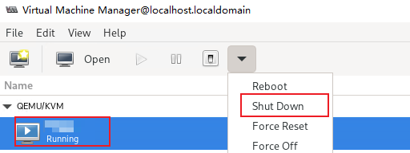

16. (Optional) Use a passthrough drive partition as the data drive of the VM.

    > **NOTE**
    >
    >Passthrough drive partitions can improve the drive I/O performance of VMs. It is recommended that this function be enabled in drive I/O-intensive scenarios, such as high-density cloud gaming.

    1. View drive partition information of the host.

        ```shell
        lsblk
        ```

        Select a partition as the data drive of the VM. The following uses `nvme0n1p7` as an example.

        

    2. Open virt-manager and choose **Add Hardware > Manage**. Set **Bus type** to **VirtIO**, **Cache mode** to **none**, and **IO mode** to **native**.

        

    3. Choose **Browse Local > dev > nvme0n1p7 > Open**.

        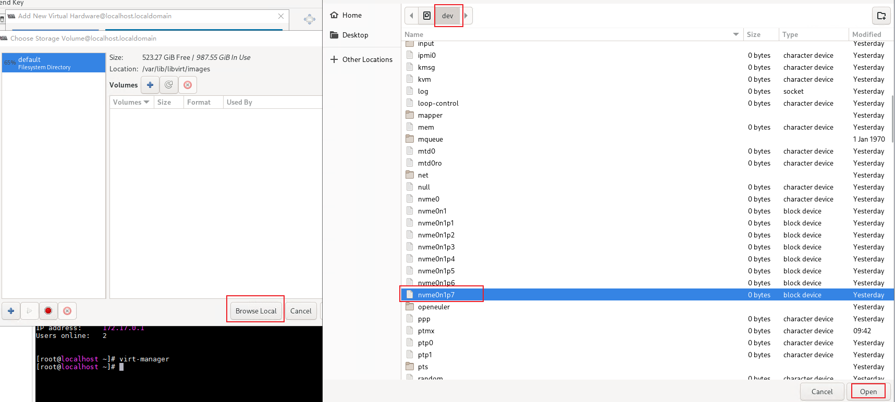

    4. Click **Finish**.

        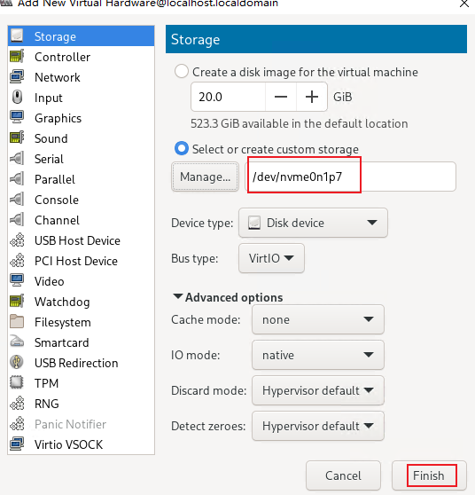

17. If the SR-IOV solution is used, delete unnecessary virtual network interfaces.

    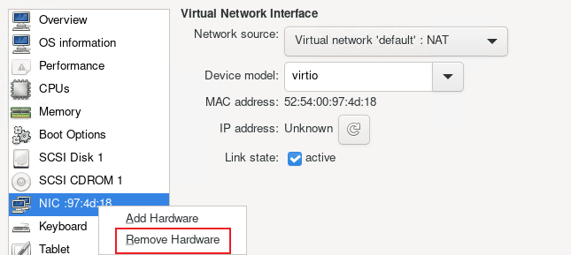

18. Delete the virtual graphics card.

    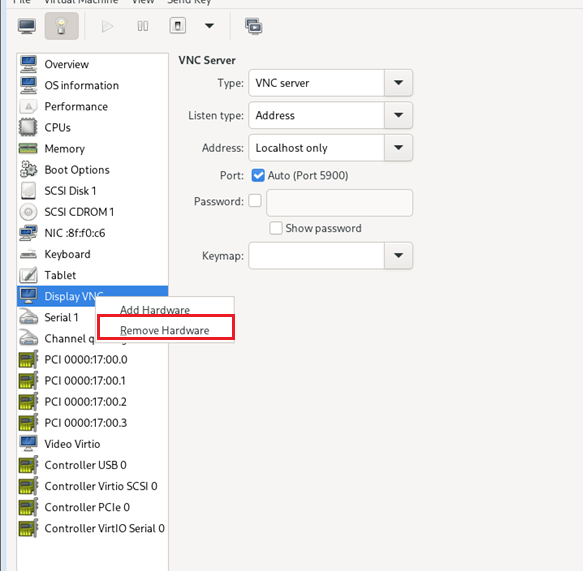

    

#### Tuning VM Configurations<a name="ZH-CN_TOPIC_0000002518464886" id="tuning-vm-configurations"></a>

VM configuration tuning needs to be performed according to the mapping between GPUs and NUMA nodes.

Perform operations in this section on all the four VMs. `vm0` corresponding to NUMA1 is used as an example. For details about the mapping, refer to [Querying PCIe Node Information of a GPU](#querying-pcie-node-information-of-a-gpu). You can download the VM tuning script according to [Obtaining VM Software Packages](#obtaining-vm-software-packages).

1. Open the VM XML file.

    ```shell
    virsh edit vm0
    ```

2. <a id="tuning-vm-configurations-2"></a>Press **i** to enter the insert mode and add the following content to `</cputune>` to configure the mapping between VM vCPUs and host CPUs.

    The value of `cpuset` is the bound host CPU core ID. The value ranges from 0 to 79 for NUMA0, from 80 to 159 for NUMA1, from 160 to 239 for NUMA2, and from 240 to 319 for NUMA3.

    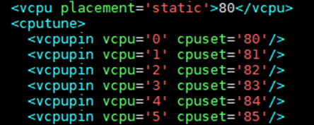

    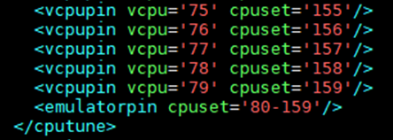

    > **NOTE**
    >
    >You can also run the following command instead:
    >
    > ```shell
    > ./setup_vm.sh vm0 --cputune 80,159
    > ```

3. <a id="tuning-vm-configurations-3"></a>Add the following content under `</cputune>` to bind the VM to the NUMA memory of the host. (In this example, NUMA1 is bound to the VM.)

    ```shell
    <numatune>
          <memory mode='strict' nodeset='1'/>
    </numatune>
    ```

    

    > **NOTE**
    >
    >You can also run the following command instead:
    >
    > ```shell
    > ./setup_vm.sh vm0 --numatune 1
    > ```

4. Add the following content above `</cputune>` to bind the QEMU emulator:

    ```shell
    <emulatorpin cpuset='80-159' />
    ```

    

    > **NOTE**
    >
    >You can also run the following command instead:
    >
    > ```shell
    > ./setup_vm.sh vm0 --emulatorpin 80-159
    > ```

5. <a id="tuning-vm-configurations-5"></a>Use huge pages. Add the content in the red box to the position shown in the following figure.

    ```shell
    <memoryBacking>
         <hugepages/>
    </memoryBacking>
    ```

    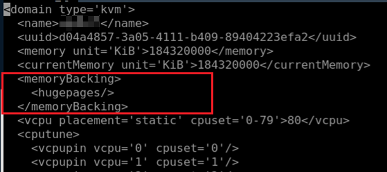

    > **NOTE**
    >
    >You can also run the following command instead:
    >
    > ```shell
    > ./setup_vm.sh vm0 --enable_hugepages
    > ```

6. Enable CPU topology.

    Find the <cpu mode='host-passthrough' check='none'\> element and modify the content as follows.

    ```shell
    <cpu mode='host-passthrough' check='none'>
      <topology sockets='1' dies='1' clusters='10' cores='4' threads='2'/>
    </cpu>
    ```

    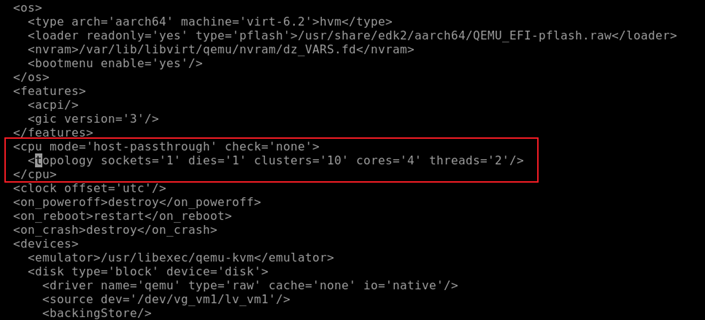

7. Press **Esc** to exit the insert mode. Type `:wq!` and press **Enter** to save the settings and exit.
8. Start the VM.

    

9. Run the following command on the VM. If `0-7` is displayed in the command output, CPU topology takes effect.

    ```shell
    cat /sys/devices/system/cpu/cpu0/topology/cluster_cpus_list
    ```

    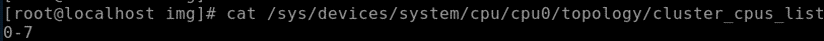

10. Run the following command to enable cluster scheduling optimization:

    ```shell
    echo 1 > /proc/sys/kernel/sched_cluster
    ```

    > **NOTE**
    >
    >This step needs to be performed each time the VM is restarted. You are advised to write this step in a file such as `~/.bashrc` for automatic execution after each restart.

#### Configuring the VM Network<a name="ZH-CN_TOPIC_0000002518304964"></a>

##### Configuring the VM NIC Configuration File<a name="ZH-CN_TOPIC_0000002549944731"></a>

Modify the VM NIC configuration file to enable network communication for the VM. If the SR-IOV solution is used, you need to manually generate a VM NIC configuration file by referring to this section.

1. Check the VM NIC name.

    ```shell
    ip a
    ```

    

2. Generate a configuration file.

    - If the SR-IOV solution is adopted in [2.2.6-Configuring the Host Network](#configuring-the-host-network), run the following commands to create a network configuration file:

        ```shell
        nmcli connection add ifname enp1s0 con-name enp1s0 type ethernet
        cd /etc/sysconfig/network-scripts/
        ls
        ```

        As shown in the following figure, the VM NIC configuration file is created.

        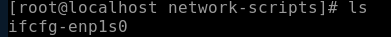

    - If the bridge mode is adopted in [2.2.6-Configuring the Host Network](#configuring-the-host-network), a network configuration file is automatically generated on the VM. The file name is the same as the NIC name in the `ip a` command output. In this case, skip this step.

    > **NOTE**
    >
    >If possible, you are advised to use the SR-IOV solution, which provides better computing performance and shorter latency.

3. Log in to the VM and configure `IPADDR`, `NETMASK`, `GATEWAY`, and `DNS` for the VM. Ensure that `ONBOOT` is set to `yes`.

    The VM and host share the values of `NETMASK`, `GATEWAY`, and `DNS`. `IPADDR` can be customized. Confirm with the network administrator to ensure that the IP address does not conflict with other IP addresses on the LAN.

    ```shell
    vi ifcfg-enp1s0
    ```

    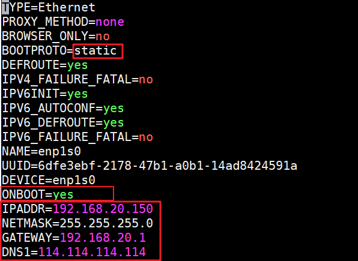

    If the configuration file contains the content in the red box in the following figure, delete the content.

    

4. Reload network connections. You are advised to run the commands in the shell of virt-manager. If you perform remote operations through SSH, connections will be interrupted due to network configuration modification.

    ```shell
    virt-manager
    ```

    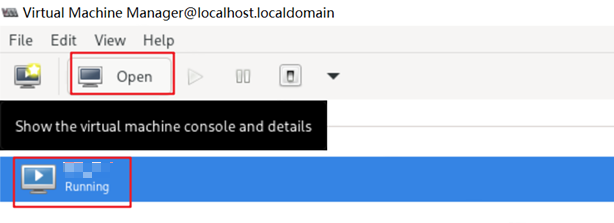

    ```shell
    nmcli connection reload
    nmcli connection down enp1s0
    nmcli connection up enp1s0
    ```

    

5. Ping the gateway and check whether the configuration takes effect over SSH remote connection. The gateway can be queried in the configuration file of bridge `br0`.

    ```shell
    ping 192.168.20.1
    ```

    

    On any server in the same network segment, connect to the VM using `ssh`.

    ```shell
    ssh 192.168.20.150
    ```

    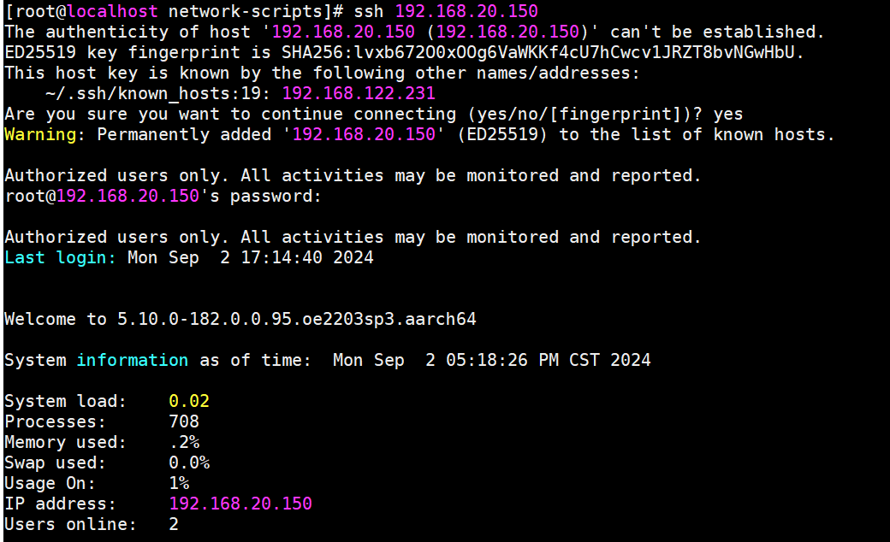

    > **NOTE**
    >
    >In this example, data communication with the VM within the server's LAN has been achieved. To access this VM from an external network, contact your network administrator to configure the VM following the same configuration as the server on the LAN.

### Video Stream Startup Environment Configuration (VM)<a name="ZH-CN_TOPIC_0000002549947651" id="video-stream-startup-environment-configuration-vm"></a>

When deploying the cloud phone container environment and video stream container in the VM environment, you need to adjust the `cfct_video` and `hardware_bind.cfg` files based on the number of CPU and GPU cores of the VM.

Deploy the cloud phone container environment on the VM and run video stream cloud phones. For details, see [Deployment Description](https://www.hikunpeng.com/document/detail/en/kunpengcps/boostcph/kboxcpc/docs/en/install_guide.md) in the *Kbox Cloud Phone Container Installation Guide* and [Software Deployment](https://www.hikunpeng.com/document/detail/en/kunpengcps/boostcph/videostreamengine/docs/en/install_guide.md#d1-software-deployment) in the *Video Stream Engine Installation Guide*.

The specific steps are as follows:

1. Extract the `cfct_video` and `hardware_bind.cfg` files. For details, see [Software Deployment](https://www.hikunpeng.com/document/detail/en/kunpengcps/boostcph/videostreamengine/docs/en/install_guide.md#d1-software-deployment) in the *Video Stream Engine Installation  Guide*.
2. Modify the `hardware_bind.cfg` script to adapt it to the VM's 80-core CPU and 4 GPU nodes.
    1. Open the `hardware_bind.cfg` script.

        ```shell
        vim hardware_bind.cfg
        ```

    2. Press **i** to enter the insert mode and add the following content:

        ```shell
        VIDEO_CPU_MAP_80CORE_MODE0=(
        "${MODE0_CPUS0_320[0]}"
        "${MODE0_CPUS0_320[1]}"
        "${MODE0_CPUS0_320[2]}"
        "${MODE0_CPUS0_320[3]}"
        "${MODE0_CPUS0_320[4]}"
        "${MODE0_CPUS0_320[5]}"
        "${MODE0_CPUS0_320[6]}"
        "${MODE0_CPUS0_320[7]}"
        "${MODE0_CPUS0_320[8]}"
        "${MODE0_CPUS0_320[9]}"
        "${MODE0_CPUS0_320[10]}"
        "${MODE0_CPUS0_320[11]}"
        "${MODE0_CPUS0_320[12]}"
        "${MODE0_CPUS0_320[13]}"
        "${MODE0_CPUS0_320[14]}"
        "${MODE0_CPUS0_320[15]}"
        "${MODE0_CPUS0_320[16]}"
        "${MODE0_CPUS0_320[17]}"
        "${MODE0_CPUS0_320[18]}"
        "${MODE0_CPUS0_320[19]}"
        "${MODE0_CPUS0_320[20]}"
        "${MODE0_CPUS0_320[21]}"
        "${MODE0_CPUS0_320[22]}"
        "${MODE0_CPUS0_320[23]}"
        "${MODE0_CPUS0_320[24]}"
        "${MODE0_CPUS0_320[25]}"
        "${MODE0_CPUS0_320[26]}"
        "${MODE0_CPUS0_320[27]}"
        "${MODE0_CPUS0_320[28]}"
        "${MODE0_CPUS0_320[29]}"
        "${MODE0_CPUS0_320[30]}"
        "${MODE0_CPUS0_320[31]}"
        "${MODE0_CPUS0_320[32]}"
        "${MODE0_CPUS0_320[33]}"
        "${MODE0_CPUS0_320[34]}"
        "${MODE0_CPUS0_320[35]}"
        "${MODE0_CPUS0_320[36]}"
        "${MODE0_CPUS0_320[37]}"
        "${MODE0_CPUS0_320[38]}"
        )
        VIDEO_CPU_MAP_80CORE_MODE1=(
        "${MODE1_CPUS0_320}"
        )
        VIDEO_GPU_MAP_80CORE=(
        "${GPUS[0]}"
        "${GPUS[1]}"
        "${GPUS[2]}"
        "${GPUS[3]}"
        )
        ```

        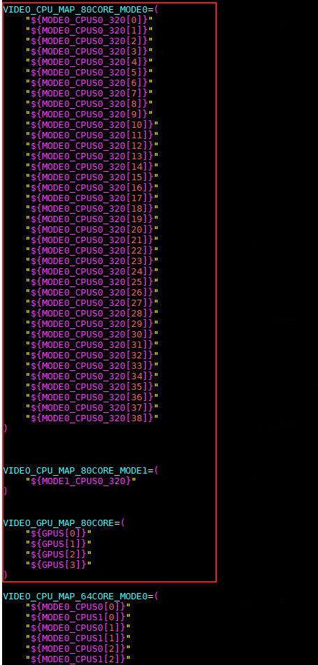

    3. Press **Esc** to exit the insert mode. Type `:wq!` and press **Enter** to save the settings and exit.

        > **NOTE**
        >
        >The CPU cores and GPU nodes in the preceding configuration are for reference only. Adjust them based on allocated resources of the VM and service requirements.

3. Invoke the `cfct_video` script to start the video stream container on the VM. For details, see "Starting a Video Stream Cloud Phone Instance" in the [Video Stream Engine User Guide](https://www.hikunpeng.com/document/detail/en/kunpengcps/boostcph/videostreamengine/docs/en/user_guide.md#d11-starting-a-video-stream-cloud-phone-instance).

    

### VM Copying<a name="ZH-CN_TOPIC_0000002518304966" id="vm-copying"></a>

#### Copy Description<a name="ZH-CN_TOPIC_0000002549944733"></a>

- If four VMs have been created following the procedure in [2.3-VM Configuration](#vm-configuration), skip the VM copy operations.
- If one VM has been created based on [2.3-VM Configuration](#vm-configuration), copy the VM based on the following sections to create the remaining three VMs.

    You are advised to copy the VM after [2.2-Host Environment Configuration](#host-environment-configuration), [2.3-VM Configuration](#vm-configuration), and [2.4-Video Stream Startup Environment Configuration (VM)](#video-stream-startup-environment-configuration-vm) are performed to avoid repeated configuration during VM creation. If operations in the preceding sections are complete, you only need to adjust a few configurations in [2.3-VM Configuration](#vm-configuration) on the copied VMs.

#### Copying the Virtual Drive and Configuration File<a name="ZH-CN_TOPIC_0000002550064721"></a>

This section describes how to copy a VM, involving virtual drive copy and configuration file modification.

1. Check the location of the virtual drive to be copied.

    ```shell
    virsh dumpxml vm0 | grep "source file"
    ```

    

2. <a name="li14352145276"></a>Copy the virtual drive. Ensure that the drive space for storing the new virtual drive is sufficient.

    ```shell
    cd Custom_path_to_the_new_virtual_drive
    cp /var/lib/libvirt/images/vm0.qcow2 vm1.qcow2
    ```

3. Copy the VM configuration file.

    ```shell
    virsh dumpxml vm0 > vm1.xml
    ```

4. Modify the configuration file.
    1. Open the configuration file.

        ```shell
        vim vm1.xml
        ```

    2. Press **i** to enter the insert mode. Change the values of `name`, `uuid`, and `mac` to ensure that the name, UUID, and MAC address of each VM is unique. In addition, change the value of `source` to the path configured in [2](#li14352145276).

        ```shell
        <name>vm1</name>
        <uuid>dfbd8ad1-34ef-423d-8b9c-f7551654b09f</uuid>
        ```

        

        ```shell
        <mac address='52:54:00:be:e7:69' />
        ```

        ```shell
        <source file=' /Drive_image_directory/vm1.qcow2' index='2' />
        ```

    3. Press **Esc** to exit the insert mode. Type `:wq!` and press **Enter** to save the settings and exit.

5. Create a VM.

    ```shell
    virsh define vm1.xml
    ```

    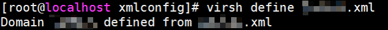

6. Verify that the VM has been created.

    ```shell
    virsh list --all
    ```

7. Obtain the GPU nodes corresponding to the NUMA node bound to the VM based on [Querying PCIe Node Information of a GPU](#querying-pcie-node-information-of-a-gpu).
8. Log in to the VM and remove current GPU nodes.

    ```shell
    virt-manager
    ```

    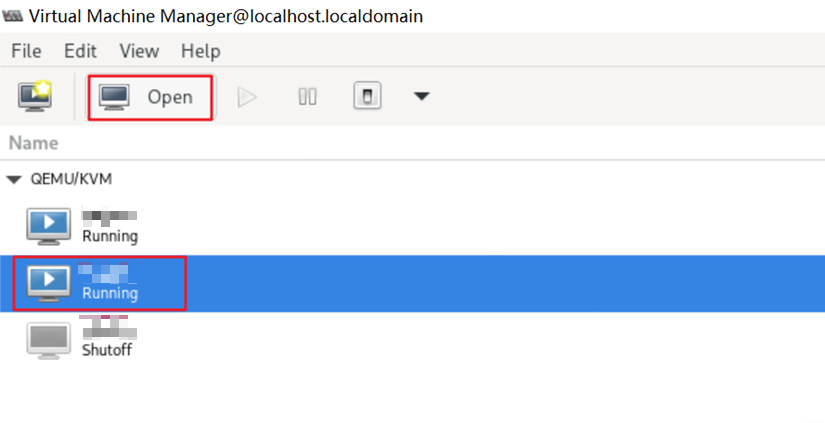

    

9. Obtain the PCIe nodes of the GPUs matching the current VM by following instructions in [Querying PCIe Node Information of a GPU](#querying-pcie-node-information-of-a-gpu). Then choose **Add Hardware > PCI Host Device**, select nodes, and click **Finish** to add the matching PCIe nodes.

    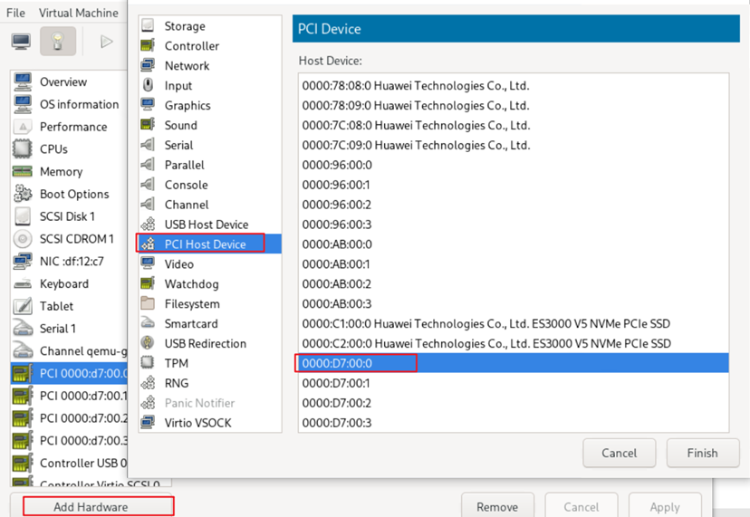

10. If SR-IOV is enabled for the VM, delete the original SR-IOV vNIC.

    

    Add a new SR-IOV vNIC by referring to [Configuring the Host Network](#configuring-the-host-network).

    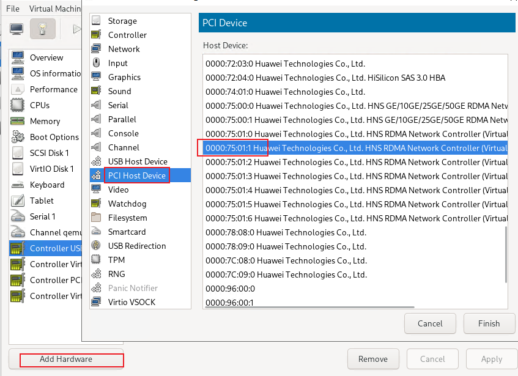

11. If drive partition passthrough is enabled for the VM, delete the original passthrough drive partition.

    

    Add a new drive partition by referring to [2.3.1-15](#virt-manager-15).

    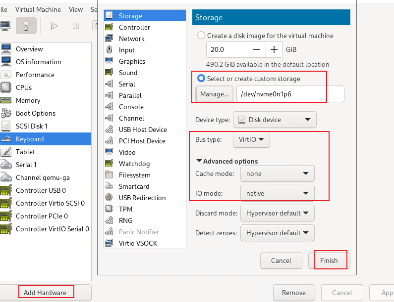

#### Tuning VM Configurations<a name="ZH-CN_TOPIC_0000002518464890"></a>

Resources allocated to each VM are different. You need to reconfigure other resources except the hugepage memory.

For details, see [2.3.2-Tuning VM Configurations](#tuning-vm-configurations).

#### Configuring the Network<a name="ZH-CN_TOPIC_0000002518304968"></a>

Configure the network of the copied VMs.

1. Log in to a VM.

    ```shell
    virsh start vm1
    virt-manager
    ```

    

2. Change the VM IP address.

    ```shell
    vi /etc/sysconfig/network-scripts/ifcfg-enp1s0
    ```

    

3. Reload network connections.

    ```shell
    nmcli connection reload
    nmcli connection down enp1s0
    nmcli connection up enp1s0
    ```

4. Ping the gateway and check whether the configuration takes effect over SSH remote connection. The gateway can be queried in the configuration file of bridge `br0`.

    ```shell
    ping 192.168.20.1
    ```

    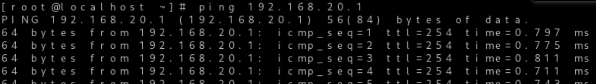

#### Expanding the Virtual Drive<a name="ZH-CN_TOPIC_0000002549944735"></a>

Drive capacity may need to be expanded depending on the scenario (some game applications occupy large drive space).

1. Check the location of the virtual drive.

    ```shell
    virsh dumpxml <domain>
    ```

    

2. Adjust the virtual drive space.

    ```shell
    qemu-img resize /home/VirtualMachine/Disks/oe22.03-lts-sp1-64cores.qcow2 600G
    ```

    This command expands the virtual drive space to 600 GB.

3. Log in to the VM and adjust the VM partition size.
    1. Check the partition where the root directory is located. This partition is to be expanded.

        ```shell
        lsblk
        ```

        

    2. Select a drive and check its partition information.

        ```shell
        parted /dev/sda
        print
        ```

        After running the `print` command, select `Fix`.

        

    3. Expand partition 4.

        ```shell
        resizepart 4 -1
        ```

        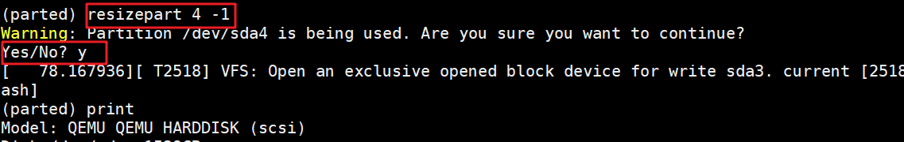

4. Press **Ctrl+C** to exit `parted` and adjust the file system size.

    ```shell
    resize2fs /dev/sda4
    ```

    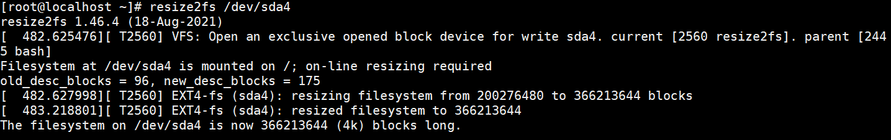

## Change History

|Document Version|Date|Description|
|--|--|--|
|01|2026-09-30|This is the first official release.|

