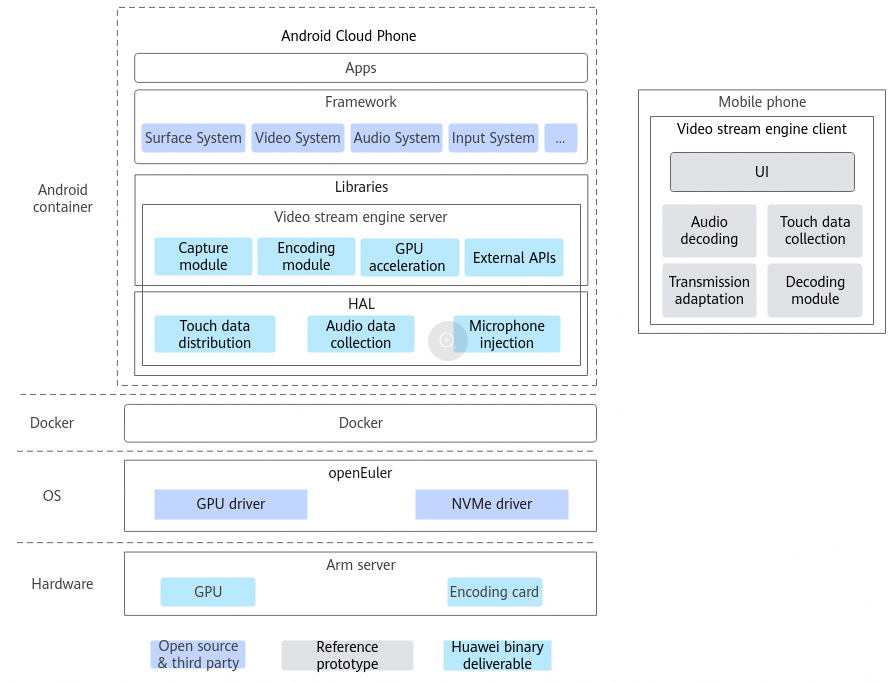
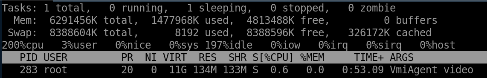
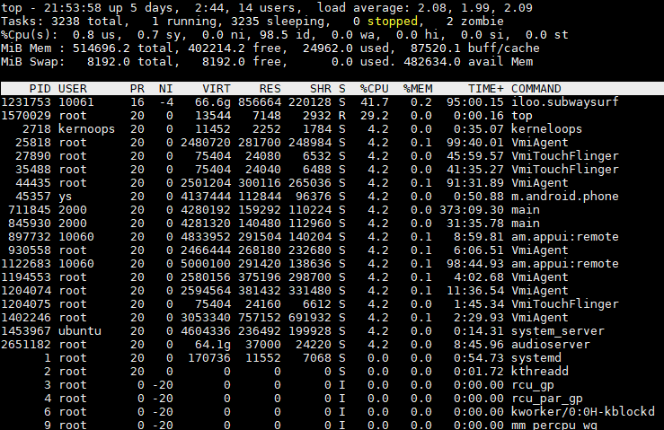
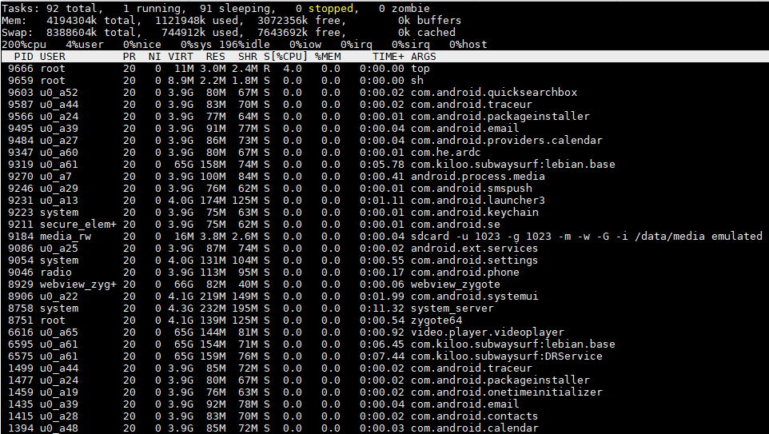
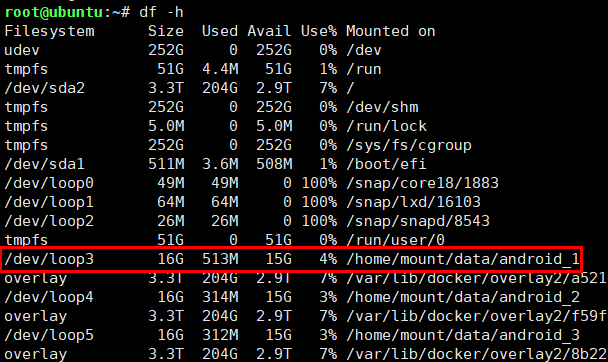
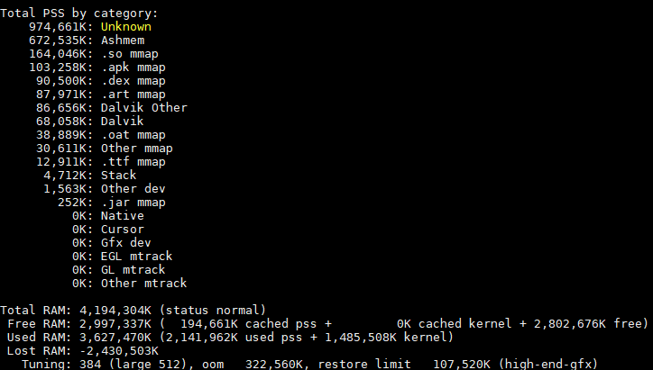
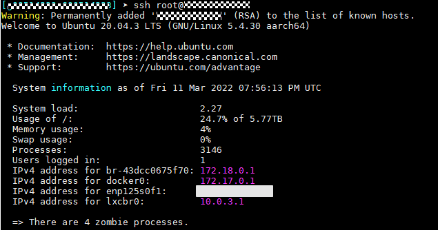
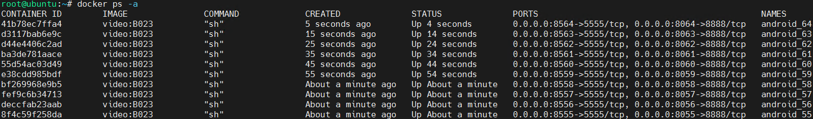

# Routine Maintenance<a name="ZH-CN_TOPIC_0000002552733333"></a>

<!-- md-trans-meta sourceCommit=8137c5c6f22411c010ac7e5e01f7b05f199cf237 translatedAt=2026-08-29T08:19:14.743Z pushedAt=2026-09-03T03:18:47.968Z -->

## O&M Overview<a name="ZH-CN_TOPIC_0000002549705369"></a>

A cloud phone is a cloud server with an Android Open Source Project (AOSP) and functions as a virtual phone. It extends the functions of a physical phone and can be used in various scenarios such as cloud mobile gaming and mobile office.

A video stream cloud phone is a virtualization solution implemented using a Kbox container and a device-cloud synergy engine. A Kbox container is an Android Docker container running on an Arm server. The device-cloud synergy engine consists of the device side and the cloud side. The cloud side runs on a cloud phone; the device side is generally an APK, which can be installed on your Android mobile phone to interact with the cloud side and operate the video stream cloud phone. The following figure shows the video stream cloud phone architecture.



The video stream engine consists of a server and a client. The server provides functions such as image acquisition and encoding, and the client decodes and plays video data. In some scenarios, functions such as obtaining and injecting user touch data, and obtaining and playing audio data are also supported.

- O&M objects

    Suites and subcomponents in the base image environment and video stream-related deployment environments

- O&M types

    Inspection, performance monitoring, log management, risky operations, and routine maintenance

## Inspection<a name="ZH-CN_TOPIC_0000002549825359"></a>

### Overview<a name="ZH-CN_TOPIC_0000002549705345"></a>

Inspection is a manual routine check. Through inspection, you can learn about the running status and environment changes of the video stream cloud phone in real time, detect potential risks, and take measures in a timely manner to improve the efficiency of handling emergencies and ensure the security and stability of the system. This document uses the Docker container runtime as an example to demonstrate inspection items.

### Inspection Items and Periods<a name="ZH-CN_TOPIC_0000002518345530"></a>

Generate a report based on the inspection operations, as shown in [**Table 1**](#video-stream-cloud-phone-inspection-report).

After a video stream cloud phone is deployed for the first time, you are advised to perform an inspection immediately.

**Table 1** Video stream cloud phone inspection report<a id="video-stream-cloud-phone-inspection-report"></a>

|Category|Item|Recommended Period|Result|Remarks|
| :---: | :---: | :---: | :---: | :---: |
|Server configuration|Hardware configuration|Before deploying a video stream cloud phone|
|Server configuration|Server indicators, such as the temperature, CPU usage, and memory usage|Before deploying a video stream cloud phone|
|Software configuration|Software package verification|Before deploying a video stream cloud phone|
|Alarm check|Server alarms|After a service fault occurs|
|Operating environment|Status of the operating environment and Docker service|Before running the video stream cloud phone|
|Video stream cloud phone status|Container status|Before or during the running of the video stream cloud phone|
|Video stream cloud phone status|Container resource consumption|Before or during the running of the video stream cloud phone|

### Checking the Operating Environment Status<a name="ZH-CN_TOPIC_0000002549705329"></a>

#### Docker Service Status<a name="ZH-CN_TOPIC_0000002549705375"></a>

1. Use an SSH tool such as Xshell to log in to the server where the video stream cloud phone is deployed as the cloud phone O&M user (for example, `root`).
2. Query the Docker service status.

    ```bash
    systemctl status docker
    ```

    

    If the value of `Active` is `active`, the Docker service is normal. Otherwise, the service is abnormal.

3. If the service status is abnormal, run the following command to check the cause of the Docker service startup failure:

    ```bash
    dockerd --debug
    ```

    If the fault persists, restart the Docker service (for details, see [4](#li65832418453)) or contact Huawei technical support.

4. <a name="li65832418453"></a>Restart the Docker service. After the restart, check whether the service status is `active`. If the restart fails or the service status is not `active`, contact Huawei technical support.

    ```bash
    systemctl daemon-reload
    systemctl restart docker
    ```

    > **NOTE**
    >
    >- `systemctl daemon-reload`: Start the Docker daemon.
    >- `systemctl restart docker`: Restart the Docker service.

### Checking the Video Stream Cloud Phone Status<a name="ZH-CN_TOPIC_0000002549825337"></a>

#### Container Status<a name="ZH-CN_TOPIC_0000002518185572"></a>

##### Container Startup Status<a name="ZH-CN_TOPIC_0000002518185580"></a>

1. Use an SSH tool such as Xshell to log in to the server where the video stream cloud phone is deployed as the cloud phone O&M user (for example, `root`).
2. Query the ID of the cloud phone container instance.

    ```bash
    docker ps -a
    ```

3. Access the video stream cloud phone container. ${android_id} indicates the ID of the started instance.

    ```bash
    docker exec -it android_${android_id} sh
    ```

4. Check the status of the `sys.boot_completed` property.

    ```bash
    getprop sys.boot_completed
    ```

    If the value of `sys.boot_completed` is `1` in the command output, the startup is successful.

##### Container Running Status<a name="ZH-CN_TOPIC_0000002549825353"></a>

During the running of the video stream cloud phone container, you can check whether the container is normal by checking the process status.

1. Use an SSH tool such as Xshell to log in to the server where the video stream cloud phone is deployed as the cloud phone O&M user (for example, `root`).
2. Query the ID of the cloud phone container instance.

    ```bash
    docker ps -a
    ```

3. Access the video stream cloud phone container. ${android_id} indicates the user-defined ID of the started instance, which usually starts from 1.

    ```bash
    docker exec -it android_${android_id} sh
    ```

4. Check the process status.
    - If the parent process of a large number of processes changes to `sh` (process ID: 1), as shown in the following figure, the container crashes. In this case, contact Huawei technical support.

        ```bash
        ps -elf
        ```

        

    - Check whether the `VmiAgent` process exists. If the process is not found, it indicates that `VmiAgent` is stopped and the video stream cloud phone cannot work normally. In this case, contact Huawei technical support.

#### Container Resource Consumption<a name="ZH-CN_TOPIC_0000002549825327"></a>

During the running of the video stream cloud phone container, you need to know about the system resources used by the container in a timely manner. Run the following command to dynamically view the resource consumption of the video stream cloud phone:

```bash
docker stats
```


> **NOTE**
>
>By default, the output of the `stats` command refreshes every second. You can press **Ctrl**+**C** to stop the refreshing.
>Parameters in the command output are as follows:
>
>- `CONTAINER ID`: container ID
>- `NAME`: container name
>- `CPU %`: CPU usage
>- `MEM USAGE/LIMIT`: used memory and maximum available memory
>- `MEM %`: memory usage in percentage
>- `NET I/O`: network I/O data
>- `BLOCK I/O`: drive I/O data
>- `PIDS`: Process IDs

#### Engine Service Status<a name="ZH-CN_TOPIC_0000002518345526"></a>

During the running of the video stream cloud phone container, you can check whether the container is normal by checking the process status.

1. Use an SSH tool such as Xshell to log in to the server where the video stream cloud phone is deployed as the cloud phone O&M user (for example, `root`).
2. Access the video stream cloud phone container. ${android_id} indicates the ID of the started instance.

    ```bash
    docker exec -it android_${android_id} sh
    ```

3. Check the process status.
    - Check the `VmiAgent` process. If the `VmiAgent` process is not found, this process has been terminated and the video stream cloud phone cannot be used. In this case, contact Huawei technical support.

        ```bash
        ps -elf |grep VmiAgent
        ```

        

    - Check the `VmiAgent` process. If the `VmiAgent` process is found, check its process ID. In the example highlighted in the figure above, the process ID is `283`. Run the following command to check the process status, CPU usage, and memory usage. In the command, ${pid} indicates the `VmiAgent` process ID. The command output is shown in the following figure.

        ```bash
        top -p ${pid}
        ```

        

## Monitoring<a name="ZH-CN_TOPIC_0000002549825319"></a>

### Overview<a name="ZH-CN_TOPIC_0000002549825345"></a>

Monitoring is performed on video stream cloud phone resources and applications. Through application monitoring, you can learn about the resource usage, trends, and alarms in a timely manner.

### Host CPU and Memory Usage<a name="ZH-CN_TOPIC_0000002518345494"></a>

1. Use an SSH tool such as Xshell to log in to the server where the video stream cloud phone is deployed as the cloud phone O&M user (for example, `root`).
2. Switch to the `root` user.

    ```bash
    su - root
    ```

3. Run the following command to query the CPU and memory usage of processes within the containers on the host. See the following figure.

    ```bash
    top
    ```

    

    If the memory usage of some processes is higher than 85% and the CPU usage remains higher than 90%, check whether the processes are abnormal or contact Huawei technical support.

    > **NOTE**
    >
    >Parameters in the command output are as follows:
    >- `PID`: process ID
    >- `USER`: creator of the process
    >- `PR`: process priority
    >- `NI`: nice value. A smaller value indicates a higher priority. The value ranges from -20 to 20, while the user-configurable range is -20 to 19.
    >- `VIRT`: total virtual memory used by the process, in KB
    >- `RES`: non-swapped-out size of the physical memory used by the process, in KB
    >- `SHR`: size of the shared memory, in KB
    >- `S`: process state. The value can be `D` (uninterruptible sleep), `R` (running), `S` (interruptible sleep), `T` (traced/stopped), or `Z` (zombie).
    >- `%CPU`: CPU usage of the process
    >- `%MEM`: memory usage of the process
    >- `TIME+`: running time of the process
    >- `COMMAND`: process name
    >- You are advised to query the CPU usage for multiple times. The result of a single query cannot be used as a reference.

    If you want to monitor the processes running in the system and the complete commands, you can install and use the `htop` utility. After the installation is complete, run the following command:

    ```bash
    htop
    ```

    

    If the memory usage is higher than 85% and the CPU usage remains higher than 90%, contact Huawei technical support.

    > **NOTE**
    >
    >Parameters in the `htop` command output are described as follows:
    >The left part (in red box) displays the CPU usage, memory usage, and swap partition usage from top to bottom.
    >In the right part (yellow box), `Tasks` indicates the total number of processes and the number of running processes. `Load average` indicates the average system load in 1 minute, 5 minutes, and 15 minutes. `Uptime` indicates the system uptime.
    >Other parameters are similar to those of the `top` command.

### Container CPU and Memory Usage<a name="ZH-CN_TOPIC_0000002518185588"></a>

1. Use an SSH tool such as Xshell to log in to the server where the video stream cloud phone is deployed as the cloud phone O&M user (for example, `root`).
2. Switch to the `root` user.

    ```bash
    su - root
    ```

3. Access the Docker container and check the CPU and memory usage. In the command, ${android_id} indicates the ID of the started instance.

    ```bash
    docker exec -it android_${android_id} sh
    ```

4. Query the CPU and memory usage of the processes in the Docker container. See the following figure.

    ```bash
    top
    ```

    

    If the memory usage of some processes is higher than 85% and the CPU usage remains higher than 90%, check whether the processes are abnormal or contact Huawei technical support.

    > **NOTE**
    >
    >The parameter description is the same as that of the host CPU and memory usage.

    To view the real-time information about the CPU load and memory usage, run the following command:

    ```bash
    ctop
    ```

    

    > **NOTE**
    >
    >`ctop` is a resource monitoring utility managed by Docker. To install it, download [ctop-0.7.5-linux-arm64](https://github.com/bcicen/ctop/releases/download/v0.7.5/ctop-0.7.5-linux-arm64), rename the downloaded binary file `ctop`, and copy it to the `/usr/bin` directory.
    >Parameters in the `ctop` command output are described as follows:
    >- `NAME`: container name
    >- `CID`: container ID
    >- `CPU`: CPU usage of the container
    >- `MEM`: memory usage of the container
    >- `NET RX/TX`: volume of data received and transmitted by the container network
    >- `IO`: I/O read and write data volume of the container drive
    >- `PIDS`: process ID of the container

### System Memory<a name="ZH-CN_TOPIC_0000002518345486"></a>

1. Use an SSH tool such as Xshell to log in to the server where the video stream cloud phone is deployed as the cloud phone O&M user (for example, `root`).
2. Switch to the `root` user.

    ```bash
    su - root
    ```

3. Check the drive usage of the video stream cloud phone server.

    ```bash
    free
    ```

    You can run the `free` command to query the system memory usage, including the physical memory, virtual swap memory, and shared memory regions, as well as buffers used by the system kernel. The memory usage of the video stream cloud phone can also be queried by using this command.

### Drive Usage<a name="ZH-CN_TOPIC_0000002518185538"></a>

1. Use an SSH tool such as Xshell to log in to the server where the video stream cloud phone is deployed as the cloud phone O&M user (for example, `root`).
2. Switch to the `root` user.

    ```bash
    su - root
    ```

3. Check the drive usage of the video stream cloud phone server.

    ```bash
    df -h
    ```

    

    In the preceding figure, the video stream cloud phone container data is stored in `/home/mount/data/`. The content in the red box shows the data storage information of container `android_1`. The storage size is `16G`, and the current usage is `4%`. If the value of `Use%` is less than or equal to 85%, the drive usage is normal. Otherwise, you need to clear the drive space.

### System Load<a name="ZH-CN_TOPIC_0000002518345502"></a>

The system load indicates the current CPU workload, which measures the average number of threads in the running queue during a specific time interval. If the load is too high, the server cannot process requests and operations, or even breaks down.

1. Use an SSH tool such as Xshell to log in to the server where the video stream cloud phone is deployed as the cloud phone O&M user (for example, `root`).
2. Switch to the `root` user.

    ```bash
    su - root
    ```

3. Run the following command to query the system load:

    ```bash
    uptime
    ```

    Command output:

    ```bash
    19:49:12 up 25 days,  5:04,  9 users,  load average: 8.17, 8.16, 8.07
    ```

    > **NOTE**
    >
    >Parameters in the command output are described as follows:
    >- `19:49:12`: current time
    >- `up 25 days, 5:04`: system uptime
    >- `9 users`: number of current online users
    >- `load average: 8.17, 8.16, 8.07`: average system load in the last 1, 5, and 15 minutes

    - If the current load average is no more than 0.7 times the number of CPU cores, the system load is within a safe range.
    - If the load average is less than 3 times the number of CPU cores, the system load is not severe.
    - If the load average reaches 5 times the number of CPU cores, the system load is extremely high, and scripts launched at this point will run very slowly.

    Generally, the system load in the last 1 minute (load1) is a temporary condition. The system load in the last 15 minutes (load15) is a sustained condition. If load15 is high and load1 is low, the situation can be considered to be improving. Conversely, the situation may be worsening.

    High load may be caused by hardware or software issues. Hardware issues typically arise from inadequate device performance, while software issues might result from prolonged thread occupation, high memory usage, and other factors. If the problem persists, contact Huawei technical support for assistance.

## Log Management<a name="ZH-CN_TOPIC_0000002549825375"></a>

### Overview<a name="ZH-CN_TOPIC_0000002549705353"></a>

Log management provides log search and log dump capabilities. Log management records user operation audit logs, helps quickly locate causes of problems, traces program execution, collects data statistics, and analyzes performance.

### Basic Cloud Phone Maintenance Tool<a name="ZH-CN_TOPIC_0000002518345458"></a>

The Kbox cloud phone container provides Kbox_maintainer, a maintenance tool. This tool supports functions such as log collection, resource check, and fault rectification to improve the testability, serviceability, and maintainability of the cloud phone prototype. For details about how to obtain and use this tool, see "Maintenance Tool" in [Kbox Cloud Phone Container Routine Maintenance](https://www.hikunpeng.com/document/detail/en/kunpengcps/boostcph/kboxcpc/docs/en/routine_maintenance.md#d44-maintenance-tool).

### Querying Video Stream Cloud Phone Logs<a name="ZH-CN_TOPIC_0000002518185612"></a>

#### Querying Logs on the Android Device<a name="ZH-CN_TOPIC_0000002549825389"></a>

##### Application Stack Information During ANR<a name="ZH-CN_TOPIC_0000002549825383"></a>

If an application not responding (ANR) event occurs in the video stream cloud phone container, you need to collect related application stack information. The information is stored in the `/data/anr/` directory of the container.

#### Querying Logs on the Server<a name="ZH-CN_TOPIC_0000002549705307"></a>

##### System Log Information<a name="ZH-CN_TOPIC_0000002549705337"></a>

1. Use an SSH tool such as Xshell to log in to the server where the video stream cloud phone is deployed as the cloud phone O&M user (for example, `root`).
2. Switch to the `root` user.

    ```bash
    su - root
    ```

3. Go to the `/var/log` directory on the server to view `syslog` and other kernel logs.

    > **NOTE**
    >
    >The `syslog` file records alarm information, which is usually the information about system faults.
    >Other kernel files include core startup logs (`dmesg`), system error logs (`messages`), login records (`wtmp`), and boot logs (`boot.log`).

##### Operating Environment Log Information<a name="ZH-CN_TOPIC_0000002518185558"></a>

1. Use an SSH tool such as Xshell to log in to the server where the video stream cloud phone is deployed as the cloud phone O&M user (for example, `root`).
2. Switch to the `root` user.

    ```bash
    su - root
    ```

3. Collect `dmesg` logs when the video stream cloud phone container is abnormal.

    The `dmesg` logs contain device initialization logs, kernel module logs, and application crash information, which are helpful for subsequent cause analysis and fault location.

    ```bash
    dmesg -T
    ```

#### Querying Docker Container Logs<a name="ZH-CN_TOPIC_0000002549705383"></a>

##### Metadata Information<a name="ZH-CN_TOPIC_0000002518185618"></a>

1. Use an SSH tool such as Xshell to log in to the server where the video stream cloud phone is deployed as the cloud phone O&M user (for example, `root`).
2. Switch to the `root` user.

    ```bash
    su - root
    ```

3. Run the following command to query the container ID:

    ```bash
    docker ps -a
    ```

4. Run the `inspect` command provided by Docker to view container details. In the following command, ${android_id} indicates the ID of the started instance.

    ```bash
    docker inspect android_${android_id}
    ```

    After the preceding command is executed, all metadata information of the container is returned in JSON array format. In most cases, if you only need to obtain a specific piece of data about the container, you can extract the required data from the JSON data. For example, to obtain the IP address of the container, run the following command:

    ```bash
    docker inspect --format='{{range .NetworkSettings.Networks}}{{.IPAddress}}{{end}}' android_${index}
    ```

    Example:

    ```bash
    docker inspect --format='{{range .NetworkSettings.Networks}}{{.IPAddress}}{{end}}' android_11
    ```

    Command output:

    ```bash
    172.17.0.4
    ```

##### logcat Log Information<a name="ZH-CN_TOPIC_0000002518185602"></a>

1. Use an SSH tool such as Xshell to log in to the server where the video stream cloud phone is deployed as the cloud phone O&M user (for example, `root`).
2. Switch to the `root` user.

    ```bash
    su - root
    ```

3. Run the following command to query the container ID:

    ```bash
    docker ps -a
    ```

4. Run the following command to query real-time server logs. In the command, ${android_id} indicates the container ID, and VMI is the log tag prefix of the video stream cloud phone.

    ```bash
    docker exec -it android_${android_id} logcat |grep -i VMI
    ```

##### Process Information<a name="ZH-CN_TOPIC_0000002518185548"></a>

1. Use an SSH tool such as Xshell to log in to the server where the video stream cloud phone is deployed as the cloud phone O&M user (for example, `root`).
2. Switch to the `root` user.

    ```bash
    su - root
    ```

3. Run the following command to query the container ID:

    ```bash
    docker ps -a
    ```

4. Run the following command to query the information about the running processes. In the command, ${android_id} indicates the container ID.

    ```bash
    docker exec -it android_${android_id} ps -elf
    ```

##### Top Information<a name="ZH-CN_TOPIC_0000002549825379"></a>

1. Use an SSH tool such as Xshell to log in to the server where the video stream cloud phone is deployed as the cloud phone O&M user (for example, `root`).
2. Switch to the `root` user.

    ```bash
    su - root
    ```

3. Run the following command to query the container ID:

    ```bash
    docker ps -a
    ```

4. Run the following command to query the resource usage of each process in the container in real time. In the command, ${android_id} indicates the container ID.

    ```bash
    docker exec -it android_${android_id} top
    ```

##### Property Information<a name="ZH-CN_TOPIC_0000002549705359"></a>

1. Use an SSH tool such as Xshell to log in to the server where the video stream cloud phone is deployed as the cloud phone O&M user (for example, `root`).
2. Switch to the `root` user.

    ```bash
    su - root
    ```

3. Run the following command to query the container ID:

    ```bash
    docker ps -a
    ```

4. Run the following command to query the system property information of the container. In the command, ${android_id} indicates the container ID.

    ```bash
    docker exec -it android_${android_id} getprop
    ```

##### dumpsys Information<a name="ZH-CN_TOPIC_0000002518185566"></a>

1. Use an SSH tool such as Xshell to log in to the server where the video stream cloud phone is deployed as the cloud phone O&M user (for example, `root`).
2. Switch to the `root` user.

    ```bash
    su - root
    ```

3. Run the following command to query the container ID:

    ```bash
    docker ps -a
    ```

4. Run the following command to obtain the diagnosis output of all system services in the container. In the command, ${android_id} indicates the ID of the started instance.

    `dumpsys` is a tool running on Android devices. It provides information about system services.

    ```bash
    docker exec -it android_${android_id} dumpsys
    ```

    After the preceding command is run, a large amount of data is displayed. Generally, you need to specify the services to be checked in the command.

    - To obtain the complete list of system services supported by `dumpsys`, run the following command:

        ```bash
        docker exec -it android_${android_id} dumpsys -l
        ```

    - To obtain the container memory information, run the following command:

        ```bash
        docker exec -it android_${android_id} dumpsys meminfo
        ```

        The following figure shows the command output.

        

### Exporting Video Stream Cloud Phone Logs<a name="ZH-CN_TOPIC_0000002518345508"></a>

The log export function enables you to view logs on the local IDE and quickly locate faults, preventing real-time log printing from affecting fault location.

1. Use an SSH tool such as Xshell to log in to the server where the video stream cloud phone is deployed as the cloud phone O&M user (for example, `root`).
2. Switch to the `root` user.

    ```bash
    su - root
    ```

3. Run the following command to query the container ID:

    ```bash
    docker ps -a
    ```

4. Run the following command to query real-time server logs. In the command, ${android_id} indicates the container ID.

    ```bash
    docker exec -it android_${android_id} logcat -d >> /home/file.log
    ```

5. Copy the logs from the corresponding directory on the server to a local directory.

    > **NOTE**
    >
    >`/home/file.log` is the log output path.

### Log Overflow Dump<a name="ZH-CN_TOPIC_0000002549825309"></a>

The implementation of the log overflow dump function depends on ISVs. The video stream engine does not involve the log overflow dump design.

### Log Audit<a name="ZH-CN_TOPIC_0000002518345444"></a>

Periodically record parameter settings of external APIs of the video stream engine and external APIs on which the video stream engine depends. For details, see [Developer Guide](development_guide.md).

## Risky Operations<a name="ZH-CN_TOPIC_0000002549705379"></a>

### Forbidden Operations<a name="ZH-CN_TOPIC_0000002518345522"></a>

Currently, no forbidden operations are involved. If you have any questions, contact Huawei technical support.

### Risky Operations<a name="ZH-CN_TOPIC_0000002549825369"></a>

Risky operations are classified into the following levels:

- Minor: Operation that does not modify the feature configurations but may result in the loss of user-defined key data.
- Major: Operation that may cause managed resources to be unreachable or interrupt some services running on a node.
- Critical: Operation that may cause interruption of a large number of services on the entire network.

For details about risky operations on server hardware, see [**Table 1**](#risky-operations-on-hardware). For details about risky operations on software, see [**Table 2**](#risky-operations-on-software).

**Table 1** Risky operations on hardware<a id="risky-operations-on-hardware"></a>

|No.|Operation|Impact|Risk Level|Operation Requirements in Production Environment|Operation Requirements in Test Environment|
| :---: | :---: | :---: | :---: | :---: | :---: |
|1|Replacing server parts|Perform this operation in strict accordance with the operation instructions to avoid function failure and hardware damage.|Critical|This operation must be performed within the maintenance and test period approved by the customer. This operation must be performed by maintenance personnel. This operation must be approved by the customer.|This operation must be performed by maintenance personnel or approved by the customer.|
|2|Powering off unexpectedly during the CPLD upgrade|AC power failure during CPLD upgrade may cause CPLD file corruption and affect functionality, requiring a re-upgrade for recovery.|Critical|This operation must be performed within the maintenance and test period approved by the customer. This operation must be performed by maintenance personnel. This operation must be approved by the customer.|This operation must be performed by maintenance personnel or approved by the customer.|
|3|Powering off unexpectedly during the BIOS upgrade|AC power failure during BIOS upgrade may cause BIOS damage and affect functionality, requiring a re-upgrade for recovery.|Critical|This operation must be performed within the maintenance and test period approved by the customer. This operation must be performed by maintenance personnel. This operation must be approved by the customer.|This operation must be performed by maintenance personnel or approved by the customer.|
|4|Powering off unexpectedly during the iBMC upgrade|AC power failure during iBMC upgrade may cause iBMC hardware damage, preventing access to the server management page and requiring iBMC hardware replacement.|Critical|This operation must be performed within the maintenance and test period approved by the customer. This operation must be performed by maintenance personnel. This operation must be approved by the customer.|This operation must be performed by maintenance personnel or approved by the customer.|
|5|Installing/Removing a server in/from a cabinet|Perform this operation in strict accordance with the service and maintenance guide to avoid hardware damage and personnel injury.|Critical|This operation must be performed within the maintenance and test period approved by the customer. This operation must be performed by maintenance personnel. This operation must be approved by the customer.|This operation must be performed by maintenance personnel or approved by the customer.|

**Table 2** Risky operations on software<a id="risky-operations-on-software"></a>

|No.|Operation|Operation Entry|Impact|Risk Level|Workaround|Operation Requirements in Production Environment|Operation Requirements in Test Environment|
| :---: | :---: | :---: | :---: | :---: | :---: | :---: | :---: |
|1|Running the `service network restart` command during the normal operation of the system|Log in to the host and run the `service network restart` command.|The host, service provisioning, and VM startup may fail.|Critical|None|This operation must be performed within the maintenance and test period approved by the customer. This operation must be performed by maintenance personnel. This operation must be approved by the customer.|This operation must be performed by maintenance personnel or approved by the customer.|
|2|Running the `ping -I` command on the host (specifying a network interface)|Log in to the host and run the `ping -I` command.|Host network communication may be interrupted. Running the `ping` command to check the network is recommended.|Critical|None|This operation must be performed within the maintenance and test period approved by the customer. This operation must be performed by maintenance personnel. This operation must be approved by the customer.|This operation must be performed by maintenance personnel or approved by the customer.|
|3|Manually deleting or modifying the message log files|Log in to the host and run the `rm` command to delete message logs from `/var/log`.|Logs cannot be printed.|Critical|None|This operation must be performed within the maintenance and test period approved by the customer. This operation must be performed by maintenance personnel. This operation must be approved by the customer.|This operation must be performed by maintenance personnel or approved by the customer.|
|4|Clearing the user-defined information in the BIOS flash memory|Log in to the iBMC CLI and run the `ipmcset -d clearcmos` command.|Deleted information cannot be recovered.|Critical|None|This operation must be performed within the maintenance and test period approved by the customer. This operation must be performed by maintenance personnel. This operation must be approved by the customer.|This operation must be performed by maintenance personnel or approved by the customer.|
|5|Restoring the iBMC factory settings|Log in to the iBMC CLI and run the `ipmcset -d restore` command.|User data cannot be recovered after factory settings are restored.|Critical|None|This operation must be performed within the maintenance and test period approved by the customer. This operation must be performed by maintenance personnel. This operation must be approved by the customer.|This operation must be performed by maintenance personnel or approved by the customer.|
|6|Changing the IP address of a server|Log in to the host and run the `ifconfig` command to change the IP address.|This operation may affect service processes on the host and current service operations.|Critical|None|This operation must be performed within the maintenance and test period approved by the customer. This operation must be performed by maintenance personnel. This operation must be approved by the customer.|This operation must be performed by maintenance personnel or approved by the customer.|
|7|Running the `rm -rf` command to delete files|Log in to the host and delete files on the host or files required by the commercial release package.|This operation may affect service processes on the host and the video stream cloud phone service.|Critical|None|This operation must be performed within the maintenance and test period approved by the customer. This operation must be performed by maintenance personnel. This operation must be approved by the customer.|This operation must be performed by maintenance personnel or approved by the customer.|

## Routine O&M<a name="ZH-CN_TOPIC_0000002549705389"></a>

### Overview<a name="ZH-CN_TOPIC_0000002518185596"></a>

You need to perform routine maintenance on project operations and output O&M reports. For details, see [**Table 1**](#video-stream-routine-maintenance-report).

After a video stream cloud phone is deployed for the first time, you are advised to perform an inspection immediately.

**Table 1** Video stream cloud phone routine maintenance report<a id="video-stream-routine-maintenance-report"></a>

|No.|Item|Recommended O&M Interval|Result|Remarks|
| :---: | :---: | :---: | :---: | :---: |
|1|Viewing the server status|Once a day|
|2|Viewing the container status|Once a week|

### Server Status<a name="ZH-CN_TOPIC_0000002518345468"></a>

Use a server query tool and run the following command to connect to the server IP address:

```bash
ssh root@xxx.xxx.xxx.xxx
```

If information similar to the following is displayed, the server is connected. Otherwise, check related configurations, such as whether the network is normal and whether the IP address is correct.



### Container Status<a name="ZH-CN_TOPIC_0000002518185608"></a>

1. Use an SSH tool such as Xshell to log in to the server where the video stream cloud phone is deployed as the cloud phone O&M user (for example, `root`).
2. Switch to the `root` user.

    ```bash
    su - root
    ```

3. Run the following command to list containers. The following figure shows the running status of Docker containers.

    ```bash
    docker ps -a
    ```

    

    As shown in the preceding figure, all containers are in the Up state. You can delete containers in other states as required to release resources.

## References<a name="ZH-CN_TOPIC_0000002518345476"></a>

None

## Change History

|Document Version|Date|Description|
|--|--|--|
|01|2026-09-30|This is the first official release.|
