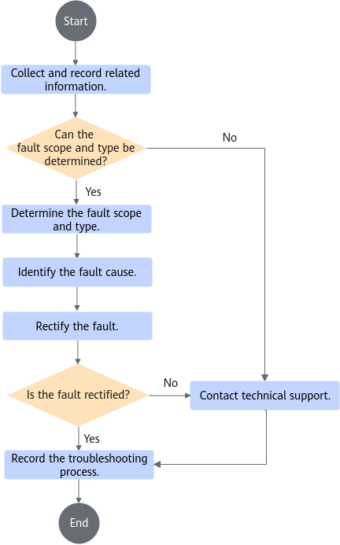

# User Guide<a name="ZH-CN_TOPIC_0000002552853353"></a>

<!-- md-trans-meta sourceCommit=41a1a976d550af475fa400f09eb69f540cee3709 translatedAt=2026-08-29T08:35:21.683Z pushedAt=2026-09-04T07:25:38.323Z -->

## Operating a Video Stream Cloud Phone Instance<a name="ZH-CN_TOPIC_0000002549744217"></a>

### Starting a Video Stream Cloud Phone Instance<a name="ZH-CN_TOPIC_0000002549744219" id="starting-a-video-stream-cloud-phone-instance"></a>

You can set parameters in the `cfct_config` file to start video stream cloud phone instances with different resolution and frame rates, and set the initial video encoding parameters in the `default.prop` file. If WebRTC is used for data transmission, you can modify the `default.prop` file to change the snapshot resolution; if you use an APK to access the video stream cloud phone, you can configure the snapshot resolution in the APK settings.

1. (Optional) To start video stream cloud phone instances with custom frame rates, modify the frame rate property in the `cfct_config` file. The default frame rate is 30 fps. 60 fps is also supported when the resolution is 720p or 1080p.

    ```bash
    BUILD_FPS=30
    ```

2. (Optional) To start video stream cloud phone instances with the C2 decoder enabled (applicable for configuration scheme 1), set `ENABLE_AMD_C2_DECODE=1` in the `cfct_config` configuration file and disable hardware decoding by setting `T432_QUADRA_DECODE_ENABLE=0`. The C2 decoder must be enabled or disabled before the container is started for the first time. After the container has started, switching by modifying the `ENABLE_AMD_C2_DECODE` parameter in `kbox_config.cfg` and restarting the container is not supported. Built-in apps in the cloud phone will choose the decoder on their own as needed.

    ```bash
    ENABLE_AMD_C2_DECODE=1
    T432_QUADRA_DECODE_ENABLE=0
    ```

3. To start video stream cloud phone instances with different initial encoding parameters, snapshot resolutions, and audio and video output formats over WebRTC, perform the following operations:
    1. Decompress `DemoVideoEngine.tar.gz` to obtain the `vendor` folder and copy the `vendor/default.prop` file to the current directory.

        ```bash
        cd /home/kbox_video/
        tar -xvf DemoVideoEngine.tar.gz vendor
        cp vendor/default.prop .
        ```

    2. Set initial encoding parameters by configuring property fields started with `vmi.video.encode` in `default.prop`. For details about the property fields, see [Configuration Items in the Startup Script](#configuration-items-in-the-startup-script).
    3. Set the snapshot resolution.

        Configure property fields started with `vmi.video.frame` in `default.prop`. For details about the property fields, see [Configuration Items in the Startup Script](#configuration-items-in-the-startup-script). After changing the resolution, you are advised to change the screen pixel density in the `cfct_config` file as well to achieve the optimal display effect. [**Table 1**](#recommended-configurations) lists the recommended configurations.

        **Table 1** Recommended configurations for different resolutions<a id="recommended-configurations"></a>

        |Screen Width (BUILD_WIDTH)|Screen Density (BUILD_DENSITY)|
        |--|--|
        |360|120|
        |480|160|
        |720|320|
        |1080|480|
        |1440|640|
        |2160|960|

        > **NOTE**
        >
        >After you change the video output resolution (to a resolution different from the configuration at the last startup), the rendering resolution of the AOSP system and apps is changed. In this case, a compatibility issue or rendering problem may occur in some apps. Generally, this problem can be solved by restarting apps. It is recommended that you return to the home screen and clear background apps before changing the resolution.

    4. Set the audio and video output formats.
        - If you access a video stream cloud phone instance over WebRTC, configure property fields in `default.prop` within the allowed value range to set video and audio output formats. For details, see [WebRTC property fields](#webrtc-property-fields).
        - If you access a video stream cloud phone instance using an APK, configure property fields in `default.prop` to set video and audio output formats. For details, see [video stream engine property fields](#video-stream-engine-property-fields).

    5. Enable the adaptive resolution function.

        If you access the video stream cloud phone instance using an APK, you can enable the adaptive resolution function on the APK settings page. For details, see [Using an APK](#using-an-apk). If adaptive resolution is disabled, configure property fields started with `vmi.video.frame` in `default.prop` to change the snapshot resolution. For details about the property fields, see [Configuration Items in the Startup Script](#configuration-items-in-the-startup-script). After changing the resolution, you are advised to change the screen pixel density in the `cfct_config` file as well to achieve the optimal display effect. [**Table 1**](#recommended-configurations) lists the recommended configurations.

    6. If you use the WebRTC method, configure the IP address and the UDP start port.

        In `default.prop`, configure property fields `vmi.webrtc.connection.serverip` (IP address of the cloud phone server) and `vmi.webrtc.connection.udpbeginport` (available UDP start port). For details, see [WebRTC property fields](#webrtc-property-fields).

4. Start video stream cloud phones.

    ```bash
    cd /home/kbox_video/
    ./cfct_video start ${index1} ${index2}
    ```

    In the preceding command, `${index1}` and `${index2}` indicate instance indexes, and `${index2}` can be left blank. The following are examples of using the startup script:

    - Start a video stream cloud phone whose index is 1.

        ```bash
        ./cfct_video start 1
        ```

    - Start five video stream cloud phones indexed from 1 to 5.

        ```bash
        ./cfct_video start 1 5
        ```

    > **NOTE**
    >
    >When using NFS for mounting, replace the `start` command with `nstart`. For example:
    >
    >```bash
    >./cfct_video nstart 1 5
    >```

5. <a name="li3304181302311"></a>Query video stream cloud phones.

    - Video stream cloud phone with Docker:

        ```bash
        docker ps -a
        ```

        Example command output:

        

    - Video stream cloud phone with containerd:

        ```bash
        nerdctl ps -a
        ```

        Example command output:

        

    Make sure that the started container can be found and is in normal state.

6. Check whether the video stream cloud phone is successfully started. `${index}` indicates the index of the started instance. For example, in the last column in the command output of [5](#li3304181302311), the `${index}` of `android_35` is 35.

    - Video stream cloud phone with Docker:

        ```bash
        docker exec -it android_${index} sh 
        ```

    - Video stream cloud phone with containerd:

        ```bash
        nerdctl exec -it android_${index} sh
        ```

        ```bash
        getprop sys.boot_completed
        ```

    If the value of `sys.boot_completed` in the output is `1`, the startup is successful.

    

### Querying Component Version Information<a name="ZH-CN_TOPIC_0000002549744227" id="querying-component-version-information"></a>

This section provides the following two methods to obtain the version of the video stream engine component.

Method 1: using the obtained software package

1. Refer to [Software requirements for deploying the video stream engine](install_guide.md#software-requirements-for-deploying-the-video-stream-engine) to obtain `BoostKit-boostcph-videoengine_*.zip` and decompress it to obtain the version file.
2. Check the version of the video stream engine component.

    ```bash
    unzip BoostKit-boostcph-videoengine_*.zip
    tar -xvf  VideoEngine.tar.gz vendor/etc/videoengine_version.txt
    cat vendor/etc/videoengine_version.txt
    ```

    The command output is the version information of the video stream engine component. An example is as follows:

    ```bash
    Product Name: Kunpeng BoostKit
    Product Version: 26.0.RC1
    Component Name: BoostKit-boostcph-videoengine
    Component Version: 8.0.RC1
    Component AppendInfo: 11.0.0_r48
    ```

Method 2: calling an external API of the video stream engine

Call the `GetVersion` API to obtain the version information. For details, refer to "External APIs > Function APIs > GetVersion" in [Video Stream Engine Developer Guide](development_guide.md). The command output example is the same as that in method 1.

### Accessing a Video Stream Cloud Phone<a name="ZH-CN_TOPIC_0000002549864229" id="accessing-a-video-stream-cloud-phone"></a>

#### Using an APK<a name="ZH-CN_TOPIC_0000002518224464" id="using-an-apk"></a>

If the video stream cloud phone is started in the default mode, you can access the cloud phone using an APK.

1. Decompress `CloudPhoneApk.tar.gz`.
2. Install `CloudPhone.apk` on an Android phone.
3. (Optional) Tap the gear icon in the upper right corner to access the settings screen.
4. (Optional) Enable the adaptive resolution function. This function is enabled by default. If adaptive resolution is disabled, you need to modify the rendering resolution in `default.prop`. For details, see step 2 in [Starting a Video Stream Cloud Phone Instance](#starting-a-video-stream-cloud-phone-instance).
5. Return to the home page, enter the server IP address and port in top-down order, and tap **Connect** to access the video stream cloud phone.

    The default port is 8000 + `${index}`.

    > **NOTE**
    >
    >- A port must be configured for each video stream cloud phone instance. This can be set in the `cfct_video` script during deployment. The port number ranges from 1024 to 65535 and cannot be an occupied port to avoid port contention and video stream cloud phone access failure.
    >- The video stream engine client is 64-bit and must run on 64-bit Android mobile phones running HarmonyOS or Android 7 or later.
    >- Ensure that the network connection between the mobile phone and the server is normal.

#### From a Web Page on a PC<a name="ZH-CN_TOPIC_0000002518384374"></a>

If the video stream cloud phone instance is started with the WebRTC feature enabled for data transmission, you can access the cloud phone from a web page on the PC.

1. Decompress `WebClient.zip`.
2. Open `html/login.html`. The following page is displayed.

    

3. Enter the server IP address and port in top-down order, and click **SUBMIT** to access the video stream cloud phone. The default port is 8000 + `${index}`.

    > **NOTE**
    >
    >A mapping port must be configured for each video stream cloud phone instance. This can be set in the `cfct_video` script during deployment. The port number ranges from 1024 to 65535 and cannot be an occupied port to avoid port contention and video stream cloud phone access failure.

### (Optional) Dynamically Modifying Cloud Phone Parameters<a name="ZH-CN_TOPIC_0000002549744243"></a>

You can use `CloudPhone.apk` to dynamically modify the video encoding and audio playback encoding parameters when the cloud phone is running.

1. Before connecting to the cloud phone, go to the settings page to confirm that adaptive resolution is enabled by default.

2. After connecting to the cloud phone, tap the gear icon on the screen.

3. Set video encoding parameters.
    1. Tap the video icon.

    2. Set the video encoding parameters.

        For details about the value range of each parameter, see the properties starting with `vmi.video.encode` in [Configuration Items in the Startup Script](#configuration-items-in-the-startup-script). The rendering resolution can be 360p, 720p, or 1080p.

    3. After the setting is complete, tap **Send** to send the parameter values to the server. If the values are valid, they take effect immediately.

        > **NOTE**
        >
        >If adaptive resolution is disabled, you can run the `setprop` command in the container after starting the cloud phone to change property settings. For details, refer to property fields of the video stream engine in [Configuration Items in the Startup Script](#configuration-items-in-the-startup-script). If the width and height of the adaptive resolution is changed, you are advised to change the screen pixel density in the `cfct_config` file as well to achieve the optimal display effect. [**Table 1** Recommended configurations](#recommended-configurations) lists the recommended configurations for different resolutions.

4. Set audio playback encoding parameters.
    1. Tap the audio icon.

    2. Set the audio playback encoding parameters.

        For details about the value range of each parameter, see the properties starting with `vmi.audio.encode` in [Configuration Items in the Startup Script](#configuration-items-in-the-startup-script).

    3. After the setting is complete, tap **Send** to send the parameter values to the server. If the values are valid, they take effect immediately.

### Restarting a Video Stream Cloud Phone Instance<a name="ZH-CN_TOPIC_0000002549864227"></a>

Run the `cfct_video` script to restart a video stream cloud phone instance.

- Restart a video stream cloud phone whose index is `${index1}`.

    ```bash
    ./cfct_video restart ${index1}
    ```

- Restart video stream cloud phones indexed from `${index1}` to `${index2}`.

    ```bash
    ./cfct_video restart ${index1} ${index2}
    ```

### Deleting a Video Stream Cloud Phone Instance<a name="ZH-CN_TOPIC_0000002549864211"></a>

Run the `cfct_video` script to delete a video stream cloud phone instance.

- Delete a video stream cloud phone whose index is `${index1}`.

    ```bash
    ./cfct_video delete ${index1}
    ```

- Delete video stream cloud phones indexed from `${index1}` to `${index2}`.

    ```bash
    ./cfct_video delete ${index1} ${index2}
    ```

> **NOTE**
>
>When deleting a container with an NFS mount, use `ndelete` instead of `delete`. After deletion with `ndelete`, the image file is saved by default. Example:
>
>```bash
>./cfct_video ndelete 1 5
>```

## Operating a Video Stream Cloud Phone Instance in the Kubernetes Cluster<a name="ZH-CN_TOPIC_0000002518224466"></a>

### Starting the DaoCloud Device Plugin<a name="ZH-CN_TOPIC_0000002549864209"></a>

Start the DaoCloud device plugin on the master node. Before starting the plugin, obtain the TAR package of the video stream engine server for obtaining the audio and video data of the Kbox container.

Obtain the `DemoVideoEngine.tar.gz` software package based on [Software requirements for deploying the video stream engine](install_guide.md#software-requirements-for-deploying-the-video-stream-engine), and upload the software package to the `/home/k8s` directory on the server.

1. Decompress `DemoVideoEngine.tar.gz`.

    ```bash
    cd /home/k8s/
    tar -xvf DemoVideoEngine.tar.gz
    ```

2. Create a label (`va-device=va-sg100`) on the specified Kubernetes node.

    ```bash
    kubectl label nodes $NODENAME va-device=va-sg100
    ```

    > **NOTE**
    >
    >`$NODENAME` indicates the name of a worker node.

3. Create a namespace `va-plugin`.

    ```bash
    kubectl create ns va-plugin
    ```

4. Create a ConfigMap object `va-plugin` and add the content of the `config.yaml` file to the ConfigMap.

    ```bash
    cd /home/k8s/k8s/script
    kubectl create cm -n va-plugin va-plugin-configs --from-file=config=config.yaml
    ```

5. Change the name of the DaoCloud device plugin image.

    ```bash
    vi va-device-plugin.yaml
    ```

    Change the value of the following field to the actual value:

    `spec.spec.containers.image`: Enter the name of the DaoCloud device plugin image imported to the worker node.

6. Start the DaoCloud device plugin.

    ```bash
    cd /home/k8s/k8s/script
    kubectl create -f va-device-plugin.yaml
    ```

    > **NOTE**
    >
    >You can run the `kubectl delete -f va-device-plugin.yaml` command to delete the DaoCloud device plugin.

7. After the startup is complete, check whether the DaoCloud device plugin can run properly.

    ```bash
    kubectl get pods -A
    ```

    It is expected that the Pod names should start with `va-device-plugin-daemonset` and their status in the `STATUS` column should all be `Running`.

### Starting the Device Plugin<a name="ZH-CN_TOPIC_0000002518224436"></a>

Start the device plugin on the master node.

1. Start the device plugin.

    ```bash
    cd /home/k8s/k8s/script
    ./start_devices.sh
    ```

    > **NOTE**
    >
    >You can run the `./delete_devices.sh` command to delete the device plugin.

2. After the startup is complete, check whether the device plugin can run properly.

    ```bash
    kubectl get pods -A
    ```

    It is expected that the `STATUS` column of Pods whose name starts with `k8s-host-device` is `Running`.

### Running the Hook Script<a name="ZH-CN_TOPIC_0000002549866525"></a>

Run the hook script on all worker nodes.

1. Obtain `DemoVideoEngine.tar.gz` based on [Video Stream Engine Installation Guide](install_guide.md) and upload it to the `/home/k8s` directory on the server.
2. Copy the `oci-device-hook.sh` script in the `/home/k8s/k8s/script` directory to the `/usr/local/sbin/` directory.

    ```bash
    cd /home/k8s/k8s/script
    cp oci-device-hook.sh /usr/local/sbin/
    ```

3. Modify the containerd configuration by changing the container runtime added in [Deploying the DaoCloud Device Plugin Image](install_guide.md#deploying-the-daocloud-device-plugin-image) to `/usr/local/sbin/oci-device-hook.sh`.

    ```bash
    sed -i 's|BinaryName = "/usr/bin/va-container-runtime"|BinaryName ="/usr/local/sbin/oci-device-hook.sh"|g' /etc/containerd/config.toml
    ```

4. Restart containerd.

    ```bash
    systemctl restart containerd
    ```

### Running the NRI Plugin

Run the NRI plugin on all worker nodes.

1. Obtain `DemoVideoEngine.tar.gz` based on [Video Stream Engine Installation Guide](install_guide.md) and upload it to the `/home/k8s` directory on the server.

2. Go to the `/home/k8s/k8s/scripts/nri-quota-plugin` directory and build the plugin.

    ```bash
    go mod tidy
    go build -o quota-plugin main.go
    ```

3. Configure containerd and restart it to enable NRI.

    Set `disable` to `false` in the `/etc/containerd/config.toml` file.

    ```toml
    [plugins."io.containerd.nri.v1.nri"]
    disable = false
    plugin_config_path = "/etc/nri"
    plugin_socket_path = "/var/run/nri"
    ```

    Restart containerd.

    ```bash
    systemctl restart containerd
    ```

4. Deploy the plugin.

    ```bash
    mkdir -p /var/log/nri /var/run/nri /opt/nri-quota-plugin
    cp quota-plugin /opt/nri-quota-plugin/
    chmod +x /opt/nri-quota-plugin/quota-plugin
    ```

5. Start the NRI plugin.

    ```bash
    cp quota-plugin.service /etc/systemd/system/quota-plugin.service
    systemctl daemon-reload
    systemctl enable quota-plugin
    systemctl start quota-plugin
    ```

### Starting a Kubernetes Video Stream Cloud Phone Instance<a name="ZH-CN_TOPIC_0000002549864215"></a>

Perform the following operations on worker nodes.

1. Modify the `k8s-video.yaml` file.

    ```bash
    cd /home/k8s/k8s/script
    vi k8s-video.yaml
    ```

    Change the following fields to the actual values:

    - `spec.containers.image`: video stream image. Enter the name of the video stream image imported to the worker node.
    - `spec.containers.resources.limits.cpu` and `spec.containers.resources.requests.cpu`: number of cores to be bound to containers. The two fields need to be modified together.
    - `spec.containers.resources.limits.memory` and `spec.containers.resources.requests.memory`: container memory. The two fields need to be modified together.

2. Start a Kubernetes video stream cloud phone.

    Note: If the created data volume is in f2fs format, the f2fs switch must be configured to 1. If the created data volume is in ext4 format, the f2fs switch must be configured to 0.

    ```bash
    ./k8s-video.sh start ${index1} ${index2} ${index3} ${index4}
    ```

    > **NOTE**
    > 
    > To use NFS for mounting, change `start` to `nstart`. Example:
    >
    > ```bash
    > ./k8s-video.sh nstart ${index1} ${index2} ${index3} ${index4}
    > ```
    > 
    > For a Kubernetes container started through `nstart`, you can use the following command to check whether NFS is enabled normally. The expected result is `/tmp/nfs/data/video1/data`.
    >
    > ```bash
    > kubectl get pod video1 -o jsonpath='{.spec.volumes[?(@.name=="data")].hostPath.path}'
    > ```
    >
    > `${index1}` and `${index2}` indicate the Pod indexes, and `${index3}` indicates whether to enable the f2fs file format. If you enter `0` or leave it blank, the f2fs file format is disabled. The default value is `0`. `${index4}` indicates the size allocated to the `/system` partition inside the container, in MB. Entering a value greater than 0 enables it, while entering `0` or leaving it blank disables it. This configuration defaults to `0`. `${index2}`, `${index3}`, and `${index4}` can be left blank. Example:
    >- Create a Pod named `video2` with the default ext4 file format.
    >
    > ```bash
    > ./k8s-video.sh start 2
    > ```
    >
    >- Create a Pod named `video3` with the f2fs file format.
    >
    > ```bash
    > ./k8s-video.sh start 3 3 1
    > ```
    >
    >- Create a Pod named `video3` with the f2fs file format.
    >
    > ```bash
    > ./k8s-video.sh start 3 3 1
    > ```
    >
    >- Create a total of 5 Pods named `video1` to `video5` with the default ext4 file format.
    >
    > ```bash
    > ./k8s-video.sh start 1 5
    > ```
    >
    >- Create a total of 5 Pods named `video2` to `video6` with the default f2fs file format.
    >
    > ```bash
    > ./k8s-video.sh start 2 6 1
    > ```
    >
    >- Create a Pod named `video1` with the default ext4 file format and a system partition size limit of 10240 MB.
    >
    > ```bash
    > ./k8s-video.sh start 1 1 0 10240
    > ```
    >
    >- Create a Pod named `video2` with the f2fs file format and a system partition size limit of 10240 MB.
    >
    > ```bash
    > ./k8s-video.sh start 2 2 1 10240
    > ```
    >

3. Check whether the Pods are successfully started.

    ```bash
    kubectl get pods -o wide
    ```

    It is expected that the `STATUS` column of Pods whose name starts with `video` is `Running`.

4. To connect to a video stream cloud phone and operate on its container, check the `NODE` column to find the node where the corresponding Pod is scheduled.

    ```bash
    kubectl get pods -o wide
    ```

    Access the video stream cloud phone based on [Accessing a Video Stream Cloud Phone](#accessing-a-video-stream-cloud-phone). The client connection port is 8000 + `${index}`, where `${index}` indicates the Pod index.

    - On any node, run the following command to access the container. The following uses `video1` as an example:

        ```bash
        kubectl exec -it video1 -- sh
        ```

    - On the worker node, run the `crictl ps` command to view the cloud phone instance. The corresponding Pod is displayed in the `NAME` field. Run the following command to access the container. Replace `${CONTAINER}` with the value in the first column in the `crictl ps` command output.

        ```bash
        crictl exec -it ${CONTAINER} sh
        ```

### Deleting a Kubernetes Video Stream Cloud Phone Instance<a name="ZH-CN_TOPIC_0000002518384356"></a>

Run the following commands on worker nodes:

```bash
cd /home/k8s/k8s/script
./k8s-video.sh delete ${index1} ${index2}
```

> **NOTE**
>
> `${index1}` and `${index2}` indicate Pod indexes, and `${index2}` can be left blank. Example:
>
> ```bash
> ./k8s-video.sh delete 2 (delete the Pod named video2)
> ./k8s-video.sh delete 1 5 (delete 5 Pods from video1 to video5)
> ```
> 
> To delete a cloud phone instance that is started with an NFS mount, use the `ndelete` command. After deletion with `ndelete`, the image file is saved by default. Example:
> 
> ```bash
> ./k8s-video.sh ndelete 1 5 (delete 5 Pods from video1 to video5)
> ```
> 

### Creating a Base Data Volume<a name="ZH-CN_TOPIC_0000002518224462"></a>

This section demonstrates how to create a base data volume for setting storage isolation and size of a container on a worker node.

1. On a worker node, run the `k8s-video.sh` script to start a cloud phone. The following uses `video1` as an example:

    ```bash
    ./k8s-video.sh start 1
    ```

2. On the master node, find the node where `video1` resides.

    ```bash
    kubectl get pod -A -owide
    ```

    In the command output, find the row where `NAME` is `video1`. The value in the `NODE` column is the node where `video1` resides.

3. Pre-install required applications (such as Subway Surfers) in the cloud phone container.
4. Log in to the node where `video1` resides. The base data volume is stored in `/home/mount/img/video1.img`. Rename the image file `videobase.img` and copy it to the `/home/mount/img` directory on each worker node. If you want to use `videobase.img` as the data volume, perform operations based on [worker node operation 1](install_guide.md#worker-node-operation-1).

## Functional Specifications of Configuration Items<a name="ZH-CN_TOPIC_0000002549864233"></a>

### Commercial Modules of the Video Stream Engine<a name="ZH-CN_TOPIC_0000002518384362"></a>

#### System Properties<a name="ZH-CN_TOPIC_0000002518224460"></a>

You can configure video, audio, network functions of the video stream engine server using system properties. This section describes how to configure related properties.

[**Table 1**](#property-fields-of-commercial-modules) shows the system properties of commercial modules of the video stream engine. You can change property settings to configure the default commercial module running parameters.

**Table 1** Property fields of commercial modules<a id="property-fields-of-commercial-modules"></a>

|Field Name|Description|Value Range|Default Value|
|--|--|--|--|
|ro.hardware.fps|Cloud phone screen frame rate, in fps.|30fps<br>60fps<br>90fps|30|
|ro.hardware.width|Cloud phone screen width. The width, height, and density must match. The relationship is as follows: 360p (360 640 120); 480p (480 856 160); 720p (720 1280 320); 1080p (1080 1920 480); 2K (1440 2560 640); 4K (2160 3840 960)|360<br>480<br>720<br>1080<br>1440<br>2160|720|
|ro.hardware.height|Cloud phone screen height.|640<br>856<br>1280<br>1920<br>2560<br>3840|1280|
|ro.vmi.video.capture.render_optimizing|Rendering optimization of streams output to the primary screen.|**1**: enabled by default|1|
|ro.vmi.hardware.vpu|Encoding card type.|**0**: no encoding card<br>**1**: T432<br>**3**: Quadra|3|
|vmi.mic.cachefactor|Microphone frame cache size.|**0**: no cache<br>**1**: 1 frame<br>**2**: 2 frames<br>**3**: 3 frames|2|
|vmi.crowd.control.master|Crowd control.|**false**: disabled|false|
|ro.vmi.loglevel|Log level.|**1**: default<br>**2**: verbose<br>**3**: debug<br>**4**: info<br>**5**: warn<br>**6**: error<br>**7**: fatal|4|
|ro.hardware.dynamicfps|Dynamic frame rate adjustment.|**0**: disabled<br>**1**: enabled|1|
|ro.hardware.downfps|Rendering frame rate (in fps) after the client is disconnected when the dynamic frame rate adjustment function is enabled.|12fps<br>24fps|12|
|ro.hardware.compositionBypass|Composition bypass, which is used to optimize application full-screen display. (You must disable this function if DC1000/DC1000C GPUs are used.)|**1**: enabled<br>Other: disabled|0|
|ro.hardware.compositionBypass.offset|Composition bypass offset (number of frames). When the composition bypass function is enabled, it takes effect after the specified number of consecutive frames. This helps to mitigate image rotation caused by composition bypass.|Greater than 0|You can adjust the value as required. `0` is recommended in the AMD environment.|
|ro.vmi.adaptive.vsync|Adaptive vertical synchronization (vsync). After this function is enabled, the processing delay in the image rendering phase on the server can be optimized.|**1**: enabled<br>Other: disabled|Disabled|

#### Configuration Items of the Graphics Acceleration Layer<a name="ZH-CN_TOPIC_0000002518224442" id="configuration-items-of-the-graphics-acceleration-layer"></a>

The graphics acceleration layer supports two configurable functions: GPU mock and shader cache. This section describes the configuration items and rules of the two functions, and provides configuration examples for reference.

- GPU mock: emulates the GPU vendor, GPU model, OpenGL ES version, GL_MAX capability value, and OpenGL ES extension.
- Shader cache: pre-builds shader binaries and shares cache across multiple cloud phones to cut shader compilation and linking time, thereby reducing the stuttering of large OpenGL ES applications.

You can configure the functions in the `kbox_render_accelerating_configuration.xml` file.

**Configuration Items<a name="section4273629612"></a>**

**Table 1** Configuration items in kbox_render_accelerating_configuration.xml<a id="kbox-render-accelerating-configuration"></a>

|Category|Element|Sub-element|Property|Value Range|Description|
|--|--|--|--|--|--|
|General settings|Application|-|name|system|Indicates general system settings.|
|General settings|Application|-|isEnable|true<br>false|Specifies whether to enable the graphics acceleration layer for the application.|
|General settings|Application|feature|name|kbox.render.accelerating.gpuMock|Specifies a graphics acceleration layer function.|
|General settings|Application|feature|isEnable|true<br>false|Specifies whether to enable the corresponding function for the application.|
|Application settings|Application|-|name|process_name|Specifies the process name of the application.|
|Application settings|Application|-|isEnable|true<br>false|Specifies whether to enable the graphics acceleration layer for the application.|
|Application settings|Application|feature|name|kbox.render.accelerating.shaderCache<br>kbox.render.accelerating.gpuMock|Specifies a graphics acceleration layer function. The parameters vary according to the value of `name`. For details, see [**Table 2**](#internal-parameters).|
|Application settings|Application|feature|isEnable|true<br>false|Specifies whether to enable the corresponding function for the application.|

**Table 2** Internal parameters of each name property value<a id="internal-parameters"></a>

|Value of name|Sub-element|Internal Parameter|Description|Mandatory/Optional|
|--|--|--|--|--|
|kbox.render.accelerating.shaderCache|GL_SHADER_CACHE|SHADER_CACHE_MODE|Specifies the read/write mode for the application enabled with the shader cache function to access the cache directory. The value can be any of the following:<br>**0**: no read or write permission on files in the cache directory<br>**1**: read-only<br>**2**: read and write|Optional|
|kbox.render.accelerating.shaderCache|GL_SHADER_CACHE|SHADER_CACHE_DIR_SIZE|Specifies the cache directory size for the application. The value can be 64, 128, 256, 512, or 1024, in MB.|Optional|
|kbox.render.accelerating.gpuMock|GL_RENDERER_MOCK|GL_RENDERER|Mocks the GPU model.|Optional|
|kbox.render.accelerating.gpuMock|GL_RENDERER_MOCK|GL_VENDOR|Mocks the GPU vendor.|Optional|
|kbox.render.accelerating.gpuMock|GL_RENDERER_MOCK|GL_VERSION|Mocks the OpenGL ES version.|Optional|
|kbox.render.accelerating.gpuMock|GL_EXTENSION_MOCK|-|Mocks the enabling status of the OpenGL ES extension.<br>`param` indicates the extension name of OpenGL ES.<br>`value` can be any of the following:<br> **1**: If OpenGL ES does not support the extension, it is mocked as supported.<br> **0**: If OpenGL ES supports the extension, it is mocked as not supported.|Optional|
|kbox.render.accelerating.gpuMock|GL_MAX_VALUE_MOCK|-|Mocks a GL_MAX capability value of OpenGL ES.<br>`param` is an enumerated value of `GL_MAX_*` that can be queried by OpenGL ES.<br>`value` specifies the capability value.|Optional|

**Configuration Rules<a name="section18753121811614"></a>**

- Both general system settings and application-specific settings are supported. The application name of general system settings is fixed to `system`. Application-specific settings can override general system settings. Only the GPU mock function is supported in general system settings.
- GPU mock serves as the fundamental function of other graphics acceleration layer functions. Enabling the shader cache function for an application will automatically enable GPU mock as well.

**Configuration Example<a name="section18450203117618"></a>**

```bash
<!-- Configuration Example -->
<!-- General system settings -->
<Application name="system" isEnable="false">
     <feature name="kbox.render.accelerating.gpuMock"  isEnable="false">
          <GL_RENDERER_MOCK>
               <param name="GL_RENDERER" value="Mali_G76"/>
               <param name="GL_VENDOR" value="Huawei"/>
               <param name="GL_VERSION" value="OpenGL ES 3.2 Mesa 22.1.7"/>
          </GL_RENDERER_MOCK>
     </feature>
</Application>
<!-- Application-specific settings -->
<Application name="process_name" isEnable="false">
     <feature name="kbox.render.accelerating.shaderCache"  isEnable="false">
          <GL_SHADER_CACHE>
               <param name="SHADER_CACHE_MODE" value="0"/>
               <param name="SHADER_CACHE_DIR_SIZE" value="200"/>
          </GL_SHADER_CACHE>
     </feature>
     <feature name="kbox.render.accelerating.gpuMock"  isEnable="false">
          <GL_RENDERER_MOCK>
               <param name="GL_RENDERER" value="Mali_G76"/>
               <param name="GL_VENDOR" value="Huawei"/>
               <param name="GL_VERSION" value="OpenGL ES 3.2 Mesa 22.1.7"/>
          </GL_RENDERER_MOCK>
          <GL_EXTENSION_MOCK>
               <param name="GL_EXT_blend_minmax" value="1"/>
          </GL_EXTENSION_MOCK>
          <GL_MAX_VALUE_MOCK>
               <param name="GL_MAX_VERTEX_ATTRIBS" value="16"/>
          </GL_MAX_VALUE_MOCK>
     </feature>
</Application>
```

### Non-commercial Modules of the Video Stream Engine<a name="ZH-CN_TOPIC_0000002549744215"></a>

#### Configuration Items in the Startup Script<a name="ZH-CN_TOPIC_0000002549864225" id="configuration-items-in-the-startup-script"></a>

You can configure video stream engine server functions such as hardware decoding and WebRTC by setting configuration items in the startup script `cfct_config`. This section describes the default configuration items in this file.

[**Table 1**](#non-commercial-configuration-items) describes the default configuration items in the video stream startup script `cfct_config` for non-commercial modules.

Configure the default running parameters for audio and video modules of the video stream engine based on this table.

Configure the default running parameters for the WebRTC module of the video stream engine based on [WebRTC Configuration Items](#webrtc-configuration-items).

**Table 1** Configuration items in the script<a id="non-commercial-configuration-items"></a>

|Field Name|Description|Value Range|Default Value|
|--|--|--|--|
|RAM_SIZE_GB|Cloud phone RAM size, in GB.|Within the cloud phone memory specification|6|
|STORAGE_SIZE_GB|Storage size of the cloud phone, in GB.|Within the cloud phone storage specification|16|
|BUILD_WIDTH|Cloud phone screen width. The width, height, and density must match. The relationship is as follows: 360p (360 640 120); 480p (480 856 160); 720p (720 1280 320); 1080p (1080 1920 480); 2K (1440 2560 640); 4K (2160 3840 960)|360<br>480<br>720<br>1080<br>1440<br>2160|720|
|BUILD_HEIGHT|Cloud phone screen height.|640<br>856<br>1280<br>1920<br>2560<br>3840|1280|
|BUILD_DENSITY|Cloud phone screen density.|**120** for 360p<br>**160** for 480p<br>**320** for 720p<br>**480** for 1080p<br>**640** for 2K<br>**960** for 4K|320|
|BUILD_FPS|Cloud phone screen frame rate, in fps.|1 to 120|30|
|ENCODECARD|Encoding card.|**0**: T432<br>**1**: Quadra<br>**2**: Va1e (not supported currently)<br>**3**: OpenH264|1|
|ENABLE_AMD_C2_DECODE|C2 software decoding in the AMD solution. Mutually exclusive with Quadra hardware decoding.|**0** or other values: disabled<br>**1**: enabled|0|
|T432_QUADRA_DECODE_ENABLE|T432/Quadra hardware decoding. Mutually exclusive with C2 software decoding.|**0** or other values: disabled<br>**1**: enabled|0|
|ENABLE_HARD_DECODE|DC1000/DC1000C hardware decoding.|**0** or other values: disabled<br>**1**: enabled|1|
|ENABLE_WEBRTC_CONNECTION|WebRTC connection.|**0** or other values: disabled<br>**1**: enabled|0|
|ENABLE_F2FS|F2FS file system.|**0** or other values: disabled; **1**: enabled|0|
|SYSTEM_PARTITION_SIZE_MB|Switch and specific value for adjusting the size of the `/system` partition (in MB).|**0**: disabled; other values: enabled|0|
|NFS_DIR|Client directory where the NFS server directory is mounted.|Valid NFS mount directory|/tmp/nfs|

#### Video Stream Engine Property Configuration Items<a name="ZH-CN_TOPIC_0000002518384388"></a>

This section describes the system properties of non-commercial modules of the video stream engine, such as the video and audio modules. You can change property settings to configure the default running parameters of these modules.

[**Table 1**](#video-stream-engine-property-fields) describes the system properties of non-commercial modules of the video stream engine.

**Table 1** Property fields of the video stream engine<a id="video-stream-engine-property-fields"></a>

|Field Name|Description|Value Range|Default Value|
|--|--|--|--|
|vmi.video.encodertype|Encoder type. When this item is set to CPU, that is, when software encoding is used, if the cloud phones need to run heavy-load applications, you are advised to change the core binding mode to NUMA to prevent insufficient CPU resources in the default core binding mode (two containers, two cores). The modification method is as follows: Change the value of **CPU_BIND_MODE** in the **cfct_config** file to **1**.|**0**: CPU (software encoding via CPU)<br>**1**: VPU (hardware encoding via external hardware)<br>**2**: GPU (available only when DC1000/DC1000C is used)|1|
|vmi.video.videoframetype|Frame data output format.|**0**: H.264<br>**1**: YUV (available only if **encodertype** is set to **0**)<br>**2**: RGB (not supported currently)<br>**3**: H.265 (unavailable if **vmi.video.encodertype** is set to **0**)|3|
|vmi.video.frame.width|Width of the adaptive resolution. The value must be a multiple of 8.|360 to 2160|720|
|vmi.video.frame.height|Height of the adaptive resolution. The value must be a multiple of 8.|360 to 3840|1280|
|vmi.video.frame.widthaligned|Aligned width of the resolution (not configurable currently).|360 to 2160|720|
|vmi.video.frame.heightaligned|Aligned height of the resolution (not configurable currently).|360 to 3840|1280|
|vmi.video.frame.density|Pixel density of the adaptive resolution.|120 to 960|320|
|ro.vmi.video.wmcmd|Adaptive resolution option.|**0**: disabled<br>**1**: enabled|1|
|vmi.video.encode.gopsize|Encoding GOP size.|30 to 3000|60|
|vmi.video.encode.profile|Encoding profile. (Only **main** can be used for H.265 encoding.)|**0**: baseline (supported only in H.264 encoding)<br>**1**: main<br>**2**: high (supported only in H.264 encoding)|1|
|vmi.video.encode.bitrate|Encoding bit rate.|500000 to 50000000 (AMD, usually W6800)<br>500000 to 30000000 (DC1000/DC1000C)<br>Unit: bit/s|8000000|
|vmi.video.encode.forcekeyframe|Forced I-frame encoding.|**0**: Disable forced I-frame encoding.<br>**1**: Forcibly generate an I-frame as the next frame.|0|
|vmi.video.encode.rcmode|Encoding mode.|**0**: average bit rate (ABR) (not supported currently)<br>**1**: constant rate factor (CRF) (not supported currently)<br>**2**: constant bit rate (CBR)<br>**3**: capped CRF|3|
|vmi.video.encode.crf|CRF bit rate control level.|0 to 51|21|
|vmi.video.encode.maxcrfrate|Maximum CRF bit rate.|500000 to 100000000 (AMD, usually W6800)<br>500000 to 30000000 (DC1000/DC1000C)|10000000|
|vmi.video.encode.vbvbuffersize|Size of the CRF bit rate buffer.|**-1**: auto mode.<br>**0**: Disable the maximum bit rate restriction.<br>[*min_vbv_size*, 3000]: *min_vbv_size* = floor(1000/fps) + 1 and *min_vbv_size* ≥ 10|1000|
|vmi.video.encode.interpolation|Frame interpolation.|**0**: disabled<br>**1**: enabled|0|
|vmi.audio.audiotype|Audio output format.|**0**: OPUS<br>**1**: PCM|0|
|vmi.audio.encode.sampleinterval|Audio output sampling interval.|**5**: 5 ms (not supported currently)<br>**10**: 10 ms<br>**20**: 20 ms (not supported currently)|10|
|vmi.audio.encode.bitrate|Audio OPUS encoding bit rate (bit/s).|13200 to 512000|192000|
|vmi.mic.audiotype|Microphone input format.|**0**: OPU<br>**S1**: PCM|0|
|vmi.network.type|Network type.|**1**: TCP<br>**4**: WebRTC|1|
|demo.data.offset|Size of the reserved field for testing network packets.|0 to 1024|20|
|vmi.video.renderoptimize|Rendering optimization.|**0**: disabled<br>**1**: enabled|1|
|ro.vmi.audio.mic.passthrough|Server-side audio and microphone passthrough.|**0**: disabled<br>**1**: enabled|1|
|ro.vmi.gps.passthrough|Server-side GPS passthrough.|**0**: disabled<br>**1**: enabled|1|
|ro.vmi.sensor.passthrough|Server-side sensor passthrough.|**0**: disabled<br>**1**: enabled|1|
|ro.hardware.vsyncoffset|Offset of the vsync signal of the container compared against the default value, in ns.|0|0|
|ro.sys.vmi.cloudphone|Cloud phone type.|**video**: video stream cloud phone|video|
|heartbeat.max.aveage.latency|Maximum average heartbeat latency.|**1**: 1s|1|
|vmi.sys.network.latency.average|Average maximum network latency.|Specific average maximum latency|-1|
|ro.vmi.loglevel|Log level.|**1**: default<br>**2**: verbose<br>**3**: debug<br>**4**: info<br>**5**: warn<br>**6**: error<br>**7**: fatal|4|

#### WebRTC Configuration Items<a name="ZH-CN_TOPIC_0000002549744223" id="webrtc-configuration-items"></a>

This section describes the system properties of the non-commercial WebRTC module. You can change property settings to configure the default running parameters of this module.

[**Table 1**](#webrtc-property-fields) describes the system properties of WebRTC.

**Table 1** WebRTC property fields<a id="webrtc-property-fields"></a>

|Field Name|Description|Value Range|
|--|--|--|
|vmi.video.encodertype|Encoder type.|**0**: CPU (software encoding via CPU)<br>**1**: VPU (hardware encoding via external hardware)<br>**2**: GPU (not supported currently)|
|vmi.video.videoframetype|Frame data output format.|**0**: H.264<br>**1**: YUV (available only if **encodertype** is set to **0**)|
|vmi.video.encode.bitrate|Initial bit rate of WebRTC.|1000000 to 3000000<br>Unit: bit/s|
|vmi.video.encode.target_bitrate|Target bit rate of WebRTC.|3000000 to 50000000<br>Unit: bit/s|
|vmi.audio.audiotype|Audio output format.|**1** (WebRTC supports only the PCM format.)|
|vmi.webrtc.connection.serverip|IP address of the cloud phone server.|Specific IP address|
|vmi.webrtc.connection.udpbeginport|UDP start port of the cloud phone server. By default, two UDP ports are used. After the start port is determined, the UDP ports used by the cloud phone are (start port + `${index}` x 2 – 1) and (start port + `${index}` x 2).|Available start port|
|vmi.network.type|Network type.|**1**: TCP<br>**4**: WebRTC|
|vmi.webrtc.httpserver.port|Server-side HTTP mapping port.|Specific mapping port|
|vmi.webrtc.connection.udpminport|Minimum UDP port used by the server.|Available minimum port|
|vmi.webrtc.connection.udpmaxport|Maximum UDP port used by the server.|Available maximum port|

#### Dynamic CPU Frequency Regulation Within Containers<a name="ZH-CN_TOPIC_0000002549744226" id="dynamic-cpu-frequency-regulation-within-containers"></a>

##### Background

On physical devices, the system dynamically regulates the CPU frequency to balance load and power consumption. In contrast, cloud phones run in a containerized environment relying on the host, where the underlying physical CPU frequency typically remains constant, differing from physical devices. The following steps describe how to implement dynamic CPU frequency regulation for cloud phones to improve emulation fidelity.

##### Procedure<a name="ZH-CN_TOPIC_000000254983255011"></a>

    Currently, third-party detection applications typically retrieve the current CPU frequency of a device by reading two files: `scaling_cur_freq` and `cpuinfo_cur_freq`. To enhance the emulation fidelity of cloud phone devices, both files need to be modified.

    Before making modifications, ensure that you have write permissions for the relevant paths. Run the following commands inside the container to check the permissions for these paths:

    ```bash
    ls -ld /sys/devices/system/cpu/cpu${cpu_id}/cpufreq/scaling_cur_freq
    ```

    ```bash
    ls -ld /sys/devices/system/cpu/cpu${cpu_id}/cpufreq/cpuinfo_cur_freq
    ```

    If the output contains `w` (such as `-rw-r--r--`), the file owner (typically `root`) possesses write permissions.

    If the output does not contain `w` (for example, `-r--r--r--`), the file is read-only.
    In this case, execute the following commands inside the container to grant write permissions.
    Run the following command to add write (`w`) permissions to `scaling_cur_freq`:

    ```bash
    chmod u+w /sys/devices/system/cpu/cpu${cpu_id}/cpufreq/scaling_cur_freq
    ```

    Run the following command to add write (`w`) permissions to `cpuinfo_cur_freq`:

    ```bash
    chmod u+w /sys/devices/system/cpu/cpu${cpu_id}/cpufreq/cpuinfo_cur_freq
    ```

    Then, run the following command inside the container to read the list of supported CPU frequencies:

    ```bash
    cat /sys/devices/system/cpu/cpu${cpu_id}/cpufreq/scaling_available_frequencies
    ```

    Next, run the following two commands inside the container to modify the frequencies. It is recommended that the input frequency values match one of the supported CPU frequencies retrieved in the previous step.

    ```bash
    echo ${target_frequency} > /sys/devices/system/cpu/cpu${cpu_id}/cpufreq/scaling_cur_freq
    ```

    ```bash
    echo ${target_frequency} > /sys/devices/system/cpu/cpu${cpu_id}/cpufreq/cpuinfo_cur_freq
    ```

    If the container restarts, the previous modifications will become invalid, and the CPU frequency values will restore to defaults.

    To achieve dynamic CPU frequency regulation, you can copy and paste the following shell script to any path inside the container and execute it. This allows you to observe dynamic CPU frequency changes in third-party applications (such as "Device Info"). In this script, `sleep 1` specifies a 1-second interval between changes, which can be modified as required. The `FREQS` array stores the potential CPU frequency values, and `CPU_ID` specifies the index of the CPU to be modified. These three values can be adjusted based on your actual requirements.

    ```bash
    CPU_ID=0
    FREQS=(554000 860000 956000 1042000 1128000 1224000 1320000 1397000 1512000 1628000 1748000 1858000 1954000)
    while true; do
       for FREQ in "${FREQS[@]}"; do
          echo $FREQ > /sys/devices/system/cpu/cpu${CPU_ID}/cpufreq/scaling_cur_freq 2>/dev/null
          echo $FREQ > /sys/devices/system/cpu/cpu${CPU_ID}/cpufreq/cpuinfo_cur_freq 2>/dev/null
          echo "CPU${CPU_ID} frequency has been dynamically adjusted to: $FREQ"
          sleep 1
       done
    done
    ```

##### Verifying Whether the Configuration Takes Effect

    After starting the container, install a third-party application (such as "Device Info") inside the container to check whether the CPU frequency matches the expected value. If it matches, the CPU frequency regulation has successfully taken effect.

## Troubleshooting<a name="ZH-CN_TOPIC_0000002549864199"></a>

### Overview<a name="ZH-CN_TOPIC_0000002549864223"></a>

#### Troubleshooting Principles<a name="ZH-CN_TOPIC_0000002549744235"></a>

- Fault analysis, locating, and troubleshooting principles:
    - Restore services as soon as possible.
    - Collect fault data immediately and save the data to mobile storage media or other computers.
    - Before crafting a troubleshooting solution, evaluate the impact to ensure service continuity.
    - If a fault occurs on a third-party hardware device, view the documentation of the device or call the service hotline of the third party for assistance.
    - If a fault cannot be located or rectified according to the manual, contact technical support in a timely manner to minimize the service interruption time.

- Precautions:
    - Strictly comply with operation regulations and industrial safety regulations to ensure personnel and equipment safety.
    - Analyze the fault symptom, identify the cause, and then rectify the fault. If the cause is unknown, do not perform operations to prevent the fault from worsening.
    - Before rectifying a fault, keep all on-site records relevant to the fault and do not delete any data or logs.
    - To ensure customer network security and privacy, obtain the customer's consent and authorization before collecting fault logs.
    - Before making any modifications, back up data manually or using a script.
    - Take electrostatic discharge (ESD) prevention measures, for example, wearing an ESD wrist strap when replacing or maintaining devices.
    - Record raw information in detail when any issue occurs during maintenance.
    - All major operations such as restarting processes must be documented. In addition, these operations must be performed by qualified personnel who have confirmed the feasibility of the operations, backed up necessary files, and prepared contingency and security measures.
    - After the system recovers, check the system running status to confirm that the fault has been rectified. Write associated troubleshooting reports in a timely manner.
    - Exercise caution when performing risky operations and running risky commands.

- Requirements for maintenance personnel:
    - Have basic knowledge of network devices, OSs, and databases, and be skilled at running common commands for maintenance.
    - Understand the logical structure of the on-site service system, mapping relationship between components and on-site devices, and physical connections between on-site devices.
    - Be familiar with the service processes and system structure and be skilled at operating the software and hardware related to the service.
    - Know how to locate and rectify common faults.
    - Be adept with remote access.

#### Troubleshooting Process<a name="ZH-CN_TOPIC_0000002518224434"></a>

The troubleshooting process consists of the following operations: collecting fault information, diagnosing the fault, locating the fault, and rectifying the fault.

**Figure 1** Troubleshooting process<a name="fig4128162522010"></a><a id="troubleshooting-process"></a>


**Fault Information Collection<a name="section196271610142212"></a>**

Collect as much fault information as possible to facilitate fault location and rectification, such as logcat logs in AOSP.

**Fault Diagnosis<a name="section4572941192214"></a>**

Determine the type and scope of the fault based on the collected information.

**Fault Location<a name="section3895552182410"></a>**

Identify the possible causes of the fault. You need to analyze and compare the possible causes of the fault and determine the root cause.

The commonly used methods for fault location are as follows:

- View client logs, especially the alarms.
- View server logs, especially the alarms.
- View OS logs, especially the alarms.
- Check the resource usage, especially the full load and overload of resources.
- Check operation logs for misoperations.
- View configuration files and check whether configurations are correct.

**Fault Rectification<a name="section18134350132614"></a>**

Fault rectification refers to the process of rectifying a fault according to different causes of the fault. This process involves checking and repairing devices, modifying configurations, and restarting processes, containers, and servers.

> **NOTE**
>
>Contact technical support for handling critical faults.
>During the troubleshooting, the maintenance personnel may perform operations that may affect service data, such as modifying configurations and restarting VMs. Therefore, to ensure data security, save onsite data and back up related databases, alarm information, and log files before the troubleshooting.
>If system maintenance personnel cannot rectify the fault, contact technical support for assistance.

### Information Collection<a name="ZH-CN_TOPIC_0000002518224450"></a>

#### Statement<a name="ZH-CN_TOPIC_0000002549864205"></a>

Observe the following principles during information collection:

- All maintenance operations must be authorized by the customer. Any maintenance operation beyond the scope of the customer's approval is prohibited.
- Transferring fault location data outside the customer's network must be authorized by the customer.

#### Basic Information Collection<a name="ZH-CN_TOPIC_0000002549864231"></a>

**Collecting Site Information<a name="section4323131116418"></a>**

After a fault occurs, collect site information for technical support and R&D engineers to learn about the situation. In addition, provide the phone numbers of onsite engineers to ensure smooth communication.

The following table lists the site information to be collected.

**Table 1** Site information to be collected<a id="site-information-to-be-collected"></a>

|Carrier or Enterprise|Site|Networking Diagram|Onsite Engineer Name and Phone Number|Customer Name and Phone Number|
|--|--|--|--|--|
|Version information|-|-|-|-|
|Remote maintenance information|-|-|-|-|

**Collecting Basic Fault Information<a name="section19389174953610"></a>**

Collect basic fault information to learn about the fault, current status, device status before the fault occurred, and possible causes of the fault. For details, see the following table.

**Table 2** Basic fault information to be collected<a id="basic-fault-information-to-be-collected"></a>

|Required Information|Collected Information|
|--|--|
|Symptom|-|
|Fault occurrence time|-|
|Fault occurrence frequency|-|
|Impact on services|-|
|Fault handling progress|-|
|Operations performed in the system when the fault occurs|-|
|Operations performed for resolving issues that occurred during maintenance|-|
|Measures taken to handle the fault|-|
|Effect of the measures taken to handle the fault|-|
|Whether alarms are generated|-|
|Whether site alarm information is collected|-|

**Collecting Fault-Related Alarm Information<a name="section350713449381"></a>**

Collect alarm information related to the fault for further analyzing, locating, and rectifying the fault. For details, see the following table.

**Table 3** Alarm information to be collected<a id="alarm-information-to-be-collected"></a>

|Parameter|Value|
|--|--|
|Alarm ID|-|
|Alarm severity|-|
|Alarm name|-|
|Alarm source/object|-|
|Generated at|-|
|Region|-|
|Type|-|
|Possible causes|-|
|Additional information|-|

**Collecting Log Information<a name="section168781199405"></a>**

Collect system logs and view details about user operations and operation time in the system to analyze and locate the fault.
