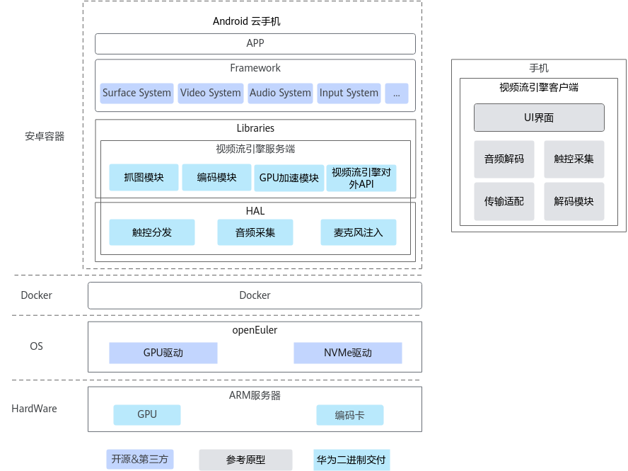

# 特性指南

## 简介

视频流引擎主要应用于云手机，基于视频流引擎技术实现的云手机方案也称为视频流云手机。本文介绍了视频流引擎的基本概念，提供视频流引擎环境部署和使用操作指导。

云手机是基于 ARM 服务器虚拟出的带有 AOSP（Android Open Source Project）系统的虚拟手机服务。简单来说，云手机 = ARM 服务器 + Android OS。您可以远程实时控制云手机，实现Android APP的云端运行；也可以基于云手机的基础算力，高效搭建应用，如云游戏、移动办公、直播互娱等场景。

端云协同引擎顾名思义可以分为端侧和云侧两个部分：云侧运行于服务器上；端侧一般为云手机 APK，可以被安装在用户的 Android 手机上，用于和云侧进行交互，进而对 Kbox 容器进行正常的操作。

端云协同引擎包括视频流引擎和指令流引擎，本文主要描述视频流引擎。

## 软件架构

本节介绍视频流云手机的上下文逻辑结构与所包含的模块含义及作用。

### 视频流云手机架构图



视频流引擎包括服务端和客户端两个部分：服务端提供图像获取、图像数据编码等功能；客户端提供视频数据解码播放功能。在部分场景下还包含用户触控的获取和注入、音频数据的获取和播放等功能。

| 模块名称 | 功能描述 |
| -------- | -------- |
| 抓图模块 | 获取图像数据，输出格式为 RGBA 显存地址或者 RGBA 内存地址 |
| 编码模块 | 将 YUV 数据通过编码模块编码为 H.264/H.265 码流，并通过视频流引擎对外 API 发送 |
| GPU 加速模块 | 将抓图模块获取的 RGBA 数据，利用 GPU 能力转换为 YUV 数据或视频码流 |
| 音频采集 | 获取音频数据，输出 OPUS 或 PCM 格式音频数据，并通过视频流引擎对外 API 发送 |
| 麦克风注入 | 从视频流引擎对外 API 获取 OPUS 或 PCM 数据，并注入 Android 系统 |
| 触控分发 | 向服务端 Android 云手机注入触控数据 |
| 视频流引擎对外 API | 视频流引擎服务端的对外 API 接口 |

## 规格

鲲鹏服务器上视频流云手机规格，如[表1视频流云手机规格](#视频流云手机规格)所示。

**表1**视频流云手机规格<a id="视频流云手机规格"></a>

| 条目 | 配置 |
| ---- | ---- |
| 场景 | 中度游戏应用（王者荣耀登录页面）硬编 |
| 绑核策略 | 容器绑 NUMA，每 NUMA 空前两核 |
| 内存 | 3GB |
| 存储 | 16GB |
| 分辨率/帧率 | 720*1280/30fps |

> **说明：** 
> 内存和硬盘以满足整机规格为准，可灵活调配。

## 可获得性

版本支持：

完整部署视频流云手机所需的软件/硬件配套，请参见《[版本配套表（Android 15）](https://www.hikunpeng.com/document/detail/zh/kunpengcps/cpturbokit/videostreamengine_ad15/kunpengcps_video_0003.html)》。

## 约束与限制

视频流云手机部署和使用时在硬件、系统和应用等方面存在一些约束和限制条件，您需要充分了解这些条件，以便在后续部署或使用过程中参考。

- 软硬件限制

  - 视频流引擎服务端运行在 Kbox 容器中，系统为 Android 15.0.0_r17。
  - 视频流引擎客户端为 64 位，需要运行在鸿蒙系统或 Android 7 及以上版本的 Android 系统的 64 位系统的手机上。
  - 视频流引擎服务端的视频编码功能依赖第三方集成的视频编码模块，该模块可以是软件实现也可以是硬件实现，典型的硬件如 NETINT Quadra T2A 视频编码卡。如果使用固定码率模式编码，在画面快速变化的场景可能出现短暂模糊现象，这是由于此类场景对码率要求过高导致的，可以通过提高码率设置进行缓解。
  - 视频流引擎客户端的视频解码功能依赖手机的硬件视频解码能力。
  - 本文档所述的性能/规格，和硬件能力相关的，需在指定的硬件上测试。

- 使用限制

  - 本项目对第三方交付视频流引擎二进制库，并承诺引擎本身的质量、性能和安全性。第三方根据自身业务场景集成视频流引擎，定义产品规格和性能，同时相关的场景定义、业务开发、网络设计、系统安全、业务的运营运维均由第三方负责。
  - 华为手机特有的一键清理功能不会结束正在进行数据传输的后台活动进程，因为视频流客户端需要维护心跳数据，保证与视频流服务端之间网络连接不断。所以华为手机上，视频流客户端不会在一键清理时被结束掉。
  - 因为主机侧的操作系统不在本解决方案的交付范围，所以，涉及操作系统相关的安全加固措施，需要客户或者 ISV 厂家进行实施，本文档不提供相关描述。
  - 本文中的脚本调用默认使用 root 权限，仅供参考，不做商业承诺，为了避免操作系统安全风险，建议在商用部署场景下，客户或者 ISV 厂家实施针对文件的访问控制、最小化授权等防御手段。
  - 在按照文档描述进行操作时，建议用户对上传文件、目录的权限进行合理配置。其他用户属组建议不配置写权限。
  - 为确保视频流云手机的稳定运行与最佳性能，在启动云手机时，绑定的 GPU 节点和 CPU 核须保障不跨片。

- 其他限制

  - 应用与 Android 模拟器的兼容性如第三方登录、广告、支付、客户反馈、扩展小游戏、模拟器检测等场景的兼容性依赖云手机镜像的兼容能力。

  - 若打开动态帧率调整功能，其相关的环境变量 `ro.hardware.downfps` 应配置为 12 或 24，避免由于帧数过低导致应用的未知异常行为。

  - 在打开自适应帧同步功能时，由于该特性实现机制可能导致实际帧率大于配置帧率。可通过阈值 `vmi.adaptive.vsync.threshold` 进行配置，该配置值建议与云机配置的帧率保持一致。配置值较小可以降低发生帧率异常冲高现象的概率，但会使自适应帧同步的收益不稳定。

  - 在使用硬件配置方案一时，若打开合成优化功能，可能在进入/退出游戏、拉起输入栏等行为时，发生画面旋转现象，可根据具体场景评估影响，决定是否需要打开。

  - 视频流引擎依赖第三方提供的安全 + 可靠通信机制进行会话认证和数据传输/加密。

  - 商用二进制遵循 Android 系统最小权限原则，要求文件属主与属组均为 root。

  - 视频流云手机在长时间运行中，会占用 Host 端大量的 cache。请定期使用清理 cache 命令进行清理，参考如下：

    ```bash
    echo 3 > /proc/sys/vm/drop_caches
    ```

> **说明：** 
> 清理 cache 会短暂影响当前系统的性能，请控制好清理周期和粒度。
>
> - 清理 pagecache。
>
>   ```bash
>   echo 1 > /proc/sys/vm/drop_caches
>   ```
>
> - 清理内核 slab 对象（包括 inode 对象和 dentry 目录对象）。
>
>   ```bash
>   echo 2 > /proc/sys/vm/drop_caches
>   ```
>
> - 同时清理 pagecache 和内核 slab 对象。
>
>   ```bash
>   echo 3 > /proc/sys/vm/drop_caches
>   ```

## 应用场景

视频流引擎是云手机解决方案的重要组成部分，是实现 Android 系统端云协同的方案之一。由于视频流方案具有云侧应用兼容性好、端侧硬件要求低、技术成熟、网络带宽稳定等优点，因此视频流云手机是当前的主流应用方案。

视频流云手机的主要应用场景有云手机、云游戏、移动办公等。

## 原理描述

视频流云手机的整体思路，是将视频流引擎分解为服务端和客户端两个部分：服务端提供图像获取、图像数据编码等功能；客户端提供视频数据解码播放功能。在某些场景下还包含用户触控的获取和注入、音频数据的获取和播放等功能。
