# 安装指南<a name="ZH-CN_TOPIC_0000002521895634"></a>

## 软件部署<a name="ZH-CN_TOPIC_0000002518386576"></a>

### 环境要求<a name="ZH-CN_TOPIC_0000002518226658"></a>

#### 硬件环境<a name="ZH-CN_TOPIC_0000002518226662"></a>

部署Kbox云手机容器环境前请确保您的环境满足已验证的硬件环境要求。

Kbox云手机容器环境部署的硬件环境配置方案要求如[**表 1** Kbox云手机容器环境部署硬件配置方案要求](#Kbox云手机容器环境部署硬件配置方案要求)所示。

**表 1** Kbox云手机容器环境部署硬件配置方案要求<a id="Kbox云手机容器环境部署硬件配置方案要求"></a>

|配置项|硬件配置方案一|硬件配置方案二|硬件配置方案三|硬件配置方案四|硬件配置方案五|
|--|--|--|--|--|--|
|CPU|2\*鲲鹏920 7260处理器，64 Core\@2.6GHz|2\*鲲鹏920 7260处理器，64 Core\@2.6GHz|2\*鲲鹏920 7280Z处理器，80 Core\@2.9GHz|2\*鲲鹏920 7260W处理器，64 Core\@2.2GHz|2\*鲲鹏920 7282C处理器，80 Core\@2.9GHz|
|内存|16\*DDR4 RDIMM内存-32GB-2933MT/s|16\*DDR4 RDIMM内存-32GB-2933MT/s|16\*DDR5 DIMM内存-64GB-4800MT/s|16\*DDR5 DIMM内存-64GB-5200MT/s|16\*DDR4 DIMM内存-64GB-3200MT/s|
|编码卡|1\*NETINT Quadra T2A（X8）|无|无|无|无|
|GPU|2\*AMD W6800|4\*道客DC1000|8\*道客DC1000 或 8\*道客DC1000C|8\*道客DC1000|8\*道客DC1000|
|操作系统|openEuler 24.03 LTS SP1|openEuler 24.03 LTS SP1|openEuler 24.03 LTS SP1|openEuler 24.03 LTS SP1|openEuler 24.03 LTS SP1|
|系统/内核版本|6.6.0-72.0.0|6.6.0-72.0.0|6.6.0-72.0.0|6.6.0-72.0.0|6.6.0-72.0.0|

> **说明：** 
>
>- 选择鲲鹏服务器兼容的Mellanox网卡，通过[鲲鹏计算兼容性查询工具](https://info.support.huawei.com/computing/tools/compatibility-query/enterprise/kunpeng-computing/component-compatibility)可查询具体型号网卡。
>- NETINT驱动针对Android15系统仅支持Quadra卡。

#### 软件环境<a name="ZH-CN_TOPIC_0000002549866439"></a>

##### Kbox<a name="ZH-CN_TOPIC_0000002549866441"></a>

部署Kbox云手机容器的软件环境要求请参见《[Kbox云手机容器 特性指南（Android 15）](https://gitcode.com/boostkit/Kbox-patches/blob/AOSP15/docs/zh/feature_guide.md)》中软件部署的“软件环境”章节。

##### 视频流引擎<a name="ZH-CN_TOPIC_0000002549746419" id="视频流引擎"></a>

在部署视频流云手机环境前，请参见本节提供的渠道获取相应的软件包并对华为提供的软件包进行完整性校验，以便进行后续的部署步骤。

**获取软件包<a name="section9155930113616"></a>**

**表 1** 部署视频流引擎的软件环境要求<a id="部署视频流引擎的软件环境要求"></a>

|序号|软件包|说明|获取地址|配置方案一|配置方案二|配置方案三|配置方案四|配置方案五|
|--|--|--|--|--|--|--|--|--|
| 1 | BoostKit-boostcph-videoengine_*_15.zip | 视频流引擎二进制包 | [获取链接](https://www.hikunpeng.com/boostkit/arm-native?application=视频流引擎#application-soft) | √ | √ | √ | √ |√ |
| 2 | DemoVideoEngine.tar.gz | 视频流服务端tar包组件，负责获取Kbox容器音视频数据等 | 请联系华为技术支持获取 | √ | √ | √ | √ |√ |
| 3 | DemoVideoEngine_sha256.txt | 视频流服务端tar包组件对应的sha256文件，负责完整性校验 | 请联系华为技术支持获取 | √ | √ | √ | √ |√ |
| 4 | CloudPhoneApk.tar.gz | 视频流客户端tar包组件，负责解码播放音视频数据 | 请联系华为技术支持获取 | √ | √ | √ | √ |√ |
| 5 | CloudPhoneApk_sha256.txt | 视频流客户端tar包组件对应的sha256文件，负责完整性校验 | 请联系华为技术支持获取 | √ | √ | √ | √ |√ |
| 6 | VideoClientEmulator.tar.gz | 视频流云手机压测工具 | 请联系华为技术支持获取 | √ | √ | √ | √ |√ |
| 7 | NETINT-v*XXX*.tar.gz | 视频流NETINT编码卡tar包组件，负责硬件编码，配套版本4.8.F-Android15 | [获取链接](https://www.netint.cn/quadra-firmware-downloads-android15)<br/>下载密码:test123 | √ | - | - | - |- |
| 8 | Quadra_V*XXX*.zip | NETINT编码卡Quadra软固件及文档包 | [获取链接](https://www.netint.cn/quadra-firmware-downloads-android15)<br/>下载密码:test123 | √ | - | - | - | - |
| 9 | topo-affinity-plugin-master.zip | K8s NUMA亲和插件 | [获取链接](https://gitee.com/kunpeng_compute/topo-affinity-plugin) | √ | √ | √ | √ |√ |

> **说明：** 
>
>- √：是指使用对应硬件配置方案时需要安装该软件项目。
>- -：是指使用对应硬件配置方案时不需要安装该软件项目。

**软件包完整性校验<a name="section111981239163615"></a>**

为了防止软件包在传递过程或存储期间被恶意篡改，从鲲鹏社区获取软件包时需下载对应的数字签名文件用于完整性验证。

1. 请参见[**表 1** 部署视频流引擎的软件环境要求](#部署视频流引擎的软件环境要求)获取软件包。
2. <a name="li1273482318125"></a>从[华为企业业务网站](https://support.huawei.com/enterprise/zh/tool/pgp-verify-TL1000000054)或[运营商网站](http://support.huawei.com/carrier/digitalSignatureAction)获取校验工具和校验方法。
3. 使用[2](#li1273482318125)获取的签名验证指南文档对下载的软件包进行PGP数字签名校验。

> **说明：** 
>
>如果校验失败，请不要使用该软件包，先联系华为技术支持工程师解决。
>使用软件包安装/升级之前，也需要按上述过程先验证软件包的数字签名，确保软件包未被篡改。
>使用软件包前请先阅读《[鲲鹏应用使能套件BoostKit用户许可协议 2.0](https://www.hikunpeng.com/zh/legal/developer/boostkit/software/protocol)》，如确认继续使用，则默认同意协议的条款和条件。

### 部署云手机<a name="ZH-CN_TOPIC_0000002549746425"></a>

#### 环境配置<a name="ZH-CN_TOPIC_0000002518386582"></a>

##### 配置BIOS<a name="ZH-CN_TOPIC_0000002518226660"></a>

环境部署指定的服务器BIOS版本对内存的插入格式有限制。在进行BIOS设置之前，请确保内存插入格式正确，然后根据硬件配置方案需求完成MISC、Performance和Memory等相关选项的配置，用以提高服务器性能。

具体配置步骤请参见《[Kbox云手机容器 特性指南（Android 15）](https://gitcode.com/boostkit/Kbox-patches/blob/AOSP15/docs/zh/feature_guide.md)》中“软件部署”的“配置BIOS”章节内容。

##### （硬件配置方案一，可选）升级NVMe固件版本<a name="ZH-CN_TOPIC_0000002518226644"></a>

该章节仅在使用硬件配置方案一，并且需要使能编码卡硬件解码功能时才需要执行。若不需要使能硬件解码则跳过该章节。

部署环境前，在确认编码卡是否被NVMe驱动正确识别的同时检查NVMe固件版本，若与本文档提供的版本不一致则需要进行固件版本升级。

1. 查看编码卡是否被NVMe驱动正确识别。

    ```bash
    nvme list
    ```

    回显如下说明识别正确。该内容为回显示例，请以实际为准。

    ```bash
    Node          SN                   Model            Namespace Usage                    Format           FW Rev
    ------------- -------------------- ---------------- --------- ------------------------ ---------------- --------
    /dev/nvme0n1  Q2A325A11DC082-0454A QuadraT2A        1         8.59  TB /   8.59  TB    4 KiB +  0 B     48F6rKr1
    /dev/nvme1n1  Q2A325A11DC082-0454B QuadraT2A        1         8.59  TB /   8.59  TB    4 KiB +  0 B     48F6rKr1
    ```

    如果固件版本（最右侧的FW Rev一栏）与4.8.F-Android15配套固件版本不一致，请参见以下步骤对编码卡上的固件进行升级。

    > **说明：** 
    >
    >NVMe固件版本比较的规则是：数字越大，字母越靠后，版本越新。

2. 请从**Quadra_V_XXX_.zip**（其中，XXX为版本号信息，仅做示例使用，下列步骤请按实际名称解压）中获取4.8.F-Android15固件升级包并升级固件**。**

    ```bash
    unzip Quadra_VXXX.zip
    cd Quadra_VXXX/
    tar -zxvf Quadra_FW_VXXX.tar.gz
    cd Quadra_FW_VXXX/
    chmod +x quadra_auto_upgrade.sh
    ./quadra_auto_upgrade.sh
    ```

    升级大约持续1分钟。

3. 升级完成后需重启系统生效。

    ```bash
    reboot
    ```

##### （硬件配置方案一）配置GPU工作模式<a name="ZH-CN_TOPIC_0000002518226676"></a>

使用硬件配置方案一时将GPU卡工作模式设置为高性能模式，使GPU运行在最高频率，保持GPU性能最优。该操作每次系统重启都需重新配置一次。

执行如下命令设置GPU卡工作模式为高性能模式。

```bash
find /sys -name power_dpm_force_performance_level | xargs -I {} sh -c "echo high > '{}'"
```

##### 部署Kbox容器基础环境<a name="ZH-CN_TOPIC_0000002549746421" id="部署Kbox容器基础环境"></a>

Kbox云手机容器部署的详细操作请参见《[Kbox云手机容器 特性指南](https://gitcode.com/boostkit/Kbox-patches/blob/AOSP15/docs/zh/feature_guide.md)》中的“软件部署”章节。按照步骤完成该章节中“启动和卸载云手机实例”小节前的所有部署。

##### （可选）部署Containerd环境<a name="ZH-CN_TOPIC_0000002549866409" id="部署Containerd环境"></a>

视频流云手机除支持以基于Docker的容器运行时启动外，还支持以Containerd容器运行时启动。若选择以Containerd运行时运行视频流云手机，可参考本章节进行Containerd相关软件包的部署。

**获取软件包<a name="section11783175614511"></a>**

部署Containerd环境需要使用的软件包如[**表 1** Containerd相关软件包](#Containerd相关软件包)所示。

**表 1** Containerd相关软件包<a id="Containerd相关软件包"></a>

|软件名|版本号|软件描述|获取方式|
|--|--|--|--|
| Containerd | v1.7.14 | Containerd是一个容器运行时。 | Containerd二进制软件包：containerd-1.7.14-linux-arm64.tar.gzContainerd Service文件：[获取链接](https://raw.githubusercontent.com/containerd/containerd/main/containerd.service) |
| runc | v1.1.12 | runc是一个符合开放容器标准OCI（Open Container Initiative）规范的轻量级容器运行时，是Containerd的一个依赖组件。 | [获取链接]( https://github.com/opencontainers/runc/releases/download/v1.1.12/runc.arm64) |
| CNI Plugin | v1.4.1 | 容器网络接口CNI（Container Network Interface）是一个规范和库，用于在Linux容器中配置网络接口。 | [获取链接]( https://github.com/containernetworking/plugins/releases/download/v1.4.1/cni-plugins-linux-arm64-v1.4.1.tgz) |
| nerdctl | v1.7.5 | nerdctl是一个兼容Docker CLI的命令行工具，用于管理Containerd容器和镜像。 | [获取链接](https://github.com/containerd/nerdctl/releases/download/v1.7.5/nerdctl-1.7.5-linux-arm64.tar.gz) |
| Golang | v1.25 | Golang是一个系统级编程语言，用于管理和生成NRI插件。 | [获取链接](https://golang.google.cn/dl/go1.25.0.linux-arm64.tar.gz) |

**部署Containerd环境<a name="section343716111874"></a>**

1. <a id="部署Containerd环境1"></a>下载并解压Containerd二进制软件包到“/usr/local”目录下。

    ```bash
    mkdir -p /root/containerdenv/downloads
    cd /root/containerdenv/downloads
    wget https://github.com/containerd/containerd/releases/download/v1.7.14/containerd-1.7.14-linux-arm64.tar.gz --no-check-certificate
    tar Cxzvf /usr/local containerd-1.7.14-linux-arm64.tar.gz
    ```

    确认Containerd版本号为v1.7.14。

    ```bash
    containerd --version
    ```

2. 下载Containerd Service文件，配置成系统服务。

    ```bash
    cd /root/containerdenv/downloads
    wget https://raw.githubusercontent.com/containerd/containerd/main/containerd.service --no-check-certificate
    mkdir -p /usr/local/lib/systemd/system/
    cp containerd.service /usr/local/lib/systemd/system/
    systemctl daemon-reload
    systemctl enable --now containerd
    ```

    确认Containerd服务是否已正常启动。

    ```bash
    systemctl status containerd
    ```

    

    回显信息如上图所示表示Containerd服务已经正常启动。

3. <a id="部署Containerd环境3"></a>下载并安装runc。

    ```bash
    cd /root/containerdenv/downloads
    wget https://github.com/opencontainers/runc/releases/download/v1.1.12/runc.arm64 --no-check-certificate
    install -m 755 runc.arm64 /usr/local/sbin/runc
    ```

    确认runc版本号为1.1.12。

    ```bash
    runc --version
    ```

4. 下载并安装CNI plugin。

    ```bash
    cd /root/containerdenv/downloads
    mkdir -p /opt/cni/bin
    wget https://github.com/containernetworking/plugins/releases/download/v1.4.1/cni-plugins-linux-arm64-v1.4.1.tgz --no-check-certificate
    tar Cxzvf /opt/cni/bin cni-plugins-linux-arm64-v1.4.1.tgz
    ```

5. <a id="部署Containerd环境5"></a>下载并安装nerdctl工具。

    ```bash
    cd /root/containerdenv/downloads
    wget https://github.com/containerd/nerdctl/releases/download/v1.7.5/nerdctl-1.7.5-linux-arm64.tar.gz --no-check-certificate
    tar Cxzvf /usr/local/bin nerdctl-1.7.5-linux-arm64.tar.gz
    ```

    确认nerdctl版本号为1.7.5。

    ```bash
    nerdctl --version
    ```

6. <a id="安装Golang"></a>下载并安装Golang。

    ```bash
    wget https://golang.google.cn/dl/go1.25.0.linux-arm64.tar.gz
    tar -C /usr/local -xzf go1.25.0.linux-arm64.tar.gz
    echo 'export PATH=/usr/local/go/bin:$PATH' >> ~/.bashrc
    source ~/.bashrc
    ```

    配置代理。

    ```bash
    go env -w GO111MODULE=on
    go env -w GOPROXY=https://goproxy.cn,direct
    ```

    确认Golang版本号为1.25。

    ```bash
    go version
    ```

7. <a id="部署Containerd环境7"></a>重新启动Docker服务，并重新启动一个新的终端以使新的容器运行时生效。

    ```bash
    systemctl restart docker
    ```

    若要切换至Docker版本的容器运行时，须将[1](#部署Containerd环境1)~[5](#部署Containerd环境5)已安装的相关软件二进制从对应目录中移除。移除完成后，参考以上命令重启Docker服务并重新启动一个新的终端。

#### （硬件配置方案二、三、四、五）安装显卡驱动<a name="ZH-CN_TOPIC_0000002549866411"></a>

使用硬件配置方案二、三、四、五每次服务器重启后，都需要重新执行安装显卡驱动步骤。

1. 请参见[软件环境](https://www.hikunpeng.com/document/detail/zh/kunpengcps/boostcph/kboxcpc_ad15/docs/zh/install_guide.md#d22-%E8%BD%AF%E4%BB%B6%E7%8E%AF%E5%A2%83)获取VAGPU-A15-C-F-26.02.06.00.RC2.tgz，上传至“~/dependency/”目录，解压后获取显卡内核态驱动。

    ```bash
    cd ~/dependency/
    tar -zxvf VAGPU-A15-C-F-26.02.06.00.RC2.tgz
    ```

2. 将驱动包里的固件拷贝到系统的“/lib/firmware/”目录。

    ```bash
    cd ~/dependency/VAGPU-A15-C-F-26.02.06.00.RC2/fw
    cp rgx* /lib/firmware/
    ```

3. 安装显卡图形驱动。

    GPU驱动会为每个显卡节点启动一个kworker进程，道客DC1000/DC1000C单卡有4个节点。为保障kworker进程性能，建议使用kworkerCores参数为每个kworker进程绑定CPU，kworkerCores参数依次表示每个显卡节点对应kworker进程的绑核。

    在安装显卡图形驱动绑核时，**请确保kworker进程绑定的CPU核和GPU渲染节点同属一个CPU片**。GPU渲染节点所属CPU片的查询方式请参见[确定GPU拓扑结构](https://www.hikunpeng.com/document/detail/zh/kunpengcps/boostcph/kboxcpc_ad15/docs/zh/install_guide.md#d81-%E7%A1%AE%E5%AE%9Agpu%E6%8B%93%E6%89%91%E7%BB%93%E6%9E%84)章节。

    以DC1000/DC1000C为例，以下绑核方式仅作为参考，请依据实际情况做出调整。

    ```bash
    cd ~/dependency/VAGPU-A15-C-F-26.02.06.00.RC2/kmd/GUEST/openEuler-6.6.0+
    ```

    硬件配置方案二（鲲鹏920 7260处理器 + 4\*道客DC 1000）：

    ```bash
    insmod va_gpu.ko kworkerCores=0,0,1,1,32,32,33,33,64,64,65,65,96,96,97,97
    ```

    硬件配置方案三（鲲鹏920 7280Z处理器 + 8\*道客DC 1000 或 8\*道客DC1000C）：

    ```bash
    insmod va_gpu.ko kworkerCores=80,80,81,81,82,82,83,83,0,0,1,1,2,2,3,3,240,240,241,241,242,242,243,243,160,160,161,161,162,162,163,163
    ```

    硬件配置方案四（鲲鹏920 7260W处理器 + 8\*道客DC 1000）：

    ```bash
    insmod va_gpu.ko kworkerCores=64,64,65,65,66,66,67,67,0,0,1,1,2,2,3,3,192,192,193,193,194,194,195,195,128,128,129,129,130,130,131,131
    ```

    硬件配置方案五（鲲鹏920 7282C处理器 + 8\*道客DC 1000）：

    ```bash
    insmod va_gpu.ko kworkerCores=80,80,80,80,81,81,81,81,0,0,0,0,1,1,1,1,240,240,240,240,241,241,241,241,160,160,160,160,161,161,161,161
    ```
    
4. 等待脚本执行完成，查看内核日志。

    ```bash
    dmesg | grep VAGPU | grep version
    ```

    回显信息中显卡内核态驱动版本号和显卡固件版本号相同，如下内容，则表明显卡驱动安装完成。

    ```bash
    PVR_K:  28823: Meta firmware version: 1.18@6276027 build: release branch:  commit: 67e785a8 tag: VAGPU-A15-C-F-26.02.06.00.RC2
    ...
    ```

> **说明：** 
>
>更换驱动版本时，需要卸载驱动后重新安装其他版本驱动。
>
>1. 删掉所有的容器，解除对驱动的占用。
>2. 顺序卸载驱动。
>3. 新版本的DC驱动取消了va_gfx.ko和va_pci.ko, 合并为了va_gpu.ko, 新版的DC驱动只需要卸载va_gpu.ko即可。
>
>
> ```bash
> rmmod va_gpu
> ```
>
> 旧版驱动指令如下：
>
> ```bash
> rmmod va_gfx
> rmmod va_pci 
> ```

#### 制作镜像<a name="ZH-CN_TOPIC_0000002549866429" id="制作镜像"></a>

##### 制作Kbox镜像<a name="ZH-CN_TOPIC_0000002549866417"></a>

制作视频流云手机镜像前需要根据本章节内容完成Kbox镜像的制作。

1. 请参见[部署Kbox容器基础环境](#部署Kbox容器基础环境)获取Kbox容器启动依赖组件android.tar和Kbox-patches-AOSP15.zip，并上传至服务器的“/home/kbox_video”目录（本文以此目录作为示例，用户也可自行设置目录）。
2. 解压Kbox-patches-AOSP15.zip，获取“deploy_scripts”路径下的3个组件android_kbox_aosp15.sh、base_box_aosp15.sh、hardware_bind.cfg， 并将其拷贝到“/home/kbox_video”目录，赋予文件权限，使文件拥有者有读、写、执行权限而属组用户和其他用户只有读和执行权限。

    ```bash
    unzip Kbox-patches-AOSP15.zip
    cp Kbox-patches-AOSP15/deploy_scripts/base_box_aosp15.sh /home/kbox_video/
    cp Kbox-patches-AOSP15/deploy_scripts/android_kbox_aosp15.sh /home/kbox_video/
    cp Kbox-patches-AOSP15/deploy_scripts/hardware_bind.cfg /home/kbox_video/
    
    chmod 755 /home/kbox_video/base_box_aosp15.sh
    chmod 755 /home/kbox_video/android_kbox_aosp15.sh
    ```

3. 制作Kbox镜像，镜像名称通常命名为kbox:origin。
    1. 上传Kbox Demo镜像包android.tar至“~/dependency”目录（本文以此目录作为示例，用户可自行设置目录），并挂载。

        镜像的名称和tag可以自行定义，格式为“{名称}:{tag}”，此处设置镜像名为kbox:demo。

        ```bash
        cd ~/dependency
        docker import android.tar kbox:demo
        ```

    2. 将Kbox-patches-AOSP15文件夹中的deploy_scripts目录上传至服务器的“~/dependency”目录。
    3. 上传Android Kbox二进制文件包BoostKit-boostcph-kbox_\*.zip到“~/dependency/deploy_scripts”目录。
    4. （硬件配置方案二、三、四、五）使用硬件配置方案二、三、四、五时需要解压显卡驱动压缩包VAGPU-A15-C-F-26.02.06.00.RC2.tgz，上传到服务器的“~/dependency/deploy_scripts”目录。
    5. 制作包含Android Kbox二进制的Kbox镜像，其中kbox:demo为导入的官方Kbox Demo镜像，kbox:origin为包含Android Kbox二进制的新镜像。
        - 硬件配置方案一：

            ```bash
            cd ~/dependency/deploy_scripts
            chmod +x make_image_aosp15.sh
            ./make_image_aosp15.sh kbox:demo kbox:origin
            ```

        - 硬件配置方案二、三、四、五：

            ```bash
            cd ~/dependency/deploy_scripts
            chmod +x make_image_aosp15.sh
            ./make_image_aosp15.sh kbox:demo kbox:origin VAGPU-A15-C-F-26.02.06.00.RC2
            ```

            > **说明：** 
            >
            >执行步骤3后，回显中会出现多行linkerconfig告警，该告警不影响正常功能，可以忽略。
            >

4. 查看Kbox镜像（kbox:origin）是否制作成功。

    ```bash
    docker images
    ```

    回显如下，表示镜像制作成功。

    ```bash
    REPOSITORY    TAG       IMAGE ID        CREATED          SIZE
    kbox          origin    d1f5cfd2e722    6 seconds ago    2.09GB
    ```

##### 制作视频流云手机镜像<a name="ZH-CN_TOPIC_0000002518386578"></a>

获取视频流客户端tar包组件、视频流服务端tar包组件、视频流引擎二进制软件包和视频流NETINT编码卡tar包组件进行视频流云手机镜像的制作。

**校验软件包完整性<a name="section1286473717216"></a>**

1. 请参见[视频流引擎](#视频流引擎)获取CloudPhoneApk.tar.gz、DemoVideoEngine.tar.gz和BoostKit-boostcph-videoengine_\*_15.zip软件包，获取后将软件包上传至服务器的“/home/kbox_video”目录。
2. 通过以下命令获取如下组件的sha256校验码。

    ```bash
    sha256sum DemoVideoEngine.tar.gz
    sha256sum CloudPhoneApk.tar.gz
    ```

3. 将校验码分别与DemoVideoEngine_sha256.txt和CloudPhoneApk_sha256.txt进行对比。

    如果一致，说明获取的软件包完整，可以继续下一步操作，否则应该暂停部署，重新获取完整的软件包。

4. （硬件配置方案一）使用硬件配置方案一时请参见[视频流引擎](#视频流引擎)获取NETINT-vXXX.tar.gz软件包，获取后将软件包上传至服务器的“/home/kbox_video”目录，并重命名为NETINT.tar.gz。

    > **说明：** 
    >
    >- NETINT对Android15系统仅支持Quadra编码卡

**制作镜像<a name="section118652371219"></a>**

1. 解压DemoVideoEngine.tar.gz软件包获取制作镜像的脚本，并赋予可执行权限。
    - 配置方案一：

        ```bash
        tar -xvf DemoVideoEngine.tar.gz Dockerfile_NoVPU Dockerfile_QuadraT2A make_image.sh
        chmod +x Dockerfile_NoVPU Dockerfile_QuadraT2A make_image.sh
        ```

    - 配置方案二、三、四、 五：

        ```bash
        tar -xvf DemoVideoEngine.tar.gz Dockerfile_NoVPU  make_image.sh
        chmod +x Dockerfile_NoVPU  make_image.sh
        ```

2. 制作视频流云手机镜像。镜像名称可以使用默认镜像名也可以自己指定。
    - 使用默认镜像名称，执行命令如下。Kbox基础云手机和视频流云手机默认镜像名称分别为kbox:latest和video:latest。

        ```bash
        ./make_image.sh
        ```

    - 如果镜像名称需要自定义，执行命令如下例所示。通过参数指定Kbox基础云手机和视频流云手机镜像名称，格式均为“{镜像名}:{tag}”，如下例所示kbox、video为镜像名，origin、latest为tag。

        ```bash
        ./make_image.sh kbox:origin video:latest
        ```

        > **说明：** 
        >
        >镜像名只可包含数字与小写字母，首字符应为小写字母，tag名只可包含数字与字母。若自定义修改了视频流云手机的镜像名称，请参见[制作基础数据卷](#制作基础数据卷)章节中将cfct_config配置文件中的视频流云手机镜像名更新为自定义的镜像名称。
        >执行该步骤后，回显中会出现多行linkerconfig告警，该告警不影响正常功能，可以忽略。
        >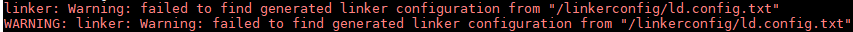

3. 查看视频流云手机镜像（video:latest）是否制作成功。

    ```bash
    docker images
    ```

    回显如下，表示镜像制作成功。

    ```bash
    REPOSITORY    TAG       IMAGE ID        CREATED          SIZE
    video         latest    40e5f42c17d9    6 seconds ago    2.11GB
    ```

#### 设置cfct_config，hardware_bind.cfg配置文件（配置方案一）<a name="ZH-CN_TOPIC_0000002518386584"></a>

通过cfct_config，hardware_bind.cfg文件配置参数可以灵活配置视频流云手机使用的资源，使性能达到最优。云手机启动时必须在启动路径下存放cfct_config，hardware_bind.cfg配置文件，云手机容器会使用该文件中的配置，使用时应确保cfct_config，hardware_bind.cfg配置文件中的配置正确。

cfct_config，hardware_bind.cfg配置文件配置项和配置方法如下所示。

1. 解压cfct_config配置文件并设置文件权限，使文件拥有者有读写权限而其他属组用户和其他用户只有读权限。

    ```bash
    cd /home/kbox_video/
    tar -xvf DemoVideoEngine.tar.gz cfct_config
    chmod 644 cfct_config
    ```

2. 通过配置GPU、CPU、ENC、USERDATA等map中对应路数的值，选择该路容器使用的GPU、CPU、NETINT编码卡，以及数据卷存放路径。

    > **说明：** 
    >
    >为确保视频流云手机的稳定运行与最佳性能，请保障每个容器所绑定的CPU物理核和GPU渲染节点同属于一个CPU片。

3. NETINT编码卡的节点在不同服务器中会有区别，请参见[4](#li5561723173614)并结合实际情况修改hardware_bind.cfg中NETINT的值，保证编码不会因跨片导致性能损失。
4. 如果要使能Quadra编码卡硬解，需要将cfct_config中的“T432_QUADRA_DECODE_ENABLE”设置为“1”。
5. 针对1张GPU卡环境：需要修改hardware_bind.cfg配置文件中VIDEO_CPU_MAP_{_CPU总核数_}CORE_MODE{_CPU_BIND_MODE变量值_}。NETINT编码卡芯片节点所属NUMA查询方式请参见[NETINT编码卡芯片节点所属NUMA查询方式](#section2507154233510)。

    以VIDEO_CPU_MAP_128CORE_MODE0为例，保留该配置变量下与GPU绑定的CPU配置，删除其他配置，当GPU卡插在CPU0上时，删除MODE0_CPUS2和MODE0_CPUS3所有相关引用；若GPU卡插在CPU1上时，删除MODE0_CPUS0和MODE0_CPUS1所有相关引用。GPU卡所属NUMA查询方式请参见[AMD GPU渲染节点所属NUMA的查询方式](#section20575115322416)。

6. 针对1张编码卡环境：需要修改hardware_bind.cfg配置文件中“VIDEO_ENC_MAP_CORE”。
7. 当编码卡插在CPU0上时，删除“${NETINT1}”；若编码卡插在CPU1上时，删除“${NETINT0}”。
8. 若视频帧采用CPU进行软编码，需要将cfct_config中的“CPU_BIND_MODE”设置为“1”，以防卡顿。
9. 如果需要使能图形加速层，请参见[图形加速层的基本功能和使用说明](#section9932195417616)。
10. 如果要使能C2解码器，需要将cfct_config中的“ENABLE_AMD_C2_DECODE”设置为“1”。

**NETINT编码卡芯片节点所属NUMA查询方式<a name="section2507154233510"></a>**

1. <a name="li1256022316361"></a>通过**nvme list**命令查看编码卡芯片对应节点号。

    ```bash
    nvme list
    ```

    以下回显为NETINT编码芯片NVMe节点，该内容为回显示例，请以实际为准。

    ```bash
    Node          SN                   Model            Namespace Usage                    Format           FW Rev
    ------------- -------------------- ---------------- --------- ------------------------ ---------------- --------
    /dev/nvme0n1  Q2A325A11DC082-0454A QuadraT2A        1         8.59  TB /   8.59  TB    4 KiB +  0 B     48F6rKr1
    /dev/nvme1n1  Q2A325A11DC082-0454B QuadraT2A        1         8.59  TB /   8.59  TB    4 KiB +  0 B     48F6rKr1
    ```

2. 查看NVMe节点与PCIe bus号对应关系。

    {index}为[1](#li1256022316361)回显信息所示的NVMe节点编号。例如/dev/nvme1n1，该节点{index}即为1。

    ```bash
    find /sys/devices/ -name nvme{index}
    ```

    回显如下，其中0000:05:00.0为该设备对应的busID：

    ```bash
    /sys/devices/pci0000:00/0000:00:0e.0/0000:05:00.0/nvme/nvme1
    /sys/devices/virtual/nvme-subsystem/nvme-subsys1/nvme1
    ```

3. 通过bus号找到该节点与NUMA从属关系。

    {busID}为上一步骤获取的bus号。以nvme1设备的回显为例，{busID}即为0000:05:00.0。

    ```bash
    lspci -vvvs {busID} | grep NUMA
    ```

    回显如下。

    ```bash
    NUMA node: 0
    ```

4. <a name="li5561723173614"></a>根据编码卡NVMe设备节点对应的NUMA修改hardware_bind.cfg中NETINT的值。

    鲲鹏920 7265F/7260服务器：从属于0、1号NUMA的NVMe节点写在NETINT0字段中，从属于2、3号NUMA的NVMe节点写在NETINT1字段中。

    字段中每个设备需添加两个节点。例如2号NVMe设备，需添加“/dev/nvme2”、“/dev/nvme2n1”两个节点。

    ```bash
    # NETINT编码卡设备节点
    NETINT0="/dev/nvme0,/dev/nvme0n1,/dev/nvme1,/dev/nvme1n1"
    NETINT1="/dev/nvme2,/dev/nvme2n1,/dev/nvme3,/dev/nvme3n1"
    ```

**AMD GPU渲染节点所属NUMA的查询方式<a name="section20575115322416"></a>**

> **说明：** 
>
>AMD GPU每张卡对应1个GPU渲染节点。

1. <a name="li34656503552"></a>获取GPU渲染节点命令。

    ```bash
    ll /dev/dri/by-path/ | grep renderD
    ```

    回显示例如下。

    ```bash
    lrwxrwxrwx 1 root root 13 Oct 25 10:58 pci-0000:03:00.0-render -> ../renderD128
    lrwxrwxrwx 1 root root 13 Oct 25 10:58 pci-0000:83:00.0-render -> ../renderD129
    ```

    说明该服务器插了两张AMD GPU，渲染节点分别为renderD128，renderD129。

2. 查询NUMA节点命令。

    ```bash
    cat /sys/bus/pci/devices/0000\:XX\:00.0/numa_node 
    ```

    其中，指令中的“XX”应按[1](#li34656503552)中的实际回显IP地址进行修改。以回显renderD128为例，查询指令应为：

    ```bash
    cat /sys/bus/pci/devices/0000\:03\:00.0/numa_node
    ```

    回显如下所示。

    ```bash
    0
    ```

    该回显表明GPU渲染节点renderD128所在NUMA节点为0。

**图形加速层的基本功能和使用说明<a name="section9932195417616" id="图形加速层的基本功能和使用说明"></a>**

当前图形加速层使能了两个功能：

- GPUMock：对GPU厂商、GPU型号、OpenGL ES版本、GLMax能力值、OpenGL ES拓展进行模拟。
- ShaderCache：通过预构建着色器二进制、多云手机共享缓存，消除着色器编译链接等处理时间，降低OpenGL ES大型应用运行卡顿率。

以上两个功能均可使用kbox_render_accelerating_configuration.xml配置文件进行功能配置。图形加速层的使能步骤如下：

1. 修改云手机启动配置文件cfct_config中“**ENABLE_RENDER_LAYER**”设置为1。
2. 从软件包Kbox-patches-AOSP15.zip中复制kbox_render_accelerating_configuration.xml配置文件到启动路径/home/kbox_video/。

    ```bash
    cp /home/kbox_video/Kbox-patches-AOSP15/deploy_scripts/kbox_render_accelerating_configuration.xml /home/kbox_video/
    ```

3. 打开kbox_render_accelerating_configuration.xml配置文件，对应用的图形加速层功能进行配置。具体配置项描述请参见[图形加速层配置项](user_guide.md#图形加速层配置项)章节的图形加速层配置项说明。

> **说明：** 
>
>- 首次启动云手机后，若需要修改图形加速层功能的配置，修改配置文件中应用对应的配置，手动将其拷贝到云手机容器“/data/local/tmp”路径，重启应用生效。
>- 宿主机上多容器共享一个着色器缓存路径，可以先启动一路云手机预收集应用尽可能完整的着色器，其他云手机通过将配置文件对应的应用设置为只读模式来使能ShaderCache功能，此时性能最佳。
>- ShaderCache功能没有缓存淘汰机制，若是缓存文件系统存储已满或者游戏版本更新，为了避免着色器和二进制文件不能对应，请清理整个文件系统的缓存。

#### 设置cfct_config，hardware_bind.cfg配置文件（配置方案二、三、四、五）<a name="ZH-CN_TOPIC_0000002518386592"></a>

通过设置cfct_config，hardware_bind.cfg配置文件可以灵活配置视频流云手机使用的资源，使性能达到最优。云手机启动时必须在启动路径下存放cfct_config，hardware_bind.cfg配置文件，云手机容器会使用该文件中的配置，使用时应确保cfct_config，hardware_bind.cfg配置文件中的配置正确。

cfct_config，hardware_bind.cfg配置文件配置项和配置方法如下所示。

1. 解压cfct_config配置文件并设置文件权限，使文件拥有者有读写权限而其他属组用户和其他用户只有读权限。

    ```bash
    cd /home/kbox_video/
    tar -xvf DemoVideoEngine.tar.gz cfct_config
    chmod 644 cfct_config
    ```

2. 通过配置GPU、CPU、USERDATA等map中对应路数的值，选择该路容器使用的GPU、CPU以及数据卷存放路径。

    > **说明：** 
    >
    >为确保视频流云手机的稳定运行与最佳性能，请保障每个容器所绑定的CPU物理核和GPU渲染节点同属于一个CPU片。

3. 当前视频流云手机默认使能DC1000/DC1000C GPU硬解的硬解功能（即默认**ENABLE_HARD_DECODE=1**），如需使用软解，需设置**ENABLE_HARD_DECODE=0**并重启容器。
4. 如果要使能WebRTC特性，需要更改cfct_config中的ENABLE_WEBRTC_CONNECTION=1。
5. 针对1张GPU卡环境：需要修改hardware_bind.cfg配置文件中VIDEO_CPU_MAP_{_CPU总核数_}CORE_MODE{_CPU_BIND_MODE变量值_}。

    以VIDEO_CPU_MAP_128CORE_MODE0为例，保留该配置变量下与GPU绑定的CPU配置，删除其他配置，当GPU卡插在CPU0上时，删除MODE0_CPUS2和MODE0_CPUS3所有相关引用；若GPU卡插在CPU1上时，删除MODE0_CPUS0和MODE0_CPUS1所有相关引用。

    - 如何确认当前环境只有一张GPU？

        以DC1000/DC1000C为例，查询服务器中道客DC1000/DC1000C信息。

        ```bash
        lspci -D | grep 0200
        ```

        回显如下所示，可知该服务器上只有一张道客DC1000，其中0000:04:00.0为busID。

        ```bash
        0000:04:00.0 3D controller: Device 1f4f:0200
        0000:04:00.1 3D controller: Device 1f4f:0200
        0000:04:00.2 3D controller: Device 1f4f:0200
        0000:04:00.3 3D controller: Device 1f4f:0200
        ```

    - 如何确认GPU与CPU的绑定关系？

        查询该显卡所属的NUMA。

        ```bash
        lspci -vvvs {busID} | grep NUMA
        ```

        回显如下所示，说明该卡绑定在cpu的NUMA 0上。

        ```bash
        NUMA node: 0
        ```

6. 如果需要使能图形加速层，请参见[图形加速层的基本功能和使用说明](#图形加速层的基本功能和使用说明)。

#### 制作基础数据卷<a name="ZH-CN_TOPIC_0000002518386594" id="制作基础数据卷"></a>

确认并根据需要调整默认的镜像名称和数据卷存放目录。删除或备份现有数据卷，解压并设置启动脚本权限，使用脚本启动云手机并预装应用，最后删除初始容器。

1. <a name="li16219132415811"></a>确认数据卷存放目录和镜像名称。

    默认镜像名称为video:latest，默认数据卷存放目录为“/home/mount”，可根据实际情况自行更改，修改方法为将“cfct_config”文件中“DOCKER_IMAGE”和“USERDATA”值调整为实际的名称或目录。

    ```bash
    DOCKER_IMAGE=video:latest
    USERDATA="/home/mount"
    ```

2. 删除原有数据卷或备份到其他位置，其中{USERDATA}为[1](#li16219132415811)中的实际数据卷存放目录，若存在多个数据卷存放目录，则需要分别对每个数据卷存放目录进行本章节余下所有操作。

    ```bash
    rm -rf ${USERDATA}/data/android_base
    ```

3. 从DemoVideoEngine.tar.gz中解压获取启动脚本cfct_video，并赋予权限，使文件拥有者有读、写、执行权限而属组用户和其他用户只有读和执行权限。

    ```bash
    cd /home/kbox_video/
    tar -xvf DemoVideoEngine.tar.gz cfct_video
    chmod 755 cfct_video
    ```

4. 使用cfct_video脚本启动1路云手机。

    ```bash
    ./cfct_video start ${index}  
    ```

5. 将所需的应用（例地铁跑酷等）预装到该云手机容器中，将android_${index}作为新数据卷，供启动视频流云手机时使用。

    ```bash
    cd ${USERDATA}/data/
    cp -rp android_${index} android_base
    ```

    > **说明：** 
    >
    >如果使用nfs挂载启动的容器，由于性能考虑，不支持cp -rp直接拷贝数据目录，应该直接拷贝img。
    >
    >将所需的应用（例如地铁跑酷等）预装到该云手机容器中，将android_${index}.img拷贝为android_base.img作为新数据卷。
    >
    >```bash
    >cd ${USERDATA}/img/
    >cp -rp android_${index}.img android_base.img
    >```
    >
    >在启动指定容器前手动拷贝android_base.img为相应容器编号。
    >
    >```bash
    >cd ${USERDATA}/img/
    >cp -rp android_base.img android_${index}.img
    >```

6. 删除android_${index}容器。

    ```bash
    cd /home/kbox_video/
    ./cfct_video delete ${index}
    ```

### K8s集群下部署视频流云手机（配置方案二）<a name="ZH-CN_TOPIC_0000002518226646"></a>

#### 环境准备<a name="ZH-CN_TOPIC_0000002549866425"></a>

视频流云手机支持使用Containerd启动，使用K8s集群管理。在K8s集群下部署视频流云手机时需准备至少2台服务器，1台作为master节点，1台或者多台作为工作节点。

各节点规划详情如[**表 1** K8s集群节点详情](#K8s集群节点详情)所示。

**表 1** K8s集群节点详情<a id="K8s集群节点详情"></a>

|节点名称（即主机名，可自定义）|节点角色|服务器个数|环境准备|节点功能|
|--|--|--|--|--|
| k8s-master | master节点 | 1台 | 基于鲲鹏服务器和openEuler 24.03 LTS SP1系统 | 整个集群的大脑和控制中心，负责协调和管理集群中的各种资源，以实现高可用性、可扩展性和自动化运维，实际不运行云手机相关业务 |
| k8s-slave1 | 工作节点 | 1台及以上 | 请参见2 软件部署章节完成视频流云手机的环境部署 | 运行云手机业务 |

> **说明：** 
>
>- K8s是容器编排平台，其工作节点需实际运行云手机业务，在部署K8s前或重启节点后，需确保工作节点完成视频流云手机的环境部署，完成环境部署的校验方式可启动一个视频流云手机验证。
>- K8s集群环境部署和部署镜像涉及从Docker镜像仓拉取镜像的操作，需确保部署的服务器网络环境能够从Docker镜像仓拉取镜像。

#### 搭建k8s集群<a name="ZH-CN_TOPIC_0000002518386560"></a>

##### 所有节点公共操作<a name="ZH-CN_TOPIC_0000002518386570"></a>

在所有master和工作节点下完成K8s集群软件安装、Containerd配置以及其他相关操作。

1. 修改hostname，保证每台服务器hostname不重复。

    例如：

    - 在master节点上将hostname修改为k8s-master。

        ```bash
        hostnamectl set-hostname k8s-master
        bash
        ```

    - 在工作节点上将hostname修改为k8s-slave1。

        ```bash
        hostnamectl set-hostname k8s-slave1
        bash
        ```

2. 将所有服务器密码修改为相同的密码。
3. 关闭防火墙。

    ```bash
    systemctl stop firewalld
    systemctl disable firewalld
    ```

4. 关闭交换分区。
    - 单次生效，执行如下命令。

        ```bash
        swapoff -a   
        ```

    - 永久生效，在“fstab”文件中注释swap自动挂载。

        ```bash
        sed -i "/\/dev\/mapper\/openeuler-swap/ s|^|#|" /etc/fstab
        ```

5. 配置安装K8s集群所需软件的源。

    ```bash
    touch /etc/yum.repos.d/kubernetes.repo
    cat >/etc/yum.repos.d/kubernetes.repo <<EOF
    [kubernetes]
    name=Kubernetes
    baseurl=https://pkgs.k8s.io/core:/stable:/v1.28/rpm/
    enabled=1
    gpgcheck=1
    gpgkey=https://pkgs.k8s.io/core:/stable:/v1.28/rpm/repodata/repomd.xml.key
    EOF
    ```

6. 安装K8s集群软件。

    ```bash
    yum install -y kubelet kubeadm kubectl kubernetes-cni --disableexcludes=kubernetes
    systemctl enable --now kubelet
    ```

7. 请参见[（可选）部署Containerd环境](#部署Containerd环境)的[1](#部署Containerd环境1)至[3](#部署Containerd环境3)安装Containerd和runc组件。在完成Containerd和runc的组件安装后，工作节点需要额外执行[7](#部署Containerd环境7)进行Docker服务的重启。
8. 修改Containerd配置。

    ```bash
    mkdir -p /etc/containerd/
    cd /etc/containerd/
    containerd config default > /etc/containerd/config.toml
    sed -i "s|SystemdCgroup =.*|SystemdCgroup = true|g" /etc/containerd/config.toml
    ```

9. 配置crictl，并重启containerd。

    ```bash
    echo "runtime-endpoint: unix:///run/containerd/containerd.sock" >> /etc/crictl.yaml
    echo "image-endpoint: unix:///run/containerd/containerd.sock" >> /etc/crictl.yaml
    echo "timeout: 10" >> /etc/crictl.yaml
    systemctl daemon-reload
    systemctl restart containerd
    ```

10. 安装yq工具，用于后续通过脚本动态调整yaml文件

    ```bash
    wget https://github.com/mikefarah/yq/releases/latest/download/yq_linux_arm64 --no-check-certificate -O /usr/local/bin/yq
    chmod +x /usr/local/bin/yq
    ```

11. 配置网络转发。该步骤服务器重启后需重新执行。

    ```bash
    modprobe overlay
    modprobe br_netfilter
    modprobe xt_multiport
    echo "net.bridge.bridge-nf-call-ip6tables=1" >> /etc/sysctl.d/k8s.conf
    echo "net.bridge.bridge-nf-call-iptables=1" >> /etc/sysctl.d/k8s.conf
    echo "net.ipv4.ip_forward=1" >> /etc/sysctl.d/k8s.conf
    sysctl -p /etc/sysctl.d/k8s.conf
    ```

##### master节点操作<a name="ZH-CN_TOPIC_0000002549746441"></a>

在master节点上初始化集群。

1. 下载必备镜像。

    ```bash
    kubeadm config images pull 
    ```

    此过程若无报错则下载成功。

    > **说明：** 
    >
    >国内网络环境需要配置镜像仓，例如：
    >
    >```bash
    >kubeadm config images pull --image-repository registry.aliyuncs.com/google_containers
    >```

2. 修改containerd镜像配置，根据拉取的镜像中pause的版本更改config.toml的配置，查看pause镜像版本

    ```bash
    crictl images
    ```

    **图 1** 镜像拉取信息<a id="镜像拉取信息"></a>

    

    以[**图 1** 镜像拉取信息](#镜像拉取信息) 中registry.aliyuncs.com/google_containers/pause:3.9为例：

    ```bash
    sed -i 's|sandbox_image =.*|sandbox_image = "registry.aliyuncs.com/google_containers/pause:3.9"|g' /etc/containerd/config.toml
    ```

3. 重启Containerd。

    ```bash
    systemctl restart containerd
    ```

4. 集群初始化。

    ```bash
    kubeadm init --pod-network-cidr=10.244.0.0/16
    ```

    初始化成功后有如[**图 2** 集群初始化成功打印信息](#集群初始化成功打印信息) 所示信息打印。

    > **说明：** 
    >
    >如果在下载镜像时配置了镜像仓，集群初始化也需要配置相同镜像仓，例如：
    >
    >```bash
    >kubeadm init --pod-network-cidr=10.244.0.0/16 --image-repository registry.aliyuncs.com/google_containers
    >```

    **图 2** 集群初始化成功打印信息<a id="集群初始化成功打印信息"></a>
    
    

    需执行在[**图 2** 集群初始化成功打印信息](#集群初始化成功打印信息) 中黄框信息命令配置集群，红框信息表示工作节点加入集群的token命令，请保存该段命令。

    ```bash
    rm -rf $HOME/.kube
    mkdir -p $HOME/.kube
    sudo cp -i /etc/kubernetes/admin.conf $HOME/.kube/config
    sudo chown $(id -u):$(id -g) $HOME/.kube/config
    ```

    > **说明：** 
    >
    >当在master节点上集群初始化失败后，需按照提示查找原因并进行重置，重置后重新执行初始化命令。重置命令如下。
    >
    >```bash
    >kubeadm reset
    >systemctl stop kubelet
    >rm -rf /var/lib/cni/
    >rm -rf /var/lib/kubelet/*
    >rm -rf /etc/cni/
    >ifconfig cni0 down
    >ifconfig flannel.1 down
    >ip link delete cni0
    >ip link delete flannel.1
    >```

5. 启动kube-flannel网络插件。

    请参见[视频流引擎](#视频流引擎)获取DemoVideoEngine.tar.gz软件包，获取后将软件包上传至服务器的“/home/k8s”目录。

    ```bash
    cd /home/k8s
    tar -xvf DemoVideoEngine.tar.gz
    cd /home/k8s/k8s/script
    kubectl apply -f kube-flannel.yml
    ```

6. 查看集群状态。

    1. 查看当前节点的状态。

        ```bash
        kubectl get nodes -A -o wide
        ```

        预期结果为此master节点的状态（STATUS）列是Ready，运行时（CONTAINER-RUNTIME）列是containerd://x.x.x。

    2. 查看pod状态。

        ```bash
        kubectl get pod -A -o wide
        ```

        预期结果为所有的pod的状态（STATUS）列都是Running。

    > **说明：** 
    >
    >若查看当前节点的状态（STATUS）列是NotReady，及查看kubelet服务状态（systemctl status kubelet）时有明显报错（Network plugin returns error: cni plugin not initialized），此情况建议将集群重置并将服务器重启后重新初始化。

##### 工作节点操作<a name="ZH-CN_TOPIC_0000002549746443" id="工作节点操作"></a>

将工作节点加入到集群中。

请参见[视频流引擎](#视频流引擎)获取DemoVideoEngine.tar.gz软件包，获取后将软件包上传至服务器的“/home/k8s”目录。

1. 容器存储隔离和大小设置。该步骤服务器重启后需重新执行。

    ```bash
    cd /home/k8s
    tar -xvf DemoVideoEngine.tar.gz k8s/
    cd /home/k8s/k8s/DevicesPlugin
    chmod +x storage_manager.sh
    ./storage_manager.sh $ACTION $STORAGE_START_INDEX $STORAGE_END_INDEX $STORAGE_SIZE_GB $IMG_BASE
    ```

    命令参数说明如[**表 1** 容器存储隔离和大小设置参数说明](#容器存储隔离和大小设置参数说明)所示。

    **表 1** 容器存储隔离和大小设置参数说明<a id="容器存储隔离和大小设置参数说明"></a>

    |参数|说明|
    |--|--|
    | ACTION | 参数值为create或delete，创建或者删除 |
    | STORAGE_START_INDEX | 数据卷删除或创建起始编号 |
    | STORAGE_END_INDEX | 数据卷删除或创建结束编号，结束编号必须大于或者等于起始编号 |
    | STORAGE_SIZE_GB | 存储大小，单位为GB。删除时可不传 |
    | IMG_BASE | 基础数据卷img文件，若无基础数据卷可不传，基础数据卷img文件制作请参考。删除时可不传。参数STORAGE_SIZE_GB和IMG_BASE只传其中一个 |

    例如：
        
    创建100个存储大小为32GB的存储隔离数据卷，文件格式为默认的ext4，名称为video1~video100。
        
    ```bash
    ./storage_manager.sh create 1 100 32
    ```
        
    创建100个存储大小为32GB的存储隔离数据卷，文件格式为f2fs，名称为video1~video100。
        
    ```bash
    ./storage_manager.sh fcreate 1 100 32
    ```
        
    如果在此基础上，要增加20个存储大小为32GB的存储隔离数据卷，文件格式为默认的ext4，名称为video101~video120。
        
    ```bash
    ./storage_manager.sh create 101 120 32
    ```

    如果在此基础上，要增加20个存储大小为32GB的存储隔离数据卷，文件格式为f2fs，名称为video101~video120。
        
    ```bash
    ./storage_manager.sh fcreate 101 120 32
    ```
        
    删除名称为video1~video100数据卷。
        
    ```bash
    ./storage_manager.sh delete 1 100
    ```
        
    如果在此基础上，要删除名称为video101~video120这剩余20个数据卷。
        
    ```bash
    ./storage_manager.sh delete 101 120
    ```
        
    通过videobase.img为基础制作名为video1~video100的数据卷，文件格式为默认的ext4。
        
    ```bash
    ./storage_manager.sh create 1 100 /home/mount/img/videobase.img
    ```

    通过videobase.img为基础制作名为video1~video100的数据卷，文件格式为f2fs。
        
    ```bash
    ./storage_manager.sh fcreate 1 100 /home/mount/img/videobase.img
    ```
        
    > **说明：** 
    >
    >若已执行该步骤命令，重新修改某个编号的数据卷存储大小时需先删除对应编号的数据卷再重新创建。
    >
    >此处创建的数据卷的文件格式需要和'k8s-video.sh'拉起pod时的配置保持一致。例如：若通过'fcreate'为video1创建了f2fs格式的数据卷，那么使用启动脚本'k8s-video.sh'拉起video1的时候必须将f2fs开关设置为1。

2. 修改containerd镜像配置，根据master节点拉取的镜像中pause的版本更改config.toml的配置，以[**图 1** 镜像拉取信息](#镜像拉取信息) 中registry.aliyuncs.com/google_containers/pause:3.9为例

    ```bash
    sed -i 's|sandbox_image =.*|sandbox_image = "registry.aliyuncs.com/google_containers/pause:3.9"|g' /etc/containerd/config.toml
    ```

3. 执行在master节点集群初始化成功时保存的[**图 2** 集群初始化成功打印信息](#集群初始化成功打印信息) 红框中加入集群的token命令。

    例如：

    ```bash
    kubeadm join xx.xx.xx.xx:xxxx --token 7h0hpd.1av4cdcb4fb0on5x \
    --discovery-token-ca-cert-hash sha256:357c6d1dbefe6f7adf3c80987a90d3765965b1c43e1757b655ea8586c8ade10a
    ```

    > **说明：** 
    >
    >- 工作节点重启后，重新加入集群时，需保证此工作节点可运行视频流云手机。
    >- xx.xx.xx.xx为IP地址，xxxx为映射端口号。
    >- 加入集群的**token**命令若失效可重新在master节点执行如下命令重新生成。
    >
    >    ```bash
    >    kubeadm token create --print-join-command
    >    ```

4. 拷贝master节点的kube config文件到工作节点

    ```bash
    rm -rf $HOME/.kube
    mkdir -p $HOME/.kube
    sudo scp root@xxx.xxx.xxx.xxx:$HOME/.kube/config $HOME/.kube/config
    sudo chown $(id -u):$(id -g) $HOME/.kube/config
    ```

5. 查看集群状态。
    1. 需在master节点查看状态。

        ```bash
        kubectl get nodes -A -o wide
        ```

        预期结果为此工作节点的状态（STATUS）列是Ready，运行时（CONTAINER-RUNTIME）列是containerd://x.x.x。

    2. 需在master节点查看pod状态。

        ```bash
        kubectl get pod -A -o wide
        ```

        预期结果为此工作节点上的pod的状态（STATUS）列都是Running。

    3. 在此工作节点查看容器状态。

        ```bash
        crictl ps
        ```

        预期结果为所有的容器状态（STATE）列都是Running

6. （可选）配置NUMA亲和。
    1. 编译环境配置和插件时需要保证Golang版本1.25或以上，请参见[安装Golang](#安装Golang)进行安装。

    2. 请参见[视频流引擎](#视频流引擎)获取K8s NUMA亲和插件软件包topo-affinity-plugin-master.zip，获取后将软件包上传至服务器的“/home/k8s”目录。
    3. 解压topo-affinity-plugin-master.zip，进入软件包目录并编译插件。

        ```bash
        unzip topo-affinity-plugin-master.zip
        cd topo-affinity-plugin-master
        go mod tidy
        make build
        ```

        构建完成后，请确认在“bin”目录下生成“kunpeng-tap”二进制文件。

    4. 安装Containerd运行时的版本。

        ```bash
        make install-service-containerd
        ```

        如果需要修改启动参数，则在源代码目录下的“hack/kunpeng-tap.service.containerd”文件的“ExecStart=”下进行修改，用户可根据需求修改相关参数后启动。参数说明请参见[**表 2** 启动参数说明](#启动参数说明)。

        ```bash
        [Unit]
        Description=Kunpeng Topology-Affinity Plugin Service
        After=network.target
        
        [Service]
        ExecStart=/usr/local/bin/kunpeng-tap --runtime-proxy-endpoint="/var/run/kunpeng/tap-runtime-proxy.sock" \
            --container-runtime-service-endpoint="/var/run/containerd/containerd.sock" --container-runtime-mode="Containerd" \
            --resource-policy="topology-aware" --v=2
        Restart=always
        RestartSec=5
        
        [Install]
        WantedBy=multi-user.target
        ```

        **表 2** 启动参数说明<a id="启动参数说明"></a>

        |参数名称|参数描述|默认值|说明|
        |--|--|--|--|
        |container-runtime-mode|插件对接的容器运行时，对应集群运行时设置Docker或Containerd。|Containerd|依照K8s集群使用的容器运行时决定。|
        |resource-policy|容器资源的优化策略，目前支持numa-aware和topology-aware。numa-aware策略支持Burstable类型容器进行CPU的NUMA亲和。topology-aware策略提供Socket、Die、NUMA等拓扑层次的CPU亲和，支持内存、GPU的优化配置。|topology-aware|依照需求进行选择。|
        |v|日志信息等级，调整范围2至5。|2|等级越高，日志输出越详细。|

    5. 启动TAP服务。

        ```bash
        make start-service
        ```

        启动成功后回显信息中输出的Status为active。

    6. 修改并重启Kubelet。
        1. 重启前需确保该节点上未部署容器。
        2. 修改kubelet参数配置文件“/var/lib/kubelet/kubeadm-flags.env”。

            初始配置内容如下：

            ```bash
            KUBELET_KUBEADM_ARGS="... --container-runtime=remote --container-runtime-endpoint=unix:///var/run/containerd/containerd.sock ..."
            ```

            修改为如下内容：

            ```bash
            KUBELET_KUBEADM_ARGS="... --container-runtime=remote --container-runtime-endpoint=unix:///var/run/kunpeng/tap-runtime-proxy.sock ..."
            ```

    7. 重新启动kubelet并查看，并查看是否重启成功。

        ```bash
        systemctl daemon-reload
        systemctl restart kubelet
        systemctl status kubelet
        ```

        > **说明：** 
        >
        >卸载TAP插件步骤：
        >- “/var/lib/kubelet/kubeadm-flags.env”文件为初始配置内容并重启kubelet。
        >
        >    ```bash
        >    systemctl daemon-reload
        >    systemctl restart kubelet
        >    systemctl status kubelet
        >    ```
        >
        >- 进入“topology-affinity-plugin”源码目录，并执行插件卸载命令。
        >
        >    ```bash
        >    cd /home/k8s/topo-affinity-plugin-master
        >    make uninstall-service
        >    ```

#### 部署镜像<a name="ZH-CN_TOPIC_0000002549746431"></a>

##### 部署道客设备插件镜像<a name="ZH-CN_TOPIC_0000002518386564" id="部署道客设备插件镜像"></a>

在所有工作节点完成部署道客设备插件镜像的操作。

道客设备插件由道客提供，本文档配套v0.0.5版本。请先获取相关的安装文档和软件包，并按照文档完成道客设备插件的部署。

1. 请参见《[Kbox云手机容器 安装指南（Android 15）](https://www.hikunpeng.com/document/detail/zh/kunpengcps/boostcph/kboxcpc_ad15/docs/zh/install_guide.md#d22-%E8%BD%AF%E4%BB%B6%E7%8E%AF%E5%A2%83)》中的“环境准备”章节获取显卡驱动VAGPU-A15-C-F-26.02.06.00.RC2.tgz软件包。解压获取k8s/v0.0.5-1.tar.gz压缩包。
2. 解压v0.0.5-1.tar.gz获取相关的安装文档和软件包。
3. 请参见《DC1000加速卡Va Docker安装指南 02.pdf》中第四章（安装Va Docker）安装Va Docker。
4. 请参见《DC1000加速卡Va Docker安装指南 02.pdf》中第五章（配置低级运行时）配置低级运行时。

> **说明：** 
>
>道客设备插件版本支持v0.0.5版本及以上。

##### 部署设备插件镜像<a name="ZH-CN_TOPIC_0000002518226672"></a>

在所有工作节点完成部署设备插件镜像的操作。

1. 若Golang未安装，请参见[安装Golang](#安装Golang)进行安装。

2. 下载device-plugin的代码并切换到指定commitid。

    ```bash
    git clone https://github.com/everpeace/k8s-host-device-plugin.git
    cd  k8s-host-device-plugin
    git checkout 15e0a180dd4fbea7ea09b563b9e0713d3b90579a
    ```

3. 合入device-plugin.patch。

    将device-plugin.patch（此文件位于DemoVideoEngine.tar.gz中的“k8s/DevicesPlugin”文件夹下）拷贝到“k8s-host-device-plugin”目录。

    ```bash
    cd k8s-host-device-plugin
    patch -p1 < device-plugin.patch
    ```

4. 编译device-plugin，修改go语言的镜像仓库地址。

    ```bash
    export GOPROXY=https://goproxy.cn
    go build
    ```

5. 制作镜像。

    ```bash
    docker build -f Dockerfile  -t k8s-hostdev-plugin:0.1 .
    docker save k8s-hostdev-plugin:0.1 -o k8s-hostdev-plugin.tar
    ```

6. 导入镜像。

    将k8s-hostdev-plugin.tar拷贝到所有工作节点，然后导入镜像。

    ```bash
    ctr -n k8s.io images import k8s-hostdev-plugin.tar
    ```

##### 部署视频流镜像<a name="ZH-CN_TOPIC_0000002549746415"></a>

选择一台工作节点机器进行镜像制作，然后在所有工作节点导入并完成部署视频流镜像操作。

1. 将DemoVideoEngine.tar.gz软件包放在指定目录下，假设DemoVideoEngine.tar.gz已经放在“/home/k8s”目录下。

    ```bash
    mkdir -p /home/k8s/tmp 
    cd /home/k8s/tmp 
    tar -xvf  ../DemoVideoEngine.tar.gz
    ```

2. <a id="部署视频流镜像2"></a>修改编码器类型，重新制作DemoVideoEngine.tar.gz软件包。

    “default.prop”文件中设置编码器默认类型为“1”，而道客需要使用编码器类型为“2”，故解压修改后需要重新打包。此外“default.prop”文件还可以修改帧率等设置信息，设置完成后需要重新制作镜像。需保证制作后的镜像通过Docker方式可正常运行云手机。

    1. 打开“default.prop”文件。

        ```bash
        vi vendor/default.prop
        ```

    2. 按“i”键进入编辑模式，修改文件中“vmi.video.encodertype”值为“2”，“vmi.video.encode.rcmode”值为“2”。
    3. 按“Esc”键，输入**:wq!**并按“Enter”键保存并退出编辑。
    4. 重新制作DemoVideoEngine.tar.gz软件包。

        ```bash
        tar -zcvf DemoVideoEngine.tar.gz  *
        ```

3. 使用[2](#部署视频流镜像2)制作的DemoVideoEngine.tar.gz，请参见[制作镜像](#制作镜像)重新制作视频流镜像。例如：制作出的镜像名为video:version。
4. 使用**docker**导出视频流镜像。

    ```bash
    docker save video:version -o video.tar
    ```

5. 将视频流镜像拷贝至所有工作节点并导入。

    ```bash
    ctr -n k8s.io images import video.tar
    ```

    **crictl images**命令可查看镜像名称和tag，例如：镜像名为docker.io/library/video:version。

## 虚拟机环境部署<a name="ZH-CN_TOPIC_0000002550093497"></a>

### 环境要求<a name="ZH-CN_TOPIC_0000002518653638"></a>

建议在鲲鹏920 7280Z处理器上部署视频流引擎的虚拟机环境，部署前，请确保您的硬件环境满足要求。

**硬件要求<a name="zh-cn_topic_0000002518345410_section217mcpsimp"></a>**

硬件要求如[**表 1** Kbox安卓容器环境部署硬件环境要求](#Kbox安卓容器环境部署硬件环境要求)所示，硬件配置及参数如[**表 2** 鲲鹏服务器配置及参数](#鲲鹏服务器配置及参数)所示。

**表 1** Kbox安卓容器环境部署硬件环境要求<a id="Kbox安卓容器环境部署硬件环境要求"></a>

|序号|设备型号|用途|
|--|--|--|
| 1 | 鲲鹏920 7280Z处理器 | 用于构建视频流容器运行的虚拟机环境，运行视频流云手机 |

**表 2** 鲲鹏服务器配置及参数<a id="鲲鹏服务器配置及参数"></a>

|配置项|配置子项|参数|
|--|--|--|
|CPU|-|2\*鲲鹏920 7280Z处理器，80 <Core@2.9GHz>|
|内存|-|16\*DDR5 RDIMM内存-64GB-4800MT/s|
|硬盘|系统盘|ES3600C V5固态硬盘-6400GB-NVMe SSD|
|数据盘|ES3600C V5固态硬盘-6400GB-NVMe SSD|
|网卡|板载|1*（4\*GE接口卡）1\*5902L板载灵活网卡|
|Riser卡|-|1\*16X SLOT(PCIe X16) + 2\*8X SLOT (PCIe X8)-RISER1&2模组、2\*8X SLOT (PCIe X8)-后置Riser|
|GPU|-|4\*道客DC1000 或 4\*道客DC1000C|
|操作系统|-|openEuler 24.03 LTS SP1|
|系统/内核版本|-|6.6.0-72.0.0|

**表 3** 虚拟机规格<a id="虚拟机规格"></a>

|虚拟机总个数|CPU个数（单个虚拟机）|内存（单个虚拟机）|磁盘大小（单个虚拟机）|
|--|--|--|--|
|4|80|180GiB|512GiB|

> **说明：** 
>
>上述虚拟机内存以及磁盘容量仅作为演示，具体容量根据实际情况分配。

**操作系统要求<a name="zh-cn_topic_0000002518345410_section305mcpsimp"></a>**

宿主机/虚拟机操作系统要求如[**表 4** 宿主机操作系统要求](#宿主机操作系统要求)、[**表 5** 虚拟机操作系统要求](#虚拟机操作系统要求)所示。

**表 4** 宿主机操作系统要求<a id="宿主机操作系统要求"></a>

|项目|版本|下载地址|
|--|--|--|
|openEuler|24.03 LTS SP1|[获取链接](https://www.openeuler.openatom.cn/zh/download/archive/detail/?version=openEuler%2024.03%20LTS%20SP1)|
|Kernel|基于6.6.0-72.0.0| [获取链接](https://gitee.com/openeuler/kernel/repository/archive/6.6.0-72.0.0.zip) |

**表 5** 虚拟机操作系统要求<a id="虚拟机操作系统要求"></a>

|项目|版本|下载地址|
|--|--|--|
|openEuler|24.03 LTS SP1|[获取链接](https://www.openeuler.openatom.cn/zh/download/archive/detail/?version=openEuler%2024.03%20LTS%20SP1)|
| Kernel | 基于6.6.0-72.0.0 | 请参见《Kbox云手机容器 特性指南（Android 15）》“软件部署”中的“编译内核”章节进行编译 |

**软件要求<a name="zh-cn_topic_0000002518345410_section1543425619147" id="软件要求"></a>**

虚拟机部署所需的补丁和脚本文件如[**表 6** 虚拟机部署所需文件获取方式](#虚拟机部署所需文件获取方式)所示。

**表 6** 虚拟机部署所需文件获取方式<a id="虚拟机部署所需文件获取方式"></a>

|软件包|文件|文件路径|获取地址|
|--|--|--|--|
|Kbox-patches-AOSP15|虚拟机内核补丁|Kbox-patches-AOSP15/deploy_scripts/vm_deploy/patchForKernel/general.patch|[获取链接](https://gitcode.com/boostkit/Kbox-patches/tree/AOSP15)|

### 宿主机环境配置<a name="ZH-CN_TOPIC_0000002518493742"></a>

#### 修改BIOS配置<a name="ZH-CN_TOPIC_0000002549973491"></a>

通过在宿主机中修改BIOS相关配置选项，使宿主机达到部署虚拟机环境的最优条件。

宿主机中BIOS选项配置如[**表 1** BIOS配置项说明](#BIOS配置项说明)所示。

**表 1** BIOS配置项说明<a id="BIOS配置项说明"></a>

|配置项|配置路径|取值|
|--|--|--|
|SMMU选项|Advanced > MISC Configuration > Support Smmu|Enabled|
|CPU超线程|Advanced > Power And Performance Configuration > CPU PM Control > SMT2|Enabled|
|性能策略|Advanced > Power And Performance Configuration > Power Policy|Performance|
|GICv4.1|Advanced >Processor Configuration >GIC Version|4.1|

#### 修改内核模块<a name="ZH-CN_TOPIC_0000002550093499"></a>

使用道客DC 1000硬件环境时，在虚拟机内安装驱动需要对宿主机内核做适配，请提前获取内核源码。

1. 请参见[**表 4** 宿主机操作系统要求](#宿主机操作系统要求)获取内核源码。
2. 解压内核源码并进入根目录。

    ```bash
    unzip kernel-6.6.0-72.0.0.zip
    cd kernel-6.6.0-72.0.0
    ```

3. 抑制本地版本号。

    ```bash
    touch .scmversion
    ```

4. 请参见[软件要求](#软件要求)，获取内核patch文件general.patch。
5. 在内核源码目录“kernel-6.6.0-72.0.0”下，合入patch。

    ```bash
    patch -p1 < general.patch
    ```

6. 生成.config文件到源码目录。

    ```bash
    cp /boot/config-`uname -r` .config
    make menuconfig
    ```

7. 在出现的配置界面中选择“Load”选项，如图所示。

    

8. 出现如图所示的配置界面时，选择“OK”选项。

    

9. 在内核配置界面中，配置如[**表 1** 内核编译选项配置说明](#内核编译选项配置说明)所示的内核编译选项。

    **表 1** 内核编译选项配置说明<a id="内核编译选项配置说明"></a>

|配置项|配置要求|
|--|--|
|LOCALVERSION|-patched-vm|
|DEBUG_INFO_BTF|N|
|SYSTEM_TRUSTED_KEYS|清空内容配置结果应该如下：( ) Additional X.509 keys for default system keyring|

    > **说明：** 
    >
    >配置方法说明：
    >-   “/”用于搜索。
    >-   “Y”将选中项编译进内核，对应项显示为：\[\*\]。
    >-   “N”将选中项排除，对应项显示为：\[\]。
    >-   “M”键将选中的项编译成模块（编译成ko的形式），对应项显示为：<M\>。
    >-   “Enter”编辑选中项内容。
    >-   数字选择搜索结果。
    >-   修改完成后单击最下方<Save\>保存修改。
    >-   保存后单击最下方<Exit\>选项退出。

10. 安装依赖并启用LXCFS服务。若命令分多行，需要在行末加上“\\”符号。

    ```bash
    yum install -y dwarves dpkg dpkg-devel openssl openssl-devel ncurses ncurses-devel bison flex bc libdrm build elfutils-libelf-devel docker lxc lxcfs lxcfs-tools git tar patch make gcc
    systemctl start lxcfs
    systemctl enable lxcfs
    ```

    

11. 编译内核代码。

    ```bash
    make -j72
    ```

12. 安装新内核。

    ```bash
    make modules_install 
    make install
    ```

13. 更新内核启动项。

    ```bash
    grub2-mkconfig -o /boot/efi/EFI/openEuler/grub.cfg
    ```

14. 设置启动内核。

    ```bash
    grub2-set-default 'openEuler (6.6.0-patched-vm) 24.03 (LTS-SP1)'
    ```

15. 重启服务器。

    ```bash
    reboot
    ```

16. 重启完毕后检查内核是否切换为“6.6.0-patched-vm”。

    ```bash
    uname -r
    ```

#### 安装虚拟机相关依赖<a name="ZH-CN_TOPIC_0000002518493744"></a>

在宿主机中安装虚拟机环境所需的依赖。

1. 安装libvirt和virt-manager及相关依赖。

    ```bash
    yum install libvirt virt-manager edk2-aarch64 sshpass mesa-libGLES-devel mesa-dri-drivers virt-install -y
    systemctl start libvirtd
    ```

2. 安装x11 server用于支持virt-manager图形化管理界面。

    ```bash
    yum install xorg-x11-server
    ```

3. 打开sshd配置文件。

    ```bash
    vi /etc/ssh/sshd_config
    ```

4. 按“i”进入编辑模式，将“X11Forwarding”字段设置为“yes”。
5. 按“Esc”键退出编辑模式，输入**:wq!**并按“Enter”键保存退出文件。
6. 重启sshd服务。

    ```bash
    systemctl restart sshd
    ```

    > **说明：** 
    >
    >若后续**virt-manager**指令报错则需要重新打开一个ssh界面。

#### 查询GPU卡PCIe节点信息<a name="ZH-CN_TOPIC_0000002549973493"></a>

鲲鹏920 7280Z处理器有4个NUMA，总共会创建4个虚拟机，虚拟机所使用的资源分别对应宿主机的4个NUMA。因每个NUMA上都会有两张GPU卡，为避免产生跨NUMA访问而造成性能损失，在创建虚拟机前，需要确认每个虚拟机使用GPU卡的PCIe节点，用于添加设备。

1. <a name="zh-cn_topic_0000002518185514_p644mcpsimp"></a>确认瀚博GPU卡所有PCIe节点的ID。

    ```bash
    lspci | grep 0200
    ```

    

2. 确认所对应的NUMA，此返回顺序符合[1](#zh-cn_topic_0000002518185514_p644mcpsimp)中的ID顺序，即可确定每个GPU卡节点所对应的NUMA ID。下图所示回显信息仅为示例，如17:00.0~18:00.3（即前八个节点）对应宿主机的NUMA 1。

    ```bash
    lspci -vvv -d 1f4f:0200 | grep NUMA
    ```

    

#### 配置宿主机网络<a name="ZH-CN_TOPIC_0000002550093501" id="配置宿主机网络"></a>

创建宿主机网络设备，支撑后续虚拟机网络配置。

1. <a name="配置宿主机网络1"></a>查看宿主机使用的网卡。

    ```bash
    ip a
    ```

    

2. 查看该网卡的PCI节点。

    ```bash
    lshw -c network -businfo
    ```

    

3. <a name="配置宿主机网络3"></a>查看该网卡最多支持的VF网卡数量。

    ```bash
    cat /sys/bus/pci/devices/0000:75:00.0/sriov_totalvfs
    ```

    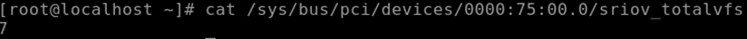

    - 如果该步骤执行成功，说明设备支持SR-IOV虚拟网卡直通方案。回显为7表示可以生成7个虚拟网卡，最多可以支撑7个虚拟机使用虚拟网卡。
    - 如果该步骤执行失败，或者回显的虚拟网卡数小于准备部署的虚拟机数量，则可以选择第二个方案网桥模式。网桥模式会带来额外的计算性能损耗以及时延。网桥模式配置详情请查看[6](#zh-cn_topic_0000002549705251_li9644845123820)~[7](#zh-cn_topic_0000002549705251_li55473504593)。

4. 生成VF虚拟网卡。

    ```bash
    echo 4 > /sys/bus/pci/devices/0000:75:00.0/sriov_numvfs
    ```

    > **说明：** 
    >
    >每次服务器重启都需要重新执行该步骤，建议将其配置在“~/.bashrc”等文件中，确保每次重启后都会自动执行。

5. <a name="配置宿主机网络5"></a>查看生成的VF节点。

    ```bash
    lshw -c network -businfo
    ```

    回显如下图所示，新生成了4个虚拟网卡，表示操作成功。

    

    > **说明：** 
    >
    >[1](#配置宿主机网络1)~[5](#配置宿主机网络5)已经完成了SR-IOV虚拟网卡方案中，虚拟网卡的生成。后续步骤可以跳过。
    >如果设备不支持SR-IOV，考虑使用下面的网桥方案。
    >如果[3](#配置宿主机网络3)中网卡最多支持的VF网卡数量回显小于4，比如说是2，那么考虑2个虚拟机使用SR-IOV方案，2个虚拟机使用网桥方案。

6. <a name="zh-cn_topic_0000002549705251_li9644845123820"></a>查看当前网卡配置文件并备份。

    ```bash
    cd /etc/sysconfig/network-scripts/
    cp ifcfg-eno5 ifcfg-eno5.bak
    ```

7. <a name="zh-cn_topic_0000002549705251_li55473504593"></a>新建网桥配置文件“ifcfg-br0”并修改网卡配置文件。

    将网卡配置文件的IPADDR，NETMASK，GATEWAY，DNS全部移植到网桥配置文件中。

    ```bash
    touch ifcfg-br0
    cat >ifcfg-br0 <<EOF
    TYPE=Bridge
    NAME=br0
    DEVICE=br0
    ONBOOT=yes
    BOOTPROTO=static
    IPADDR=XX.XX.XX.XX
    NETMASK=XX.XX.XX.XX
    GATEWAY=XX.XX.XX.XX
    DNS1=XX.XX.XX.XX
    EOF
    ```

    > **说明：** 
    >
    >1. 网桥配置文件中的IPADDR，NETMASK，GATEWAY，DNS根据宿主机网卡配置修改。
    >2. 宿主机网卡配置文件中删除IPADDR，NETMASK，GATEWAY，DNS配置并在最后新增配置“BRIDGE=br0”。
    > 

8. 重启libvirtd和NetworkManager服务并重启服务器。

    ```bash
    systemctl restart libvirtd
    systemctl restart NetworkManager
    reboot
    ```

9. 查看br0网桥是否成功创建。

    ```bash
    ip a
    ```

    出现如下配置说明网桥创建成功。

    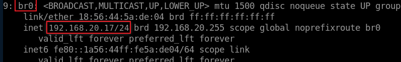

### 虚拟机配置<a name="ZH-CN_TOPIC_0000002518653642"></a>

#### 使用virt-manager创建虚拟机<a name="ZH-CN_TOPIC_0000002518493746"></a>

总共需要创建4个虚拟机，需要顺序操作执行4次该章节的操作步骤。

1. 下载openEuler提供的qcow镜像。

    ```bash
    wget https://mirrors.yacloud.net/openeuler/openEuler-24.03-LTS-SP1/virtual_machine_img/aarch64/openEuler-24.03-LTS-SP1-aarch64.qcow2.xz
    ```

    > **说明：** 
    >
    >使用openEuler官方提供的已经装好了系统的qcow2镜像可以简化操作，不用从头开始安装操作系统，但是该镜像内的“/boot”目录使用的是vfat文件系统，该文件系统不支持**ln**软链接，后续如果编译安装内核时**make install**时会出现“Operation not permitted”报错，如下图所示。
    >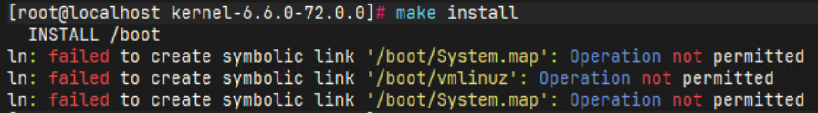
    >解决方案：
    >进入“/boot”目录， 手动将刚编译出来的System.map-6.6.0\*和vmlinuz-6.6.0\*各自拷贝一份命名为System.map和vmlinuz后，直接重启服务器即可，无需再次执行make install。

2. <a name="zh-cn_topic_0000002518345430_li1862819192232"></a>解压qcow压缩包。

    ```bash
    unxz -k openEuler-24.03-LTS-SP1-aarch64.qcow2.xz
    ```

3. 打开virt-manager，选择红框所示按钮打开虚拟机配置界面。

    ```bash
    virt-manager
    ```

    

4. 选择“Import existing disk image”后单击“Forward”。

    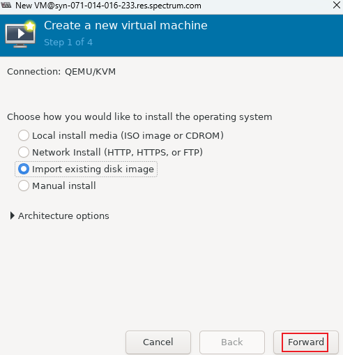

5. 单击“Browse”，再单击“Browse Local”选择[2](#zh-cn_topic_0000002518345430_li1862819192232)中解压缩的openEuler 24.03 LTS SP1镜像后，单击“open”，填写“Generic Linux 2022”，最后单击“Forward”。

    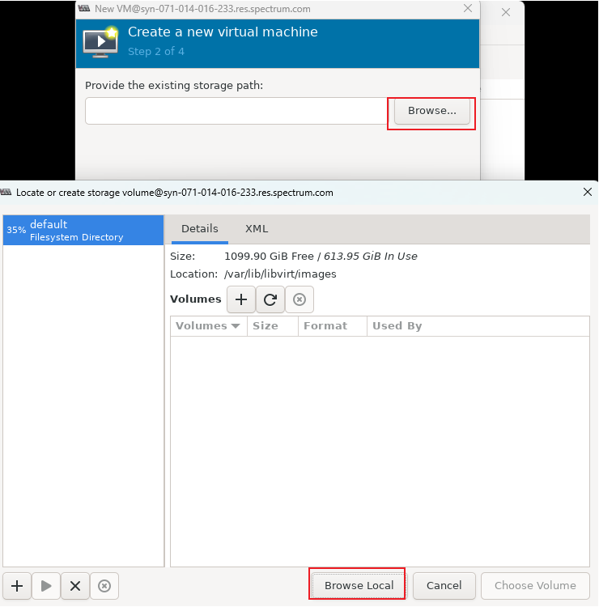

    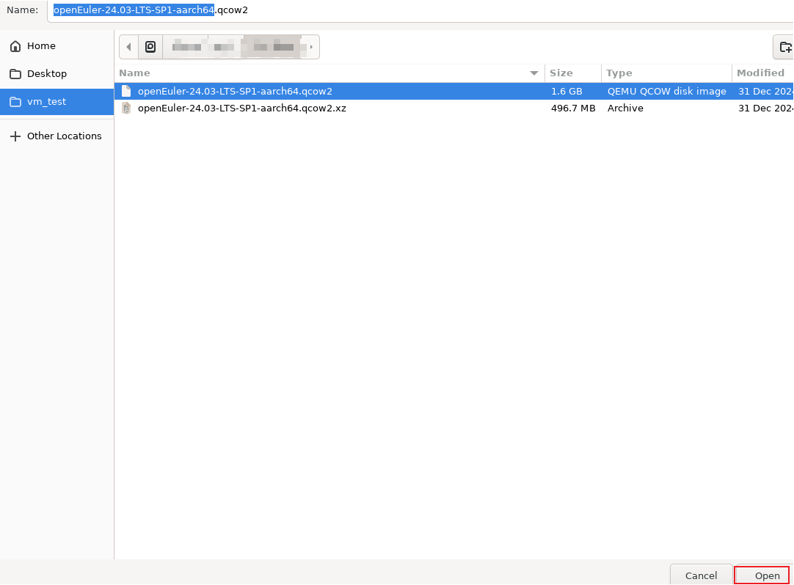

    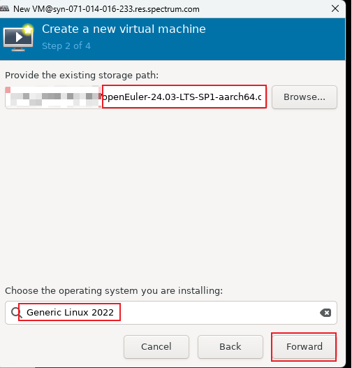

6. “Memory”分配额度填写“180000”，“CPUs”处填写“80”，然后单击“Forward”。

    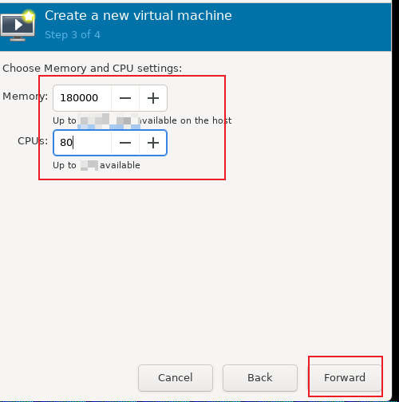

    > **说明：** 
    >
    >内存180000仅供参考，用户根据实际情况分配即可。

7. 名称分别起名为vm_X_（X = 0,1,2,3） ，如果[配置宿主机网络](#配置宿主机网络)中宿主机配置了网桥模式，此处Network selection应选择Bridge device...，然后填入网桥名称，最后单击“Finish”。

    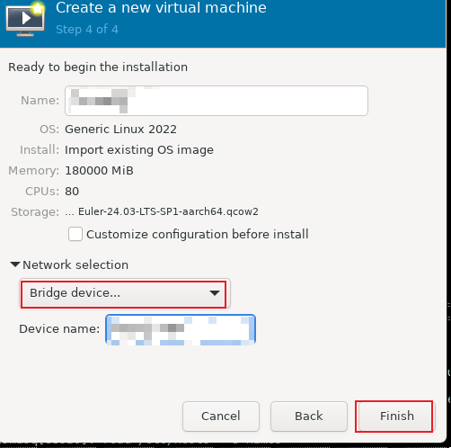

    > **说明：** 
    >
    >如果[配置宿主机网络](#配置宿主机网络)选择了SR-IOV虚拟网卡直通配置，则无需考虑Network selection，后续会将其删除。

8. 系统会自动启动，单击如下按钮，进入外设的配置界面。

    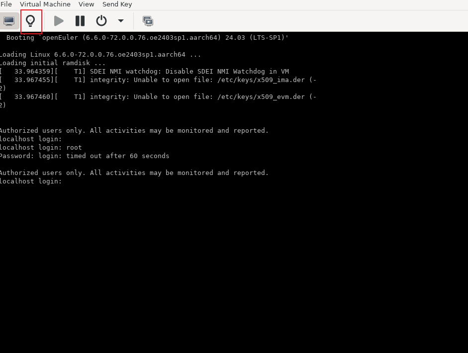

9. 进入界面后单击下方“Add Hardware”依次添加以下相关设备。

    

    1. 添加外设1：“Add Hardware \> Input \> USB Keyboard \> Finish”
    2. 添加外设2：“Add Hardware \> Input \> Virtio Tablet \> Finish”
    3. 添加GPU卡PCIe设备（每个虚拟机需要2张GPU卡，4个虚拟机 x 2张GPU卡 = 8个节点，因此总共需要添加8个GPU卡节点） :  “Add Hardware \> PCI Host Device  \> 选择对应节点 \> Finish”
    4. 如果[配置宿主机网络](#配置宿主机网络)中采用了SR-IOV方案，添加虚拟网卡到虚拟机：“Add Hardware \> PCI Host Device  \> 选择对应节点 \> Finish”。网卡节点请参见[配置宿主机网络](#配置宿主机网络5)回显信息。

        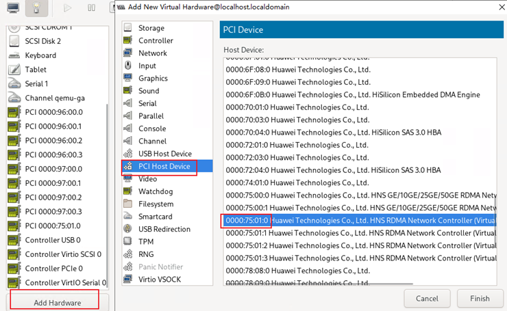

10. 制作数据盘。提供两种方案，根据实际情况选择其一即可。

    **方案一：**使用镜像文件作为数据盘，该方案操作相对简单但是磁盘IO性能一般，不适合磁盘IO密集场景。

    创建镜像文件作为数据盘。

    > **说明：** 
    >
    >此处的512GiB仅作为示例，请根据实际情况分配磁盘空间。

    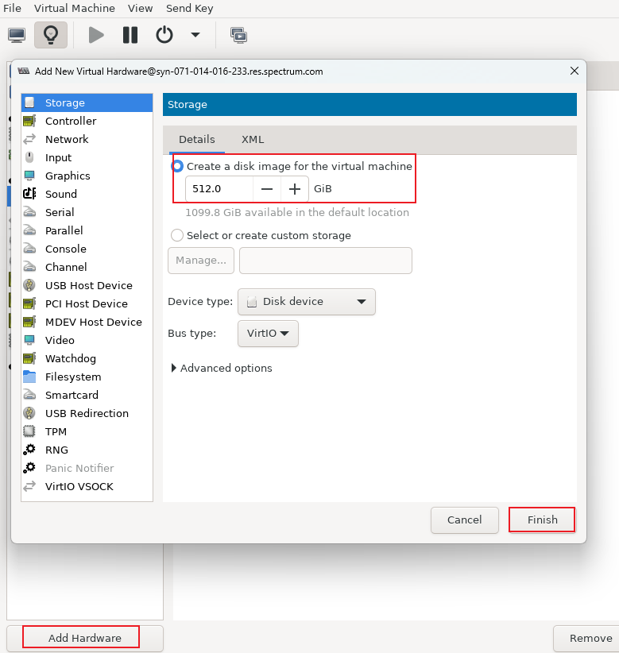

    **方案二：**挂载磁盘分区可以提升虚拟机磁盘的IO性能，推荐在磁盘IO密集场景比如说高密度云游戏场景使能该特性。

    1. 挂载磁盘分区进入虚拟机内部作为数据盘。

        ```bash
        lsblk
        ```

        选择一个分区作为虚拟机的数据盘，此处以nvme0n1p7为例。

        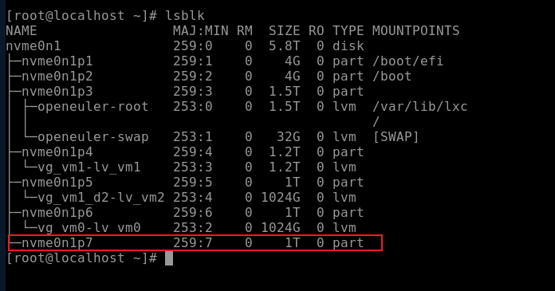

    2. 打开virt-manager，单击“Add Hardware \> Storage \> Manage”。将“Bus type”配置为“VirtIO”，“Cache mode”配置为“none”。

        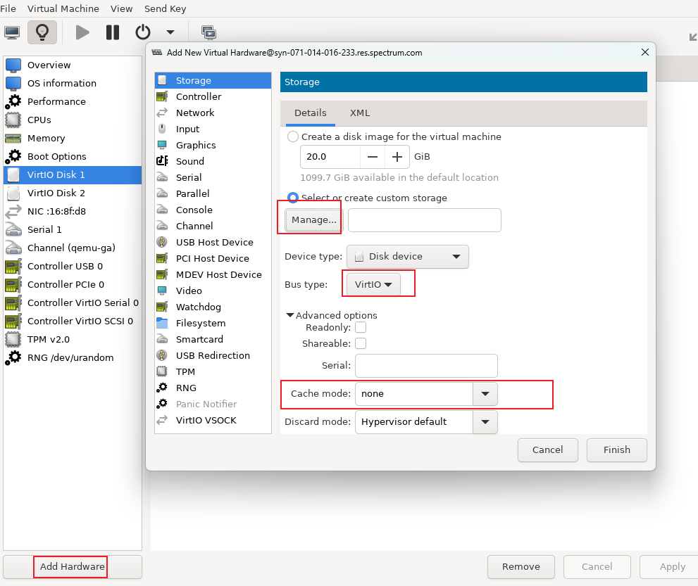

    3. 单击“Browse Local \> dev \> nvme0n1p7 \> open”。

        

    4. 单击“Finish”。

        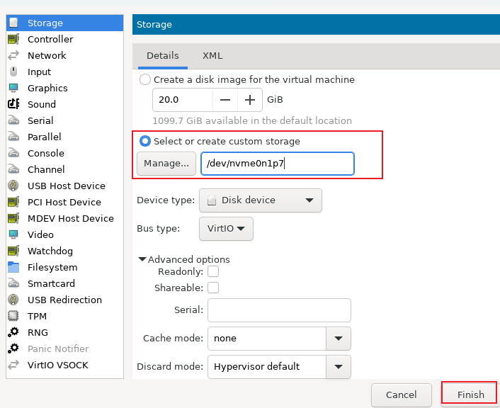

11. 如果采用了SR-IOV虚拟网卡直通方案，则需要删除多余的虚拟网络接口。

    

12. 配置完成后，重启虚拟机使其生效。

    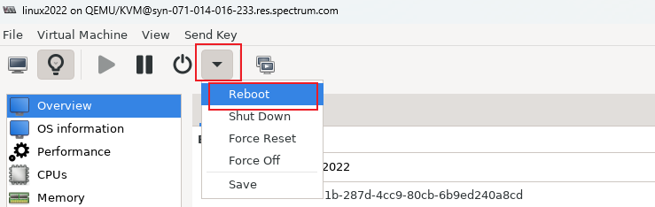

13. （可选）修改默认的root密码。

    > **说明：** 
    >
    >默认root账号的密码是**openEuler12\#$**，使用该密码登录后可以选择修改密码。

    ```bash
    passwd root
    ```

#### 配置虚拟机网络<a name="ZH-CN_TOPIC_0000002550093503"></a>

##### 配置虚拟机网卡配置文件<a name="ZH-CN_TOPIC_0000002518653644"></a>

通过配置虚拟机内部的网卡文件以启用网络。若采用SR-IOV方案，则需依照本章步骤手动生成该配置文件。

1. 查看虚拟机网卡名称。

    ```bash
    ip a
    ```

    

2. 生成配置文件。

    - 如果在[配置宿主机网络](#配置宿主机网络)章节中选择了SR-IOV网卡直通，则执行如下指令，生成网络配置文件。

        ```bash
        nmcli connection add ifname enp1s0 con-name enp1s0 type ethernet
        cd /etc/sysconfig/network-scripts/
        ls
        ```

        如下图所示虚拟机网卡配置文件生成。

        

    - 如果[配置宿主机网络](#配置宿主机网络)中采用的网桥模式，那么虚拟机中会自动生成网络配置文件，文件名和**ip a**中网卡名称一致，则跳过该步骤。

    > **说明：** 
    >
    >如果条件允许，建议使用SR-IOV虚拟网卡方案，采用该方案的虚拟机具有更强的计算性能以及更短的时延。

3. 进入虚拟机配置虚拟机的IPADDR，NETMASK，GATEWAY，DNS，确保ONBOOT=yes。

    虚拟机和宿主机共用NETMASK，GATEWAY，DNS。IPADDR可自定义，需要和网络管理员确认，请不要与局域网内其他的IP地址冲突。

    ```bash
    vi ifcfg-enp1s0
    ```

    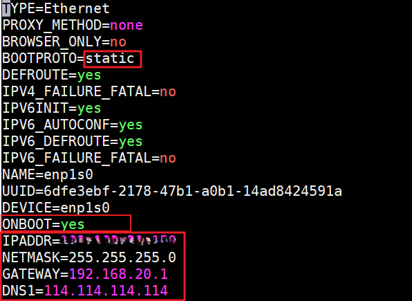

    如果配置文件中有下图红框内容，请将其删除。

    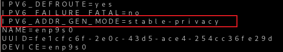

4. 重新配置网络连接，建议在virt-manager的Shell中执行，通过SSH远程操作会因为网络配置修改断连。

    ```bash
    virt-manager
    ```

    

    ```bash
    nmcli connection reload
    nmcli connection down enp1s0
    nmcli connection up enp1s0
    ```

    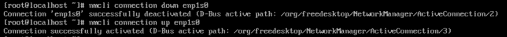

5. ping网关，SSH远程连接验证配置是否生效，网关的IP地址在br0网桥的配置文件中可以找到。

    ```bash
    ping 192.168.20.1
    ```

    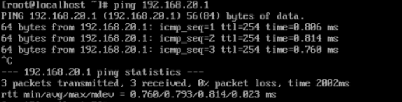

    同一网段内任意服务器**ssh**连接虚拟机。

    ```bash
    ssh IP地址
    ```

    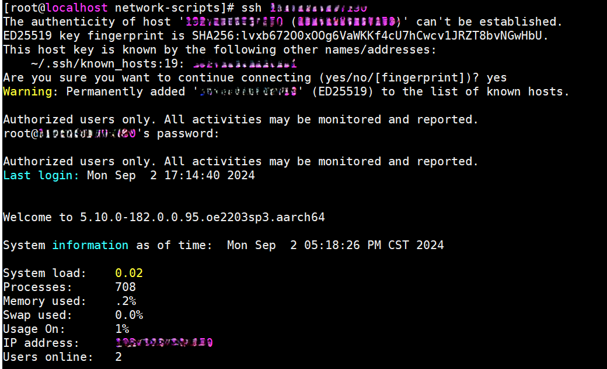

    > **说明：** 
    >
    >至此已经实现了虚拟机在服务器局域网内的数据通信，如果希望在外网访问局域网内的该虚拟机，请联系网络管理员按照局域网内服务器的相关配置对虚拟机进行配置即可。

### 视频流启动环境配置（虚拟机）<a name="ZH-CN_TOPIC_0000002550093505"></a>

在虚拟机环境中部署云手机与视频流容器后，需根据虚拟机内部的CPU及GPU核数，修改hardware_bind.cfg配置文件，以便正确设置视频流的启动与运行参数。

请参见《Kbox云手机容器 安装指南（Android 15）》的“[硬件环境](https://www.hikunpeng.com/document/detail/zh/kunpengcps/boostcph/kboxcpc_ad15/docs/zh/install_guide.md#d21-%E7%A1%AC%E4%BB%B6%E7%8E%AF%E5%A2%83)”以及《视频流引擎 安装指南（Android 15）》的“[软件部署](https://www.hikunpeng.com/document/detail/zh/kunpengcps/boostcph/videostreamengine_ad15/docs/zh/install_guide.md#d1-%E8%BD%AF%E4%BB%B6%E9%83%A8%E7%BD%B2)”章节在虚拟机内部署云手机容器环境和运行视频流云手机。

具体操作步骤如下所示：

1. 请参见《视频流引擎 安装指南（Android 15）》中的“[软件部署](https://www.hikunpeng.com/document/detail/zh/kunpengcps/boostcph/videostreamengine_ad15/docs/zh/install_guide.md)”章节解压缩出cfct_video和hardware_bind.cfg文件。
2. 修改hardware_bind.cfg脚本适配虚拟机80核CPU和虚拟机4 GPU节点。
    1. 打开hardware_bind.cfg脚本。

        ```bash
        vim hardware_bind.cfg
        ```

    2. 按“i”进入编辑模式，增加以下内容。

        ```bash
        VIDEO_CPU_MAP_80CORE_MODE0=(
        "${MODE0_CPUS0_320[0]}"
        "${MODE0_CPUS0_320[1]}"
        "${MODE0_CPUS0_320[2]}"
        "${MODE0_CPUS0_320[3]}"
        "${MODE0_CPUS0_320[4]}"
        "${MODE0_CPUS0_320[5]}"
        "${MODE0_CPUS0_320[6]}"
        "${MODE0_CPUS0_320[7]}"
        "${MODE0_CPUS0_320[8]}"
        "${MODE0_CPUS0_320[9]}"
        "${MODE0_CPUS0_320[10]}"
        "${MODE0_CPUS0_320[11]}"
        "${MODE0_CPUS0_320[12]}"
        "${MODE0_CPUS0_320[13]}"
        "${MODE0_CPUS0_320[14]}"
        "${MODE0_CPUS0_320[15]}"
        "${MODE0_CPUS0_320[16]}"
        "${MODE0_CPUS0_320[17]}"
        "${MODE0_CPUS0_320[18]}"
        "${MODE0_CPUS0_320[19]}"
        "${MODE0_CPUS0_320[20]}"
        "${MODE0_CPUS0_320[21]}"
        "${MODE0_CPUS0_320[22]}"
        "${MODE0_CPUS0_320[23]}"
        "${MODE0_CPUS0_320[24]}"
        "${MODE0_CPUS0_320[25]}"
        "${MODE0_CPUS0_320[26]}"
        "${MODE0_CPUS0_320[27]}"
        "${MODE0_CPUS0_320[28]}"
        "${MODE0_CPUS0_320[29]}"
        "${MODE0_CPUS0_320[30]}"
        "${MODE0_CPUS0_320[31]}"
        "${MODE0_CPUS0_320[32]}"
        "${MODE0_CPUS0_320[33]}"
        "${MODE0_CPUS0_320[34]}"
        "${MODE0_CPUS0_320[35]}"
        "${MODE0_CPUS0_320[36]}"
        "${MODE0_CPUS0_320[37]}"
        "${MODE0_CPUS0_320[38]}"
        )
        VIDEO_CPU_MAP_80CORE_MODE1=(
        "${MODE1_CPUS0_320}"
        )
        VIDEO_GPU_MAP_80CORE=(
        "${GPUS[0]}"
        "${GPUS[1]}"
        "${GPUS[2]}"
        "${GPUS[3]}"
        )
        ```

        

    3. 按“Esc”键退出编辑模式，输入**:wq!**并按“Enter”键保存退出文件。

        > **说明：** 
        >
        >上述的配置的CPU核心以及GPU节点仅供参考，请根据实际虚拟机的资源分配以及业务的需要，灵活地调整该配置。

3. 请参见《视频流引擎 特性指南》的“启动视频流云手机”章节调用cfct_video脚本即可成功在虚拟机启动视频流容器。

    
