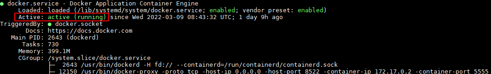
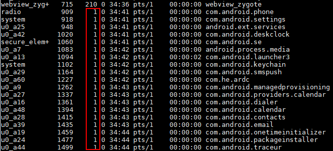
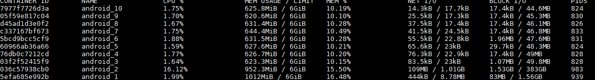
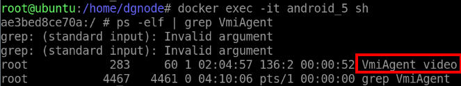
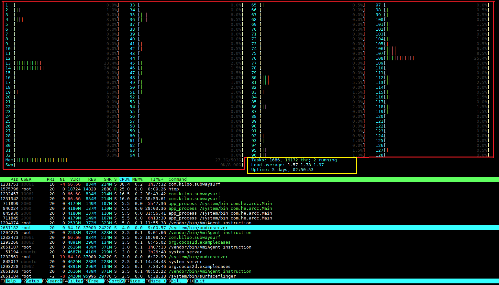
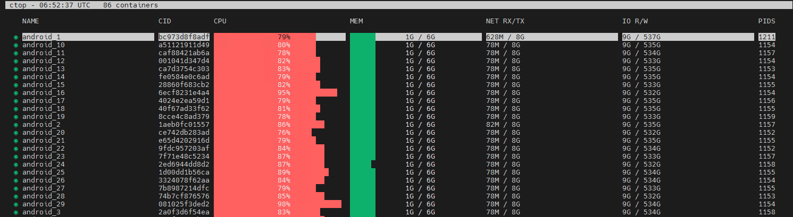

# 例行维护<a name="ZH-CN_TOPIC_0000002552733333"></a>

## 运维概述<a name="ZH-CN_TOPIC_0000002549705369"></a>

云手机是指虚拟出带有AOSP（Android Open Source Project）系统，具有虚拟手机功能的云服务器。作为一种新型应用，它对物理手机起到了有效的延伸和扩展作用，可以用在云手游、移动办公等诸多场景。

视频流云手机是一种基于Kbox容器和端云协同引擎的虚拟化方案。Kbox容器是指运行于ARM服务器上的Android系统Docker容器。端云协同引擎顾名思义可以分为端侧和云侧两个部分：云侧运行于云手机上；端侧一般为手机APK，可以被安装在用户的Android手机上，用于与云侧进行交互，进而对视频流云手机进行正常的操作。视频流云手机架构图如图所示。


视频流引擎包括服务端和客户端两个部分：服务端提供图像获取、图像数据编码等功能；客户端提供视频数据解码播放功能。在某些场景下还包含用户触控的获取和注入、音频数据的获取和播放等功能。

- 运维对象

    包括基础镜像环境、视频流相关部署环境等套件及其子部件。

- 运维功能

    提供运维对象的巡检、监控、日志管理、高危操作和日常维护等能力。

## 巡检<a name="ZH-CN_TOPIC_0000002549825359"></a>

### 简介<a name="ZH-CN_TOPIC_0000002549705345"></a>

巡检是人工进行的例行检查。通过巡检操作，可以实时掌握视频流云手机的运行状况及周围环境的变化，发现其中的隐患，及时采取有效措施，提高对突发事件的处理效率，保证其安全和系统稳定。本文档主要以Docker容器运行时为例进行相关巡检项目的演示。

### 巡检项目和周期<a name="ZH-CN_TOPIC_0000002518345530"></a>

根据例行维护巡检操作，输出如[**表1**视频流云手机例行维护巡检报告](#视频流云手机例行维护巡检报告)所示巡检报告。

首次视频流云手机部署完成后，建议立即进行一次巡检。

**表1**视频流云手机例行维护巡检报告<a id="视频流云手机例行维护巡检报告"></a>

|检查分类|检查项|建议巡检周期|检查结果|备注|
| :---: | :---: | :---: | :---: | :---: |
|服务器配置|硬件配置|视频流云手机部署前|||
|服务器配置|服务器相关指标是否正常（温度、CPU使用率、内存使用率等）|视频流云手机部署前|||
|软件配置|软件包校验|视频流云手机部署前|||
|检查告警|检查服务器相关告警|服务出现故障后|||
|检查运行环境|前置运行环境状态和Docker服务状态|视频流云手机运行前|||
|检查视频流云手机状态|容器状态|视频流云手机运行前或运行中|||
|检查视频流云手机状态|容器资源耗能|视频流云手机运行前或运行中|||

### 检查运行环境状态<a name="ZH-CN_TOPIC_0000002549705329"></a>

#### Docker 服务状态<a name="ZH-CN_TOPIC_0000002549705375"></a>

1. 使用视频流云手机运维用户（如root）账号通过SSH登录工具（如Xshell）登录到部署视频流云手机的服务器。
2. 执行以下命令，查看Docker服务状态。

    ```bash
    systemctl status docker
    ```

    

    当"Active"显示为"active"时，Docker服务状态正常，其他情况则为异常状态。

3. 如果服务状态异常，请执行以下命令查看Docker服务启动失败原因。

    ```bash
    dockerd --debug
    ```

    若无法解决，请重启Docker服务（请参见[4](#li65832418453)）或请提交ISSUE反馈。

4. <a name="li65832418453"></a>按照以下步骤重启Docker服务。重启后请重新进行服务状态查询是否为"active"状态。若重启失败或服务状态不为"active"状态，请请提交ISSUE反馈。

    ```bash
    systemctl daemon-reload
    systemctl restart docker
    ```

    > 说明
    >
    >- systemctl daemon-reload：启动Docker守护进程。
    >- systemctl restart docker：重启Docker服务。

### 检查视频流云手机状态<a name="ZH-CN_TOPIC_0000002549825337"></a>

#### 容器状态<a name="ZH-CN_TOPIC_0000002518185572"></a>

##### 启动时容器状态<a name="ZH-CN_TOPIC_0000002518185580"></a>

1. 使用视频流云手机运维用户（如root）账号通过SSH登录工具（如Xshell）登录到部署视频流云手机的服务器。
2. 执行以下命令，查询云手机容器实例编号。

    ```bash
    docker ps -a
    ```

3. 执行以下命令，进入视频流云手机容器中，其中“${android_id}”为启动实例的编号。

    ```bash
    docker exec -it android_${android_id} sh
    ```

4. 执行以下命令，查看sys.boot_completed的属性状态是否得到开机状态。

    ```bash
    getprop sys.boot_completed
    ```

    若回显信息中"sys.boot_completed"显示为"1"，则表示启动成功。

##### 运行时容器状态<a name="ZH-CN_TOPIC_0000002549825353"></a>

在视频流云手机容器运行过程中，可以通过检查其进程状态判断容器是否正常。

1. 使用视频流云手机运维用户（如root）账号通过SSH登录工具（如Xshell）登录到部署视频流云手机的服务器。
2. 执行以下命令，查询云手机容器实例编号。

    ```bash
    docker ps -a
    ```

3. 执行以下命令，进入视频流云手机容器中，其中“${android_id}”为自定义的启动实例的编号，一般为从1开始的数字。

    ```bash
    docker exec -it android_${android_id} sh
    ```

4. 执行以下命令查看进程状态，分为两种情况：
    - 若出现大量进程的父进程变为进程sh（进程号为1），如下图所示，则说明容器已经crash，容器已经处于异常状态，请请提交ISSUE反馈。

        ```bash
        ps -elf
        ```

        

    - 查看VmiAgent进程是否存在，若不存在，证明VmiAgent已经被结束，视频流云手机则不能正常使用，请请提交ISSUE反馈。

#### 容器资源耗能<a name="ZH-CN_TOPIC_0000002549825327"></a>

在视频流云手机容器运行的过程中，若需要及时掌握容器使用的系统资源。执行以下命令动态查看视频流云手机的资源消耗情况。

```bash
docker stats
```



> 说明
>
> 默认情况下，**stats**命令会每隔1s刷新一次输出的内容，"Ctrl+C"可以终止刷新。
> 回显参数说明：
>
> - CONTAINER ID：显示容器ID。
> - NAME：容器名称。
> - CPU %：CPU的使用状况。
> - MEM USAGE/LIMIT：当前使用内存和最大可使用内存。
> - MEM %：以百分比的形式显示内存使用情况。
> - NET I/O：网络IO数据。
> - BLOCK I/O：磁盘IO数据。
> - PIDS：PID号。

#### 引擎服务状态<a name="ZH-CN_TOPIC_0000002518345526"></a>

在视频流云手机容器运行过程中，可以通过检查其进程状态判断容器是否正常。

1. 使用视频流云手机运维用户（如root）账号通过SSH登录工具（如Xshell）登录到部署视频流云手机的服务器。
2. 执行以下命令，进入视频流云手机容器中，其中“${android_id}”为启动实例的编号。

    ```bash
    docker exec -it android_${android_id} sh
    ```

3. 执行以下命令查看进程状态，分为以下两种情况：
    - 查看VmiAgent进程。若VmiAgent进程不存在，证明VmiAgent已经被结束，视频流云手机将不能正常使用，请请提交ISSUE反馈。

        ```bash
        ps -elf |grep VmiAgent
        ```

        

    - 查看VmiAgent进程。若VmiAgent进程存在，如上图所示红框，查看其对应的PID（对应上图中的283），执行以下命令可以查看进程状态、CPU使用率和内存使用率等，其中"{pid}"为VmiAgent进程编号，如下图所示。

        ```bash
        top -p ${pid}
        ```

        

## 监控<a name="ZH-CN_TOPIC_0000002549825319"></a>

### 简介<a name="ZH-CN_TOPIC_0000002549825345"></a>

监控是针对视频流云手机资源和应用的监控，通过应用监控您可以及时了解资源使用情况、趋势和告警，使用这些信息，您可以快速响应，保证云手机流畅运行。

### 主机 CPU 和内存使用率状态<a name="ZH-CN_TOPIC_0000002518345494"></a>

1. 使用视频流云手机运维用户（如root）账号通过SSH登录工具（如Xshell）登录到部署视频流云手机的服务器。
2. 执行以下命令，切换至root用户。

    ```bash
    su - root
    ```

3. 执行以下命令，分别查询主机容器中进程的CPU及内存使用率等情况。如下图所示。

    ```bash
    top
    ```

    

    若视频流云手机某些进程内存使用率高于85%，CPU使用率持续高于90%，则需要进一步排查该进程是否异常或请请提交ISSUE反馈。

    > 说明
    >
    >回显参数说明：
    >- PID：进程号。
    >- USER：进程创建者。
    >- PR：进程优先级。
    >- NI：nice 值。越小优先级越高，最小-20，最大20（用户最大可设置19）。
    >- VIRT：进程使用的虚拟内存总量，单位（KB）。
    >- RES：进程使用的、未被换出的物理内存大小，单位（KB）。
    >- SHR：共享内存大小，单位（KB）。
    >- S：进程状态。D（不可中断的睡眠状态）、R（运行状态）、S（睡眠状态）、T（跟踪/停止状态）、Z（僵尸状态）。
    >- %CPU：进程占用CPU百分比。
    >- %MEM：进程占用内存百分比。
    >- TIME+：进程运行时间。
    >- COMMAND：进程名称。
    >- CPU使用率建议查询多次记录结果，单次执行结果不具备参考意义。

    若希望更直观地允许用户监视系统上运行的进程及其完整的命令，可以安装并使用htop工具，安装完成后执行以下命令即可。

    ```bash
    htop
    ```

    

    若内存使用率高于85%，CPU使用率持续高于90%，请请提交ISSUE反馈。

    > 说明
    >
    >**htop**命令回显结果说明：
    >左边部分（图中红框）从上至下，分别为CPU、内存、交换分区的使用情况。
    >右边部分（图中黄框）为：Tasks为进程总数，当前运行的进程数、Load average为系统1分钟，5分钟，15分钟的平均负载情况、Uptime为系统运行的时间。
    >其他参数与top命令类似，此处不再赘述。

### 容器 CPU 和内存占用率状态<a name="ZH-CN_TOPIC_0000002518185588"></a>

1. 使用视频流云手机运维用户（如root）账号通过SSH登录工具（如Xshell）登录到部署视频流云手机的服务器。
2. 执行以下命令，切换至root用户。

    ```bash
    su - root
    ```

3. 执行以下命令，进入Docker容器中查看相关CPU和内存占用率状态，其中“${android_id}”为启动实例的编号。

    ```bash
    docker exec -it android_${android_id} sh
    ```

4. 执行以下命令，分别查询Docker容器中进程的CPU及内存占用率等情况。如下图所示。

    ```bash
    top
    ```

    

    若视频流云手机某些进程内存占用率高于85%，CPU占用率持续高于90%，则需要进一步排查该进程是否异常或请请提交ISSUE反馈。

    > 说明
    >
    >参数与主机CPU和内存占用率状态参数一致，此处不再赘述。

    若希望更直观地显示CPU负载、内存消耗的实时信息，则可以通过以下命令操作。

    ```bash
    ctop
    ```

    

    > 说明
    >
    >**ctop**是Docker管理的资源监控工具，若未安装ctop，请先下载[ctop-0.7.5-linux-arm64](https://github.com/bcicen/ctop/releases/download/v0.7.5/ctop-0.7.5-linux-arm64)，将下载后的二进制重命名为ctop，并拷贝到"/usr/bin"目录下即可完成安装。
    >**ctop**命令回显参数说明：
    >- NAME：容器名称。
    >- CID：容器ID。
    >- CPU：容器CPU使用率。
    >- MEM：容器内存使用率。
    >- NET RX/TX：容器网络收发数据量。
    >- IO：容器磁盘IO读写数据量。
    >- PIDS：容器所在进程号。

### 系统内存<a name="ZH-CN_TOPIC_0000002518345486"></a>

1. 使用视频流云手机运维用户（如root）账号通过SSH登录工具（如Xshell）登录到部署视频流云手机的服务器。
2. 执行以下命令，切换至root用户。

    ```bash
    su - root
    ```

3. 执行以下命令，查看视频流云手机服务器上的磁盘空间使用率。

    ```bash
    free
    ```

    使用**free**命令可查询到系统内存使用情况，包括实体内存、虚拟的交换文件内存、共享内存区域以及系统核心使用的缓冲区等。对于视频流云手机也可以通过此命令查询，此处不再赘述。

### 监控磁盘使用率状态<a name="ZH-CN_TOPIC_0000002518185538"></a>

1. 使用视频流云手机运维用户（如root）账号通过SSH登录工具（如Xshell）登录到部署视频流云手机的服务器。
2. 执行以下命令，切换至root用户。

    ```bash
    su - root
    ```

3. 执行以下命令，查看视频流云手机服务器上的磁盘空间使用率。

    ```bash
    df -h
    ```

    

    上图中视频流云手机容器数据存储在"/home/mount/data/"下，红色矩形圈出来的是容器android_1的数据存储信息，其存储大小为“16G”，当前使用率为“4%”。若“Use%”的值均不大于85%，则磁盘空间使用率正常。否则，需要处理磁盘空间。

### 监控负载<a name="ZH-CN_TOPIC_0000002518345502"></a>

负载是对当前CPU工作量的度量，被定义为特定时间间隔内运行队列中的平均线程数。负载过高则会导致服务器无法处理其他请求及操作，甚至导致死机。

1. 使用视频流云手机运维用户（如root）账号通过SSH登录工具（如Xshell）登录到部署视频流云手机的服务器。
2. 执行以下命令，切换至root用户。

    ```bash
    su - root
    ```

3. 执行以下命令查询系统负载。

    ```bash
    uptime
    ```

    回显如下

    ```bash
    19:49:12 up 25 days,  5:04,  9 users,  load average: 8.17, 8.16, 8.07
    ```

    > 说明
    >
    >回显结果说明：
    >- 19:49:12表示当前时间。
    >- up 25 days,  5:04表示系统已运行的时间。
    >- 9 users表示当前在线用户。
    >- load average: 8.17, 8.16, 8.07表示平均负载，最近1分钟、5分钟、15分钟系统的负载。

    - 若每个CPU内核当前活动进程不大于其0.7倍，即表示系统负载的安全线。
    - 若每个CPU内核小于其3倍，即表示系统负载不是很严重。
    - 若每个CPU内核达到其5倍，即表示当前系统负载非常严重，此时打开执行的脚本应该会非常缓慢。

    一般情况下，1分钟系统负荷表示最近的暂时现象。15分钟系统负荷表示是持续现象，并非暂时问题。如果load15较高，而load1较低，可以认为情况有所好转。反之，情况可能在恶化。

    负载过高可能由硬件或软件问题引起。若为硬件问题，通常是由于机器性能不足；若为软件问题，则可能是由于某些线程被长时间占用、内存持续大量占用等原因导致。如无法自行解决，请提交ISSUE反馈进一步协助。

## 日志管理<a name="ZH-CN_TOPIC_0000002549825375"></a>

### 简介<a name="ZH-CN_TOPIC_0000002549705353"></a>

日志管理提供强大的日志管理能力，包括日志检索、日志转储等功能。通过日志管理能够记录用户操作的审计日志，快速定位问题的根源、跟踪程序执行的过程，还能用于数据统计和性能分析等。

### 基础云手机维护工具<a name="ZH-CN_TOPIC_0000002518345458"></a>

Kbox云手机容器提供了Kbox_maintainer（维护工具）。该工具包含日志收集、资源检查、故障恢复等功能，提升云手机原型的可测试性、可服务性、可维护性。该工具的获取和使用方法请参见《[Kbox云手机容器 例行维护](https://www.hikunpeng.com/document/detail/zh/kunpengcps/boostcph/kboxcpc/docs/zh/routine_maintenance.md#d44-%E7%BB%B4%E6%8A%A4%E5%B7%A5%E5%85%B7)》的"维护工具"章节。

### 视频流云手机查询日志操作<a name="ZH-CN_TOPIC_0000002518185612"></a>

#### Android 侧查询日志操作<a name="ZH-CN_TOPIC_0000002549825389"></a>

##### ANR 时应用堆栈信息<a name="ZH-CN_TOPIC_0000002549825383"></a>

在视频流云手机容器内若出现了应用程序未响应（ANR，Application Not responding）时，需要搜集相关应用堆栈信息，该信息保存在容器的"/data/anr/"路径下。

#### 服务器侧查询日志操作<a name="ZH-CN_TOPIC_0000002549705307"></a>

##### 系统日志信息<a name="ZH-CN_TOPIC_0000002549705337"></a>

1. 使用视频流云手机运维用户（如root）账号通过SSH登录工具（如Xshell）登录到部署视频流云手机的服务器。
2. 执行以下命令，切换至root用户。

    ```bash
    su - root
    ```

3. 进入服务器的“/var/log”目录，可以查看syslog和其他kernel日志。

    > 说明
    >
    >syslog文件记录警告信息，常常是系统出问题的信息。
    >其他kernel文件主要包括核心启动日志（dmesg）、系统报错日志（messages）、登录记录（wtmp）和引导日志（boot.log）等。

##### 运行环境日志信息<a name="ZH-CN_TOPIC_0000002518185558"></a>

1. 使用视频流云手机运维用户（如root）账号通过SSH登录工具（如Xshell）登录部署视频流云手机服务器上。
2. 执行以下命令，切换至root用户。

    ```bash
    su - root
    ```

3. 视频流云手机容器出现异常时，可搜集dmesg日志。dmesg日志可以直接通过如下命令获取。

    dmesg日志中包含设备初始化日志、内核模块日志，还会记录应用崩溃的相关信息，对于后续根因分析和定位有很大帮助。

    ```bash
    dmesg -T
    ```

#### Docker 容器查询日志操作<a name="ZH-CN_TOPIC_0000002549705383"></a>

##### 容器元数据信息<a name="ZH-CN_TOPIC_0000002518185618"></a>

1. 使用视频流云手机运维用户（如root）账号通过SSH登录工具（如Xshell）登录到部署视频流云手机的服务器。
2. 执行以下命令，切换至root用户。

    ```bash
    su - root
    ```

3. 执行以下命令查询对应的容器编号。

    ```bash
    docker ps -a
    ```

4. 可使用Docker提供的inspect命令查看容器的详细信息，如下命令，其中“${android_id}”为启动实例的编号。

    ```bash
    docker inspect android_${android_id}
    ```

    上述命令会以JSON数组的格式返回容器的所有元数据信息。多数情况下，只需要获取容器的特定数据信息，则可直接从JSON数据中截取需要的数据，如只获取容器的IP地址可使用如下命令。

    ```bash
    docker inspect --format='{{range .NetworkSettings.Networks}}{{.IPAddress}}{{end}}' android_${index}
    ```

    例如：

    ```bash
    docker inspect --format='{{range .NetworkSettings.Networks}}{{.IPAddress}}{{end}}' android_11
    ```

    回显如下：

    ```bash
    172.17.0.4
    ```

##### 容器内 logcat 日志信息<a name="ZH-CN_TOPIC_0000002518185602"></a>

1. 使用视频流云手机运维用户（如root）账号通过SSH登录工具（如Xshell）登录到部署视频流云手机的服务器。
2. 执行以下命令，切换至root用户。

    ```bash
    su - root
    ```

3. 执行以下命令查询对应的容器编号。

    ```bash
    docker ps -a
    ```

4. 执行以下命令可以查询到实时的服务端日志信息。其中“${android_id}”为对应的容器编号，"VMI"为视频流云手机的日志tag前缀。

    ```bash
    docker exec -it android_${android_id} logcat |grep -i VMI
    ```

##### 容器内进程信息<a name="ZH-CN_TOPIC_0000002518185548"></a>

1. 使用视频流云手机运维用户（如root）账号通过SSH登录工具（如Xshell）登录到部署视频流云手机的服务器。
2. 执行以下命令，切换至root用户。

    ```bash
    su - root
    ```

3. 执行以下命令查询对应的容器编号。

    ```bash
    docker ps -a
    ```

4. 执行以下命令可以查询到当前正在运行的进程信息，其中“${android_id}”为对应的容器编号。

    ```bash
    docker exec -it android_${android_id} ps -elf
    ```

##### 容器内 top 信息<a name="ZH-CN_TOPIC_0000002549825379"></a>

1. 使用视频流云手机运维用户（如root）账号通过SSH登录工具（如Xshell）登录到部署视频流云手机的服务器。
2. 执行以下命令，切换至root用户。

    ```bash
    su - root
    ```

3. 执行以下命令，查询对应的容器编号。

    ```bash
    docker ps -a
    ```

4. 执行以下命令，可以实时查询到容器中各个进程的资源占用情况，其中“${android_id}”为对应的容器编号。

    ```bash
    docker exec -it android_${android_id} top
    ```

##### 容器属性信息<a name="ZH-CN_TOPIC_0000002549705359"></a>

1. 使用视频流云手机运维用户（如root）账号通过SSH登录工具（如Xshell）登录到部署视频流云手机的服务器。
2. 执行以下命令，切换至root用户。

    ```bash
    su - root
    ```

3. 执行以下命令，查询对应的容器编号。

    ```bash
    docker ps -a
    ```

4. 执行以下命令，可以查询到容器中系统属性信息，其中“${android_id}”为对应的容器编号。

    ```bash
    docker exec -it android_${android_id} getprop
    ```

##### 容器 dumpsys 信息<a name="ZH-CN_TOPIC_0000002518185566"></a>

1. 使用视频流云手机运维用户（如root）账号通过SSH登录工具（如Xshell）登录到部署视频流云手机的服务器。
2. 执行以下命令，切换至root用户。

    ```bash
    su - root
    ```

3. 执行以下命令，查询对应的容器编号。

    ```bash
    docker ps -a
    ```

4. 执行以下命令，获取容器的所有系统服务诊断输出，其中“${android_id}”为启动实例的编号。

    dumpsys是在Android设备上运行的工具，可提供有关系统服务的信息。

    ```bash
    docker exec -it android_${android_id} dumpsys
    ```

    上述命令执行后，输出的数据信息会比较多，一般情况下需要在命令中指定需要检查的服务。

    - 获取dumpsys支持的系统服务完整列表可执行以下命令。

        ```bash
        docker exec -it android_${android_id} dumpsys -l
        ```

    - 获取容器内存信息可执行以下命令。

        ```bash
        docker exec -it android_${android_id} dumpsys meminfo
        ```

        结果如下图所示。

        

### 视频流云手机导出日志操作<a name="ZH-CN_TOPIC_0000002518345508"></a>

导出日志功能主要是方便用户在本地的IDE上查看，并快速的定位问题，避免实时的日志打印影响定位。

1. 使用视频流云手机运维用户（如root）账号通过SSH登录工具（如Xshell）登录到部署视频流云手机的服务器。
2. 执行以下命令，切换至root用户。

    ```bash
    su - root
    ```

3. 执行以下命令，查询对应的容器编号。

    ```bash
    docker ps -a
    ```

4. 执行以下命令，可以查询到实时的服务端日志信息，其中”{android_id}“为对应的容器编号。

    ```bash
    docker exec -it android_${android_id} logcat -d >> /home/file.log
    ```

5. 将日志从服务器中对应的目录下复制到本地，方便用户查看。

    > 说明
    >
    >"/home/file.log"是日志输出的路径。

### 日志溢出转储<a name="ZH-CN_TOPIC_0000002549825309"></a>

日志溢出转储功能的具体实现取决于ISV，视频流引擎不涉及日志溢出转储的设计。

### 日志审计<a name="ZH-CN_TOPIC_0000002518345444"></a>

请参见《[开发指南](development_guide.md)》文档中用户对视频流对外接口、对外依赖接口等设置的参数进行记录，做到定期记录，可追溯。

## 高危操作<a name="ZH-CN_TOPIC_0000002549705379"></a>

### 禁用操作一览表<a name="ZH-CN_TOPIC_0000002518345522"></a>

禁用操作暂无，如有疑问，请请提交ISSUE反馈。

### 高危操作一览表<a name="ZH-CN_TOPIC_0000002549825369"></a>

风险操作等级划分如下：

- Minor：操作本身不会修改特性配置，但可能导致用户自定义的关键数据丢失。
- Major：操作可能导致被管资源脱管或节点上承载的部分业务中断。
- Critical：操作可能导致全网大量业务中断。

服务器的硬件高危操作请参见[**表1**硬件类高危操作](#硬件类高危操作)，软件类高危操作请参见[**表2**软件类高危操作](#软件类高危操作)。

**表1**硬件类高危操作<a id="硬件类高危操作"></a>

|序号|高危操作描述|影响|风险等级|产品环境操作要求|测试环境操作要求|
| :---: | :---: | :---: | :---: | :---: | :---: |
|1|更换服务器部件|更换服务器部件需要严格按照操作指导执行，否则有可能导致功能异常甚至损坏硬件。|Critical|必须在客户同意的维测时段操作。必须由维护人员执行。必须得到客户的同意后才可操作。|必须由维护人员执行或得到客户同意。|
|2|在CPLD升级过程中异常掉电|升级CPLD过程中AC掉电可能导致CPLD文件损坏，影响功能，需要重新升级恢复。|Critical|必须在客户同意的维测时段操作。必须由维护人员执行。必须得到客户的同意后才可操作。|必须由维护人员执行或得到客户同意。|
|3|在BIOS升级过程中异常掉电|升级BIOS过程中AC掉电可能导致BIOS损坏，影响功能，需要重新升级恢复。|Critical|必须在客户同意的维测时段操作。必须由维护人员执行。必须得到客户的同意后才可操作。|必须由维护人员执行或得到客户同意。|
|4|在iBMC升级过程中异常掉电|升级iBMC过程中AC掉电可能导致iBMC硬件损坏，影响服务器管理页面无法登录，需要重新更换iBMC硬件。|Critical|必须在客户同意的维测时段操作。必须由维护人员执行。必须得到客户的同意后才可操作。|必须由维护人员执行或得到客户同意。|
|5|服务器上下柜操作|服务器上下柜操作必须严格遵守服务与维护指南，否则有可能损坏硬件，甚至导致操作人员受伤。|Critical|必须在客户同意的维测时段操作。必须由维护人员执行。必须得到客户的同意后才可操作。|必须由维护人员执行或得到客户同意。|

**表2**软件类高危操作<a id="软件类高危操作"></a>

|序号|高危操作描述|操作入口|影响|风险等级|规避措施|产品环境操作要求|测试环境操作要求|
| :---: | :---: | :---: | :---: | :---: | :---: | :---: | :---: |
|1|在系统正常运行时主机上执行**service network restart**命令重启主机的网络进程。|登录主机系统，执行**service network restart**。|可能导致主机故障、业务发放失败、虚拟机启动失败。|Critical|无|必须在客户同意的维测时段操作。必须由维护人员执行。必须得到客户的同意后才可操作。|必须由维护人员执行或得到客户同意。|
|2|在主机执行**ping -I**命令（指定网卡的**ping**命令）。|登录主机系统，执行**ping -I**命令。|通过指定网卡执行ping任务，可能导致主机网络中断。建议改为使用**ping**命令检查网络。|Critical|无|必须在客户同意的维测时段操作。必须由维护人员执行。必须得到客户的同意后才可操作。|必须由维护人员执行或得到客户同意。|
|3|直接手动删除或者修改message日志文件。|登录主机系统，执行**rm**命令删除/var/log下message日志。|导致日志无法打印。|Critical|无|必须在客户同意的维测时段操作。必须由维护人员执行。必须得到客户的同意后才可操作。|必须由维护人员执行或得到客户同意。|
|4|清除BIOS Flash上的用户自定义信息。|登录BMC命令行界面，执行**ipmcset -d clearcmos**。|信息删除后无法恢复。|Critical|无|必须在客户同意的维测时段操作。必须由维护人员执行。必须得到客户的同意后才可操作。|必须由维护人员执行或得到客户同意。|
|5|恢复iBMC出厂设置。|登录BMC命令行界面，执行**ipmcset -d restore**。|恢复出厂后用户数据无法恢复。|Critical|无|必须在客户同意的维测时段操作。必须由维护人员执行。必须得到客户的同意后才可操作。|必须由维护人员执行或得到客户同意。|
|6|修改服务器IP地址。|登录主机系统，执行**ifconfig**命令修改网卡IP地址。|该操作可能会影响主机的业务进程，影响当前业务操作。|Critical|无|必须在客户同意的维测时段操作。必须由维护人员执行。必须得到客户的同意后才可操作。|必须由维护人员执行或得到客户同意。|
|7|执行**rm -rf**命令删除文件。|登录主机系统，删除主机中的文件或商用发布包所需要的文件|该操作可能会影响主机的业务进程和影响视频流云手机业务。|Critical|无|必须在客户同意的维测时段操作。必须由维护人员执行。必须得到客户的同意后才可操作。|必须由维护人员执行或得到客户同意。|

## 日常运维<a name="ZH-CN_TOPIC_0000002549705389"></a>

### 简介<a name="ZH-CN_TOPIC_0000002518185596"></a>

根据项目日常操作，需要定期进行日常维护，输出如[**表1**视频流云手机日常运维报告](#视频流云手机日常运维报告)所示运维报告。

首次视频流云手机部署完成后，建议立即进行一次巡检。

**表1**视频流云手机日常运维报告<a id="视频流云手机日常运维报告"></a>

|序号|运维项|建议运维周期|检查结果|备注|
| :---: | :---: | :---: | :---: | :---: |
|1|查看服务器状态|1天|||
|2|查看容器状态|1周|||

### 服务器状态<a name="ZH-CN_TOPIC_0000002518345468"></a>

使用服务器查看工具，通过以下命令连接服务器IP地址。

```bash
ssh root@xxx.xxx.xxx.xxx
```

如下图所示，证明已经连接上服务器，否则请检查相关配置，如网络是否正常，IP地址是否正确等。


### 容器状态<a name="ZH-CN_TOPIC_0000002518185608"></a>

1. 使用视频流云手机运维用户（如root）账号通过SSH登录工具（如Xshell）登录部署视频流云手机服务器上。
2. 执行以下命令，切换至root用户。

    ```bash
    su - root
    ```

3. 执行以下命令查询对应的容器编号，如下图所示展示的Docker容器运行状态。

    ```bash
    docker ps -a
    ```

    

    通过上图可以发现所有容器都为Up状态，若为其他状态，请视实际情况将其删除，避免占用资源。

## 参考信息<a name="ZH-CN_TOPIC_0000002518345476"></a>

无

## 修订记录

|文档版本| 发布日期   | 修改说明         |
|----------| ---------- | ---------------- |
|01| 2026-09-30 | 第一次正式发布。 |
