# 用户指南<a name="ZH-CN_TOPIC_0000002552853353"></a>

## 1 操作视频流云手机实例<a name="ZH-CN_TOPIC_0000002549744217"></a>

### 1.1 启动视频流云手机实例<a name="ZH-CN_TOPIC_0000002549744219" id="启动视频流云手机实例"></a>

可根据需求配置cfct_config文件中的参数启动不同分辨率和帧率的视频流云手机实例，配置default.prop文件中的初始视频编码参数。当使用WebRTC进行数据传输时，需要根据需求配置default.prop中的抓图分辨率；当后续使用APK访问视频流云手机时，可以在APK视图中修改抓图分辨率。

1. （可选）若需要启动不同帧率的视频流云手机实例，则需要修改cfct_config配置文件中的帧率属性值。默认帧率为30fps，720p和1080p分辨率下也可支持60fps。

    ```shell
    BUILD_FPS=30
    ```

2. （可选）若需要启动使能C2解码器的视频流云手机实例（配置方案一可用），则需要修改cfct_config配置文件中的ENABLE_AMD_C2_DECODE=1。其他值不使能，默认为0。必须在容器第一次启动时配置开/关C2解码器，不支持中途切换。云手机内置应用会根据自身需要自行选择解码器。

    ```shell
    ENABLE_AMD_C2_DECODE=0
    ```

3. 若需要启动不同初始编码参数、抓图分辨率、音频视频输出格式和使用WebRTC方式访问的视频流云手机实例，则需要进行以下配置。
    1. 从DemoVideoEngine.tar.gz中解压获取“vendor”文件夹，并将其中的“default.prop”文件拷贝到当前目录。

        ```shell
        cd /home/kbox_video/
        tar -xvf DemoVideoEngine.tar.gz vendor
        cp vendor/default.prop .
        ```

    2. 配置初始化编码参数。通过修改default.prop中对应属性值来初始化编码参数，属性描述请参见[启动脚本配置项](#启动脚本配置项)章节的视频流引擎属性配置字段描述表，参考vmi.video.encode开头的属性。
    3. 配置抓图分辨率。

        通过修改default.prop中对应属性值来修改抓图分辨率，属性描述请参见[启动脚本配置项](#启动脚本配置项)章节的视频流引擎属性配置字段描述表，参考vmi.video.frame开头的属性。如果要改变分辨率，建议同步在cfct_config文件中修改屏幕像素密度以达到最佳显示效果，推荐的配置说明如下[**表 1** 不同分辨率配置说明](#不同分辨率配置说明)所示。

        **表 1** 不同分辨率配置说明<a id="不同分辨率配置说明"></a>

        |屏幕宽度（BUILD_WIDTH）|屏幕密度（BUILD_DENSITY）|
        |--|--|
        |360|120|
        |480|160|
        |720|320|
        |1080|480|
        |1440|640|
        |2160|960|

        > **说明：** 
        >改变视频输出分辨率（与上次启动时配置不同）时，会改变AOSP系统和应用的渲染分辨率，可能会导致部分应用出现兼容性问题或渲染问题。一般此类问题可以通过重新启动应用解决，因此建议在修改分辨率前返回桌面，同时清空后台应用，以提升用户使用体验。

    4. 配置视频和音频的输出格式。
        - 若使用WebRTC方式访问视频流云手机实例，则需要修改default.prop中对应属性值，必须在属性值的取值范围内配置视频和音频的输出格式，需要配置的属性字段请参见[启动脚本配置项](#启动脚本配置项)章节的WebRTC属性配置项字段描述表。
        - 若使用APK方式访问视频流云手机实例，可通过default.prop中修改视频和音频的输出格式，可配置的属性字段请参见[启动脚本配置项](#启动脚本配置项)章节的视频流属性配置项字段描述表。

    5. 使能自适应分辨率开关。

        若使用APK方式访问视频流云手机实例，可在APK的设置页中使能自适应分辨率开关，参见[APK方式访问](#APK方式访问)。若不使能自适应分辨率开关，则需要修改default.prop中对应属性值来修改抓图分辨率，属性描述请参见[启动脚本配置项](#启动脚本配置项)章节的视频流引擎属性配置字段描述表，参考vmi.video.frame开头的属性。如果要改变分辨率，建议同步在cfct_config文件中修改屏幕像素密度以达到最佳显示效果，推荐的配置说明如前[**表 1** 不同分辨率配置说明](#不同分辨率配置说明)所示。

        

    6. 使用WebRTC方式时需要配置IP地址和UDP起始端口。

        使用WebRTC方式访问视频流云手机实例时，需要通过default.prop配置云手机服务端的IP地址属性vmi.webrtc.connection.serverip和可用的UDP起始端口vmi.webrtc.connection.udpbeginport，属性字段请参见[启动脚本配置项](#启动脚本配置项)章节的WebRTC属性配置项字段描述表。

4. 启动视频流云手机。

    ```shell
    cd /home/kbox_video/
    ./cfct_video start ${index1} ${index2}
    ```

    上述命令中 \${index1} 与 \${index2} 为设备号，其中 \${index2} 可缺省。启动脚本使用示例：

    - 启动一个编号为1的视频流云手机。

        ```shell
        ./cfct_video start 1
        ```

    - 启动编号为1~5的五个视频流云手机。

        ```shell
        ./cfct_video start 1 5
        ```
    
    > **说明：** 
    >使用NFS挂载启动时，将start命令替换成nstart，例：
    >
    >```shell
    >./cfct_video nstart 1 5
    >```

5. <a name="li3304181302311"></a>查看视频流云手机。

    - 基于Docker容器运行时的视频流云手机。

        ```shell
        docker ps -a
        ```

        回显示例如下。

        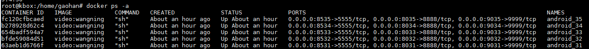

    - 基于Containerd容器运行时的视频流云手机。

        ```shell
        nerdctl ps -a
        ```

        回显示例如下。

        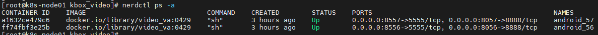

    确认所启动的容器存在，且状态正常。

6. 确认视频流云手机是否启动成功，其中 **\${index}** 为启动实例的编号，参见[5](#li3304181302311)中命令回显所示的最后一列，如 android_35， **\${index}** 即为35。

    - 基于Docker容器运行时的视频流云手机。

        ```shell
        docker exec -it android_${index} sh 
        ```

    - 基于Containerd容器运行时的视频流云手机。

        ```shell
        nerdctl exec -it android_${index} sh
        ```

        ```shell
        getprop sys.boot_completed
        ```

    如果回显信息中sys.boot_completed显示为“1”，则表示启动成功。

    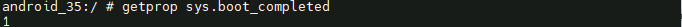

### 1.2 查询组件版本号信息<a name="ZH-CN_TOPIC_0000002549744227" id="查询组件版本号信息"></a>

本章节提供两种方法获取视频流引擎组件版本信息，通过获取的软件包和API对外接口进行查询版本号信息。

方法一：通过获取的软件包查询版本号信息

1. 请参见[部署视频流引擎的软件环境要求](install_guide.md#部署视频流引擎的软件环境要求)获取BoostKit-boostcph-videoengine_*.zip进行解压缩，获取版本文件。
2. 查看视频流引擎组件版本。

    ```shell
    unzip BoostKit-boostcph-videoengine_*.zip
    tar -xvf  VideoEngine.tar.gz vendor/etc/videoengine_version.txt
    cat vendor/etc/videoengine_version.txt
    ```

    回显信息即为视频流引擎组件版本号信息，示例如下。

    ```shell
    Product Name: Kunpeng BoostKit
    Product Version: 26.0.RC1
    Component Name: BoostKit-boostcph-videoengine
    Component Version: 8.0.RC1
    Component AppendInfo: 11.0.0_r48
    ```

方法二：通过视频流引擎对外API获取版本信息

请参见[视频流引擎 开发指南](development_guide.md)中“对外接口”章节的“GetVersion”接口使用方法，通过调用该API获取版本信息，回显示例与方法一中的回显示例相同。

### 1.3 访问视频流云手机<a name="ZH-CN_TOPIC_0000002549864229" id="访问视频流云手机"></a>

#### 1.3.1 APK方式访问<a name="ZH-CN_TOPIC_0000002518224464" id="APK方式访问"></a>

若使用默认方式启动视频流云手机时，可以通过APK方式访问云手机。

1. 解压CloudPhoneApk.tar.gz。
2. 在安卓手机上安装CloudPhone.apk。
3. （可选）单击右上角齿轮，进入设置页。

    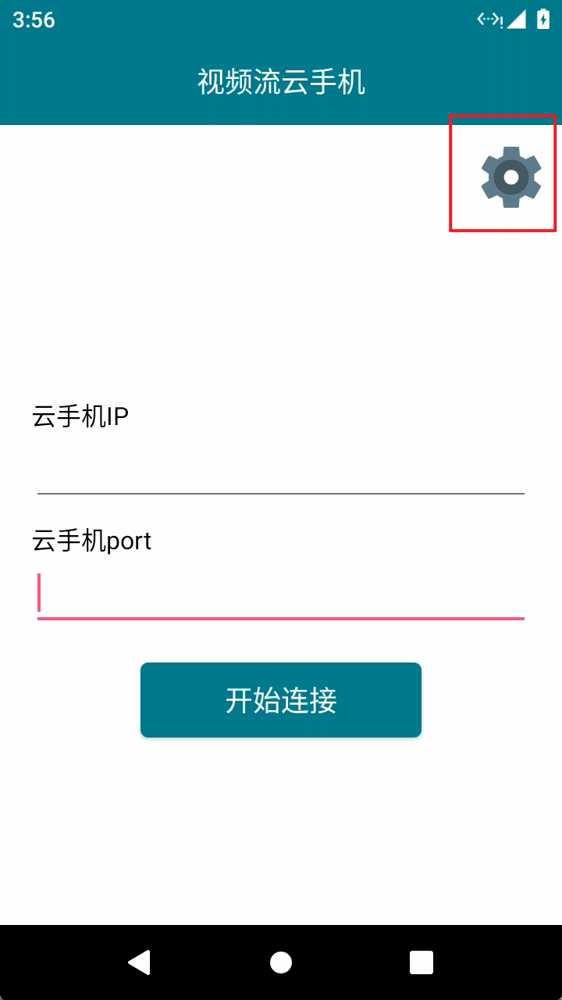

4. （可选）开启自适应分辨率，默认使能。若不开启自适应分辨率，需要在default.prop中修改渲染抓图分辨率，参见[启动视频流云手机实例](#启动视频流云手机实例)的步骤2。

    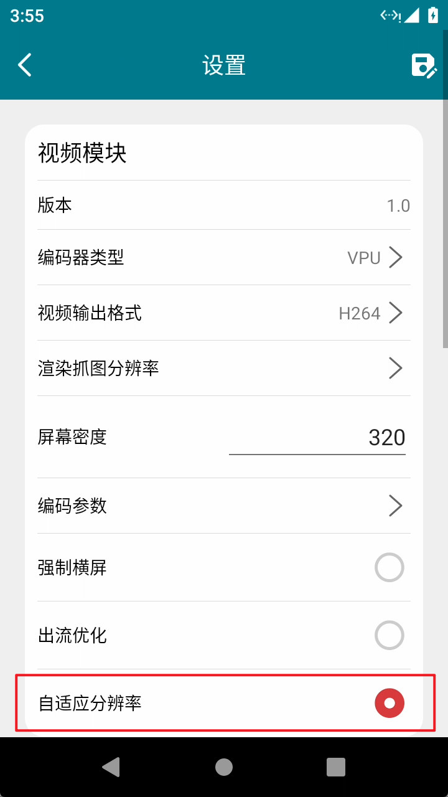

5. 返回至主页面，自上而下依次输入服务器IP地址、**\${port}**，单击“开始连接”即可访问云侧的视频流云手机，如下图所示。

    **\${port}** 默认值为 8000 + **\${index}**。

    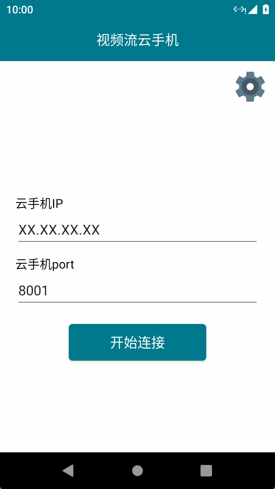

    > **说明：** 
    >- 每个视频流云手机实例需要设置端口 **\${port}** ，部署时可进入cfct_video脚本设置合适的 **\${port}**，端口号取值范围为1024~65535，且不能使用已占用端口号从而避免出现端口竞争，导致视频流云手机无法访问。
    >- 视频流引擎客户端为64位，需要运行在鸿蒙系统或Android 7版本以上的64位安卓系统手机上。
    >- 请确保手机和服务器之间网络畅通。

#### 1.3.2 PC端Web网页方式访问<a name="ZH-CN_TOPIC_0000002518384374"></a>

若使用WebRTC进行数据传输的方式启动视频流云手机实例时，可以通过PC端的Web网页访问云手机。

1. 解压WebClient.zip。
2. 打开html/login.html，获得如下图网页。

    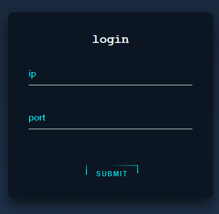

3. 自上而下依次输入服务器IP地址、**\${port}** ，单击“SUBMIT”即可访问云侧的视频流云手机。其中 **\${port}** 默认值为8000 + **\${index}**。

    > **说明：** 
    >每个视频流云手机实例需要配置映射端口，部署时可进入cfct_video脚本设置合适的**\${port}**，端口号取值范围为1024~65535，且不能使用已占用端口号从而避免出现端口竞争，导致视频流云手机无法访问。

### 1.4 （可选）动态修改云手机参数<a name="ZH-CN_TOPIC_0000002549744243"></a>

通过CloudPhone.apk可以动态修改云手机运行时的视频编码、音频播放编码参数。

1. 连接云手机前，进入设置页，默认使能自适应分辨率开关。

    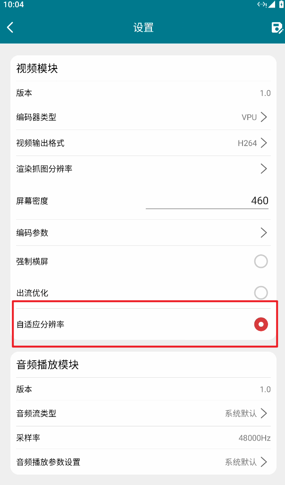

2. 连接云手机后，单击屏幕上的齿轮按钮。

    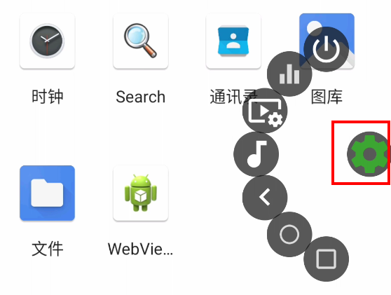

3. 设置视频编码参数。
    1. 单击图中视频图标。

        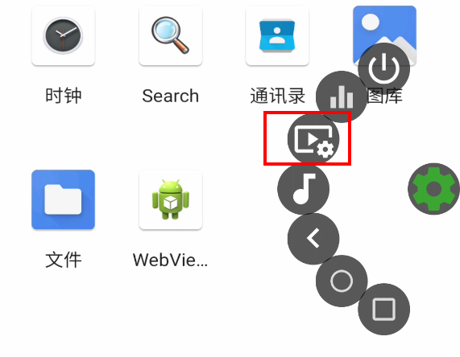

    2. 进入视频编码参数设置界面。

        参数取值范围，请参见[启动脚本配置项](#启动脚本配置项)章节中视频流引擎属性配置项中对应字段，参考vmi.video.encode开头的属性。出流分辨率分为3个可选清晰度档位：360P、720P、1080P。

        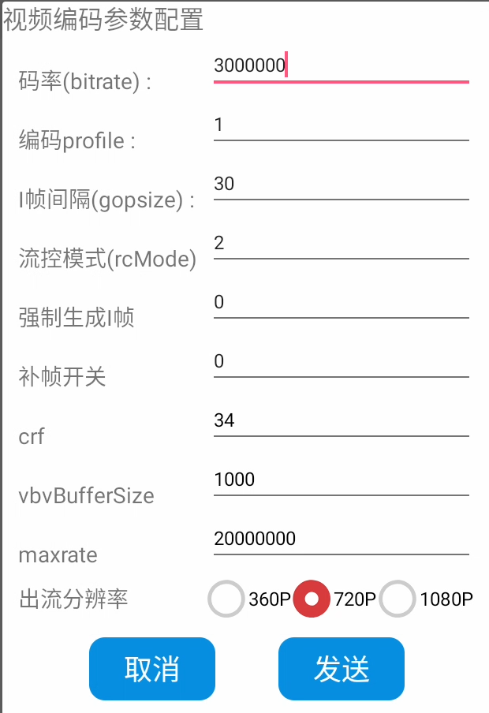

    3. 设置完成后，单击发送按钮后编码参数将会被发送到服务端，如果参数合法，将立即生效。

        > **说明：** 
        >如果不使能自适应分辨率，启动后需在容器内通过**setprop**命令更改对应属性，属性描述请参见[启动脚本配置项](#启动脚本配置项)章节的视频流引擎属性配置字段描述表。如果要改变自适应分辨率的宽高，建议同步修改cfct_config文件中屏幕像素密度以达到最佳显示效果，推荐的配置说明如[**表 1** 不同分辨率配置说明](#不同分辨率配置说明)所示。

4. 设置音频播放编码参数。
    1. 单击图中音频图标。

        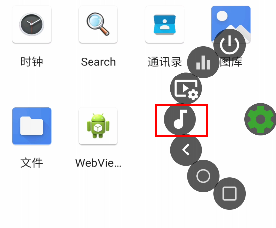

    2. 进入音频播放编码参数设置界面。

        参数取值范围，请参见[启动脚本配置项](#启动脚本配置项)章节中视频流引擎属性配置项中对应字段，参考vmi.audio.encode开头的属性。

        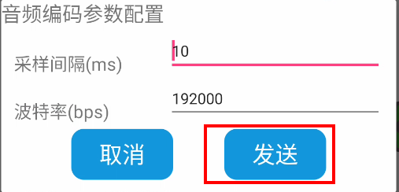

    3. 设置完成后，单击发送按钮后编码参数将会被发送到服务端，如果参数合法，将立即生效。

### 1.5 重启视频流云手机实例<a name="ZH-CN_TOPIC_0000002549864227"></a>

使用cfct_video脚本重启视频流云手机实例。

- 重启编号为 \${index1} 的视频流云手机。

    ```shell
    ./cfct_video restart ${index1}
    ```

- 重启编号为 \${index1} ~ \${index2} 的所有视频流云手机。

    ```shell
    ./cfct_video restart ${index1} ${index2}
    ```

### 1.6 删除视频流云手机实例<a name="ZH-CN_TOPIC_0000002549864211"></a>

使用cfct_video脚本删除视频流云手机实例。

- 删除编号为 \${index1} 的视频流云手机。

    ```shell
    ./cfct_video delete ${index1}
    ```

- 删除编号为 \${index1} ~ \${index2} 的所有视频流云手机。

    ```shell
    ./cfct_video delete ${index1} ${index2}
    ```

> **说明：** 
>删除NFS挂载的容器时，将delete命令替换成ndelete，例：
>
>```shell
>./cfct_video ndelete 1 5
>```

## 2 k8s集群下操作视频流云手机实例<a name="ZH-CN_TOPIC_0000002518224466"></a>

### 2.1 启动道客设备插件<a name="ZH-CN_TOPIC_0000002549864209"></a>

在master节点下启动道客设备插件，启动前需要获取视频流服务端tar包组件，用于获取Kbox容器音视频数据等。

请参见[部署视频流引擎的软件环境要求](install_guide.md#部署视频流引擎的软件环境要求)获取DemoVideoEngine.tar.gz软件包，获取后将软件包上传至服务器的“/home/k8s”目录。

1. 解压DemoVideoEngine.tar.gz。

    ```shell
    cd /home/k8s/
    tar -xvf DemoVideoEngine.tar.gz
    ```

2. 在指定K8s节点创建标签label（va-device=va-sg100）。

    ```shell
    kubectl label nodes $NODENAME va-device=va-sg100
    ```

    > **说明：** 
    >“$NODENAME”为工作节点名称。

3. 创建命名空间va-plugin。

    ```shell
    kubectl create ns va-plugin
    ```

4. 创建一个名为va-plugin的ConfigMap对象，并将config.yaml文件的内容添加到ConfigMap中。

    ```shell
    cd /home/k8s/k8s/script
    kubectl create cm -n va-plugin va-plugin-configs --from-file=config=config.yaml
    ```

5. 修改道客设备插件镜像名称。

    ```shell
    vi va-device-plugin.yaml
    ```

    关注如下字段，并修改成实际值。

    spec.spec.containers.image：道客设备插件镜像，输入在工作节点导入的道客设备插件镜像名称。

6. 启动道客设备插件。

    ```shell
    cd /home/k8s/k8s/script
    kubectl create -f va-device-plugin.yaml
    ```

    > **说明：** 
    >执行**kubectl delete -f va-device-plugin.yaml**命令可删除道客设备插件。

7. 启动完成后，查看道客设备插件是否可运行成功。

    ```shell
    kubectl get pods -A
    ```

    预期结果为Pod名称应以va-device-plugin-daemonset开头，其状态（STATUS）列都是Running状态。

### 2.2 启动设备插件<a name="ZH-CN_TOPIC_0000002518224436"></a>

在master节点下启动设备插件。

1. 启动设备插件。

    ```shell
    cd /home/k8s/k8s/script
    ./start_devices.sh
    ```

    > **说明：** 
    >执行 **./delete_devices.sh** 命令可删除设备插件。

2. 启动完成后，查看设备插件是否运行成功。

    ```shell
    kubectl get pods -A
    ```

    期望是以k8s-host-device开头的Pod名称，其状态（STATUS）列都是Running状态。

### 2.3 运行hook脚本<a name="ZH-CN_TOPIC_0000002549866525"></a>

在所有工作节点运行hook脚本。

1. 请参见[视频流引擎 安装指南](install_guide.md)获取DemoVideoEngine.tar.gz软件包，获取后将软件包上传至服务器的“/home/k8s”目录。
2. 将“/home/k8s/k8s/script”目录下的oci-device-hook.sh脚本拷贝到“/usr/local/sbin/”目录。

    ```shell
    cd /home/k8s/k8s/script
    cp oci-device-hook.sh /usr/local/sbin/
    ```

3. 更改Containerd配置，将[部署道客设备插件镜像](install_guide.md#部署道客设备插件镜像)新增的容器运行时改成“/usr/local/sbin/oci-device-hook.sh”。

    ```shell
    sed -i 's|BinaryName = "/usr/bin/va-container-runtime"|BinaryName ="/usr/local/sbin/oci-device-hook.sh"|g' /etc/containerd/config.toml
    ```

4. 重启Containerd。

    ```shell
    systemctl restart containerd
    ```

### 2.4 启动K8s视频流云手机实例<a name="ZH-CN_TOPIC_0000002549864215"></a>

启动K8s视频流云手机实例需要在工作节点下操作。

1. 修改k8s-video.yaml文件。

    ```shell
    cd /home/k8s/k8s/script
    vi k8s-video.yaml
    ```

    如下字段需关注，并修改成实际值。

    - spec.containers.image：视频流的镜像，输入在工作节点导入的视频流镜像名称。
    - spec.containers.resources.limits.cpu和spec.containers.resources.requests.cpu：容器需绑核数量，两者需同时修改。
    - spec.containers.resources.limits.memory和spec.containers.resources.requests.memory：容器的内存，两者需同时修改。

2. 启动K8s视频流云手机。

    ```shell
    ./k8s-video.sh start ${index1} ${index2} ${index3} 
    ```

    > **说明：** 
    > 
    >
    > 
    > \${index1} 与 \${index2} 为pod编号，\${index3}表示配置给容器内/system分区的大小值，单位为MB，输入大于0的数值则使能，输入0或无输入则不使能，该配置项默认是0。其中 \${index2} \${index3} 可缺省。例：
    >- 创建名为video2的pod。
    >
    > ```shell
    > ./k8s-video.sh start 2
    > ```
    >
    >- 创建名为video1~video5共5个pod。
    >
    > ```shell
    > ./k8s-video.sh start 1 5
    > ```
    >
    >- 创建名为video1的pod。system分区大小限制为10240MB
    >
    > ```shell
    > ./k8s-video.sh start 1 1 10240
    > ```
    >
    > 若需要使用NFS挂载启动，则将start改成nstart。例：
    >
    > ```shell
    > ./k8s-video.sh nstart \${index1} \${index2} \${index3} 
    > ```
    >

3. 启动后，查看是否启动成功。

    ```shell
    kubectl get pods -o wide
    ```

    期望对应以video开头的Pod名称其状态（STATUS）列都是Running。

4. 连接视频流云手机及操作容器，通过NODE列可查看对应的视频流云手机pod调度对应的NODE节点。

    ```shell
    kubectl get pods -o wide
    ```

    请参见[访问视频流云手机](#访问视频流云手机)章节访问视频流云手机，其中客户端连接端口为8000+**\${index}，index为pod编号**。

    - 在任意节点上，可通过如下命令进入容器，以video1为例：

        ```shell
        kubectl exec -it video1 -- sh
        ```

    - 在工作节点可以通过**crictl ps**查看云手机实例，根据NAME字段可以查看对应的pod。通过如下命令可进入容器，其中“\${CONTAINER}”是**crictl ps**返回的第一列。

        ```shell
        crictl exec -it ${CONTAINER} sh
        ```

### 2.5 删除K8s视频流云手机实例<a name="ZH-CN_TOPIC_0000002518384356"></a>

删除K8s视频流云手机实例需要在工作节点下操作。

```shell
cd /home/k8s/k8s/script
./k8s-video.sh delete ${index1} ${index2}
```

若要删除NFS挂载的K8s视频流云手机实例，则在工作节点进行如下操作。

```shell
cd /home/k8s/k8s/script
./k8s-video.sh ndelete ${index1} ${index2}
```

> **说明：** 
> \${index1} 与 \${index2} 为pod编号，其中 \${index2} 可缺省。
> 例：./k8s-video.sh delete 2（删除名为video2的pod）
> ./k8s-video.sh delete 1 5（删除名为video1 -video5 共5个pod）

### 2.6 制作基础数据卷<a name="ZH-CN_TOPIC_0000002518224462"></a>

通过本章节步骤制作基础数据卷，用于工作节点的容器存储隔离和大小设置。

1. 在工作节点使用k8s-video.sh脚本启动一路云手机，以video1为例。

    ```shell
    ./k8s-video.sh start 1
    ```

2. 在master节点找到云手机video1所在节点。

    ```shell
    kubectl get pod -A -owide
    ```

    在回显信息中找到NAME为video1的行，NODE列的值即为video1所在节点。

3. 将所需的应用（例地铁跑酷等）预装到该云手机容器中。
4. 登录云手机video1所在节点，基础数据卷所在位置为“/home/mount/img/video1.img”，将img文件重命名为videobase.img并拷贝到每个工作节点的“/home/mount/img”目录下，若需使用此videobase.img作为数据卷，请参见[工作节点操作-1](install_guide.md#工作节点操作1)执行操作。

## 3 可配置项功能说明<a name="ZH-CN_TOPIC_0000002549864233"></a>

### 3.1 视频流引擎商用部分<a name="ZH-CN_TOPIC_0000002518384362"></a>

#### 3.1.1 系统属性说明<a name="ZH-CN_TOPIC_0000002518224460"></a>

视频流服务端引擎可通过系统属性配置视频，音频，网络等功能引擎参数，本章节对相关配置参数进行配置说明。

如[**表 1** 视频流引擎商用部分配置属性字段描述表](#视频流引擎商用部分配置属性字段描述表)所示是商用模块的系统属性说明，开发者可以通过修改属性说明中的不同属性，配置视频流引擎商用模块的默认运行参数。

**表 1** 视频流引擎商用部分配置属性字段描述表<a id="视频流引擎商用部分配置属性字段描述表"></a>

|字段名称|字段描述|取值范围|默认值|
|--|--|--|--|
|ro.hardware.fps|云手机屏幕刷新帧率。|30fps<br>60fps<br>90fps|30：默认屏幕刷新帧率|
|ro.hardware.width|云手机屏幕物理宽度。宽、高、密度三者要匹配，关系如下：360p(360 640 120)、480p(480 856 160)、720p(720 1280 320)、1080p(1080 1920 480)、2K(1440 2560 640)、4K(2160 3840  960)。|360：物理宽度360<br>480：物理宽度480<br>720：物理宽度720<br>1080：物理宽度1080<br>1440：物理宽度1440<br>2160：物理宽度2160|720：默认物理宽度|
|ro.hardware.height|云手机屏幕物理高度。|640：物理高度640<br>856：物理高度856<br>1280：物理高度1280<br>1920：物理高度1920<br>2560：物理高度2560<br>3840：物理高度3840|1280：默认物理高度|
|ro.vmi.video.capture.render_optimizing|主屏出流使能开关。|1：默认开启|1：默认开启|
|ro.vmi.hardware.vpu|编码卡类型。|0：没有编码卡<br>1：T432<br>3：Quadra|3：默认使用Quadra|
|vmi.mic.cachefactor|麦克风帧缓存大小。|0：不缓存<br>1：缓存1帧<br>2：缓存2帧<br>3：缓存3帧|2：默认缓存2帧|
|vmi.crowd.control.master|群控开关。|false：关闭|false：默认关闭|
|ro.vmi.loglevel|日志级别。|1：default<br>2：verbose<br>3：debug<br>4：info<br>5：warn<br>6：error<br>7：fatal|4：默认info日志级别|
|ro.hardware.dynamicfps|动态帧率调整功能开关。|0：不生效<br>1：生效|1：默认生效|
|ro.hardware.downfps|动态帧率调整功能生效，客户端断连后的渲染帧率。|12fps<br>24fps|12：默认的客户端断连后渲染帧率（动态帧率调整功能生效时）|
|ro.hardware.compositionBypass|合成优化开关，针对应用全屏场景优化。（GPU为DC1000时不支持，不允许打开此开关）|1：生效合成优化<br>其他：不生效|0：默认关闭|
|ro.hardware.compositionBypass.offset|合成优化偏置帧数。在合成优化功能打开时，连续一定帧数满足生效条件后实际生效合成优化功能，可以改善合成优化功能开启后可能出现的画面旋转现象。|大于0|可根据实际情况调整（AMD环境建议0）|
|ro.vmi.adaptive.vsync|自适应vsync功能开关，打开后可以优化服务端图像渲染阶段的处理时延。|1：生效自适应vsync<br>其他：不生效|默认不生效|

#### 3.1.2 图形加速层配置项<a name="ZH-CN_TOPIC_0000002518224442" id="图形加速层配置项"></a>

当前图形加速层使能了GPUMock和ShaderCache两个可配置功能，本章节对两个可配置功能的配置项、配置规则进行说明，并且提供配置示例以供参考。

- GPUMock：对GPU厂商、GPU型号、OpenGL ES版本、GLMax能力值、OpenGL ES拓展进行模拟。
- ShaderCache：通过预构建着色器二进制、多云手机共享缓存，消除着色器编译链接等处理时间，降低OpenGL ES大型应用运行卡顿率。

可使用kbox_render_accelerating_configuration.xml配置文件进行相关功能配置。

**配置项<a name="section4273629612"></a>**

**表 1** kbox_render_accelerating_configuration.xml配置项说明<a id="kbox_render_accelerating_configuration.xml配置项说明"></a>

|配置项分类|元素|子元素|属性|取值范围|配置说明|
|--|--|--|--|--|--|
|通用配置|Application|-|name|system|表示系统通用配置。|
|通用配置|Application|-|isEnable|true：开启<br>false：不开启|指定该应用是否开启图形加速层功能。|
|通用配置|Application|feature|name|kbox.render.accelerating.gpuMock|指定图形加速层功能。|
|通用配置|Application|feature|isEnable|true：开启<br>false：不开启|指定该应用是否开启对应功能。|
|应用配置|Application|-|name|process_name|指定应用的进程名。|
|应用配置|Application|-|isEnable|true：开启<br>false：不开启|指定该应用是否开启图形加速层功能。|
|应用配置|Application|feature|name|kbox.render.accelerating.shaderCache<br>kbox.render.accelerating.gpuMock|指定图形加速层功能。取值不同时配置项也不同，请参见[**表 2** 应用配置项中feature元素的name属性取值不同时配置说明](#应用配置项中feature元素的name属性取值不同时配置说明)。|
|应用配置|Application|feature|isEnable|true：开启<br>false：不开启|指定该应用是否开启对应功能。|

**表 2** 应用配置项中feature元素的name属性取值不同时配置说明<a id="应用配置项中feature元素的name属性取值不同时配置说明"></a>

|name属性取值|子元素|内部参数|配置说明|必选/可选|
|--|--|--|--|--|
|kbox.render.accelerating.shaderCache|GL_SHADER_CACHE|SHADER_CACHE_MODE|指定ShaderCache功能应用对缓存路径的读写模式。取值如下：<br>0：对缓存路径文件没有读写权限的关闭模式。<br>1：只有读权限的只读模式。<br>2：既有读权限又有写权限的读写模式。|可选|
|kbox.render.accelerating.shaderCache|GL_SHADER_CACHE|SHADER_CACHE_DIR_SIZE|指定应用的可缓存文件存储大小。取值为：64，128，256，512，1024，单位为MB。|可选|
|kbox.render.accelerating.gpuMock|GL_RENDERER_MOCK|GL_RENDERER|对GPU型号进行模拟。|可选|
|kbox.render.accelerating.gpuMock|GL_RENDERER_MOCK|GL_VENDOR|对GPU厂商进行模拟。|可选|
|kbox.render.accelerating.gpuMock|GL_RENDERER_MOCK|GL_VERSION|对OpenGL ES版本号进行模拟。|可选|
|kbox.render.accelerating.gpuMock|GL_EXTENSION_MOCK|-|支持对OpenGL ES的拓展是否使能进行模拟。<br>属性param表示OpenGL ES的某个拓展名。<br>属性value有以下取值：<br> 1：若OpenGL ES不支持该拓展，将其模拟为支持。<br> 0：若OpenGL ES已支持该拓展，将其模拟为不支持。|可选|
|kbox.render.accelerating.gpuMock|GL_MAX_VALUE_MOCK|-|支持对OpenGL ES的GL_MAX能力值进行模拟。<br>属性param为OpenGL ES可查询的某个GL_MAX_*枚举值。<br>属性value为值大小。|可选|

**配置规则<a name="section18753121811614"></a>**

- 为了方便进行全局配置，除了支持对具体应用进行独立配置外，也支持系统通用配置。系统通用配置的Application名固定为“system”，具体应用的配置可以覆盖系统通用配置；系统通用配置支持GPUMock，不支持ShaderCache进行配置。
- GPUMock是个基础功能，可供图形加速层其他功能使用，应用使能ShaderCache功能会自动使能GPUMock功能。

**配置示例<a name="section18450203117618"></a>**

```shell
<!-- 配置示例 -->
<!-- 系统通用配置 -->
<Application name="system" isEnable="false">
     <feature name="kbox.render.accelerating.gpuMock"  isEnable="false">
          <GL_RENDERER_MOCK>
               <param name="GL_RENDERER" value="Mali_G76"/>
               <param name="GL_VENDOR" value="Huawei"/>
               <param name="GL_VERSION" value="OpenGL ES 3.2 Mesa 22.1.7"/>
          </GL_RENDERER_MOCK>
     </feature>
</Application>
<!-- 具体应用配置 -->
<Application name="process_name" isEnable="false">
     <feature name="kbox.render.accelerating.shaderCache"  isEnable="false">
          <GL_SHADER_CACHE>
               <param name="SHADER_CACHE_MODE" value="0"/>
               <param name="SHADER_CACHE_DIR_SIZE" value="200"/>
          </GL_SHADER_CACHE>
     </feature>
     <feature name="kbox.render.accelerating.gpuMock"  isEnable="false">
          <GL_RENDERER_MOCK>
               <param name="GL_RENDERER" value="Mali_G76"/>
               <param name="GL_VENDOR" value="Huawei"/>
               <param name="GL_VERSION" value="OpenGL ES 3.2 Mesa 22.1.7"/>
          </GL_RENDERER_MOCK>
          <GL_EXTENSION_MOCK>
               <param name="GL_EXT_blend_minmax" value="1"/>
          </GL_EXTENSION_MOCK>
          <GL_MAX_VALUE_MOCK>
               <param name="GL_MAX_VERTEX_ATTRIBS" value="16"/>
          </GL_MAX_VALUE_MOCK>
     </feature>
</Application>
```

### 3.2 视频流引擎非商用部分<a name="ZH-CN_TOPIC_0000002549744215"></a>

#### 3.2.1 启动脚本配置项<a name="ZH-CN_TOPIC_0000002549864225" id="启动脚本配置项"></a>

视频流服务端引擎可通过启动脚本cfct_config文件中的配置项，配置硬件解码、WebRTC等功能，本章节提供视频流启动脚本cfct_config默认功能配置项说明。

视频流启动脚本cfct_config默认功能配置项如[**表 1** 视频流引擎非商用部分脚本配置项字段描述表](#视频流引擎非商用部分脚本配置项字段描述表) 所示。

请参见[**表 1** 视频流引擎非商用部分脚本配置项字段描述表](#视频流引擎非商用部分脚本配置项字段描述表)配置视频流引擎音视频等模块的默认运行参数。

请参见[WebRTC属性配置项](#WebRTC属性配置项)配置视频流引擎WebRTC模块的默认运行参数。

**表 1** 视频流引擎非商用部分脚本配置项字段描述表<a id="视频流引擎非商用部分脚本配置项字段描述表"></a>

|字段名称|字段描述|取值范围|默认值|
|--|--|--|--|
|RAM_SIZE_GB|云手机运行内存。|可用的云手机内存范围|6：默认6GB运行内存|
|STORAGE_SIZE_GB|云手机存储大小。|可用的云手机存储范围|16：默认16GB存储|
|BUILD_WIDTH|云手机屏幕物理宽度。宽、高、密度三者要匹配，关系如下：360p(360 640 120)、480p(480 856 160)、720p(720 1280 320)、1080p(1080 1920 480)、2K(1440 2560 640)、4K(2160 3840 960)。|360：物理宽度360<br>480：物理宽度480<br>720：物理宽度720<br>1080：物理宽度1080<br>1440：物理宽度1440<br>2160：物理宽度2160|720：默认物理宽度|
|BUILD_HEIGHT|云手机屏幕物理高度。|640：物理高度640<br>856：物理高度856<br>1280：物理高度1280<br>1920：物理高度1920<br>2560：物理高度2560<br>3840：物理高度3840|1280：默认物理高度|
|BUILD_DENSITY|云手机屏幕密度。|120：屏幕密度（360p）<br>160：屏幕密度（480p）<br>320：屏幕密度（720p）<br>480：屏幕密度（1080p）<br>640：屏幕密度（2K）<br>960：屏幕密度（4K）|320：默认屏幕密度|
|BUILD_FPS|云手机屏幕刷新帧率。|1-120fps|30：默认屏幕刷新帧率|
|ENCODECARD|选择编码卡。|0：T432<br>1：Quadra<br>2：Va1e（暂不支持）<br>3：OpenH264|1：默认选择Quadra编码卡|
|ENABLE_AMD_C2_DECODE|AMD方案C2软解使能开关|0/其他值：不使能<br>1：使能|0：默认不使能|
|T432_QUADRA_DECODE_ENABLE|T432/Quadra硬解使能开关。|0/其他值：不使能<br>1：使能|0：默认不使能|
|ENABLE_HARD_DECODE|DC1000硬解使能开关。|0/其他值：不使能<br>1：使能|1：默认使能|
|ENABLE_WEBRTC_CONNECTION|WebRTC使能开关。|0/其他值：不使能<br>1：使能|0：默认不使能|
|ENABLE_F2FS|F2FS文件系统启动使能开关。|0/其他值：不使能1：使能|0：默认不使能|
|SYSTEM_PARTITION_SIZE_MB|/system分区大小调节使能开关和具体设定数值（单位为MB）。|0：不使能  非0值：使能|0：默认不使能|
|NFS_DIR|客户端NFS挂载服务端的目录|可用的NFS挂载目录|/tmp/nfs：默认NFS挂载目录|

#### 3.2.2 视频流引擎属性配置项<a name="ZH-CN_TOPIC_0000002518384388"></a>

本章节提供非商用部分音视频等模块的系统属性说明，开发者可以通过修改属性说明中的不同属性，配置视频流引擎音视频等模块的默认运行参数。

非商用部分音视频等模块的系统属性说明如[**表 1** 视频流引擎属性配置字段描述表](#视频流引擎属性配置字段描述表)所示。

**表 1** 视频流引擎属性配置字段描述表<a id="视频流引擎属性配置字段描述表"></a>

|字段名称|字段描述|取值范围|默认值|
|--|--|--|--|
|vmi.video.encodertype|编码器类型配置项，当该项配置为CPU，即使用软编时，若云手机需要运行较大负载应用，为防止默认绑核方式（2容器2核）的CPU资源不足，建议更改绑核方式为绑NUMA，修改方法如下：将cfct_config配置文件中CPU_BIND_MODE字段修改为1。|0：CPU（CPU软编码器编码）<br>1：VPU（外置硬件编码器编码）<br>2：GPU（仅DC1000支持）|1：默认VPU（外置硬件编码器编码）|
|vmi.video.videoframetype|帧数据输出格式。|0：H264<br>1：YUV（只有当encodertype取值为0时支持）<br>2：RGB（暂不支持）<br>3：H265（vmi.video.encodertype取值为0时不可用）|3：H265|
|vmi.video.frame.width|自适应分辨率宽度（必须是8的倍数）。|360~2160|720|
|vmi.video.frame.height|自适应分辨率高度（必须是8的倍数）。|360~3840|1280|
|vmi.video.frame.widthaligned|对齐后分辨率宽度（暂不支持配置）。|360~2160|720|
|vmi.video.frame.heightaligned|对齐后分辨率高度（暂不支持配置）。|360~3840|1280|
|vmi.video.frame.density|自适应分辨率屏幕像素密度。|120~960|320|
|ro.vmi.video.wmcmd|是否使用自适应分辨率功能。|0：不启用<br>1：启用|1|
|vmi.video.encode.gopsize|编码GOP大小配置项。|30~3000|60：默认编码GOP大小为60|
|vmi.video.encode.profile|编码profile配置项（H.265编码仅支持配置main）。|0：baseline（仅H264支持）<br>1：main<br>2：high（仅H264支持）|1：main|
|vmi.video.encode.bitrate|编码码率。|500000~50000000（AMD，一般为W6800）<br>500000~30000000（DC1000）<br>单位bps|8000000|
|vmi.video.encode.forcekeyframe|编码强制I帧配置项。|0：不触发编码强制I帧<br>1：在下一帧强制生成I帧|0：默认不触发编码强制I帧|
|vmi.video.encode.rcmode|编码格式参数项。|0：ABR平均码率模式（暂不支持）<br>1：CRF画质优先模式（暂不支持）<br>2：CBR恒定码率模式<br>3：CAPPED_CRF画质优先并限制最大码率模式|3：CAPPED_CRF画质优先并限制最大码率模式|
|vmi.video.encode.crf|CRF码控级别。|0-51|21|
|vmi.video.encode.maxcrfrate|CRF码率峰值。|500000~100000000（AMD，一般为W6800）<br>500000~30000000（DC1000）|10000000|
|vmi.video.encode.vbvbuffersize|CRF码率缓冲区大小。|-1：自动模式<br>0：禁用峰值比特率限制<br>[min_vbv_size ~ 3000 ]：min_vbv_size = floor(1000 / fps) +1且min_vbv_size >= 10|1000|
|vmi.video.encode.interpolation|补帧参数项。|0：关闭补帧<br>1：开启补帧|0：关闭补帧|
|vmi.audio.audiotype|音频输出格式。|0：OPUS<br>1：PCM|0：OPUS|
|vmi.audio.encode.sampleinterval|音频输出采样间隔。|5：5ms（暂不支持）<br>10：10ms<br>20：20ms（暂不支持）|10：10ms|
|vmi.audio.encode.bitrate|音频OPUS编码码率（bps）。|13200~512000|192000|
|vmi.mic.audiotype|麦克风输入格式。|0：OPU<br>S1：PCM|0：OPUS|
|vmi.network.type|网络类型。|1：tcp<br>4：webrtc|1：tcp|
|demo.data.offset|用于测试网络包预留字段大小。|0~1024|20|
|vmi.video.renderoptimize|出流优化，默认开启。|0：关闭<br>1：开启|1：默认开启|
|ro.vmi.audio.mic.passthrough|服务端audio，mic开关。|0：关闭<br>1：开启|1：默认开启|
|ro.vmi.gps.passthrough|服务端gps开关。|0：关闭<br>1：开启|1：默认开启|
|ro.vmi.sensor.passthrough|服务端sensor开关。|0：关闭<br>1：开启|1：默认开启|
|ro.hardware.vsyncoffset|vsync优化，该容器vsync信号相比默认值的偏移量，单位ns。|0：偏移量|0：默认偏移量|
|ro.sys.vmi.cloudphone|云手机类型。|video：视频流云手机|video：默认视频流云手机|
|heartbeat.max.aveage.latency|心跳最大平均时延。|1：1s|1：默认1s|
|vmi.sys.network.latency.average|网络平均最大时延。|具体网络平均最大时延|-1：默认-1|
|ro.vmi.loglevel|日志级别。|1：default<br>2：verbose<br>3：debug<br>4：info<br>5：warn<br>6：error<br>7：fatal|4：默认info日志级别|

本章节提供非商用部分音视频等模块的系统属性说明，开发者可以通过修改属性说明中的不同属性，配置视频流引擎音视频等模块的默认运行参数。

#### 3.2.3 WebRTC属性配置项<a name="ZH-CN_TOPIC_0000002549744223" id="WebRTC属性配置项"></a>

本章节提供非商用部分WebRTC模块的系统属性说明，开发者可以通过修改属性说明中的不同属性，配置视频流引擎WebRTC模块的默认运行参数。

非商用部分WebRTC模块的系统属性说明如[**表 1** WebRTC属性配置字段描述表](#WebRTC属性配置字段描述表)所示。

**表 1** WebRTC属性配置字段描述表<a id="WebRTC属性配置字段描述表"></a>

|字段名称|字段描述|取值范围|
|--|--|--|
|vmi.video.encodertype|编码器类型配置项。|0：CPU（CPU软编码器编码）<br>1：VPU（外置硬件编码器编码）<br>2：GPU（暂不支持）|
|vmi.video.videoframetype|帧数据输出格式。|0：H264<br>1：YUV（只有当encodertype取值为0时支持）|
|vmi.video.encode.bitrate|WebRTC初始编码码率。|1000000~3000000<br>单位bps|
|vmi.video.encode.target_bitrate|WebRTC目标编码码率。|3000000~50000000<br>单位bps|
|vmi.audio.audiotype|音频输出格式。|1（目前WebRTC只支持音频PCM的输出格式）|
|vmi.webrtc.connection.serverip|云手机服务端的IP地址。|具体IP地址。|
|vmi.webrtc.connection.udpbeginport|云手机服务器UDP可用起始端口，默认使用2个端口，则在确定了起始端口后，云手机使用的udp端口为：起始端口 + **\${index}** * 2 - 1，起始端口 + **\${index}** * 2。|可用的起始端口。|
|vmi.network.type|网络类型。|1：TCP<br>4：WebRTC|
|vmi.webrtc.httpserver.port|服务端HTTP映射端口号。|具体映射端口号。|
|vmi.webrtc.connection.udpminport|服务端使用的UDP最小端口。|可用的最小端口。|
|vmi.webrtc.connection.udpmaxport|服务端使用的UDP最大端口。|可用的最大端口。|

#### 3.2.4 容器内cpu频率动态调节<a name="ZH-CN_TOPIC_0000002549744226" id="容器内cpu频率动态调节"></a>

##### 3.2.4.1 功能背景

在真机中，系统为了平衡负载和功耗，会动态调节 CPU 的运行频率，而云机依托于服务器宿主机的容器化环境运行，其底层物理 CPU 的频率通常处于恒定状态，与真机存在差异。下面步骤说明如何实现云手机cpu频率动态调节，提高仿真能力

##### 3.2.4.2 **具体步骤**<a name="ZH-CN_TOPIC_000000254983255011"></a>

   当前第三方检测应用一般通过读取scaling_cur_freq和cpuinfo_cur_freq这两个文件来获取当前设备的cpu运行频率，为了提高云机设备的仿真能力，这两个文件都要进行修改，
   
   在修改前先确保相关路径有写入权限，在容器内输入如下命令查看相关路径的权限

   ```shell
   ls -ld /sys/devices/system/cpu/cpu${需要查询权限的cpu的编号}/cpufreq/scaling_cur_freq
   ```

   ```shell
   ls -ld /sys/devices/system/cpu/cpu${需要查询权限的cpu的编号}/cpufreq/cpuinfo_cur_freq
   ```

   如果包含 w（如 -rw-r--r--），说明文件的所有者（通常是 root）拥有写入权限。

   如果没有 w（如 -r--r--r--），说明它是只读的，此时权限不足，无法直接写入。
   则在容器内执行如下命令新增权限
   输入如下命令给scaling_cur_freq添加写入（w）权限

   ```shell
   chmod u+w /sys/devices/system/cpu/cpu${需要新增权限的cpu的编号}/cpufreq/scaling_cur_freq
   ```

   输入如下命令给cpuinfo_cur_freq添加写入（w）权限

   ```shell
   chmod u+w /sys/devices/system/cpu/cpu${需要新增权限的cpu的编号}/cpufreq/cpuinfo_cur_freq
   ```
   
   随后输入如下命令读取cpu所支持的频率列表。

   ```shell
   cat /sys/devices/system/cpu/cpu${准备进行频率修改的cpu的编号}/cpufreq/scaling_available_frequencies
   ```

   随后输入如下两个命令进行修改，输入的频率值最好是刚刚查询到的当前cpu支持的频率值

   ```shell
   echo ${预期修改的值} > /sys/devices/system/cpu/cpu${准备进行频率修改的cpu的编号}/cpufreq/scaling_cur_freq
   ```

   ```shell
   echo ${预期修改的值} > /sys/devices/system/cpu/cpu${准备进行频率修改的cpu的编号}/cpufreq/cpuinfo_cur_freq
   ```

   如果容器重启，那么之前的修改值会失效，CPU频率值会恢复默认。

   要实现cpu频率的动态调节，可以将如下shell命令直接复制粘贴到容器内任意路径中执行，即可在如“手机设备信息大全”这样的第三方应用中观察到cpu频率的动态变化，此处的“sleep 1”表示每隔1s变化一次，此处的“1”可以修改为其他时间值，FREQS数组里存放的是CPU频率的可能值，CPU_ID存放的是预期进行修改的CPU的编号，这三个值可以根据实际需求进行修改

   ```shell
   CPU_ID=0
   FREQS=(554000 860000 956000 1042000 1128000 1224000 1320000 1397000 1512000 1628000 1748000 1858000 1954000)
   while true; do
      for FREQ in "${FREQS[@]}"; do
         echo $FREQ > /sys/devices/system/cpu/cpu${CPU_ID}/cpufreq/scaling_cur_freq 2>/dev/null
         echo $FREQ > /sys/devices/system/cpu/cpu${CPU_ID}/cpufreq/cpuinfo_cur_freq 2>/dev/null
         echo "CPU${CPU_ID} 频率已动态调节为: $FREQ"
         sleep 1
      done
   done
   ```

##### 3.2.4.3 **校验是否生效。**

   启动容器后，在容器内安装如“手机设备信息大全”的应用，查看cpu频率是否等于预期，若等于预期值即表示cpu频率调节生效。

## 4 故障处理<a name="ZH-CN_TOPIC_0000002549864199"></a>

### 4.1 概述<a name="ZH-CN_TOPIC_0000002549864223"></a>

#### 4.1.1 故障处理原则<a name="ZH-CN_TOPIC_0000002549744235"></a>

- 故障分析、定位和处理原则：
    - 以尽快恢复业务为原则。
    - 定位故障时，应及时采集故障数据信息，并尽量将采集到的故障数据信息保存在移动存储介质中或其它计算机中。
    - 在确定故障处理的方案时，应先评估影响，优先保证业务的正常运行。
    - 第三方的硬件故障，可查看第三方的相关资料或拨打第三方公司的服务电话。
    - 如果无法定位出故障点或无法按手册解决故障，及时联系技术支持，最大程度减少业务中断时间。

- 定位处理前注意事项：
    - 严格遵守操作规程和行业安全规程，确保人身安全与设备安全。
    - 应先分析故障现象，定位原因后再进行处理。在原因不明的情况下应避免盲目操作，导致问题扩大化。
    - 在处理故障前，需要保留好故障现场的任何记录，不能随意删除数据或日志。
    - 在处理故障时，为了确保客户网络的安全和隐私，如果需要采集相关故障日志，请事先得到客户的同意和授权。
    - 在进行任何修改前，应先通过脚本导出、手工备份等方式备份数据。
    - 更换和维护设备部件过程中，要做好防静电措施，佩戴防静电腕带。
    - 在维护过程中遇到的任何问题，应详细记录各种原始信息。
    - 所有的重大操作，如重启进程等操作，均应做记录，并在操作前仔细确认操作的可行性，在做好相应的备份、应急和安全措施后，方可由有资格的操作人员执行。
    - 在系统恢复后，必须对运行情况进行观察，确认故障已经排除并及时填写相关的处理报告。
    - 慎重使用高危操作及命令。

- 对维护人员的要求：
    - 具备网络设备、操作系统和数据库基础知识，掌握其常用的操作命令，并能熟练使用它们开展维护工作。
    - 熟知现场业务系统的逻辑结构、系统各部件和现场设备的对应关系以及现场设备之间的物理连接关系。
    - 熟悉业务流程、系统结构，能熟练操作业务相关的软硬件。
    - 了解基本故障相关定位和处理方法。
    - 掌握远程接入方式的使用。

#### 4.1.2 故障处理流程<a name="ZH-CN_TOPIC_0000002518224434"></a>

故障处理总体流程主要分为四个过程：故障信息收集、故障判断、故障定位、故障排除。

**图 1** 故障处理流程<a name="fig4128162522010"></a><a id="故障处理流程"></a>
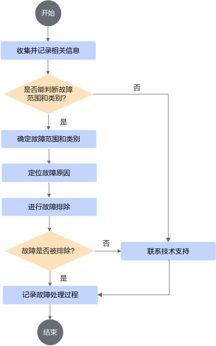

**故障信息收集<a name="section196271610142212"></a>**

故障信息是故障处理的重要依据，系统维护人员应尽可能多地收集故障信息，例如AOSP中的logcat日志。

**故障判断<a name="section4572941192214"></a>**

排除故障之前，系统维护人员根据收集的故障详细信息，对故障范围和类型进行判断。

**故障定位<a name="section3895552182410"></a>**

故障定位是指从众多可能原因中找出故障原因的过程。通过一定的方法或手段分析、比较各种可能的故障成因，不断排除非可能因素，最终确定故障发生的具体原因。

以下是故障定位的常用方法：

- 查看客户端日志，关注告警信息
- 查看服务端日志，关注告警信息
- 查看操作系统日志，关注告警信息
- 查看资源使用情况，关注资源满载过载现象
- 查询操作日志，分析操作过程是否有误
- 查看配置文件，检查数据配置是否正确

**故障排除<a name="section18134350132614"></a>**

故障排除是指根据不同的故障原因清除故障的过程。故障排除包括检修设备、修改配置数据、重启相关进程、重启容器、重启服务器等。

> **说明：** 
>处理重大故障前，请先联系技术支持工程师协助解决。
>在故障处理过程中，维护人员可能需要执行修改配置数据、重启虚拟机等重大操作，为确保数据安全，首先应该保存现场数据，备份相关数据库、告警信息和日志文件等。
>当系统维护人员无法自行排除故障时，请联系技术支持工程师协助解决。

### 4.2 信息收集<a name="ZH-CN_TOPIC_0000002518224450"></a>

#### 4.2.1 声明<a name="ZH-CN_TOPIC_0000002549864205"></a>

在信息收集操作过程中，请严格遵守以下原则：

- 任何维护操作必须得到客户的授权，禁止进行超出客户审批范围的任何维护操作。
- 将问题定位数据传出客户网络必须得到客户的授权。

#### 4.2.2 基本信息收集<a name="ZH-CN_TOPIC_0000002549864231"></a>

**收集局点信息<a name="section4323131116418"></a>**

故障发生后，作为问题定位的首要条件，通过收集局点信息，让技术支持及研发人员快速了解现场的情况，同时，反馈现场工程师的联系电话，保证联络渠道的畅通。

需收集的局点信息如下表所示。

**表 1** 局点信息收集表<a id="局点信息收集表"></a>

|运营商或企业|局点|组网图附件|现场工程师姓名/电话|客户姓名/电话|
|--|--|--|--|--|
|版本信息|-|-|-|-|
|远程维护信息|-|-|-|-|

**收集基本故障信息<a name="section19389174953610"></a>**

通过基本故障信息，可初步了解现场发生的问题、目前的状态、产生故障前的设备状态和引起故障的可能因素。具体信息如下表所示。

**表 2** 基本故障信息收集表<a id="基本故障信息收集表"></a>

|待收集现场|现场反馈结果|
|--|--|
|故障现象描述|-|
|故障出现时间|-|
|故障出现的频率|-|
|业务影响程度|-|
|当前故障是否已经处理|-|
|问题出现时，是否有相关系统进行过调整或者任何操作|-|
|对维护过程中出现的问题所实施的操作|-|
|问题出现后，是否采用什么措施进行处理|-|
|对问题进行处理后，达到的效果|-|
|现场有无明显的告警信息|-|
|现场告警信息是否已经收集|-|

**收集故障相关告警信息<a name="section350713449381"></a>**

通过故障相关的告警信息，可进一步辅助故障的分析、定位和处理。具体信息如下表所示。

**表 3** 故障相关告警信息收集表<a id="故障相关告警信息收集表"></a>

|待收集参数|参数值|
|--|--|
|告警ID|-|
|告警级别|-|
|告警名称|-|
|告警源/告警对象|-|
|产生时间|-|
|区域|-|
|类型|-|
|可能原因|-|
|附加信息|-|

**收集日志信息<a name="section168781199405"></a>**

收集系统的日志信息，可以通过日志，详细查看系统中用户的操作内容、操作时间等信息，从而进行故障的分析和定位。
